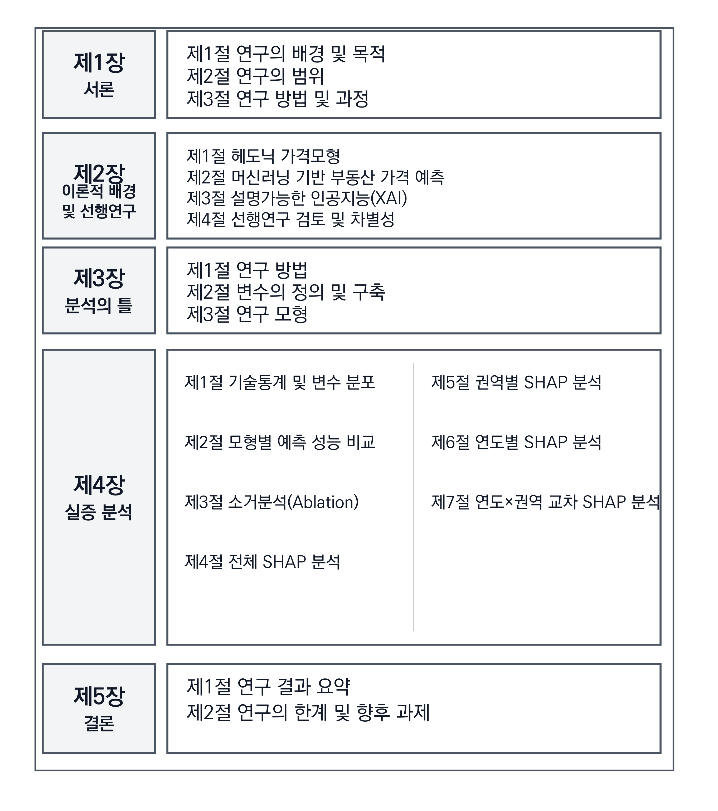
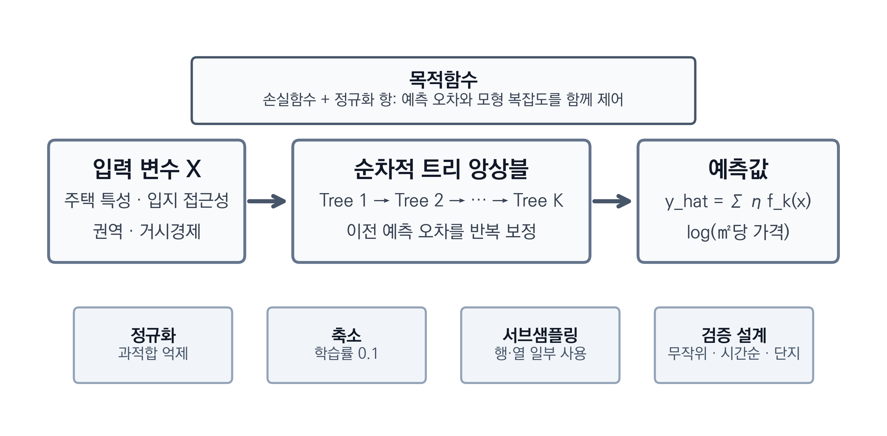
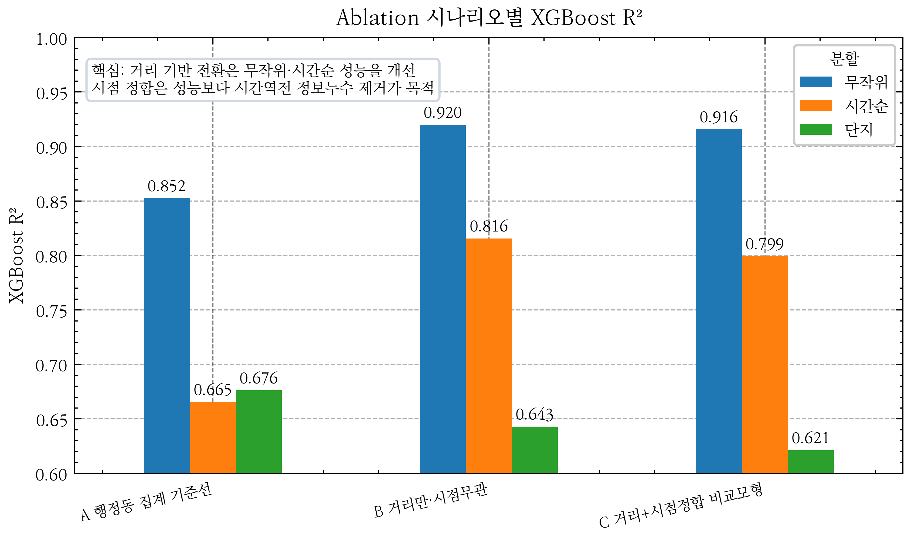
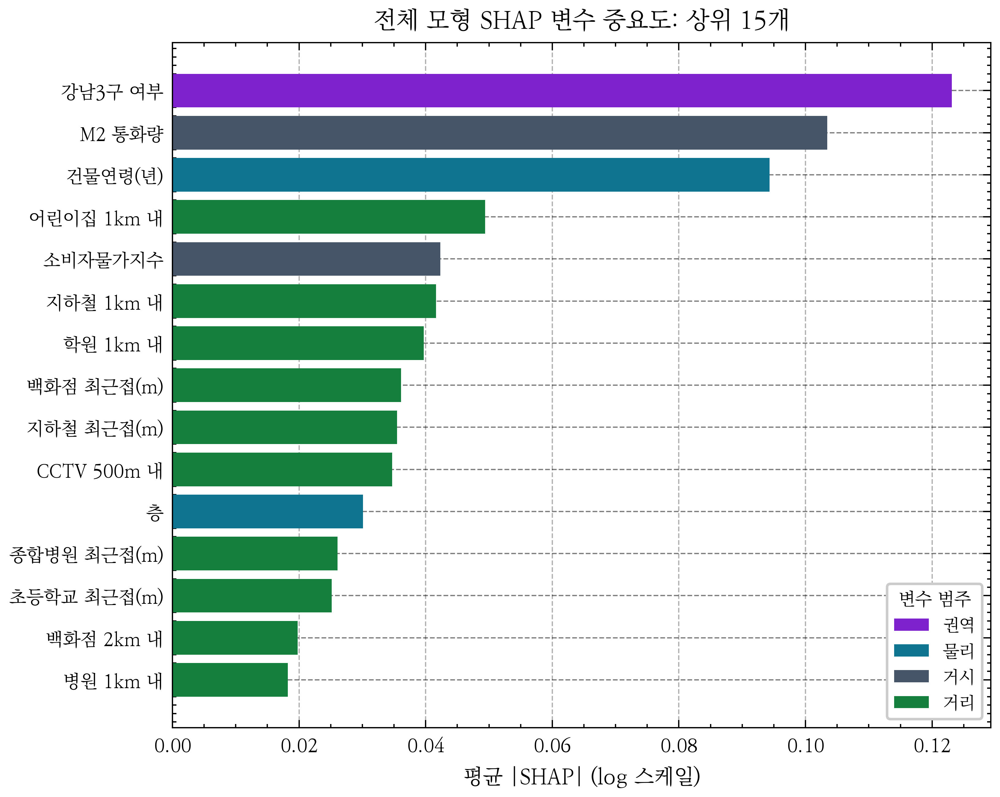
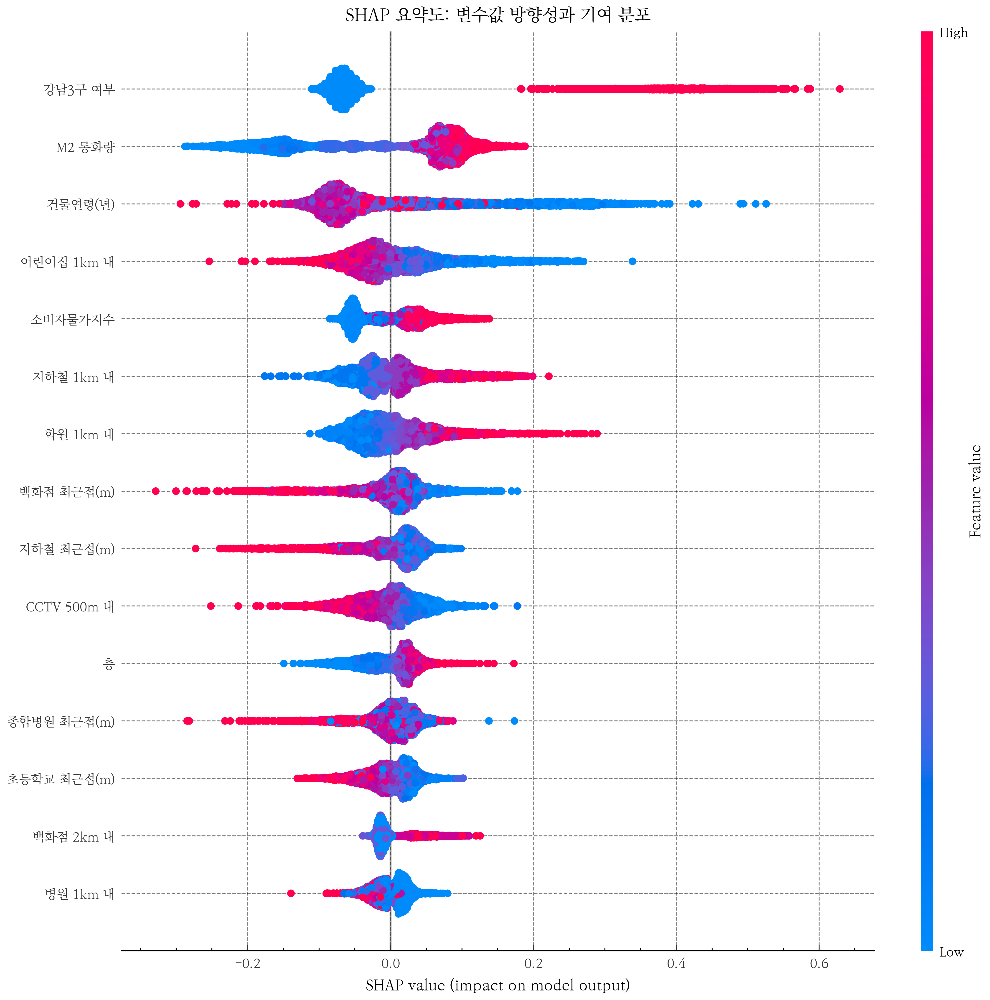
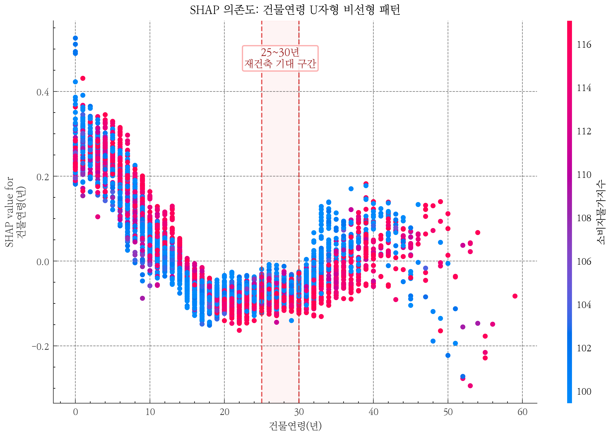
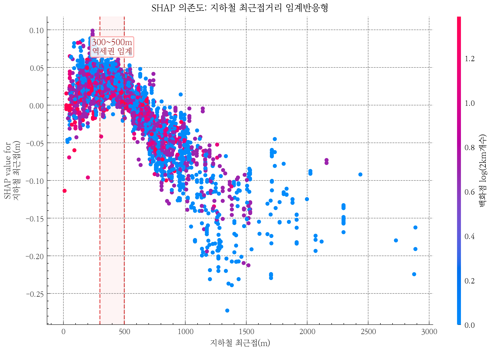
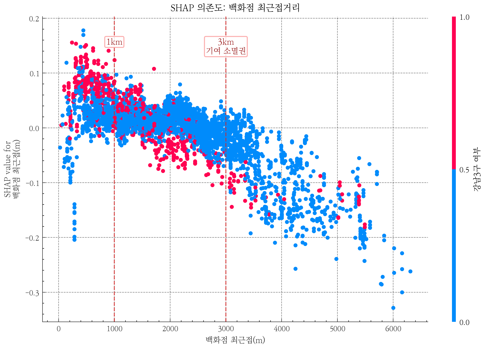
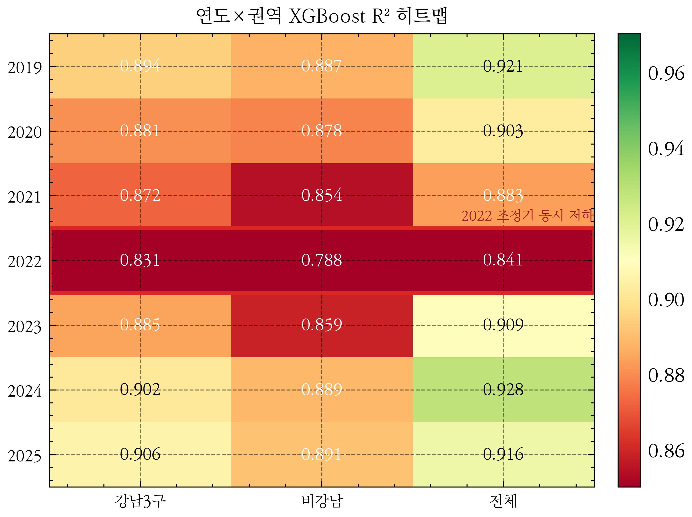
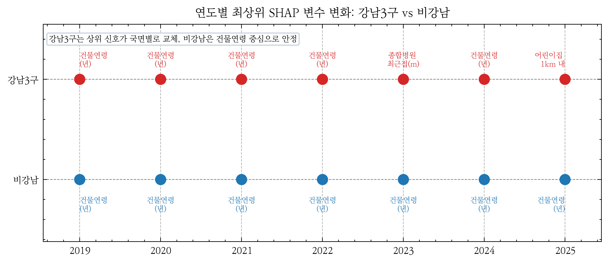

# 서울시 아파트 매매가격 예측 구조 분석: 거리 기반 접근성과 시점 정합을 중심으로

An Analysis of Apartment Sale Price Prediction Structure in Seoul: Focusing on Distance-Based Accessibility and Temporal Consistency

한양대학교 부동산융합대학원
도시·부동산빅데이터전공

---

# 목차

## 제1장 서론
- 제1절 연구의 배경 및 목적
- 제2절 연구의 범위
- 제3절 연구 방법 및 과정

## 제2장 이론적 배경 및 선행연구
- 제1절 헤도닉 가격모형
- 제2절 머신러닝 기반 부동산 가격 예측
- 제3절 예측모형 해석과 XAI
- 제4절 선행연구 검토 및 차별성

## 제3장 분석의 틀
- 제1절 연구 방법
- 제2절 변수의 정의 및 구축
- 제3절 연구 모형

## 제4장 실증 분석
- 제1절 기술통계 및 변수 분포
- 제2절 모형별 예측 성능 비교
- 제3절 소거분석(Ablation) — 거리 기반 전환과 시점 정합 비교
- 제4절 전체 SHAP 분석 — 가격 예측 기여 구조
- 제5절 권역별 SHAP 분석 — 강남3구와 비강남의 구성 차이
- 제6절 연도별 SHAP 분석 — 시장 국면별 기여도 변동
- 제7절 연도별·권역별 SHAP 비교분석 — 시장 국면별 예측 구조

## 제5장 결론
- 제1절 연구 결과 요약
- 제2절 연구의 한계 및 향후 과제

- 참고문헌
- Abstract

---

# 표 목차

- <표 3-1> 종속변수 및 독립변수 정의 · 데이터 출처
- <표 3-2> XGBoost 주요 하이퍼파라미터 설정
- <표 4-1> 종속변수 및 주요 변수 기술통계
- <표 4-2> 주요 거리 기반 변수 분포 (단지 8,601 기준 중앙값 · 백분위)
- <표 4-3> 주요 시설 도보 추정 시간 분포 (단지 8,601, 분 단위)
- <표 4-4> 모형별 · 분할별 예측 성능 비교 (종속변수 log (㎡당 가격))
- <표 4-5> 행정동 집계 기준선 대비 거리 기반 비교모형 변화
- <표 4-6> 소거분석 시나리오 구성
- <표 4-7> 소거분석 시나리오별 XGBoost R² (동일 테스트 조건)
- <표 4-8> SHAP 기여도 상위 15 변수 (전체 모형)
- <표 4-9> 권역별 독립 모형의 예측 성능
- <표 4-10> 권역별 SHAP 상위 5개 변수 (전체 기간 2019-2025)
- <표 4-11> 연도별 전체 모형 XGBoost 예측 성능
- <표 4-12> 전체 모형 연도별 SHAP 상위 5 변수
- <표 4-13> 연도별·권역별 XGBoost R² 비교
- <표 4-14> 강남3구 연도별 SHAP 상위 3개 변수
- <표 4-15> 비강남 연도별 SHAP 상위 5개 변수 (7년 고정 패턴)

# 그림 목차

- <그림 1-1> 연구의 흐름도
- <그림 2-1> XGBoost 알고리즘 개념도
- <그림 2-2> SHAP 분석 프레임워크
- <그림 4-1> 소거분석 시나리오별 XGBoost R²
- <그림 4-2> 전체 모형 SHAP 변수 중요도 상위 15
- <그림 4-3> SHAP 요약도 — 변수 방향성 및 분포
- <그림 4-4> 건물연령 SHAP 의존도 — U자형
- <그림 4-5> 어린이집 1km 내 개수 SHAP 의존도
- <그림 4-6> 지하철 최근접거리 SHAP 의존도 — 임계반응형
- <그림 4-7> 백화점 최근접거리 SHAP 의존도
- <그림 4-8> 권역별 SHAP 상위 5개 변수 비교
- <그림 4-9> 연도별·권역별 XGBoost R² 히트맵
- <그림 4-10> 연도별 최상위 SHAP 변수 변화 (강남3구 vs 비강남)

---

# 국문초록

본 연구는 서울특별시 아파트 매매가격 예측 구조를 거리 기반 접근성과 시점 정합의 관점에서 분석하였다. 자동감정평가(AVM)와 부동산 가격 예측 모형이 실무에서 활용되기 위해서는 높은 평균 성능뿐 아니라, 거래 시점에 실제 이용 가능한 시설 정보가 반영되었는지, 시장 국면이 달라질 때 예측 구조가 얼마나 안정적인지도 함께 확인되어야 한다. 기존 부동산 머신러닝 연구는 예측 정확도 향상에 초점을 두는 경우가 많았으나, 행정구역 단위 집계에 따른 공간 단위 왜곡, 분석 시점 이후의 시설 정보가 과거 거래에 결합될 수 있는 시간 정합성 문제, 단일 SHAP 결과만으로 권역·연도별 차이를 설명하기 어려운 한계가 남아 있다. 이에 본 연구는 2019년 1월부터 2025년 12월까지의 아파트 실거래 391,826건과 8,601개 단지 좌표를 대상으로, 거래 단지 좌표 기준의 거리 · 반경 접근성 지표와 연도별 시설 활동 스냅샷을 구축하였다. 좌표 기반 행정동 공간결합 결과 표본 단지는 서울시 426개 행정동 중 424개 행정동에 분포하였다. 종속변수는 규모효과를 정규화한 log(단위면적당 거래가격)으로 설정하고, OLS · 랜덤 포레스트 · XGBoost의 예측 성능을 비교하였다. 전용면적은 종속변수 산식에만 사용하고 설명변수에서는 제외하여, 단위면적당 가격과 면적 변수 사이의 기계적 결합을 피하였다. 연구 설계의 핵심은 시설 변수를 거래 단지 좌표 기준 거리 · 반경 접근성 지표로 전환하고, 시설 개업 · 폐업 이력을 반영한 연도별 시점 정합 스냅샷을 구축하며, SHAP 기여도를 전체 · 권역 · 연도 단위로 비교하는 데 있다.

최종 XGBoost 모형은 무작위 분할 R²=0.927, 시간순 분할 R²=0.812, 단지 분할 R²=0.638로 OLS와 랜덤 포레스트를 상회하였다. 다만 무작위 분할의 높은 성능은 동일·유사 단지 거래가 학습·평가 표본에 함께 포함되는 구조의 영향을 받을 수 있으므로, 본 연구는 시간순 분할과 단지 분할 결과를 함께 제시하여 일반화 난이도에 따른 성능 하락을 명시하였다. 소거분석(Ablation)에서는 행정동 집계 기준선 대비 거리 기반 변수 전환이 무작위·시간순 분할 성능을 개선하였으나, 단지 분할에서는 신규 단지 외삽 성능이 낮아지는 한계도 확인되었다. 시점 정합은 직접적인 R² 개선보다 시간역전 정보누수(temporal leakage)를 제거하여 분석의 방법론적 타당성을 높이는 데 기여하였다.

전체 SHAP 상위 변수는 강남구분, M2 통화량, 건물연령, 어린이집 1km 내 개수, 소비자물가지수였으며, 상위 15개 중 거리 기반 변수가 9개로 나타났다. 권역별로는 강남3구에서 건물연령, 백화점 최근접거리, 어린이집 1km 내 개수, 초등학교 최근접거리, 종합병원 최근접거리가 상위권을 구성한 반면, 비강남에서는 건물연령, 지하철 1km 내 역수, 어린이집 1km 내 개수, 학원 1km 내 개수, 지하철 최근접거리가 안정적으로 기여하였다. CCTV 500m 내 개수는 안전시설 자체의 인과효과가 아니라 유동인구, 상업밀도, 공공 안전 인프라 배치가 결합된 근린 환경 대리 지표로 해석하였다. 본 연구는 머신러닝이나 SHAP 적용 자체를 신규성으로 주장하기보다, 거리 기반 접근성 변수와 연도별 시점 정합 자료를 결합하고 시간순·단지 분할 및 권역·연도별 SHAP 비교를 통해 AVM 운용에서 지속적인 성능 검증과 해석 점검이 필요함을 보였다는 데 의의가 있다.

주요어 : 서울 아파트 매매가격, 거리 기반 접근성, 시점 정합, 자동감정평가, 시장 국면별 예측 구조, 예측 기여도

---

# 제1장 서론

## 제1절 연구의 배경 및 목적

### 1. 연구의 배경

부동산은 한국 가계 자산에서 가장 큰 비중을 차지하는 핵심 자산이다. 통계청 (2024)에 따르면, 한국 가구 평균 자산에서 실물자산이 차지하는 비중은 75.2%이며, 이 중 부동산이 대부분을 구성한다. 특히 서울 아파트는 자산 축적과 주거 안정의 핵심 수단으로 기능하고 있다. 서울 아파트 매매가격의 변동은 개인의 자산 가치는 물론, 가계 부채, 소비, 건설 투자 등 거시경제 전반에 광범위한 파급효과를 미친다. 이에 따라 서울 아파트 매매가격이 어떤 접근성 조건과 시장 국면, 권역별 특성 속에서 예측되는지를 파악하는 것은 학술적으로나 감정평가 · 금융 실무 측면에서 중요한 과제이다.

부동산 가격 설명의 이론적 토대는 Lancaster (1966)와 Rosen (1974)이 정립한 헤도닉 가격모형 (Hedonic Price Model)이다. 이 모형은 이질적 재화인 부동산의 가격이 면적, 층수, 건축연도, 입지 등 다양한 속성들의 함수로 설명될 수 있음을 보여준다. 헤도닉 가격모형은 다중회귀분석 (Ordinary Least Squares, OLS)을 통해 각 속성의 암묵적 가격 (implicit price)을 추정하는 방식으로 널리 활용되어 왔다. 그러나 전통적인 OLS 기반 분석은 변수 간 관계를 선형으로 가정하기 때문에, 실제 부동산 시장에서 관찰되는 비선형적 가격 변동 패턴과 변수 간 복잡한 상호작용 구조를 충분히 포착하지 못한다는 한계가 지적되어 왔다 (Čeh et al., 2018; Limsombunchai, 2004).

이러한 한계를 극복하기 위해 최근에는 머신러닝 (Machine Learning, ML) 기반의 부동산 가격 예측 연구가 활발히 진행되고 있다. 랜덤 포레스트, XGBoost, LightGBM 등의 앙상블 학습 모형과 LSTM (Long Short-Term Memory), GRU (Gated Recurrent Unit) 등의 딥러닝 모형이 전통적 회귀분석을 크게 상회하는 예측 성능을 보여주고 있다 (Choy & Ho, 2023; Mora-García et al., 2022). 그러나 이러한 머신러닝 모형들은 내부 작동 원리를 직접 해석하기 어려운 경우가 많아, 높은 예측 정확도에도 불구하고 "왜 특정 아파트의 예측값이 이렇게 산출되었는가?"라는 질문에 답하기 어렵다는 문제가 있다.

이에 대한 대안으로 최근 국제적으로 주목받고 있는 것이 설명가능한 인공지능 (eXplainable AI, XAI)이다. 특히 Lundberg & Lee (2017)가 제안한 SHAP (SHapley Additive exPlanations)은 게임이론의 Shapley value 개념을 머신러닝 모형 해석에 적용하여, 각 특성(feature)이 개별 예측에 미치는 기여도를 이론적으로 일관성 있게 분해할 수 있는 프레임워크이다. 다만 부동산 가격 예측에서 머신러닝과 SHAP을 적용하는 연구는 이미 빠르게 축적되고 있으므로, 본 연구에서 이들 방법은 신규성 자체가 아니라 단위면적당 매매가격의 예측 구조를 보수적으로 점검하기 위한 도구로 사용된다. 본 연구의 초점은 거리 기반 접근성 변수와 연도별 시점 정합 자료를 결합하고, 시간순·단지 분할 및 권역·연도별 비교를 통해 서울 아파트 가격 예측 구조가 시장 국면과 표본 분할 방식에 따라 어떻게 달라지는지를 확인하는 데 있다.

본 연구가 이 주제를 다루는 이유는 자동감정평가(Automated Valuation Model, AVM)의 실무 확산과도 관련된다. 감정평가 · 은행 · 세무 실무에서 예측값을 활용하려면 예측 정확도뿐 아니라, 그 예측값이 어떤 변수 조합에 의해 산출되었는지를 설명할 수 있어야 한다. 특히 2022년처럼 금리 급등과 거래 급감이 함께 나타난 국면에서는 기존 가격 예측 모형의 안정성이 약화될 수 있으므로, 모형의 성능 변화와 변수 기여 구조를 함께 점검할 필요가 있다.

국내외 서울 부동산 머신러닝 연구는 이미 다수 축적되어 있으나 (김이환 외, 2022; 김학현 외, 2023; 조보근 외, 2020; Chun et al., 2025; Kim et al., 2025), 분석 단위와 시간 정합성, 검증 설계 측면에서 보완 여지가 남아 있다. 기존 연구 상당수는 자치구 또는 법정동 단위 집계 변수를 사용하여 수정가능 공간단위 문제(Modifiable Areal Unit Problem, MAUP)의 영향을 받을 수 있고, 환경 변수를 수집 시점의 스냅샷으로 분석 기간 전체에 병합하는 경우에는 과거 거래에 미래 시설 정보가 결합되는 시간역전 정보누수(temporal leakage)가 발생할 수 있다. 또한 단일 SHAP 결과표만 제시하면 권역과 연도에 따라 예측 기여 구조가 어떻게 달라지는지 충분히 확인하기 어렵다. 따라서 본 연구는 단순히 높은 예측 성능을 보이는 모형을 선택하는 데 그치지 않고, 분석 단위, 시점 정합, 표본 분할 방식, 권역·연도별 예측 기여 구조를 함께 점검하는 것을 연구의 출발점으로 삼는다.

2019년부터 2025년까지의 분석 기간은 서울 아파트 시장이 유동성 주도 급등(2020 ~ 2021), 금리 충격 조정(2022), 완만한 회복(2023 ~ 2025)을 순차적으로 경험한 시기이다. 기준금리는 2020년 저점 0.5%에서 2023년 고점 3.5%를 거쳐 2025년 말 2.5%로 이동하였고, 거래량도 해마다 크게 변동하였다. 이처럼 시장 국면이 바뀌는 기간에는 가격 예측에 기여하는 변수의 순위와 방향이 고정되어 있다고 보기 어렵다.

이에 본 연구는 단위면적당 가격(log ㎡당 만원)을 종속변수로 설정하되, 전용면적은 설명변수에서 제외하여 종속변수 산식과 설명변수 사이의 기계적 결합을 피하였다. 시설 변수는 행정동 경계 내 개수 대신 거래 아파트 단지 좌표 기준 거리 · 반경 접근성 지표로 재구성하였고, 시설의 개업 · 폐업 · 신설 이력을 반영하여 연도별(2019 ~ 2025) 활동 시설 스냅샷을 구축하였다. 이때 시설 개업 · 폐업 정보는 가격에 대한 직접 인과효과가 아니라, 거래 시점에 실제 이용 가능한 시설만 설명변수로 사용하기 위한 시간 정합 장치로 해석한다. 이후 SHAP 기여도를 전체 · 권역(강남3구 / 비강남) · 연도 단위에서 산출하여 시장 국면별 예측 기여 구조와 권역별 차이를 비교하였다.

### 2. 연구의 기여

본 연구의 기여는 거리 기반 접근성 변수와 연도별 시점 정합 조건을 결합하고, 예측 성능을 보수적으로 검증하며, SHAP 기여도 구조를 권역과 연도 단위로 비교한 데 있다. 행정동 집계 기준선과 거리 기반 접근성, 시점 무관 설계와 시점 정합 설계를 각각 대조하는 소거분석(Ablation)을 통해 자료 구축 방식이 서울 아파트 가격 예측에 미치는 차이를 정량 비교하였다. 또한 전용면적을 설명변수에서 제외한 뒤에도 XGBoost가 OLS와 랜덤 포레스트를 상회함을 확인하되, 시간순 분할과 단지 분할 성능 하락을 함께 제시하여 무작위 분할 성능이 과장되지 않도록 하였다. 마지막으로 SHAP 기여도 분석을 권역별·연도별로 비교하여, 강남3구에서는 상업 · 안전 · 의료 · 재건축 관련 변수의 기여 순위가 국면별로 이동하고, 비강남에서는 건물연령 · 교통 · 생활권 접근성 변수의 기여가 상대적으로 안정적으로 유지되는 구조를 확인하였다.

## 제2절 연구의 범위

본 연구의 시간적 범위는 2019년 1월부터 2025년 12월 계약분까지 약 7년간이다. 다만 2025년 하반기 자료는 분석 시점 기준 잠정 관측치가 포함될 수 있으므로, 해당 구간의 해석에는 신고 지연 가능성을 함께 고려할 필요가 있다. 이 기간은 유동성 주도 급등 (2020 ~ 2021), 금리 충격 조정 (2022), 완만한 회복 (2023 ~ 2025) 국면을 연속으로 포함하여, 거시경제 변수가 예측값 기여 구조에서 어떤 역할을 보이는지 점검하기에 적합하다.

공간적 범위는 서울특별시 아파트 매매 실거래 데이터이다. 서울시 전체 행정동 단위는 426개로 확인되며, 본 연구의 단지 좌표 기반 공간결합 재검증 결과 최종 표본 391,826건은 8,601개 단지를 통해 424개 행정동에 분포하였다. 공간결합에서 제외된 행정동은 종로구 삼청동과 가회동 2개로, 분석 기간의 실거래 자료와 단지 좌표가 결합된 아파트 표본이 확인되지 않은 지역이다. 기존 연구들이 자치구(25개) 단위로 환경 변수를 집계한 것과 달리, 본 연구에서는 거래 단지 좌표 기준 거리 · 반경 접근성 변수를 구축하여 보다 미시적인 공간 단위에서 가격 구조를 검토한다.

## 제3절 연구 방법 및 과정

본 연구는 정량적 실증분석 방법을 채택하였다. 국토교통부 공공데이터포털(data.go.kr), 서울열린데이터광장(data.seoul.go.kr), 나이스 교육정보 개방 포털(open.neis.go.kr), 한국은행 경제통계시스템(ECOS, ecos.bok.or.kr) 등에서 원자료를 수집한 뒤, 법정동에서 행정동으로의 매핑, 결측값 처리, 이상값 제거, 변수 변환을 수행하였다. 이후 기술통계 분석을 통해 거래가격과 접근성 변수의 분포를 파악하였다.

예측 모형은 다중회귀분석(OLS), 랜덤 포레스트, XGBoost로 구성하고, R², RMSE, MAE 등의 지표를 통해 성능을 비교하였다. 최종 해석은 XGBoost 모형에 SHAP 분석을 적용하여 전체 수준 변수 중요도와 개별 예측 기여 구조를 산출하는 방식으로 진행하였다. 주 모형은 종속변수를 log(단위면적당 거래가격)으로 정규화하며, 전체 · 강남3구 · 비강남 각각에 대해 강남구분 더미를 제거한 별도 모형을 적합하여 지역 내부의 예측 구조를 비교하였다. 보조 분석으로는 연도별 · 권역별 SHAP 분석과 소거분석을 수행하였다.

분석에는 Python 프로그래밍 언어와 scikit-learn, xgboost, shap 등의 오픈소스 라이브러리를 활용하였다.

본 논문은 총 5개 장으로 구성된다.

제1장 서론에서는 연구의 배경과 목적, 연구 범위, 연구 방법 및 과정을 기술하였다.

제2장 이론적 배경 및 선행연구에서는 헤도닉 가격모형의 이론적 토대, 머신러닝 기반 부동산 가격 예측 및 자동감정평가(AVM) 연구의 동향, 공간 단위 문제 (MAUP)와 시간 정합성(temporal leakage) 논의를 검토한다. 설명가능한 인공지능 (XAI) · SHAP 방법론은 독립적 이론 축이 아니라 본 연구의 예측모형 해석 도구로 필요한 범위에서만 정리하고, 선행연구 대비 본 연구의 보완적 기여를 제시한다.

제3장 분석의 틀에서는 분석 범위와 종속변수 정의, 단지 · 주택 특성 · 행정동 기반 변수 · 거리 기반 POI 변수 · 시점 정합 변수의 구성, 권역 구분 (강남3구 / 비강남), OLS · 랜덤 포레스트 · XGBoost 모형과 SHAP 해석, 무작위 · 단지 · 시간순 분할 검증 설계를 기술한다.

제4장 실증 분석은 일곱 개의 절로 구성한다. 제1절 기초통계 및 변수 분포, 제2절 모형별 예측 성능 비교, 제3절 소거분석(Ablation) (거리 기반 전환 · 시점 정합 비교), 제4절 전체 SHAP 분석, 제5절 권역별 SHAP 분석 (강남3구 vs 비강남), 제6절 연도별 SHAP 분석 (2022년 조정기 예측 안정성 논의 포함), 제7절 연도별·권역별 SHAP 비교분석을 제시한다.

제5장 결론에서는 연구 결과를 요약하고, 인과 해석 제약, 거시 · 정책 변수 포함 범위, 도보 시간 근사, 미관측 시설 스냅샷 등 연구의 한계와 후속 연구 방향을 제시한다.

본 연구의 전체 구성과 분석 절차는 <그림 1-1>과 같다.

---

# 제2장 이론적 배경 및 선행연구

## 제1절 헤도닉 가격모형

### 1. 헤도닉 가격모형의 이론적 기초

헤도닉 가격모형 (Hedonic Price Model)은 Lancaster (1966)의 소비자 이론과 Rosen (1974)의 암묵적 시장 (implicit market) 이론에 근거한다. Lancaster (1966)는 소비자의 효용이 재화 자체가 아닌 재화가 보유한 속성 (characteristics)에서 파생된다고 주장하였다. 이를 부동산에 적용하면, 주택의 가격은 주택이라는 단일 재화가 아니라 면적, 층수, 입지, 학군, 교통 편의성 등 다양한 속성들의 묶음 (bundle)에 의해 결정된다.

Rosen (1974)은 이를 발전시켜 이질적 재화 (differentiated products)의 시장에서 각 속성의 암묵적 가격 (implicit price)을 추정하는 헤도닉 가격함수를 정립하였다. 이를 수식으로 표현하면 다음과 같다.

$$P = f(z_1, z_2, ..., z_n)$$

여기서 $P$는 부동산 가격, $z_i$는 $i$번째 속성, $n$은 모형에 포함된 속성의 수를 나타낸다. 각 속성의 암묵적 가격은 헤도닉 가격함수의 편미분으로 도출된다.

$$\frac{\partial P}{\partial z_i} = p_i (z)$$

전통적으로 헤도닉 가격모형은 다중회귀분석 (OLS)을 통해 추정되어 왔으며, 다음과 같은 선형 모형이 일반적으로 사용된다.

$$P = \beta_0 + \beta_1 z_1 + \beta_2 z_2 + ... + \beta_n z_n + \epsilon$$

여기서 $p_i(z)$는 속성 $z_i$의 조건부 한계가격, $\beta_0$는 상수항, $\beta_i$는 각 속성의 회귀계수, $\epsilon$은 오차항이다. 헤도닉 가격모형의 고전적 해석에서 $\beta_i$는 해당 속성의 한계가격(marginal implicit price)에 대응한다. 다만 실제 관측자료에 OLS를 적용할 때에는 함수형 가정, 누락변수, 다중공선성 등에 따라 이러한 계수를 조건부 연관성 수준에서 해석하는 것이 보다 보수적이다.

### 2. 헤도닉 가격모형의 한계

헤도닉 가격모형은 부동산 가격 관련 속성들을 체계적으로 정리하는 표준적 이론 프레임워크로 널리 활용되어 왔으나, OLS에 기반한 추정 방법은 다음과 같은 한계를 가진다.

첫째, 변수 간 관계를 선형으로 가정하므로, 비선형적 가격 변동 패턴을 포착하지 못한다. 예를 들어, 전용면적의 증가와 거래금액 간의 연관은 소형 면적에서와 대형 면적에서 상이할 수 있으나, 선형 모형에서는 이를 단일 기울기의 평균적 선형 관계로만 요약한다.

둘째, 변수 간 상호작용 효과 (interaction effects)를 명시적으로 지정하지 않는 한 포착하기 어렵다. 가령, 강남 지역과 비강남 지역에서 전용면적과 거래금액 간의 선형 관계가 다를 수 있으나, 기본 OLS 모형에서는 이를 반영하기 어렵다.

셋째, 다중공선성 (multicollinearity) 문제에 취약하다. 부동산 가격 관련 변수들 (금리, 물가, 통화량 등)은 상호 높은 상관관계를 가지는 경우가 많아, 개별 회귀계수의 추정에 불안정성을 초래할 수 있다.

이러한 한계를 극복하기 위하여 머신러닝 모형의 도입이 활발히 이루어지고 있다.

### 3. 거시경제 변수와 부동산 가격의 관계

헤도닉 가격모형이 주로 물리적 · 입지적 속성에 초점을 맞추는 반면, 부동산 가격 예측에서는 거시경제 환경을 함께 고려할 필요가 있다. 특히 통화량 (M2)과 금리는 부동산 시장과 관련된 유동성 · 금융 여건을 반영하는 대표적 거시변수이다. 중앙은행의 통화 공급 확대는 시중 유동성 증가와 자산시장 자금 유입 확대와 연관될 수 있으며, 한국처럼 가계자산에서 부동산 비중이 큰 경제에서는 이러한 거시 여건 변화가 주택시장 국면과 함께 움직이는 경우가 많다. 실제로 2020 ~ 2021년 COVID-19 대응 국면에서 통화 확대와 서울 아파트 가격 상승이 동시에 관찰되었다.

금리는 주택담보대출 비용과 금융여건을 반영하는 변수로 이해할 수 있다. 기준금리 인하 국면은 대출 이자 부담 완화와 함께 관찰되는 경우가 많고, 금리 인상 국면은 자금조달 여건의 제약과 동행하는 경향이 있다. 다만 기준금리와 시장금리 (CD금리) 간에는 높은 상관관계가 존재하여 다중회귀분석에서는 심각한 다중공선성 문제를 유발할 수 있다. 소비자물가지수 (CPI)는 실물자산의 인플레이션 헤지 (inflation hedge) 논의와 관련되며, 물가 상승기에는 투자자의 자산배분 판단과 함께 주택시장 국면을 읽는 보조 정보로 활용될 수 있다. 이처럼 거시경제 변수들은 개별 거래의 독립적 효과라기보다 금융 · 유동성 환경과 시장 국면을 함께 반영하는 설명 정보로 이해하는 편이 보다 적절하다. 특히 본 연구처럼 동일 월 거래들에 반복 부여된 자료 구조와 거시변수 상호 간 강한 공선성이 존재하는 경우, 개별 거시변수의 OLS 계수를 독립적인 효과처럼 해석하기보다 시장 국면을 구성하는 묶음형 정보 (bundle of regime signals)로 제한적으로 읽는 것이 보다 타당하다.

거시경제 변수와 부동산 정책이 아파트 가격에 미치는 영향도 활발히 연구되었다. 배종찬 · 정재호 (2021)는 VEC 모형으로 거시경제와 부동산정책이 서울 아파트가격에 미치는 영향을 분석하였고, 노산하 · 신진호 (2021)는 검색빈도를 활용하여 종합부동산세와 재산세의 주택가격 인하효과를 실증하였다. 정진오 · 정재호 (2023)는 조세정책과 금융정책이 부동산가격에 미치는 차별적 영향을 VAR 모형으로 분석하였으며, 김명진 · 서원석 (2023)은 코로나19에 따른 소매유통시설이 아파트 가격에 미치는 시계열 효과를 보고하였다.

## 제2절 머신러닝 기반 부동산 가격 예측

### 1. 머신러닝의 부동산 분야 적용

머신러닝은 데이터로부터 패턴을 학습하여 예측을 수행하는 알고리즘의 총칭으로, 변수 간 비선형 관계와 고차원 상호작용을 자동으로 포착할 수 있다는 점에서 전통적 통계 모형의 대안으로 주목받고 있다. 부동산 분야에서의 머신러닝 활용은 Limsombunchai (2004)의 초기 연구 이후 급속히 확대되었으며, 특히 2020년 이후 관련 연구가 급격히 증가하는 추세이다 (Choy & Ho, 2023).

Choy & Ho (2023)의 체계적 문헌 리뷰에 따르면, 부동산 가격 예측에 활용되는 주요 머신러닝 알고리즘은 다음과 같이 분류할 수 있다.

첫째, 회귀 기반 모형으로 릿지 (Ridge), 라쏘 (Lasso), 엘라스틱넷 (Elastic Net) 등 정규화 회귀 모형이 있다. 이들은 OLS의 과적합 문제를 완화하지만, 기본적으로 선형 가정을 유지한다.

둘째, 트리 기반 앙상블 모형으로 Breiman (2001)의 랜덤 포레스트, Friedman (2001)의 그래디언트 부스팅, Chen & Guestrin (2016)의 XGBoost, Ke et al. (2017)의 LightGBM 등이 있다. 이들은 비선형 관계와 변수 간 상호작용을 효과적으로 포착할 수 있으며, 특히 부동산 가격 예측에서 우수한 성능을 보여왔다 (Čeh et al., 2018).

셋째, 딥러닝 모형으로 LSTM, GRU 등의 순환신경망 (RNN) 모형과 합성곱 신경망 (CNN), 그래프 신경망 (GNN) 등이 있다. Mora-García et al. (2022)은 COVID-19 시기 딥러닝과 앙상블 모형의 예측력을 비교하였으며, Kim et al. (2022)은 공간회귀분석을 통해 주택가격의 공간적 의존성을 분석하였다.

### 2. 자동감정평가(AVM)와 검증 설계

자동감정평가(Automated Valuation Model, AVM)는 대량의 거래 · 위치 · 물리적 속성 정보를 이용하여 개별 부동산의 가격을 반복적으로 추정하는 예측 시스템이다. AVM이 감정평가, 금융, 세무, 담보평가 실무에서 활용되기 위해서는 특정 표본에서 높은 평균 정확도를 보이는 것만으로는 충분하지 않다. 학습 자료와 다른 시점의 거래, 학습에 포함되지 않은 단지, 시장 국면이 변한 기간에서도 예측 성능이 어느 정도 유지되는지를 함께 확인해야 한다.

따라서 AVM 연구에서 중요한 검증 과제는 단순한 모형 간 성능 순위가 아니라 일반화 조건별 성능 차이를 해석하는 것이다. 무작위 분할은 동일하거나 유사한 단지가 학습과 평가에 함께 포함될 수 있어 모형의 내부 예측력을 확인하는 데 유리하지만, 실제 운용 환경의 외삽 난이도를 충분히 반영하지 못할 수 있다. 시간순 분할은 과거 자료로 미래 거래를 예측하는 조건을 만들며, 단지 분할은 학습에서 보지 못한 단지에 대한 외삽 성능을 점검한다. 본 연구에서 무작위 · 시간순 · 단지 분할을 병행한 이유는 XGBoost가 우수하다는 단일 결론을 제시하기보다, 예측모형이 어떤 일반화 조건에서 강하고 어떤 조건에서 약한지를 AVM 운용 관점에서 확인하기 위해서이다.

### 3. XGBoost 알고리즘

XGBoost는 Chen & Guestrin (2016)이 제안한 트리 기반 그래디언트 부스팅 알고리즘으로, 기존 그래디언트 부스팅 머신 (Friedman, 2001)을 개선한 것이다. XGBoost는 다음과 같은 장치를 통해 과적합을 완화하고 예측 성능을 높인다.

첫째, 정규화는 목적함수에 L1 및 L2 정규화 항을 포함하여 모형 복잡도를 제어하는 장치이다. XGBoost의 목적함수는 다음과 같다.

$$\mathcal{L} = \sum_{i = 1}^{n} l(y_i, \hat{y}_i) + \sum_{k = 1}^{K} \Omega (f_k)$$

여기서 $n$은 관측치 수, $y_i$는 관측치 $i$의 실제값, $\hat{y}_i$는 예측값, $l$은 손실함수, $K$는 앙상블에 포함된 트리 수, $f_k$는 $k$번째 회귀트리, $\Omega(f_k)$는 해당 트리의 정규화 항이다. XGBoost의 트리 정규화 항은 일반적으로 다음과 같이 표현된다.

$$\Omega(f_k) = \gamma T_k + \frac{1}{2}\lambda \sum_{t = 1}^{T_k} w_{kt}^{2} + \alpha \sum_{t = 1}^{T_k}|w_{kt}|$$

여기서 $T_k$는 $k$번째 트리의 리프 수, $w_{kt}$는 리프 $t$의 가중치이며, $\gamma$, $\lambda$, $\alpha$는 각각 트리 복잡도, L2, L1 정규화 강도를 조절한다.

둘째, 축소는 각 트리의 기여도에 학습률을 적용하여 모형을 점진적으로 갱신함으로써 과적합을 완화하고 일반화 성능을 높인다.

셋째, 컬럼 서브샘플링은 랜덤 포레스트에서 착안한 절차로, 각 트리 또는 각 분기에서 무작위로 특성의 부분집합을 선택함으로써 모형의 다양성을 확보한다.

넷째, 결측값 자동 처리는 결측값이 있는 데이터에 대해 최적의 분할 방향을 자동으로 학습하는 기능이다.

다섯째, 근사 분할 알고리즘은 대용량 데이터에서도 효율적인 분할점 탐색이 가능하게 한다.

이러한 특성들로 인해 XGBoost는 다양한 분야의 구조화된 자료 예측 문제에서 높은 성능을 보이고 있으며, 부동산 가격 예측에서도 높은 정확도를 달성하는 것으로 보고되고 있다 (Čeh et al., 2018; Mora-García et al., 2022). XGBoost의 전체적인 학습 구조와 알고리즘 흐름은 <그림 2-1>에 제시하였다.

### 4. 랜덤 포레스트

랜덤 포레스트는 Breiman (2001)이 제안한 앙상블 학습법으로, 다수의 의사결정 트리를 독립적으로 학습시킨 뒤 회귀 문제에서는 예측값의 평균으로 최종 결과를 산출하는 배깅 기반 알고리즘이다. 각 트리는 학습 데이터에서 복원추출한 표본을 사용하며, 각 분기에서는 전체 변수 중 무작위로 선택된 일부 변수만 고려한다. 이를 통해 개별 트리 간의 상관관계를 줄이고 과적합을 완화한다.

Čeh et al. (2018)은 랜덤 포레스트가 다중회귀분석에 비해 비선형 관계를 효과적으로 포착하여 주택가격 예측에서 우수한 성능을 보임을 실증하였다. 본 연구에서는 랜덤 포레스트를 XGBoost의 비교 모형으로 활용한다.

## 제3절 예측모형 해석과 XAI

### 1. XAI의 연구상 역할

설명가능한 인공지능(eXplainable Artificial Intelligence, XAI)은 머신러닝 모형의 예측값이 어떤 변수 조합과 관련되어 형성되는지를 사람이 해석할 수 있는 형태로 정리하는 방법론이다. 부동산 가격 예측에서 XAI는 높은 정확도를 보이는 비선형 모형을 블랙박스로만 두지 않고, 가격 예측값의 구성 정보를 점검하는 보조 도구로 활용된다. 다만 XAI 자체는 이미 부동산 가격 예측 및 AVM 연구에서 널리 활용되고 있으므로, 본 연구의 차별성은 XAI 적용 자체가 아니라 서울 아파트 실거래 자료에서 거리 기반 근린환경 변수, 시점 정합 자료, 보수적 분할 검증을 결합해 예측 구조를 점검한 데 있다.

### 2. SHAP 해석의 범위

SHAP(SHapley Additive exPlanations)은 게임이론의 Shapley value 개념을 바탕으로 개별 예측값을 변수별 기여도로 분해하는 방법이다(Lundberg & Lee, 2017). XGBoost 등 트리 기반 모형에 대해서는 TreeSHAP 알고리즘을 통해 각 변수의 예측 기여도를 효율적으로 계산할 수 있다(Lundberg et al., 2020). 본 연구에서는 평균 절대 SHAP값을 변수 중요도 순위 비교에 사용하고, SHAP 요약도와 의존도 그림을 통해 변수값과 예측 기여 방향을 보조적으로 확인하였다.

중요한 점은 SHAP값이 회귀계수, 탄력성, 인과효과가 아니라 모형 내부의 예측 기여도라는 것이다. 따라서 "해당 시설이 가격을 상승시킨다" 또는 "특정 정책 효과가 확인되었다"가 아니라 "해당 변수가 XGBoost 예측값 변동을 설명하는 데 상대적으로 큰 몫을 차지하였다"로 해석해야 한다. 또한 강남3구와 비강남, 연도별 하위표본은 표본 수와 가격 분포가 서로 다르므로 SHAP값의 절대 크기를 단순 비교하기보다 순위, 반복성, 방향성 중심으로 제한적으로 읽는다.

### 3. 본 연구의 적용

본 연구에서 SHAP은 전체 모형, 권역별 모형, 연도별 모형의 예측 기여 구조를 비교하기 위한 해석 도구이다. 본문에서 제시하는 연도별·권역별 비교는 SHAP interaction value를 계산하거나 연도와 권역의 상호작용항을 직접 추정한 결과가 아니다. 동일한 평가 지표와 동일한 해석 도구를 연도 및 권역 단위로 나누어, 시장 국면과 권역 구분에 따라 예측 기여 구조가 어떻게 달라지는지를 사후적으로 비교한 것이다. 본 연구에서 적용한 SHAP 분석의 전체 프레임워크는 <그림 2-2>에 제시하였다.

## 제4절 선행연구 검토 및 차별성

### 1. 아파트 가격 결정요인 연구

아파트 가격 결정요인 연구는 헤도닉 가격모형을 토대로 주택의 물리적 특성, 입지, 교통 접근성, 생활 인프라, 지역 환경이 가격에 어떻게 반영되는지를 분석해 왔다. 김우성 외(2019)는 2006 ~ 2017년 강남 아파트 실거래가를 분석하여 주거 선호의 구조 변화를 실증하였고, 신광문 · 이재수 (2019)는 공간 헤도닉 모형으로 소형주택 임대료 결정요인을 분석하였다. 장희선 외(2021)는 공간헤도닉모형을 적용하여 서울시 도시공원 서비스의 편익을 주택가격을 통해 측정하였다. 이러한 연구들은 부동산 가격이 단순한 면적이나 거래 시점만으로 결정되지 않고, 입지와 주변 환경의 복합적 속성을 함께 반영한다는 점을 보여준다.

### 2. 머신러닝 기반 부동산 가격 예측 연구

머신러닝 기반 부동산 가격 예측 연구는 2020년대 이후 국내외에서 빠르게 확대되었다. 조보근 외(2020)는 기계학습 알고리즘을 활용하여 지역별 아파트 실거래가격지수 예측모델을 비교하고 LIME을 통한 해석력 검증을 수행하였다. 배성완 · 유정석 (2018)은 SVM, 랜덤 포레스트, GBT, DNN, LSTM 등 다양한 머신러닝 모형으로 한국 부동산 가격지수를 예측하여 이 분야의 국내 연구를 선도하였다. 김이환 외(2022)는 기계학습 방법론으로 아파트 매매가격지수를 산출하여 헤도닉 모형 대비 우수한 설명력을 확인하였고, 김학현 외(2023)는 DNN, XGBoost, CatBoost 등을 비교하여 딥러닝과 머신러닝의 아파트 실거래가 예측 성능을 실증하였다. 이선구 (2025)는 XGBoost 기반 자동가치산정모형 (AVM)을 은평구 다세대주택에 적용하여 86.4%의 예측 정확도를 보고하였다.

공간 정보를 직접 반영하려는 시도도 나타난다. 진수정 (2024)은 서울시 아파트 매매가격 예측에 그래프 신경망 (SRGCNN)을 적용하여 공간적 의존성을 반영한 딥러닝 모형을 제안하였다. 해외 연구에서는 Mora-García et al. (2022)이 COVID-19 시기 스페인 알리칸테 지역의 주택가격 예측에 랜덤 포레스트와 XGBoost를 적용하여 전통적 회귀분석 대비 우수한 성능을 확인하였고, Čeh et al. (2018)은 슬로베니아 아파트를 대상으로 랜덤 포레스트와 다중회귀분석을 비교하여 머신러닝 모형의 비선형 포착 능력을 실증하였다. Shahhosseini et al. (2022)은 Ames 주택 자료 세트를 활용하여 앙상블 가중치와 모형 설정값을 동시에 최적화하는 프레임워크를 제안하였다. 이들 연구는 머신러닝 모형이 비선형 관계와 변수 간 상호작용을 포착하는 데 강점을 가질 수 있음을 보여준다.

### 3. XAI 기반 부동산 가격 해석 연구

머신러닝 모형의 예측 성능이 높아질수록, 예측값을 어떤 변수 구조로 해석할 수 있는지에 대한 관심도 커지고 있다. Neves et al. (2024)은 오픈데이터와 XAI를 결합하여 리스본 스마트시티의 부동산 가격을 분석하였으며, XGBoost 모형에 SHAP을 적용하여 면적, 입지, 건축연도 등이 예측값 설명에서 어떤 역할을 보이는지 정리하였다. Ezil Sam Leni et al. (2025)은 킹카운티 주택 데이터를 대상으로 XGBoost와 SHAP을 결합한 가격 예측 프레임워크를 제안하고, 웹 배포까지 구현하여 XAI 기반 AVM의 실무적 활용 가능성을 보여주었다.

헤도닉 모형과 머신러닝을 비교하면서 해석 가능성을 함께 다룬 연구도 있다. An et al. (2025)은 한국 주택시장을 대상으로 전통적 헤도닉 가격모형과 머신러닝 모형의 예측 성능을 비교하고, SHAP을 활용하여 머신러닝 모형에 헤도닉 모형 수준의 해석 가능성을 부여할 수 있음을 실증하였다. Tarasov & Dessoulavy-Śliwiński (2025)는 폴란드 부동산 시장에서 알고리즘 기반 헤도닉 가격 모형에 XAI를 적용하여, 머신러닝이 전통적 헤도닉 접근법을 효과적으로 대체할 수 있음을 보였다. Choy & Ho (2023)는 부동산 분야 머신러닝 연구에 대한 체계적 문헌 리뷰를 수행하여, 2020년 이후 관련 연구가 급격히 증가하고 있으며 XAI의 적용이 새로운 연구 방향으로 부상하고 있음을 확인하였다.

국내 시장을 대상으로 한 국제 학술지 연구도 확인된다. Chun et al. (2025)은 서울시 아파트 매매 실거래 데이터를 활용하여 LightGBM, GBDT, XGBoost 등 다양한 머신러닝 모형과 SHAP 기반 XAI 분석을 수행한 연구로, 본 연구와 대상 시장 및 방법론 모두에서 가장 유사하다. 다만 이 연구는 변수 구성과 분석 기간에서 본 연구와 차이가 있으며, 강남 / 비강남 간 지역 비교분석을 수행하지 않았다는 점에서 본 연구가 보완적 기여를 한다. Kim, Choi & Lee (2025)는 한국 주거용 부동산 시장에 XAI 기반 대량감정평가 모형을 적용하고, SHAP과 PFI를 결합하여 시간에 따른 변수 중요도의 변화를 추적하였다.

### 4. 선행연구와의 차별성

선행연구를 종합하면, 머신러닝 기반 부동산 가격 예측 연구는 국내외에서 활발히 진행되고 있으나, 다음과 같은 연구 공백이 존재한다.

첫째, 국내 연구는 대부분 예측 정확도 비교에 치중하고 있으며, 모형이 어떤 변수 조합으로 예측값을 구성하는지에 대한 해석은 상대적으로 제한적이다. 다만 SHAP 등 XAI 기법을 활용한 부동산 가격 예측 연구도 이미 축적되고 있으므로, 본 연구는 XAI 적용 자체를 신규성으로 보지 않고 서울 아파트 시장에서 시점 정합 자료와 보수적 검증 설계를 결합한 해석 사례로 위치시킨다.

둘째, 해외 XAI 부동산 연구는 리스본 (Neves et al., 2024), 스페인 (Mora-García et al., 2022), 슬로베니아 (Čeh et al., 2018), 폴란드 (Tarasov & Dessoulavy-Śliwiński, 2025) 등 다양한 시장을 대상으로 축적되고 있으나, 서울 아파트 시장의 고유한 특성 (강남 입지 격차, 노후주택의 재건축 기대 등이 함께 반영된 시장 맥락)을 다룬 XAI 분석은 Chun et al. (2025)의 연구를 제외하면 매우 제한적이다.

셋째, 강남3구와 비강남 지역의 예측 기여 패턴 차이를 별도 모형과 SHAP 결과로 비교한 사례는 국내외 선행연구에서 상대적으로 드물다. 본 연구는 강남3구와 강남3구 외 지역을 동질적인 두 시장으로 전제하기보다, 서울 아파트 시장에서 실무적으로 자주 사용되는 권역 구분을 적용하여 예측 구조의 차이를 탐색적으로 확인한다.

넷째, 기존 연구들은 대부분 자치구 (구) 단위의 분석에 그치고 있어, 행정동 실측 변수와 구 단위 대리 지표를 함께 다루는 보다 세분화된 기여 구조 검토가 충분히 제시되지 못하고 있다.

이러한 연구 공백을 바탕으로, 본 연구의 의의는 다음과 같이 정리된다.

첫째, 본 연구는 국내 아파트 가격 연구에서 OLS, 랜덤 포레스트, XGBoost의 3모형 비교와 SHAP 기반 해석을 함께 제시하되, 무작위 분할 성능만으로 모형의 실무 적용 가능성을 판단하지 않고 시간순 분할과 단지 분할 결과를 함께 제시하였다.

둘째, 본 연구는 기존 연구들이 자치구(25개) 또는 행정동 경계 집계에 머문 것과 달리, 법정동 기반 실거래 데이터를 단지 좌표로 정렬하고 각 단지에서 시설까지의 최근접거리와 반경 내 개수를 산출하였다. 이를 통해 행정구역 경계 안에 들어오는 시설 수만을 세는 방식보다 거래 단지의 실제 위치에 가까운 접근성 정보를 반영하였다. 다만 행정동 공간결합은 분석 표본 확인과 기준선 비교를 위한 절차이며, 최종 주모형의 핵심 설명변수는 거리 기반 접근성 변수이다.

셋째, 본 연구는 서울시 전체 426개 행정동 중 좌표 기반 최종 표본이 분포한 424개 행정동의 391,826건 실거래 데이터를 7년간(2019 ~ 2025)에 걸쳐 분석하였다. 이 기간은 유동성 확대, 금리 충격, 회복 국면을 포함하므로 AVM 운용에서 시장 국면 변화에 따른 성능과 해석 구조를 함께 점검할 필요성을 확인하기에 적합하다.

넷째, 본 연구는 강남3구와 비강남 지역의 SHAP 결과를 비교하여 지역별 예측 기여 패턴 차이를 탐색적으로 정리하였다. 이는 Chun et al. (2025)과 Kim, Choi & Lee (2025)에서 직접 수행되지 않은 권역 비교를 보완한다는 점에서 의미가 있으나, 비강남을 하나의 동질 시장으로 단정하는 분석이 아니라 강남3구 외 지역 전체의 평균적 예측 구조를 비교한 결과로 이해할 필요가 있다.

다섯째, 기존 헤도닉 모형 연구가 주로 물리적 · 입지적 특성에 초점을 맞추는 반면, 본 연구는 기준금리, CD금리, 소비자물가지수, M2 통화량 등 거시경제 변수를 포함하여 미시적 특성과 거시적 환경을 함께 고려하였다. 다만 이들 변수는 월별 시장 국면을 읽기 위한 보조 정보로 해석하며, 개별 정책 효과나 인과효과를 식별한 것으로 보지 않는다.

---

# 제3장 분석의 틀

## 제1절 연구 방법

본 연구의 분석틀은 네 가지 검토 과제를 중심으로 구성된다. 첫째, 거래 단지 좌표 기준 거리 기반 접근성 변수가 행정동 경계 집계 변수 대비 예측 성능과 해석 안정성을 개선하는지 검토한다. 둘째, 시설의 연도별 활동 이력을 반영한 시점 정합 변수가 시간역전 정보누수를 제거하면서 시간순 분할의 일반화 성능을 유지하는지 확인한다. 셋째, 강남3구와 비강남의 가격 예측에 기여하는 SHAP 기여도의 구성과 연도별 변화 양상을 비교한다. 넷째, 이러한 검증 결과를 바탕으로 AVM · 감정평가 실무에서 단일 평균 성능만이 아니라 시간순 검증, 단지 분할 검증, 권역·연도별 해석 점검을 병행해야 하는지를 검토한다.

본 연구의 종속변수는 아파트 매매 실거래가를 전용면적(㎡)으로 나눈 단위면적당 가격의 자연로그값(log ㎡당 만원)이다. 전용면적은 이 종속변수 산식에 이미 포함되므로 최종 설명변수에서는 제외하였다. 독립변수는 층, 건물연령, 권역 구분, 거리 기반 접근성(13개 시설군), 연도별 시점 정합, 거시경제 변수로 구성되며, 최종 XGBoost 모형 기준 총 34개이다(구성 세부는 <표 3-1> 참조). 기준 모형으로 다중회귀분석(OLS)을 설정하고, 비선형 모형으로 랜덤 포레스트와 XGBoost를 구축하여 예측 성능을 비교한 후, XGBoost를 SHAP 분석의 해석 대상 모형으로 설정하였다. 다만 단지 분할에서는 무작위 분할 대비 성능이 크게 하락하므로, XGBoost의 성능 우위는 학습에서 관찰된 단지와 유사한 공간 구조가 일부 공유되는 조건에서 더 강하게 나타나는 결과로 해석할 필요가 있다.

## 제2절 변수의 정의 및 구축

### 1. 데이터 수집

본 연구에서 사용한 데이터는 다음의 공공데이터 출처로부터 수집하였다.

종속변수인 아파트 매매 실거래가는 국토교통부가 운영하는 공공데이터포털(data.go.kr)의 아파트매매 실거래자료 API를 통해 수집하였다. 분석 기간은 2019년 1월부터 2025년 12월 계약분까지이며, 실거래·단지 좌표·행정동 경계 공간결합 절차를 통과한 총 391,826건 거래 데이터를 확보하였다. 서울시 전체 행정동 수는 426개이고, 단지 좌표 기준 최종 표본은 424개 행정동에 분포하였다. 부동산 실거래 신고는 계약일로부터 30일 이내에 이루어지므로, 2025년 하반기 거래 데이터는 잠정 관측치 성격을 가지며 신고 지연으로 인해 일부 누락되었을 가능성이 있다.

분석 시작 시점을 2019년으로 설정한 이유는 세 가지이다. 첫째, 2019년 이후 구간은 2020~2021년 유동성 확대, 2022년 금리 급등과 거래 위축, 2023~2025년 회복 국면을 연속적으로 포함하므로 시장 국면별 예측 안정성을 비교하기에 적합하다. 둘째, 본 연구의 핵심인 시설 개업·폐업 이력과 연도별 스냅샷 구축은 장기 과거로 갈수록 원자료의 결측과 명칭 변경 문제가 커지므로, 시점 정합성을 확보할 수 있는 최근 7개년으로 범위를 제한하였다. 셋째, 2024~2025년을 시간순 테스트 구간으로 남기기 위해서는 최소한 2019~2023년의 학습 구간이 필요하므로, AVM 관점의 미래 시점 검증을 위해서도 2019년 시작이 적절하다고 판단하였다.

### 2. 법정동-행정동 매핑

국토교통부의 실거래가 데이터는 법정동 기준으로 제공되며, 본 연구는 거래 단지 좌표 기준 거리 접근성을 구축하기 위해 법정동·아파트명 조합을 위경도 좌표로 변환하였다. 또한 행정동 집계 기준선과 표본 범위를 확인하기 위해 법정동 기반 거래자료를 행정동 경계와 공간 결합하였다. 법정동과 행정동은 일대일로 대응하지 않으므로, 두 공간 단위를 최대한 일관되게 정렬하기 위하여 다음의 2단계 공간 결합 방법론을 적용하였다.

1단계: 단지 지오코딩 (Geocoding): 거래 레코드의 (구 · 법정동 · 아파트명) 조합으로 식별한 8,601개 유니크 단지를 Kakao Local API의 키워드 · 주소 검색을 통해 위경도 좌표로 변환하였다. 거래 건은 단지 식별자를 통해 해당 좌표에 연결된다.

동일 단지는 거래 건별로 반복 등장하므로, 좌표 변환은 거래 건 단위가 아니라 단지 식별자 단위로 수행하였다. 동일한 구 · 법정동 · 아파트명이 여러 번 등장하는 경우 하나의 단지로 묶고, 해당 단지에 부여된 대표 위경도 좌표를 모든 거래 건에 연결하였다. 명칭 표기가 유사하지만 법정동이나 구가 다른 경우에는 서로 다른 단지로 유지하였고, 단지명이 같더라도 행정구역이 다르면 별도 단지로 처리하였다. 이 방식은 반복 거래가 많은 단지의 좌표를 중복 호출하지 않도록 하면서도, 단지 분할 검증에서 같은 단지가 학습과 테스트에 동시에 포함되지 않도록 그룹 기준을 일관되게 유지하기 위한 처리이다.

2단계: 공간 결합(Spatial Join): 행정동 경계 GeoJSON 데이터를 활용하여, 각 거래 건의 위경도 좌표가 어떤 행정동 경계 내에 포함되는지를 점-다각형 포함 판정(point-in-polygon)으로 확인하였다. 이를 통해 법정동 기반 거래 데이터를 행정동 분석틀에 일관되게 정렬할 수 있었다.

이러한 좌표 기반 공간결합을 통해 최종 표본이 426개 행정동 중 424개 행정동에 분포함을 확인하였다. 따라서 본 연구의 공간적 포괄 범위는 법정동 명칭 매핑값이 아니라 거래 단지 좌표와 행정동 경계를 결합한 결과를 기준으로 기술한다.

### 3. 환경 특성 변수 구축

환경 특성 변수는 학교, 학원, 어린이집, 공원, 도서관, 대형마트, 백화점, 근린시설, 병원, CCTV, 지하철 등 공공 POI 원자료에서 구축하였다. 학교 관련 데이터는 나이스 교육정보 개방 포털(open.neis.go.kr), CCTV · 백화점 · 어린이집 · 공원 · 도서관 · 근린시설 관련 데이터는 서울열린데이터광장(data.seoul.go.kr), 병원과 대형마트 좌표는 Kakao Local API 등을 활용하였다. 최종 주모형에서는 이들 원자료를 단지 좌표 기준 최근접거리와 반경 내 개수로 변환하여 사용하였다. 행정동 경계 내 개수는 최종 SHAP 해석 대상이 아니라, 기존 행정구역 집계 방식과의 비교를 위한 소거분석 기준선으로만 사용하였다.

거시경제 변수(기준금리, CD금리, 소비자물가지수, M2 통화량)는 한국은행 경제통계시스템 (ECOS, ecos.bok.or.kr)에서 월별 데이터를 수집하였다.

### 4. 변수 설정

본 연구에서 사용한 종속변수와 독립변수의 정의 및 데이터 출처는 <표 3-1>과 같다. 종속변수는 실거래가 (만원)를 전용면적 (㎡)으로 나눈 단위면적당 거래가격의 자연로그값이다. 이는 규모효과를 분모로 제거하고 고가 구간 이분산성을 완화하기 위한 설정이다 (Malpezzi, 2003; Sirmans et al., 2005).

<표 3-1> 종속변수 및 독립변수 정의 · 데이터 출처

| 구분 | 변수명 | 변수 설명 | 단위 | 데이터 출처 |
|------|--------|-----------|------|------------|
| 종속변수 | log(㎡당 거래가격) | ln(실거래가[만원] ÷ 전용면적[㎡]) | log(만원/㎡) | 국토교통부 실거래가 파생 |
| 물리적 특성 | 층, 건물연령 | 거래 층수, 거래시점 기준 건축 후 경과연수 | 층, 년 | 국토교통부 |
| 권역 | 강남구분 | 강남3구(강남·서초·송파) 여부 | 더미(0/1) | 자체 생성 |
| 거리 기반 접근성 | 13개 시설군 접근성 | 최근접거리, 반경 500m/1km/2km 내 개수, 도보 추정 시간 | m, 개, 분 | 공공 POI 원자료, Kakao Local |
| 시점 정합 | 연도별 활동 시설 스냅샷 | 거래연도 기준 활동 중인 시설만 매칭 | 연도 | 개업·폐업·개통일 파생 |
| 희소 시설 보정 | 1km 반경 내 존재 여부, 2km 반경 내 개수 로그값 | 공원·도서관·백화점의 0값 편중 보정 | 더미, 로그 | 거리 변수 파생 |
| 행정동 집계 기준선 | 10개 시설 개수 | 최종 주모형이 아닌 소거분석 기준선 비교용 | 개 | 각 시설 원자료 |
| 거시경제 | 기준금리, CD금리, CPI, M2 | 월별 금융·물가·유동성 지표 | %, 지수, 백만원 | 한국은행 ECOS |

본 연구의 거리 기반 변수는 Kakao Local API로 지오코딩한 8,601개 유니크 단지 좌표를 기준으로 산출하였다. Haversine 거리는 위도 · 경도 두 점 사이의 대권거리(great-circle distance)를 구하는 공식으로 계산한 직선거리이며, 실제 도로망을 따라 이동하는 보행 네트워크 거리가 아니다. 본 연구가 직선거리와 반경 내 개수를 주 지표로 사용한 이유는 서울 전역 8,601개 단지와 13개 시설군을 7개 연도에 걸쳐 반복 산출해야 하므로, 특정 길찾기 API의 경로 산출 조건이나 호출 시점별 도로망 상태에 의존하기보다 전 표본에 동일하게 재현 가능한 기준 거리를 확보하는 것이 우선이기 때문이다. 따라서 제4장 제3절의 소거분석은 행정동 경계 집계 기준선과 단지 좌표 기반 직선거리 설계의 차이를 비교하는 분석으로 이해해야 한다.

연도별 시점 정합 시설은 학교, 학원, 어린이집, 공원, 근린시설, 지하철의 6개 군이다. 학교의 개교일, 학원의 설립일 · 운영상태 · 휴원 이력, 어린이집의 인가일 · 폐지일, 공원의 개원일, 근린시설의 인허가일 · 영업상태 · 폐업일을 활용하여 거래 연도 Y의 Y-12-31 기준 활동 중인 시설만 포함한 7개 연도별 스냅샷을 구성하였다. 지하철은 2026년 스냅샷에 신림선 11개 역, 신분당선 신사역 1개 역, GTX 연계역 3개 역 등 신규 개통역 총 15개를 결합하여 연도별 개통 상태를 복원하였다. 반면 도서관, 백화점, 대형마트, CCTV, 병원 5개 군은 원자료에 개관 · 개점 · 설치일이 없어 2026년 2월 스냅샷을 전 기간에 적용하였다. 따라서 본 연구의 시점 정합은 모든 시설군에 완전하게 적용된 처리가 아니라, 개폐업 또는 개통 이력이 확보된 시설군에 한해 미래 시설 정보의 소급 결합을 줄인 부분적 정합 처리이며, 잔존 스냅샷 시설군은 제5장 한계에서 별도로 해석한다.

공원 · 도서관 · 백화점처럼 1km 반경 내 관측값이 0에 집중되는 시설은 1km 반경 내 존재 여부 더미와 2km 반경 내 개수의 로그 변환 변수를 추가하였다. 이 보정은 시설이 없는 구간과 일부 존재하는 구간을 같은 선형 효과로 처리하지 않기 위한 파생 변수 설계이다.

독립변수는 다음 여섯 범주와 파생 보정 변수로 구성된다.

물리적 특성은 최종 설명변수에서 층수와 건물연령으로 구성된다. 전용면적은 log(실거래가/전용면적) 산식에 사용되므로 설명변수에서는 제외하고, 면적대별 보조 분석에서만 표본 구분 기준으로 사용한다. 층수는 조망 · 채광 · 소음 등과 관련된 주거 쾌적성을 반영하고, 건물연령은 거래시점 기준 건축 후 경과연수로 노후도와 재건축 기대를 동시에 반영한다.

권역 구분은 강남3구 (강남구 · 서초구 · 송파구) 여부를 더미로 설정한다. 강남3구는 서울 아파트 시장에서 가격 수준, 재건축 기대, 고가 주거지 집중도 측면에서 실무적으로 자주 구분되는 하위시장이다. 다만 비강남은 성동구, 마포구 등 고가 하위시장을 포함한 `강남3구 외 지역` 비교군이며, 하나의 동질적인 시장으로 전제하기 어렵다. 따라서 본 연구의 권역별 분석은 강남3구와 비강남 전체의 평균적 예측 구조 차이를 탐색적으로 비교하는 것으로 해석한다. 본 연구는 통합 모형 외에 권역 별도 모형 (강남 17변수, 비강남 17변수)을 함께 적합하여 권역 내부 예측 구조를 직접 비교한다 (제4장 제5절 · 제7절).

거리 기반 접근성은 13개 시설군에 대해 단지 좌표 기준 최근접 직선거리(m), 반경 500m / 1km / 2km 내 개수, 그리고 도보 추정 시간(분)을 병행 산출한 변수 집합이다. 이 변수들은 엄밀한 의미의 실제 보행 접근성이라기보다, 단지 주변에 특정 시설이 얼마나 가깝고 조밀하게 분포하는지를 나타내는 거리 기반 근린환경 변수이다. 반경 내 시설 수는 시설의 존재량을 나타낼 뿐 실제 이용 가능성, 시설 규모, 정원, 브랜드, 서비스 수준, 혼잡도, 선호도 차이를 직접 반영하지 못한다. 도보 추정 시간은 직선거리에 도로 우회 보정계수 1.35와 보행 속도 4 km/h를 적용한 근사값이다. 네트워크 거리와 직선거리의 비율인 circuity는 도시 보행 · 도로망 접근성을 설명할 때 사용되는 개념이며, Boeing (2019)은 보행 네트워크와 주행 네트워크의 circuity가 도시와 이동 방식에 따라 달라진다는 점을 제시하였다. 다만 본 연구의 1.35는 서울 전역의 보행 네트워크를 실측해 추정한 상수가 아니라, 직선거리 기반 접근성을 분 단위로 해석하기 위한 휴리스틱 환산값이다. 따라서 모형의 핵심 설명변수는 직선거리와 반경 개수 지표로 제한하고, 도보 시간은 보조 해석에만 사용한다. 주요 시설군은 지하철, 초·중·고등학교, 어린이집, 공원, 도서관, 대형마트, 백화점, 근린시설, 병원, 종합병원, CCTV, 학원이다.

시점 정합은 시설 원자료의 개업 · 폐업 · 신설 이력을 활용하여 거래 연도별 활동 시설만 필터링한 7개 연도별 스냅샷 (2019 ~ 2025)으로 구축된다. 학교 (개교일), 학원 (설립 · 개원 상태 · 휴원 이력), 어린이집 (인가 · 폐지), 공원 (개원일), 근린시설 (인허가 · 폐업), 지하철 (2019 ~ 2025 신규 15개 역 보강) 6개 군이 연도별 시점 정합 대상이며, 도서관 · 백화점 · 대형마트 · CCTV · 병원은 원자료 제약으로 2026년 2월 스냅샷을 전 기간 적용한다. 이 설계는 시점 필드가 확보된 시설군에 대해 "2019년 거래 가격 설명에 2026년에야 개설된 시설 정보가 유입되는" 시간역전 정보누수를 제거하고, 잔존 스냅샷 시설군은 한계로 분리하여 해석한다. 다만 본 연구는 거래일 단위의 일별 시설 상태를 복원한 것이 아니라 연도 단위 스냅샷을 사용하였으므로, 같은 연도 안에서 개업 · 폐업이 발생한 시설의 정확한 월별 이용 가능성까지 반영하지는 못한다.

행정동 집계 변수는 최종 주모형의 설명변수가 아니라 기존 행정구역 집계 방식과 거리 기반 설계를 비교하기 위한 소거분석 기준선으로만 사용한다. 초·중·고등학교 · CCTV · 백화점 · 지하철 · 공원 · 도서관 · 학원 · 어린이집 10개 변수에 대해 행정동 경계 내 개수를 계산하며, 학원 · 어린이집은 원자료 제약으로 구 집계값을 구 내 행정동 수로 균등 배분한 대리 지표 성격을 가진다. 따라서 해당 변수들은 최종 SHAP 해석 대상에서 제외하고, 제4장 제3절에서 기준선 비교용으로만 보고한다.

거시경제 특성은 주택시장 전반의 금융 · 유동성 국면을 반영하는 변수로, 기준금리 · CD금리 · 소비자물가지수 · M2 (광의통화)를 포함한다. 월별 스냅샷 구조로 동일 월 거래들에 반복 부여되는 한계가 있으므로, 개별 회귀계수보다 시장 국면 대리 신호 묶음으로 해석하는 것이 적절하다.

### 5. 데이터 분할

수집된 391,826건의 데이터에 대해 세 가지 분할을 적용하였다. 무작위 분할은 전체 표본의 80%를 학습, 20%를 테스트로 배정하였다. 시간순 분할은 2019 ~ 2023년 거래를 학습 표본, 2024 ~ 2025년 거래를 테스트 표본으로 사용하였다. 단지 분할은 동일 단지가 학습과 테스트에 동시에 포함되지 않도록 구 · 법정동 · 아파트명 조합을 하나의 그룹으로 묶어 수행하였다. 이 방식은 같은 단지의 반복 거래가 학습 표본과 평가 표본에 동시에 들어가 예측 성능을 과대평가하는 문제를 줄이기 위한 검증 설계이다.

본 연구의 설계 목적은 단순히 단일 최우수 성능 모형을 선발하는 데 있지 않다. 동일 표본 · 동일 변수 체계 · 동일 평가 틀 아래에서 OLS, 랜덤 포레스트, XGBoost의 예측 성능과 예측값 구조를 비교하고, 그 차이를 해석 가능한 형태로 제시하는 데 분석의 초점을 둔다. 본 연구는 무작위 · 단지 · 시간순 세 가지 분할을 모두 수행하여 일반화 환경 난이도에 따른 성능 변화를 정량화하였으며, 어느 한 실험 결과만으로 최종 우월 모형을 선언하지 않고 분할 간 상대 성능을 종합적으로 해석한다.

## 제3절 연구 모형

### 1. 다중회귀분석(OLS)

다중회귀분석 (Ordinary Least Squares, OLS)은 종속변수와 독립변수 간의 선형 관계를 추정하는 전통적 통계 방법으로, 본 연구에서 기준 모형으로 활용하였다. OLS는 잔차의 제곱합을 최소화하는 방식으로 회귀계수를 추정하며, 각 독립변수의 회귀계수 방향과 크기를 선형 모형 내 조건부 연관성 수준에서 해석할 수 있다는 장점이 있다.

본 연구의 종속변수는 log (단위면적당 거래가격) = ln (실거래가[만원] / 전용면적[㎡])이다. 이 함수형은 헤도닉 문헌에서 널리 사용되는 log-linear 준 탄력성 모형에 대응하며 (Malpezzi, 2003), 다음 세 가지 이점을 제공한다. 첫째, 종속변수를 전용면적으로 정규화함으로써 규모효과를 분모로 제거하고, 나머지 질적 · 입지적 변수들의 설명 기여를 상대적으로 부각한다. 둘째, 로그 변환은 단위면적당 가격의 이분산성 (특히 강남 고가 구간의 분산 확대)을 완화하여 OLS 표준오차 추정을 안정화한다. 셋째, 수준형 연속 변수 또는 더미 변수의 OLS 계수 β는 $(e^{\beta}-1)\times 100\%$의 준 탄력성 (semi-elasticity, "해당 변수 1단위 증가 또는 더미 전환 시 단위면적당 가격의 % 변화")으로 해석할 수 있다. 다만 거리 · 개수 · 로그 변환 변수는 각 변수의 측정 단위와 변환 방식에 맞추어 해석해야 하며, OLS의 통계적 유의성은 설명적 참고 지표로만 활용하였다. 월별 거시경제 변수는 동일 월 거래 다수에 반복 부여되는 월별 수준값 정보이므로, 거래년월 기준 월 클러스터-강건 표준오차 및 거시경제 변수를 제외한 월 고정효과 OLS 보조 재추정과 함께 제한적으로 해석하였다.

$$\ln (P / A) = \beta_0 + \beta_1 x_1 + \beta_2 x_2 + ... + \beta_n x_n + \epsilon$$

여기서 $P$는 거래가격(만원), $A$는 전용면적(㎡), $x_j$는 최종 설명변수, $n$은 설명변수의 수, $\beta_0$는 상수항, $\beta_j$는 $j$번째 설명변수의 회귀계수, $\epsilon$은 오차항이다. 전용면적은 $A$로 종속변수 산식에만 사용하며, 최종 설명변수 $x_j$에서는 제외한다.

OLS 분석에서는 비표준화 회귀계수의 통계적 유의성 (t-검정), 모형 전체의 설명력 (R², 수정R²), 모형의 적합도 (F-검정) 등을 확인하고, 다중공선성 (VIF), 잔차의 정규성 · 등분산성, Moran's I 공간 자기상관 등 회귀 가정의 충족 여부를 진단하였다.

### 2. 랜덤 포레스트

랜덤 포레스트는 Breiman (2001)이 제안한 배깅 기반 앙상블 학습법이다. 회귀 문제에서는 다수의 의사결정 트리를 서로 다른 복원추출 표본으로 학습시키고, 각 트리의 예측값을 평균하여 최종 예측값을 산출한다. 각 분기에서는 전체 변수 중 일부를 무작위로 선택해 후보 변수로 사용하므로, 개별 트리 간 상관이 낮아지고 과적합 위험이 완화된다. 본 연구에서는 트리의 수, 최대 깊이, 최소 리프 노드 표본 수를 사전 탐색 대상 설정값으로 두었다.

랜덤 포레스트는 XGBoost와 비교할 때, 부스팅이 아닌 배깅에 기반하므로 각 트리가 독립적으로 학습된다는 구조적 차이가 있다. 부스팅 방식의 XGBoost가 이전 트리의 잔차를 순차적으로 학습하여 편향을 줄이는 데 강점을 보이는 반면, 랜덤 포레스트는 병렬적으로 학습된 다수 트리의 평균을 통해 분산을 줄이는 데 강점을 가진다 (Hastie et al., 2009). 이러한 구조적 차이로 인해, 두 모형의 성능 비교는 해당 자료 세트에서 편향과 분산 중 어느 쪽이 예측 오차의 주된 원인인지를 간접적으로 파악할 수 있게 해준다. 부동산 가격 예측 선행연구에서도 랜덤 포레스트는 OLS 대비 우수한 성능을 보이면서도 XGBoost에 비해 다소 낮은 예측력을 보이는 것이 일반적인 결과로 보고되고 있다 (Čeh et al., 2018).

본 연구에서는 전체 데이터의 규모(391,826건)를 감안하여, 별도의 사전 탐색 실험에서 50,000건의 단순 무작위 표본을 추출한 뒤 3겹 교차검증으로 설정값 후보를 점검하였다. 전체 데이터에 대한 전면 탐색은 계산 비용이 과도하였기 때문에, 전체의 약 12.8%에 해당하는 표본으로 탐색 효율성을 확보하였다. 이 표본은 설정값의 사전 점검 단계에만 사용하였고, 최종 랜덤 포레스트 모형의 적합과 성능 평가는 전체 학습 데이터 및 별도 테스트 데이터에 기반하여 수행하였다. 사전 탐색에서는 최대 깊이를 10과 15로, 최소 리프 노드 표본 수를 5와 10으로 달리하고 트리 200개로 구성된 네 가지 조합을 비교하였다. 비교 결과, 최대 깊이를 15로 두고 최소 리프 노드 표본 수를 5로 설정한 경우가 가장 적합하다고 판단하여 최종 랜덤 포레스트 모형은 이 설정과 트리 200개를 사용하였다. 사전 탐색은 최종 설정값을 고르기 위한 준비 단계로 활용하였고, 본문에서 보고하는 핵심 성능은 최종 학습 · 평가 결과를 기준으로 제시하였다.

### 3. XGBoost

XGBoost는 Chen & Guestrin (2016)이 제안한 그래디언트 부스팅 기반 앙상블 학습 알고리즘으로, 정규화, 축소, 컬럼 서브샘플링 등을 결합하여 예측 성능과 일반화 성능을 높인다. 본 연구에서는 학습률, 최대 깊이, 행 단위 및 열 단위 서브샘플링 비율을 주요 설정값으로 검토하였다.

XGBoost의 설정값은 구조화 데이터 예측 연구에서 일반적으로 사용되는 보수적 범위를 바탕으로 정하였다. 최종 모형에서는 트리를 600개 생성하고 최대 깊이를 8로 제한했으며, 학습률은 0.05로 두어 각 단계의 갱신 폭을 낮추었다. 또한 행과 열의 일부만 사용하도록 서브샘플링 비율을 각각 0.8로 설정하여 과적합을 완화하였다. 대규모 표본을 처리하기 위해 히스토그램 기반 트리 학습 방식을 사용하였다. 소거분석 및 연도별·권역별 하위모형은 반복 실험의 계산 비용을 고려하여 최대 깊이와 학습률은 유지하되 트리 수만 400개로 줄였다. 본문에 제시한 핵심 성능, SHAP 중요도, 강건성 수치는 재실행된 결과 파일을 기준으로 상호 대조하여 정리하였다.

XGBoost의 주요 하이퍼파라미터 설정은 다음과 같다. 이 표는 최종 모형과 반복 비교모형의 차이를 독자가 재현할 수 있도록 제시한 것으로, 최종 성능을 높이기 위한 과도한 탐색 결과가 아니라 계산 비용과 과적합 위험을 함께 고려한 보수적 설정이다.

<표 3-2> XGBoost 주요 하이퍼파라미터 설정

| 구분 | 최종 주모형 | 소거분석·연도별·권역별 하위모형 | 설정 이유 |
|---|---|---|---|
| n_estimators | 600 | 400 | 주모형은 충분한 학습 반복을 확보하고, 반복 하위분석은 계산 비용을 낮춤 |
| max_depth | 8 | 8 | 비선형 관계를 포착하되 과도한 복잡도를 제한 |
| learning_rate | 0.05 | 0.05 | 단계별 갱신 폭을 낮춰 과적합 위험 완화 |
| subsample | 0.8 | 0.8 | 행 표본 일부를 사용해 분산과 과적합 완화 |
| colsample_bytree | 0.8 | 0.8 | 변수 일부를 사용해 특정 변수 의존도 완화 |
| tree_method | hist | hist | 대규모 표본에서 학습 속도와 재현성 확보 |

### 4. SHAP(SHapley Additive exPlanations)

XGBoost 모형의 예측 결과를 해석하기 위하여 SHAP 분석을 수행하였다. 구체적으로 TreeSHAP 알고리즘 (Lundberg et al., 2020)을 사용하여 테스트 데이터 중 5,000건을 무작위 표본추출하여 SHAP값을 산출하고, 다음의 분석을 실시하였다.

SHAP 막대그래프를 통해 평균 절대 SHAP값(mean |SHAP value|) 기준의 전체 변수 중요도를 도출하였다. 이 지표는 각 변수가 전체 예측값 해석에서 평균적으로 어느 정도의 기여를 보이는지를 나타낸다.

SHAP 요약도를 통해 각 변수값이 예측값 해석에서 보이는 방향과 크기를 동시에 시각화하였다. 또한 SHAP 의존도 그림을 통해 주요 변수와 SHAP값 간의 관계를 상세히 분석하여 비선형 기여 패턴을 확인하였다.

개별 예측 해석에는 SHAP 워터폴 그림을 사용하였다. 이를 통해 특정 거래 건의 예측값이 기본값(base value)으로부터 각 변수의 기여에 의해 어떻게 형성되었는지를 시각화하였다.

### 5. 모형 평가 지표

모형의 예측 성능을 비교하기 위하여 다음의 지표를 사용하였다.

결정계수 (R²)는 모형이 종속변수의 총 변동 중 설명하는 비율을 나타낸다.

$$R^2 = 1 - \frac{\sum_{i = 1}^{n}(y_i - \hat{y}_i)^2}{\sum_{i = 1}^{n}(y_i - \bar{y})^2}$$

평균 제곱근 오차 (RMSE)는 예측 오차의 크기를 log 스케일에서 나타낸다. 역변환을 통해 기하 평균 오차율로 환산 가능하다.

$$RMSE_{log} = \left(\frac{1}{n}\sum_{i = 1}^{n}(y_i - \hat{y}_i)^2\right)^{1/2}$$

여기서 $y_i = \ln(P_i / A_i)$이고 $\hat{y}_i$는 모형이 예측한 log 단위면적당 가격이다.

평균 절대 오차 (MAE)는 log 스케일 예측 오차의 절대값 평균이다.

$$MAE_{log} = \frac{1}{n}\sum_{i = 1}^{n}|y_i - \hat{y}_i|$$

평균 절대 백분율 오차 (MAPE)와 중앙값 APE는 log 스케일 예측을 원 스케일 (만원/㎡)로 역변환한 뒤 실제 단위가격 대비 절대 오차율을 평균과 중앙값으로 요약한 지표이다. 가격 수준이 다른 표본 간 오차 비교를 위해 두 값을 함께 보고하였다.

---

# 제4장 실증 분석

본 장은 일곱 개의 절로 구성된다. 제1절에서는 종속변수 · 설명변수의 기술통계와 분포를, 제2절에서는 OLS · 랜덤 포레스트 · XGBoost의 세 분할 (무작위 · 시간순 · 단지) 기준 예측 성능을, 제3절에서는 행정동 집계 변수와 거리 기반 변수 · 시점 정합을 순차 결합하는 소거분석을 제시한다. 제4 ~ 7절에서는 SHAP 기반 예측 기여 구조를 전체 · 권역별 · 연도별 · 연도별·권역별 비교의 네 단면으로 나누어 해석한다.

## 제1절 기술통계 및 변수 분포

### 1. 분석 표본

분석 대상은 국토교통부 실거래가 자료 기준 서울특별시 아파트 매매 391,826건(2019.01 ~ 2025.12)이며, 최종 유니크 단지는 8,601개이다. 서울시 전체 426개 행정동 중 단지 좌표 기반 공간결합 절차를 통과한 표본은 424개 행정동에 분포하였다. 연도별 표본은 2019년 74,896건, 2020년 83,916건, 2021년 43,379건, 2022년 12,788건(조정기 거래 급감), 2023년 35,565건, 2024년 57,710건, 2025년 83,572건으로 분포한다. 권역별로는 강남3구(강남 · 서초 · 송파) 65,077건(16.6%)과 비강남 22구 326,749건(83.4%)이며, 면적대별로는 60㎡ 미만 소형 166,046건, 60 ~ 85㎡ 161,416건, 85 ~ 112㎡ 17,135건, 112㎡ 이상 대형 47,229건이다.

### 2. 종속변수 기술통계

<표 4-1>은 종속변수와 주요 물리 변수의 분포를 요약한 것이다. 단위면적당 가격과 로그 변환값을 함께 제시하여, 본 연구가 총가격이 아니라 규모효과를 통제한 단위면적당 가격 구조를 분석한다는 점을 확인한다.

<표 4-1> 종속변수 및 주요 변수 기술통계

| 변수 | 평균 | 표준편차 | 최솟값 | Q1 | 중앙값 | Q3 | 최댓값 |
|---|---|---|---|---|---|---|---|
| 거래금액(만원) | 102,872 | 79,178 | 5,400 | 55,400 | 83,000 | 127,000 | 2,900,000 |
| ㎡당 가격(만원/㎡) | 1,337.7 | 737.9 | 163.2 | 844.4 | 1,142.7 | 1,614.9 | 10,586.7 |
| log(㎡당 가격) | 7.075 | 0.488 | 5.095 | 6.739 | 7.041 | 7.387 | 9.267 |
| 전용면적(㎡) | 75.76 | 30.19 | 10.16 | 59.65 | 79.47 | 84.96 | 273.97 |
| 층 | 9.47 | 6.35 | 1 | 5 | 8 | 13 | 68 |
| 건물연령 | 19.85 | 10.76 | 0 | 12 | 20 | 27 | 64 |

단위면적당 가격은 평균 1,337.7만원/㎡, 중앙값 1,142.7만원/㎡이며, 로그 변환 후 표준편차 0.49로 축소되어 OLS 추정의 이분산 부담을 완화한다. 강남3구 단위면적당 가격 (평균 2,207.5만원/㎡, 중앙값 2,040)은 비강남 (평균 1,164.5, 중앙값 1,053.7)의 약 1.9배 수준이며, 이는 총가격 기준 배율 (2.2배)보다 작은 값으로 강남에 대형 평형이 상대적으로 많이 분포한다는 점이 총가격 격차의 일부를 설명함을 시사한다.

이 분포는 본 연구가 총거래가격이 아니라 단위면적당 가격을 종속변수로 설정한 이유와 연결된다. 총거래가격은 입지 가치와 주택 규모 효과가 함께 반영되므로, 강남과 비강남의 가격 차이를 해석할 때 면적 구성의 차이가 결과에 혼입될 수 있다. 반면 단위면적당 가격은 규모 효과를 우선 통제하므로, 층·건물연령·거시경제·거리 기반 접근성의 설명 구조를 비교하는 데 적합하다. 다만 전용면적은 종속변수 산식에 이미 포함되므로 설명변수에서는 제외하고, 면적대별 결과는 보조 해석으로만 활용한다.

### 3. 거리 기반 변수 기술통계

<표 4-2>는 주요 시설군에 대한 최근접거리 분포를 단지 단위로 정리한 것이다. 이 표는 지하철·초등학교·대형마트처럼 도보권에 가까운 시설과 백화점·종합병원처럼 차량권 성격이 강한 시설을 구분하는 기준으로 활용된다.

<표 4-2> 주요 거리 기반 변수 분포 (단지 8,601 기준 중앙값 · 백분위)

| 변수 | 중앙값 | 75분위 | 90분위 | 최댓값 |
|---|---|---|---|---|
| 지하철 최근접(m) | 464 | 677 | 938 | 3,148 |
| 지하철 1km 내 역수 | 2 | 4 | 6 | 13 |
| 초등학교 최근접(m) | 361 | 478 | 604 | 1,757 |
| 초등학교 1km 내 개수 | 4 | 5 | 6 | 11 |
| 중학교 최근접(m) | 468 | 658 | 875 | 2,067 |
| 공원 최근접(m) | 1,002 | 1,343 | 1,756 | 3,219 |
| 도서관 최근접(m) | 594 | 861 | 1,138 | 2,625 |
| 학원 최근접(m) | 95 | 143 | 215 | 1,940 |
| 대형마트 최근접(m) | 388 | 586 | 844 | 3,801 |
| 백화점 최근접(m) | 1,900 | 2,655 | 3,395 | 6,548 |
| 종합병원 최근접(m) | 2,022 | 2,964 | 3,833 | 7,226 |

지하철역 · 초등학교 · 대형마트는 중앙값 약 360 ~ 470m로 도보권 내에 위치하는 반면, 백화점 · 종합병원은 중앙값 1.9km · 2.0km로 도보권을 벗어난다. 공원은 중앙값 1,002m로 도보권 경계에 있으며, 1km 반경 내 존재 여부 더미는 50% 경계 근처에서 가격 신호 감지에 유효하다. 학원 · 어린이집은 서울 거의 모든 단지에서 도보 200m 이내 다수 존재하는 밀도 지표 성격이다.

### 4. 도보 추정 시간

시설별 도보 가능 임계거리와 적용 조건을 분 단위로 설명하기 위해, 본 연구는 최근접 직선거리를 보행 속도 4 km/h와 도로 우회 보정계수 1.35를 적용하여 도보 추정 시간(분)으로 변환하였다. 이 값은 정밀 보행 네트워크 라우팅이 아니라 보조 해석을 위한 휴리스틱 근사값이며, 최종 모형의 핵심 입력은 직선거리와 반경 개수 지표이다.

시설별 도보 추정 시간 분포는 <표 4-3>과 같다.

<표 4-3> 주요 시설 도보 추정 시간 분포 (단지 8,601, 분 단위)

| 시설 | 중앙값(분) | 75분위(분) | 90분위(분) | 해석 |
|---|---|---|---|---|
| 지하철역 | 9.4 | 13.7 | 19.0 | 역세권(10분) 도보권 |
| 초등학교 | 7.3 | 9.7 | 12.2 | 학군 배정 범위 |
| 대형마트 | 7.9 | 11.9 | 17.1 | 생활편의 도보권 |
| 공원 | 20.3 | 27.2 | 35.6 | 도보권 경계 |
| 도서관 | 12.0 | 17.4 | 23.0 | 생활SOC 10~20분 구간 |
| 백화점 | 38.5 | 53.8 | 68.8 | 도보권 밖(차량권 필요) |
| 종합병원 | 40.9 | 60.0 | 77.6 | 도보권 밖 |

해석은 다음과 같다. 지하철 · 초등학교 · 대형마트는 중앙값 기준 도보 10분 내외에 위치하여 역세권 · 학군 · 생활편의 조건을 나타내는 근린환경 신호로 볼 수 있다. 도서관은 중앙값 12분으로 생활SOC 문헌에서 논의되는 도보 10 ~ 20분 구간에 해당하고, 90분위가 23분으로 도보 접근성 편차가 상대적으로 큼이 확인된다. 백화점 · 종합병원은 중앙값이 각각 38.5분 · 40.9분으로 도보권을 명확히 벗어나므로 실제 보행 접근성보다는 광역 중심지 또는 고차 서비스 접근성을 나타내는 대리 변수로 해석해야 한다. 이러한 조건 구분은 제4장 후속 절의 SHAP 의존도 그림에서도 동일하게 반영되며, 특히 지하철은 500m 이내 (도보 10분 미만) 구간에서 예측 기여가 평탄화되는 임계반응형 패턴이, 백화점은 1km (도보 약 20분) 이내에서 상대적으로 큰 예측 기여 후 3km (도보 60분) 이후 기여가 약해지는 패턴이 관찰된다.

### 5. 연도별·권역별 표본 분포

2022년 표본은 12,788건으로 직전 2021년 43,379건 대비 70% 감소하였는데, 이는 해당 해 기준금리 급등 (1.25% → 3.25%)과 거래 위축이 동반된 변화이다. 거래량 70% 감소는 학습 표본의 축소뿐 아니라 거래 성사 표본 자체의 선택성 (매도자 · 매수자 양측 가격 협상 결렬 · 급매물 위주 거래) 가중과도 동반될 수 있어, 해당 해의 모형 일반화 성능이 약화될 수 있다. 2025년은 83,572건으로 2020년 수준을 회복하였다. 권역별로는 강남3구 2022년 2,288건, 비강남 2022년 10,500건으로 모두 이례적 저변동을 보이며, 제6 ~ 7절의 SHAP 분석에서 이 해는 별도 구간으로 해석한다.

## 제2절 모형별 예측 성능 비교

### 1. 세 분할 기준 성능

세 분할 기준의 예측 성능은 모형의 일반화 조건이 달라질 때 성능이 어떻게 변하는지를 확인하기 위한 것이다. XGBoost는 전용면적을 설명변수에서 제외한 후에도 세 분할 모두에서 OLS · 랜덤 포레스트를 상회하였다. 다만 세 분할의 성능 격차는 일반화 환경의 난이도 차이를 반영하므로, 본 연구는 무작위 R²만으로 모형 성능을 주장하지 않고 시간순 및 단지 분할 결과를 함께 제시하여 성능 해석의 범위를 제한한다. 이를 수치로 제시하면 <표 4-4>와 같다.

<표 4-4> 모형별 · 분할별 예측 성능 비교 (종속변수 log (㎡당 가격))

| 분할 | 모형 | R² | MAPE | Median APE | n_test |
|---|---|---|---|---|---|
| 무작위 분할 | OLS | 0.494 | 0.288 | 0.227 | 78,366 |
| 무작위 분할 | 랜덤 포레스트 | 0.860 | 0.138 | 0.098 | 78,366 |
| 무작위 분할 | XGBoost | 0.927 | 0.100 | 0.075 | 78,366 |
| 단지 분할 | OLS | 0.434 | 0.296 | 0.224 | 78,366 |
| 단지 분할 | 랜덤 포레스트 | 0.538 | 0.230 | 0.185 | 78,366 |
| 단지 분할 | XGBoost | 0.638 | 0.204 | 0.173 | 78,366 |
| 시간순 분할 | OLS | 0.406 | 0.312 | 0.249 | 141,282 |
| 시간순 분할 | 랜덤 포레스트 | 0.675 | 0.186 | 0.153 | 141,282 |
| 시간순 분할 | XGBoost | 0.812 | 0.146 | 0.122 | 141,282 |

주: 전용면적과 행정동 집계 기준선 변수는 최종 주모형 설명변수에서 제외하였다. XGBoost 최종 주모형은 거리 기반 접근성, 시점 정합, 거시경제, 층·건물연령, 권역 구분으로 구성된 34개 변수를 사용한다.

<표 4-4>에서 무작위 분할은 학습 · 테스트 단지가 중첩되어 가장 쉬운 조건(R² 0.927)이며, 시간순 분할은 학습 시점 이후 거래를 예측해야 하므로 중간 난이도(R² 0.812), 단지 분할은 학습에서 본 적 없는 단지 외삽을 요구하므로 가장 엄격한 조건(R² 0.638)이다. 무작위 분할 R²는 0.927로 높게 나타나지만, 전용면적 포함 설계에서 관찰될 수 있는 과도한 설명력은 완화되었다. 세 분할 간 차이는 모형의 성능 순위보다 운용 환경의 난이도를 보여주는 결과로 해석해야 한다. 즉 XGBoost가 세 분할 모두에서 비교 모형을 상회하더라도, 실제 AVM 운용에서는 학습에서 관찰된 단지와 유사한 거래를 예측하는 경우와 신규 단지 또는 새로운 시장 국면을 예측하는 경우의 오차 수준이 달라질 수 있다.

### 2. 행정동 집계 방식 대비 변화

행정동 집계 기준선과 거리 기반 비교모형의 성능 변화는 다음과 같이 해석할 수 있다. 거리 기반 비교모형은 무작위 분할과 시간순 분할에서 행정동 집계 기준선을 상회한다. 특히 시간순 분할의 +13.4%p 개선은 행정동 경계 집계에서 거래 단지 좌표 기준 접근성으로 전환하는 것이 시간 외삽 조건에서 유용함을 보여준다. 반면 단지 분할에서는 거리 기반 비교모형이 기준선보다 낮다. 이는 거리 기반 변수가 단지 고유 입지 정보를 강하게 학습하는 대신, 학습에서 본 적 없는 단지에 대한 외삽에서는 성능이 제약될 수 있음을 의미한다. 따라서 본 연구의 기여는 모든 일반화 조건에서 일관되게 우수한 예측기를 제시하는 것이 아니라, 거리 기반 접근성과 시점 정합이 어떤 조건에서 유효하고 어떤 조건에서 한계를 갖는지를 함께 밝히는 데 있다. 이를 요약하면 <표 4-5>와 같다.

<표 4-5> 행정동 집계 기준선 대비 거리 기반 비교모형 변화

| 분할 | 시나리오 A (행정동 집계 기준선) | 시나리오 C (거리+시점정합 비교모형) | Δ |
|---|---|---|---|
| 무작위 XGBoost | 0.852 | 0.916 | +6.4%p |
| 단지 XGBoost | 0.676 | 0.621 | -5.5%p |
| 시간순 XGBoost | 0.665 | 0.799 | +13.4%p |
| OLS (무작위) | 0.499 | 0.526 | +2.6%p |

<표 4-5>에서 개선 폭은 시간순 분할에서 가장 크다. 이는 행정동 경계 내 시설 수보다 단지 좌표 기준 거리·반경 변수가 미래 거래 예측에서 더 세밀한 입지 정보를 제공할 수 있음을 의미한다. 반면 단지 분할에서의 성능 하락은 거리 기반 변수가 단지 고유의 관측 입지 특성을 강하게 반영하기 때문에, 학습에서 보지 못한 단지에 대해서는 동일한 수준의 예측력을 보장하지 못한다는 한계를 함께 보여준다.

## 제3절 소거분석(Ablation) — 거리 기반 전환과 시점 정합 비교

### 1. 실험 설계

거리 기반 전환(행정동 집계 vs 단지 좌표 기반 접근성)과 시점 정합(시점 무관 vs 연도별 시점 정합)의 기여를 분리하기 위해 다음 세 시나리오를 동일 표본 · 동일 XGBoost 설정값 조건에서 비교하였다. 시나리오 A의 행정동 집계 변수는 최종 주모형에 포함하지 않고, 기존 행정구역 집계 방식과의 비교를 위한 기준선으로만 사용한다. 소거분석 시나리오 구성은 <표 4-6>과 같다.

<표 4-6> 소거분석 시나리오 구성

| 시나리오 | 구성 | 목적 |
|---|---|---|
| A 행정동 집계 기준선 | 층·건물연령·강남구분·거시경제 + 행정동 경계 내 시설 개수 | 기존 행정구역 집계 방식과의 비교 |
| B 거리만·시점무관 | 층·건물연령·강남구분·거시경제 + 2026년 스냅샷 거리 변수 | 거리 기반 전환 효과 확인 |
| C 거리+시점정합 비교모형 | B와 동일하되 거래연도별 활동 시설 스냅샷 사용 | 시간역전 정보누수 제거 |

### 2. 공간·시간 정합 효과

<표 4-7>은 세 가지 소거분석 시나리오를 무작위, 시간순, 단지 분할 조건에서 동일하게 평가한 결과이다. 이 표는 거리 기반 변수 전환이 예측 성능에 미치는 효과와, 시점 정합 설계가 정보누수 제거라는 방법론적 목적을 어떻게 갖는지를 함께 확인하기 위해 제시하였다.

<표 4-7> 소거분석 시나리오별 XGBoost R² (동일 테스트 조건)

| 시나리오 | 무작위 | 시간순 | 단지 | 변수 수 |
|---|---|---|---|---|
| A 행정동 집계 기준선 | 0.852 | 0.665 | 0.676 | 17 |
| B 거리만·시점무관 | 0.920 | 0.816 | 0.643 | 25 |
| C 거리+시점정합 비교모형 | 0.916 | 0.799 | 0.621 | 25 |

표의 결과를 보면 행정동 경계 내 시설 개수를 사용한 기준선보다 단지 좌표 기준 거리 변수를 사용한 모형이 무작위 분할과 시간순 분할에서 높은 설명력을 보였다. 반면 단지 분할에서는 거리 기반 모형의 R²가 낮아졌는데, 이는 학습 과정에서 관찰되지 않은 단지로 외삽할 때 단지 고유의 미관측 특성이 크게 작용할 수 있음을 의미한다. 다만 시나리오 A와 B · C는 변수의 공간 단위뿐 아니라 변수 수와 정보량도 달라지므로, 이 차이를 거리 기반 변수의 순수한 인과적 효과나 독립 효과로 해석해서는 안 된다. 시점 정합 비교모형은 거리만 사용한 모형보다 R²가 소폭 낮지만, 과거 거래에 미래 시설 정보가 결합되는 문제를 제거한다는 점에서 방법론적으로 더 보수적인 설계로 해석된다.

시나리오 B와 C의 차이는 특히 해석상 중요하다. B는 모든 연도에 동일한 시설 스냅샷을 적용하므로 예측 성능이 높게 나타날 수 있으나, 과거 거래에 이후 개설된 시설 정보가 섞일 가능성이 있다. C는 일부 성능을 포기하더라도 거래연도 기준 활동 시설만 반영하여 시간역전 정보누수를 줄이는 설계이다. 따라서 본 연구에서는 C를 최종 비교 기준으로 삼고, B는 시점 정합을 하지 않았을 때의 성능 상한에 가까운 보조 결과로 해석한다.

<그림 4-1>은 <표 4-7>의 세 시나리오를 분할 방식별로 시각화한 것이다.

### 3. 해석

첫째, 거리 기반 전환(A → B)은 무작위 분할과 시간순 분할에서 성능을 개선한다. 시간순 분할은 0.665에서 0.816으로 +15.0%p 상승하여, 단지 좌표 기준 접근성이 행정동 경계 개수보다 시점 외삽 조건에서 유용한 정보를 제공할 수 있음을 보여준다. 둘째, 시점 정합(B → C)은 R²를 직접 높이기보다 미래 시점 시설 정보가 과거 거래에 유입되는 시간역전 정보누수를 제거하는 역할을 한다. 셋째, 단지 분할에서는 거리 기반 비교모형의 성능이 기준선보다 낮아진다. 이 결과는 거리 기반 접근성이 학습 표본과 유사한 단지·시점 조건에서는 강하지만, 완전히 새로운 단지로 외삽할 때에는 추가적인 단지 고정효과, 공간계량모형, 반복매매 구조 보정이 필요함을 시사한다. 따라서 본 소거분석은 변수군의 순수 효과를 식별한 실험이라기보다, 자료 구축 방식별 예측 성능과 일반화 조건의 차이를 비교한 결과로 해석한다.

## 제4절 전체 SHAP 분석 — 가격 예측 기여 구조

### 1. 전체 모형의 상위 SHAP 변수

XGBoost 최종 모형의 테스트 표본 5,000건에 대해 TreeSHAP을 적용한 결과, 평균 절대 SHAP값 기준 상위 변수 구조는 다음과 같다.

다음의 <표 4-8>은 평균 절대 SHAP값 기준 상위 변수군을 정리한 것이다. 이 값은 인과효과 크기가 아니라 모형 내부의 예측 기여도이며, 순위는 변수 범주 간 상대적 기여 구조를 비교하는 기준으로 해석한다.

<표 4-8> SHAP 기여도 상위 15 변수 (전체 모형)

| 순위 | 변수 | 평균 절대 SHAP | 비중(%) | 범주 |
|---|---|---|---|---|
| 1 | 강남구분 | 0.123 | 13.6% | 권역 |
| 2 | M2 통화량 | 0.103 | 11.4% | 거시 |
| 3 | 건물연령 | 0.095 | 10.5% | 물리 |
| 4 | 어린이집 1km 내 개수 | 0.050 | 5.5% | 거리 |
| 5 | 소비자물가지수 | 0.043 | 4.7% | 거시 |
| 6 | 지하철 1km 내 역수 | 0.041 | 4.6% | 거리 |
| 7 | 학원 1km 내 개수 | 0.040 | 4.4% | 거리 |
| 8 | 백화점 최근접(m) | 0.037 | 4.0% | 거리 |
| 9 | 지하철 최근접(m) | 0.036 | 4.0% | 거리 |
| 10 | CCTV 500m 내 개수 | 0.035 | 3.9% | 거리(밀도) |
| 11 | 층 | 0.029 | 3.2% | 물리 |
| 12 | 종합병원 최근접(m) | 0.027 | 2.9% | 거리 |
| 13 | 초등학교 최근접(m) | 0.025 | 2.8% | 거리 |
| 14 | 백화점 2km 내 개수 | 0.020 | 2.2% | 거리 |
| 15 | 병원 1km 내 개수 | 0.019 | 2.1% | 거리 |

<그림 4-2>는 <표 4-8>의 순위 구조를 시각화한 것으로, 강남구분 · M2 통화량 · 건물연령이 상위권을 형성하고 거리 기반 입지 변수가 중위권에 다수 분포함을 보여준다. 전용면적은 종속변수 산식에만 사용되므로 SHAP 순위에 등장하지 않는다. 이는 물리적 특성, 거시경제 국면, 미시 입지 신호가 최종 모형의 예측값 구조에 동시에 작용한다는 점을 시사한다.

<그림 4-3>은 SHAP값의 분포와 변수값의 방향성을 동시에 보여준다. 붉은 점은 변수값이 큰 관측치, 푸른 점은 변수값이 작은 관측치를 의미하며, 오른쪽은 단위면적당 가격 예측값을 높이는 방향, 왼쪽은 낮추는 방향의 기여를 나타낸다. 강남구분, M2 통화량, 건물연령은 분포 폭이 넓어 예측값 변동을 크게 설명하고, 어린이집 · 지하철 · 학원 등 거리 기반 변수는 중위권에서 관측치별 방향성이 달라지는 생활권 접근성 신호로 해석된다.

따라서 <표 4-8>과 <그림 4-3>은 단순한 변수 순위표로만 읽어서는 안 된다. 강남구분은 서울 내부 하위시장 가격 수준 차이를, M2와 CPI는 분석기간의 유동성·물가 국면을, 건물연령은 노후화와 재건축 기대가 결합된 물리적 대리 지표를 나타낸다. 거리 기반 변수들은 특정 시설의 직접 효과라기보다 교통·교육·상업·안전 인프라가 집적된 근린환경을 모형이 어떻게 활용했는지를 보여주는 예측 신호이다. 이러한 해석은 SHAP값을 회귀계수처럼 읽거나 시설 설치의 정책효과로 오해하는 것을 피하기 위한 제한 조건이다.

### 2. 범주별 기여도 분해

상위 15개 변수 중 거리 기반 변수는 9개이며, SHAP 비중 합계는 약 32.6%이다. 권역 변수인 강남구분은 13.6%, 거시경제 변수인 M2와 CPI는 합산 16.1%, 물리 변수인 건물연령과 층은 합산 13.7%를 차지한다. 거리 기반 변수가 단일 변수 순위의 최상위는 아니지만, 여러 생활 인프라 지표가 중위권에 넓게 분포한다는 점은 행정동 경계 집계 방식에서 놓치기 쉬운 미시 입지 신호가 거리 기반 설계에서 포착되고 있음을 보여준다.

### 3. SHAP 의존도 패턴

<그림 4-4 ~ 4-7>은 주요 변수의 SHAP 의존도 그림이며, OLS 선형 가정이 포착하지 못하는 비선형 관계를 시각적으로 제시한다.

<그림 4-4>에서 건물연령은 연식이 증가함에 따라 단위가격 예측 기여가 점진 감소하다가 25 ~ 30년 구간에서 반등하는 U자형 패턴을 보인다. 이는 노후화와 재건축 기대가 같은 변수 안에 함께 반영된 예측 신호일 가능성을 시사한다. <그림 4-5>에서 어린이집 1km 내 개수는 일정 밀도 이상에서 기여가 포화되는 경향을 보여, 보육시설 자체의 직접 효과라기보다 생활권 성숙도와 가족 주거 수요가 결합된 대리 지표로 해석하는 것이 적절하다. <그림 4-6>에서 지하철 최근접거리는 300m 이내에서 양의 예측 기여가 커지고 500m 이후 평탄화되는 임계 반응형 패턴을 보인다. <그림 4-7>에서 백화점 최근접거리는 1km 이내에서 상대적으로 큰 기여를 보인 뒤 거리가 멀어질수록 기여가 약화되어, 도보권보다는 광역 중심지 접근성 또는 상업 집적 대리 지표로 해석할 수 있다.

OLS가 선형 가정으로 이들 패턴을 평균 기울기로만 요약하는 데 비해, XGBoost는 각 구간의 비선형 반응을 데이터에서 직접 학습하고, SHAP은 이를 단위가 통일된 변수별 기여도로 분해해 해석 가능하게 만든다.

## 제5절 권역별 SHAP 분석 — 강남3구와 비강남의 구성 차이

### 1. 권역별 예측 성능

강남구분 더미를 제거한 동일 특성 공간에서 강남3구와 비강남을 각각 학습 · 평가한 결과는 다음과 같다.

<표 4-9> 권역별 독립 모형의 예측 성능

| 권역 | n | XGBoost R² | MAPE | Median APE |
|---|---|---|---|---|
| 강남3구 | 65,077 | 0.923 | 0.090 | 0.064 |
| 비강남 | 326,749 | 0.907 | 0.098 | 0.073 |

두 권역 모두 무작위 분할 기준 R²가 0.90 이상으로 나타난다. MAPE는 강남3구가 9.0%, 비강남이 9.8%로 강남3구에서 다소 낮다. 이 결과는 권역별 독립 모형에서도 거리 기반 접근성과 시점 정합 변수가 일정한 예측 정보를 제공하지만, 성능 해석은 무작위 분할 조건에 한정해야 함을 의미한다. 또한 강남3구와 비강남의 이분법은 서울 아파트 시장에서 실무적으로 자주 사용되는 비교 틀이지만, 비강남 내부에는 마용성, 여의도, 목동, 노도강 등 가격 수준과 입지 특성이 다른 하위시장이 함께 포함된다. 따라서 이하의 권역별 비교는 서울 전체의 공간적 이질성을 일반화한 분석이 아니라, 강남3구와 강남3구 외 지역의 평균적 예측 기여 구조를 비교한 결과로 해석한다.

### 2. 권역별 상위 SHAP 변수 차이

<표 4-10>은 전체 기간을 기준으로 강남3구와 비강남 모형에서 평균 절대 SHAP값이 큰 상위 5개 변수를 비교한 것이다. 권역별로 같은 건물연령이 1위에 위치하지만, 그 아래의 거리 기반 변수 구성은 서로 다르게 나타난다.

<표 4-10> 권역별 SHAP 상위 5개 변수 (전체 기간 2019-2025)

| 순위 | 강남3구 | 비강남 |
|---|---|---|
| 1 | 건물연령 | 건물연령 |
| 2 | 백화점 최근접(m) | 지하철 1km 내 역수 |
| 3 | 어린이집 1km 내 개수 | 어린이집 1km 내 개수 |
| 4 | 초등학교 최근접(m) | 학원 1km 내 개수 |
| 5 | 종합병원 최근접(m) | 지하철 최근접(m) |

### 3. 해석

<그림 4-8>은 <표 4-10>의 권역별 상위 5개 SHAP 변수를 비교한 것이다. 강남3구에서는 백화점 최근접거리, 초등학교 최근접거리, 종합병원 최근접거리 등 중심지 접근성과 생활 인프라의 거리형 변수가 상위 5위에 진입한다. 이는 강남3구 모형의 예측값 구조에서 상업 중심지, 교육 접근성, 고차 의료 접근성 관련 변수가 상대적으로 큰 설명 몫을 보였다는 의미로 해석할 수 있다.

비강남 권역에서는 지하철 1km 내 역수, 어린이집 1km 내 개수, 학원 1km 내 개수, 지하철 최근접거리 등 대중교통과 생활 · 교육 인프라 접근성이 상위권을 구성한다. 이는 비강남 모형의 예측값 구조에서 직주 접근성과 가족 주거 수요 관련 생활권 지표가 반복적으로 높은 예측 기여도를 보였다는 의미로 제한해 해석한다.

이 차이는 강남3구와 비강남의 가격 형성 구조가 완전히 다르다는 인과적 결론이 아니라, 두 하위표본에서 XGBoost가 가격 예측에 활용한 정보의 조합이 다르다는 의미이다. 강남3구에서는 고가 주거지와 상업·의료 중심지 접근성, 재건축 기대를 반영할 수 있는 건물연령 변수가 함께 작동하는 반면, 비강남에서는 대중교통과 생활·교육 인프라처럼 일상적 주거 편의와 관련된 변수가 반복적으로 나타난다. 따라서 권역별 SHAP 비교의 시사점은 어느 시설이 가격을 직접 올린다는 처방이 아니라, AVM 운용 시 권역별로 점검해야 할 예측 변수 묶음이 다를 수 있다는 데 있다.

주의할 점은 이들 결과가 인과 효과가 아니라 예측 기여도라는 점이다. 즉 "백화점 근접도가 강남 가격을 올린다"가 아니라 "강남 모형의 예측값 변동에서 백화점 근접도 변수가 설명하는 몫이 크다"로 해석해야 한다. CCTV 500m 내 개수 역시 안전시설 자체의 직접 효과가 아니라 유동인구, 상업밀도, 공공 안전 인프라 설치 수준이 결합된 근린 환경 대리 지표로 해석하는 것이 안전하다.

## 제6절 연도별 SHAP 분석 — 시장 국면별 기여도 변동

### 1. 연도별 예측 성능

<표 4-11>은 전체 모형을 연도별로 나누어 평가한 결과이다. 연도별 표본 수와 시장 국면이 다르기 때문에, 이 표는 단일 평균 성능이 아니라 시장 국면별 예측 안정성을 확인하기 위한 보조 분석으로 해석한다.

<표 4-11> 연도별 전체 모형 XGBoost 예측 성능

| 연도 | n | R² | MAPE | 시장 국면 |
|---|---|---|---|---|
| 2019 | 74,896 | 0.921 | 0.096 | 안정기 |
| 2020 | 83,916 | 0.903 | 0.104 | 유동성 주도 급등 초입 |
| 2021 | 43,379 | 0.883 | 0.110 | 급등 말기 |
| 2022 | 12,788 | 0.841 | 0.132 | 금리 급등 조정기 |
| 2023 | 35,565 | 0.909 | 0.095 | 회복 초기 |
| 2024 | 57,710 | 0.928 | 0.093 | 회복 확산 |
| 2025 | 83,572 | 0.916 | 0.104 | 안정기 |

2022년 R²가 0.841로 7년 중 최저를 기록하며, MAPE도 13.2%로 상승한다. 이는 조정기 국면에서 기존 설명변수의 예측 안정성이 약화되었을 가능성을 시사한다. 해당 해 기준금리가 1.25%에서 3.25%로 급등하고 거래량이 전년 대비 70% 감소한 환경적 특수성이 배경으로 추정된다.

연도별 성능 흐름을 보면 2020년과 2021년에는 유동성 확대와 가격 급등이 이어지면서 2019년보다 R²가 낮아졌고, 2022년에는 금리 급등과 거래 급감이 겹치면서 성능이 가장 낮았다. 이후 2023~2025년에는 거래량 회복과 시장 안정화 속에서 R²가 다시 상승한다. 따라서 <표 4-11>은 XGBoost가 평균적으로 높은 성능을 보였다는 사실보다, 시장 국면이 바뀌면 동일한 변수 체계의 예측 안정성이 달라질 수 있다는 점을 보여주는 근거로 활용된다.

### 2. 연도별 상위 SHAP 변수

<표 4-12>는 연도별로 평균 절대 SHAP값이 큰 상위 5개 변수를 정리한 것이다. 이를 통해 전체 기간 평균에서는 드러나지 않는 시장 국면별 변수 기여 순위의 변화를 확인할 수 있다.

<표 4-12> 전체 모형 연도별 SHAP 상위 5 변수

| 연도 | 1위 | 2위 | 3위 | 4위 | 5위 |
|---|---|---|---|---|---|
| 2019 | 강남구분 | 건물연령 | 어린이집 1km 내 개수 | 백화점 최근접(m) | 지하철 1km 내 역수 |
| 2020 | 건물연령 | 강남구분 | 어린이집 1km 내 개수 | 지하철 1km 내 역수 | 백화점 최근접(m) |
| 2021 | 강남구분 | 건물연령 | 어린이집 1km 내 개수 | CCTV 500m 내 개수 | 학원 1km 내 개수 |
| 2022 | 강남구분 | 건물연령 | CCTV 500m 내 개수 | 어린이집 1km 내 개수 | 학원 1km 내 개수 |
| 2023 | 강남구분 | 건물연령 | 어린이집 1km 내 개수 | 학원 1km 내 개수 | 지하철 1km 내 역수 |
| 2024 | 강남구분 | 건물연령 | 어린이집 1km 내 개수 | 학원 1km 내 개수 | 지하철 1km 내 역수 |
| 2025 | 건물연령 | 강남구분 | 어린이집 1km 내 개수 | 학원 1km 내 개수 | 지하철 1km 내 역수 |

2025년에는 건물연령이 강남구분을 제치고 1위로 올라섰다. 이는 7년 시계열 내 재건축 · 노후단지 관련 신호가 모형의 예측 기여 구조에서 상대적으로 커졌을 가능성을 시사한다. 어린이집 1km 내 개수는 모든 연도에서 상위 5위 안에 포함되어, 가족 주거 수요와 생활권 성숙도를 함께 반영하는 대리 지표로 해석된다.

연도별 중요도 변화는 시장 국면별로 모형이 의존하는 예측 신호가 일부 이동한다는 점을 보여준다. 2019~2021년에는 강남구분과 건물연령이 번갈아 상위에 위치하여 권역 가격 수준과 재건축·노후도 관련 신호가 강하게 작동한다. 2022년에는 CCTV 500m 내 개수와 학원 1km 내 개수가 상위권에 나타나지만, 이는 안전시설이나 학원 자체의 직접 효과라기보다 조정기에도 유지되는 상권·생활밀도·교육환경 대리 신호로 해석하는 것이 타당하다. 2023~2025년에는 어린이집·학원·지하철 관련 변수가 반복적으로 상위권에 머물러, 회복기에는 생활권 성숙도와 교통 접근성 관련 신호가 다시 안정적으로 관찰된다.

## 제7절 연도별·권역별 SHAP 비교분석 — 시장 국면별 예측 구조

### 1. 연도별·권역별 예측 성능 비교

<표 4-13>은 강남3구, 비강남, 전체 표본의 연도별 XGBoost R²를 비교한 결과이다. 이 표는 권역별 모형의 예측 안정성이 특정 연도, 특히 2022년 조정기에서 함께 약화되는지를 확인하기 위해 사용하였다. 여기서의 비교는 연도와 권역의 상호작용 효과를 통계적으로 식별하는 교차항 분석이 아니라, 동일한 평가 지표를 연도와 권역 단위로 나누어 시장 국면별 예측 안정성을 읽기 위한 비교분석이다.

<표 4-13> 연도별·권역별 XGBoost R² 비교

| 연도 | 강남3구 | 비강남 | 전체 |
|---|---|---|---|
| 2019 | 0.894 | 0.887 | 0.921 |
| 2020 | 0.881 | 0.878 | 0.903 |
| 2021 | 0.872 | 0.854 | 0.883 |
| 2022 | 0.831 | 0.788 | 0.841 |
| 2023 | 0.885 | 0.859 | 0.909 |
| 2024 | 0.902 | 0.889 | 0.928 |
| 2025 | 0.906 | 0.891 | 0.916 |

<그림 4-9>에서 두 권역 모두 2022년에 R²가 하락하며, 특히 비강남은 0.788로 가장 낮다. 전체 모형 R²가 권역별 R²보다 다소 높은 것은 강남 · 비강남 간 가격 수준 차이로 pooled variance가 커진 효과를 일부 반영한다. 2022년의 동시 저하는 조정기 국면이 권역을 가리지 않고 예측 구조에 영향을 미쳤음을 시사한다.

예측 안정성이 가장 낮은 구간은 2022년 비강남(R²=0.788)이며, 같은 해 강남3구도 0.831로 7년 중 가장 낮다. 이는 금리 급등과 거래 위축이 특정 고가 권역만의 문제가 아니라 서울 전반의 거래 성사 구조와 가격 예측 관계를 흔들었을 가능성을 보여준다. 다만 비강남의 더 큰 하락은 비강남 내부에 마용성, 목동, 여의도, 노도강 등 서로 다른 하위시장이 함께 포함되어 있어 조정기 충격이 평균 모형 안에서 더 이질적으로 나타났을 가능성도 함께 고려해야 한다.

### 2. 강남3구 연도별 상위 변수 변화

<표 4-14>는 강남3구 모형에서 연도별 상위 3개 SHAP 변수를 제시한다. 강남3구는 건물연령과 백화점 최근접거리의 반복적 등장이 두드러지지만, 일부 연도에서는 CCTV, 종합병원, 어린이집 접근성의 순위가 상승한다.

<표 4-14> 강남3구 연도별 SHAP 상위 3개 변수

| 연도 | 1위 | 2위 | 3위 |
|---|---|---|---|
| 2019 | 건물연령 | 백화점 최근접(m) | 어린이집 1km 내 개수 |
| 2020 | 건물연령 | 백화점 최근접(m) | 어린이집 1km 내 개수 |
| 2021 | 건물연령 | CCTV 500m 내 개수 | 백화점 최근접(m) |
| 2022 | 건물연령 | 백화점 최근접(m) | 초등학교 최근접(m) |
| 2023 | 종합병원 최근접(m) | 건물연령 | 어린이집 1km 내 개수 |
| 2024 | 건물연령 | 백화점 최근접(m) | 어린이집 1km 내 개수 |
| 2025 | 어린이집 1km 내 개수 | 건물연령 | 백화점 최근접(m) |

강남3구는 건물연령과 백화점 최근접거리가 여러 해에 걸쳐 상위권을 유지하면서도, 2021년에는 CCTV 500m 내 개수, 2023년에는 종합병원 최근접거리, 2025년에는 어린이집 1km 내 개수가 상위에 등장한다. 이는 시설의 실제 변화가 아니라 연도별 시장 국면에서 정적 입지 대리 지표의 예측 기여 순위가 달라진 것으로 해석되며, 인과 관계가 아닌 예측 모형 내 상위 설명변수 구성이 연도별로 이동한다는 진술에 해당한다.

강남3구 내부의 연도별 변화는 재건축 기대, 고가 상업 중심지 접근성, 생활 인프라 밀도가 서로 다른 국면에서 번갈아 강조되는 구조로 볼 수 있다. 2019~2020년의 건물연령·백화점 반복은 노후 고가 단지와 중심상업지 접근성이 함께 반영된 신호로 해석된다. 2021년 CCTV 변수의 상승은 실제 안전효과라기보다 유동인구와 상업밀도, 도시 인프라 설치 수준이 결합된 대리 신호일 가능성이 크다. 2023년 종합병원, 2025년 어린이집 변수의 상승도 의료·보육시설 자체의 가격 효과를 의미하기보다 고가 주거지 주변의 생활서비스 접근성과 가족 주거 수요가 예측값 구조에서 상대적으로 커진 현상으로 제한해 읽어야 한다.

### 3. 비강남 연도별 상위 변수

<표 4-15>는 비강남 모형에서 연도별 상위 5개 SHAP 변수를 제시한다. 비강남은 건물연령, 지하철 접근성, 어린이집 및 학원 접근성이 반복적으로 상위권에 나타나 강남3구보다 예측 기여 구조가 안정적으로 보인다.

<표 4-15> 비강남 연도별 SHAP 상위 5개 변수 (7년 고정 패턴)

| 연도 | 1위 | 2위 | 3위 | 4위 | 5위 |
|---|---|---|---|---|---|
| 2019 | 건물연령 | 어린이집 1km 내 개수 | 지하철 1km 내 역수 | 지하철 최근접(m) | 학원 1km 내 개수 |
| 2020 | 건물연령 | 지하철 1km 내 역수 | 어린이집 1km 내 개수 | 지하철 최근접(m) | 백화점 최근접(m) |
| 2021 | 건물연령 | 어린이집 1km 내 개수 | 지하철 1km 내 역수 | 학원 1km 내 개수 | CCTV 500m 내 개수 |
| 2022 | 건물연령 | CCTV 500m 내 개수 | 층 | 어린이집 1km 내 개수 | 학원 1km 내 개수 |
| 2023 | 건물연령 | 학원 1km 내 개수 | 지하철 1km 내 역수 | 어린이집 1km 내 개수 | 층 |
| 2024 | 건물연령 | 지하철 1km 내 역수 | 학원 1km 내 개수 | 어린이집 1km 내 개수 | 지하철 최근접(m) |
| 2025 | 건물연령 | 지하철 1km 내 역수 | 학원 1km 내 개수 | 어린이집 1km 내 개수 | 지하철 최근접(m) |

비강남 권역은 7년 내내 건물연령이 1위를 유지하고, 지하철 접근성, 어린이집 1km 내 개수, 학원 1km 내 개수가 반복적으로 상위권에 포진한다. 이는 비강남 모형의 예측 신호가 국면 변화에 대해 상대적으로 안정적으로 관찰되며, 교통 접근성과 가족 주거 수요 관련 생활권 지표가 지속적으로 높은 예측 기여도를 보였음을 시사한다.

비강남에서 반복적으로 나타나는 고정 패턴은 건물연령, 지하철 접근성, 어린이집·학원 접근성의 조합이다. 이는 비강남 전체를 하나의 동질 시장으로 볼 수 있다는 뜻은 아니지만, 강남3구 외 지역의 평균적 예측 구조에서는 재건축·노후도 신호와 일상적 생활권 접근성이 반복적으로 가격 예측에 활용되었음을 보여준다. 특히 지하철 관련 변수의 반복 등장은 비강남에서 직주 접근성과 대중교통 의존도가 상대적으로 중요한 예측 신호로 작동했을 가능성을 시사한다.

<그림 4-10>은 강남3구와 비강남에서 연도별 최상위 SHAP 변수가 어떻게 교체되는지를 요약한다.

### 4. 권역별 예측 기여 구조의 종합

연도별·권역별 SHAP 비교분석은 권역별 시간 안정성과 거리 기반 변수의 차등 기여를 함께 보여준다.

비강남은 건물연령과 교통 · 생활권 접근성 변수가 7년 동안 반복적으로 상위권을 유지하는 반면, 강남3구는 건물연령을 중심으로 백화점, CCTV, 종합병원, 어린이집 접근성의 순위가 국면별로 이동한다. 이는 비강남 모형에서는 교통 · 생활권 관련 변수가 반복적으로 상위 설명 변수로 관찰되고, 강남3구 모형에서는 상업 · 의료 · 안전 · 재건축 관련 변수가 국면별로 상위 순위를 교대한다는 해석을 뒷받침한다.

백화점 최근접거리는 강남3구에서 여러 해에 걸쳐 상위 3개 변수에 포함되는 반면, 비강남에서는 지속적인 상위 변수로 나타나지 않는다. 반대로 지하철 1km 내 역수와 학원 1km 내 개수는 비강남에서 반복적으로 상위권에 진입한다. 즉 같은 거리 기반 변수라도 어느 권역에서 의미를 갖는지는 권역 특성에 따라 달라지며, 이는 전체 모형의 SHAP 평균만으로는 확인하기 어렵다.

이 비교분석은 제3장 분석의 틀에서 설정한 권역별·연도별 예측 기여 구조의 차이를 정리하며, AVM · 감정평가 실무에서 단일 평균 성능만으로 모형을 판단하기보다 권역과 시장 국면별 성능 및 SHAP 결과를 함께 점검할 필요가 있음을 시사한다.

다만 이 비교는 서울을 강남3구와 비강남이라는 두 집단으로 나눈 결과이므로, 생활권별 또는 가격 분위별 하위시장 구조를 직접 식별한 것은 아니다. 보다 세밀한 공간 구조를 주장하려면 서울 5대 생활권, 자치구 군집, 가격 분위 또는 데이터 기반 클러스터링을 활용한 추가 분석이 필요하다.

---

# 제5장 결론

## 제1절 연구 결과 요약

본 연구는 서울특별시 아파트 매매가격 예측 구조를 거리 기반 접근성과 시점 정합의 관점에서 분석하였다. 분석 대상은 2019년 1월부터 2025년 12월까지의 실거래 391,826건과 8,601개 단지 좌표이며, 좌표 기반 공간결합 결과 표본 단지는 서울시 426개 행정동 중 424개 행정동에 분포하였다. 거래 단지의 위경도 좌표를 기준으로 거리 기반 접근성 변수를 구축하고, 시설의 연도별 활동 여부를 반영한 시점 정합 스냅샷을 사용하였다. 종속변수는 단위면적당 매매가격의 자연로그값으로 설정하였고, 전용면적은 종속변수 산식에만 사용하고 설명변수에서는 제외하였다. OLS · 랜덤 포레스트 · XGBoost의 예측 성능은 무작위 · 단지 · 시간순 세 분할에서 비교하였으며, 이후 SHAP 기여도를 전체 · 권역 · 연도 단면으로 나누어 검토하였다.

소거분석에서는 행정동 집계 기준선(A, XGBoost 시간순 R²=0.665)을 거리 기반 시점무관 비교모형(B, R²=0.816)으로 전환할 때 시간순 분할 R²가 약 +15.0%p 개선되었다. 이는 거래 단지 좌표 기준 접근성이 행정동 경계 개수보다 시점 외삽 조건에서 유용한 정보를 제공할 수 있음을 보여준다. 시점 정합 설계는 R² 자체를 크게 높이기보다, 2026년 스냅샷을 2019년 거래에 소급 적용하는 시간역전 정보누수를 제거한다는 점에서 방법론적 의미가 있다. 따라서 시설 개업 · 폐업 정보는 가격의 직접 인과요인이 아니라, 거래 시점에 실제 이용 가능한 접근성을 맞추기 위한 분석 절차로 해석해야 한다.

최종 XGBoost 모형은 무작위 R²=0.927, 시간순 R²=0.812, 단지 R²=0.638로 세 분할 모두에서 OLS와 랜덤 포레스트를 상회하였다. 그러나 단지 분할 성능은 무작위 분할보다 낮게 나타나, 미관측 신규 단지에 대한 외삽에서는 예측 성능이 제한될 수 있음을 확인하였다. 전체 SHAP 상위 5개 변수는 강남구분(13.6%), M2 통화량(11.4%), 건물연령(10.5%), 어린이집 1km 내 개수(5.5%), 소비자물가지수(4.7%)였으며, 상위 15개 변수 중 9개가 거리 기반 변수로 나타났다.

권역별 분석에서는 강남3구와 비강남의 예측 기여 구조가 서로 다르게 나타났다. 강남3구(n=65,077, R²=0.923)에서는 건물연령, 백화점 최근접거리, 어린이집 1km 내 개수, 초등학교 최근접거리, 종합병원 최근접거리가 상위권을 구성하였다. 비강남(n=326,749, R²=0.907)에서는 건물연령, 지하철 1km 내 역수, 어린이집 1km 내 개수, 학원 1km 내 개수, 지하철 최근접거리가 상위권을 구성하였다. 두 권역은 가격 수준만 다른 것이 아니라, 예측값 구조에 기여하는 접근성 변수의 종류와 순위도 다르다.

연도별·권역별 SHAP 비교분석에서는 예측 기여 구조의 안정성 차이가 관찰되었다. 강남3구는 건물연령을 중심으로 백화점, CCTV, 종합병원, 어린이집 접근성의 순위가 국면별로 이동한 반면, 비강남은 7년 동안 건물연령과 교통 · 생활권 접근성 변수가 반복적으로 상위권을 유지하였다. 2022년에는 강남3구 R²=0.831, 비강남 R²=0.788, 전체 R²=0.841로 7년 중 가장 낮은 성능을 보였는데, 이는 기준금리 급등과 거래량 감소가 동반된 조정기 국면에서 기존 변수 조합의 예측 안정성이 약화되었을 가능성과 관련된다.

이상의 결과는 자동감정평가와 감정평가 실무에서 단일 평균 성능만으로 모형을 판단하기 어렵다는 점을 보여준다. 권역과 시장 국면에 따라 예측 기여 구조가 달라지므로, AVM 운용에서는 전체 성능뿐 아니라 시간순 분할, 단지 분할, 권역별 · 연도별 SHAP 점검을 병행할 필요가 있다. 본 연구는 AVM의 구체적인 갱신 주기를 직접 추정하지는 않았으나, 2022년 조정기와 단지 분할 성능 하락을 통해 시장 국면 변화와 미관측 단지 외삽 조건에서 지속 검증이 필요함을 확인하였다. 다만 본 연구의 SHAP 기여도는 인과효과가 아니라 예측값 변동에 대한 변수별 공헌도이다. CCTV 500m 내 개수, 백화점 최근접거리, 어린이집 1km 내 개수 등은 안전, 상업 중심성, 가족 주거 수요 자체를 직접 식별한 효과가 아니라 관련 근린 환경의 대리 지표로 해석하는 것이 타당하다.

## 제2절 연구의 한계 및 향후 과제

본 연구의 한계는 자료의 시점 정합성, 접근성 측정 방식, 정책 변수의 포괄 범위, 신규 단지 일반화 성능, 해석 범위에서 확인된다. 학교 · 학원 · 어린이집 · 공원 · 근린시설 · 지하철 6개 시설군은 연도별 시점 정합을 구축하였으나, 도서관 · 백화점 · 대형마트 · CCTV · 병원 5개 시설군은 원자료의 개관 · 개점 · 설치일 필드 부재로 2026년 2월 스냅샷을 전 기간에 적용하였다. 분석 기간 중 이들 시설의 신규 개점은 소수이나(예: 더현대서울 2021.02), 완전한 시점 정합이 이루어졌다고 보기는 어렵다. 후속 연구에서는 KOSIS 자치구 연도별 통계, 개별 시설 홈페이지, 지자체 시설 이력 자료를 활용하여 시점 정합 범위를 보강할 필요가 있다.

도보 시간 산정에서도 한계가 있다. 본 연구는 haversine 직선거리에 도로 우회 보정계수 1.35와 보행 속도 4km/h를 적용하여 도보 추정 시간을 산출하였다. 이는 실제 보행 네트워크 라우팅(OSRM foot 프로파일, OpenRouteService foot-walking, 상용 길찾기 API 등)이 아니므로, 하천 · 고속도로 · 지하철 선로 같은 단절 구간이나 언덕 지형에서는 실제 접근 시간이 다르게 나타날 수 있다. 후속 연구에서는 지하철, 학교, 백화점 등 핵심 시설에 대해 정밀 보행 네트워크 경로 시간과의 민감도 분석을 수행하고, 지하도 · 육교 · 횡단보도 등 보행 접근성을 반영한 변수 재구축을 검토할 필요가 있다.

단지 좌표 사용에도 한계가 있다. 본 연구는 아파트명 · 법정동 단위로 지오코딩한 단지 대표좌표를 기준으로 거리 변수를 산출하였으므로, 대규모 단지 내부의 동별 위치 차이, 실제 보행 출입구 위치, 단지 내 보행 동선, 지하철역 또는 학교까지의 출입구별 접근성 차이를 반영하지 못한다. 특히 단지 규모가 크거나 주변 도로망이 복잡한 경우에는 대표좌표 기준 최근접거리와 실제 거주 동에서 체감하는 접근성이 달라질 수 있다. 후속 연구에서는 동별 좌표, 건물 출입구 좌표, 보행 네트워크 경로를 결합하여 단지 내부 이질성을 더 세밀하게 반영할 필요가 있다.

거시 · 정책 변수의 범위도 확장될 수 있다. 본 연구는 기준금리, CD금리, CPI, M2의 4개 거시변수를 포함하였으나, LTV · DTI · DSR 등 대출 규제, 종부세 · 취득세율 등 조세 정책, 공급 정책(재건축 · 재개발 허가) 같은 직접적 정책 변수는 반영하지 못하였다. 2022년 R² 하락이 조정기 국면과 관련된다면, 해당 국면을 더 잘 설명하는 변수는 이러한 정책 이벤트일 가능성이 있다. 향후 연구에서는 정책 이벤트 변수를 더미 또는 강도 변수로 결합하는 방식의 보완이 필요하다.

일반화 성능 측면에서는 단지 분할 결과를 유의해서 해석해야 한다. 최종 모형의 단지 분할 R²(0.638)는 무작위 분할(0.927)과 시간순 분할(0.812)에 비해 낮다. 이는 거리 변수가 단지 고유 입지 정보를 많이 포착하기 때문에, 학습 표본에 포함되지 않은 신규 단지로 확장할 때 예측 성능이 제한될 수 있음을 의미한다. AVM 실무 적용에서는 신규 단지에 대해 단지 고정효과, 반복매매 정보, 별도 검증 표본, 주기적 재학습 여부 점검 등 추가 메커니즘을 결합하는 방안을 검토해야 한다.

마지막으로, 본 연구가 보고하는 모든 SHAP 기여도는 예측값 변동에 대한 변수별 공헌도이며 해당 변수의 인과적 효과가 아니다. 따라서 "백화점 근접이 강남 가격을 올린다"와 같은 인과 해석은 본 연구 결과만으로 뒷받침될 수 없다. 본 연구의 정책적 시사점도 특정 시설을 늘리거나 이전하면 가격이 변한다는 직접 처방이 아니라, 거리 기반 근린환경 변수와 시점 정합 자료를 주택가격 예측 및 시장 모니터링의 진단 지표로 활용할 수 있다는 수준으로 제한된다. 실제 정책효과를 보려면 시설 신설, 노선 개통, 규제 변화 등 외생적 충격을 활용한 도구변수, 차분의 차분, 회귀불연속 등 별도의 식별전략이 필요하다. 또한 전용면적은 설명변수에서 제외하였으나, 보조적으로 면적대별 표본을 나누어 적합한 결과는 주모형의 해석을 보완하는 참고 결과로 제한된다. 향후 연구에서는 시설 개폐업 패널 보강, 거시 · 정책 변수 결합, 반복매매 지수 검증, 모델 노후화 또는 rolling-window 검증, 다른 XAI 방법과의 비교, 수도권 · 지방 대도시 확장, 생활권 · 가격 분위별 하위시장 분석, 공간계량모형 및 인과추론 모형과의 결합을 추가로 검토할 수 있다.

---

# 참고문헌

## 국내문헌

- 김명진, 서원석 (2023). 코로나19에 따른 유형별 소매유통시설의 아파트 가격 영향: 전역적 · 국지적 시계열 효과를 중심으로. *토지주택연구*, 14 (3), 37-53.
- 김우성, 이시온, 장현수, 김재완, 홍정의 (2019). 헤도닉 가격 모형을 통한 주거 선호의 구조 변화 분석: 2006-2017년 강남 지역 아파트를 중심으로. *부동산학보*, 76, 137-150.
- 김이환, 김형준, 류두진, 조훈 (2022). 기계학습 방법론을 활용한 아파트 매매가격지수 연구. *부동산분석*, 8(3), 1-29.
- 김학현, 유환규, 오하영 (2023). 딥러닝과 머신러닝을 이용한 아파트 실거래가 예측. *정보처리학회 논문지*, 12 (2), 59-76.
- 노산하, 신진호 (2021). 검색빈도를 이용한 종합부동산세 및 재산세의 주택가격 인하효과 분석. *국토연구*, 110, 81-93.
- 배성완, 유정석 (2018). 머신 러닝 방법과 시계열 분석 모형을 이용한 부동산 가격지수 예측. *주택연구*, 26 (1), 107-133.
- 배종찬, 정재호 (2021). 거시경제와 부동산정책이 서울 아파트가격에 미치는 영향 연구. *토지주택연구*, 12 (4), 41-59.
- 신광문, 이재수 (2019). 공간 헤도닉 가격 모형을 적용한 소형주택의 임대료 결정 요인. *부동산분석*, 5(3), 49-66.
- 이선구 (2025). XGBoost 기반 부동산 자동가치산정모형 (AVM)의 실증 분석: 은평구 다세대주택 실거래가를 중심으로. *부동산분석*, 11 (2), 21-40.
- 장희선, 최성록, 엄영숙 (2021). 공간헤도닉가격모형을 적용한 서울시민들의 도시공원 서비스에 대한 편익측정. *국토계획*, 56 (5), 215-227.
- 정진오, 정재호 (2023). 부동산정책이 부동산가격에 미치는 영향에 관한 연구: 조세정책과 금융정책 중심으로. *토지주택연구*, 14 (3), 55-75.
- 조보근, 박경배, 하성호 (2020). 기계학습 알고리즘을 활용한 지역별 아파트 실거래가격지수 예측모델 비교: LIME 해석력 검증. *정보시스템연구*, 29 (3), 119-144.
- 진수정 (2024). 그래프 신경망 (SRGCNN)을 활용한 서울시 아파트 매매가격 예측. 서울대학교 대학원 석사학위논문.
- 통계청 (2024). 가계금융복지조사 결과. 통계청.

## 데이터 출처 (공공·민간 API)

- 국토교통부 (2026). 아파트매매 실거래 상세 자료 (RTMSDataSvcAptTradeDev). 공공데이터포털. https://www.data.go.kr / data / 15126469 / openapi.do
- 서울특별시 (2026). 서울시 역사마스터 정보 (SearchSTNBySubwayLineInfo). 서울열린데이터광장. https://data.seoul.go.kr
- 서울특별시 (2026). 서울시 공원 정보 (SearchParkInfoService). 서울열린데이터광장. https://data.seoul.go.kr
- 서울특별시 (2026). 서울시 공공도서관 현황 (SeoulPublicLibraryInfo). 서울열린데이터광장. https://data.seoul.go.kr
- 서울특별시 (2026). 서울시 어린이집 정보 (ChildCareInfo). 서울열린데이터광장. https://data.seoul.go.kr
- 서울특별시 (2026). 서울시 일반음식점 · 휴게음식점 인허가 (LOCALDATA_072405). 서울열린데이터광장. https://data.seoul.go.kr
- 서울특별시 (2026). 서울시 안전 CCTV 설치현황. 서울열린데이터광장. https://data.seoul.go.kr
- 서울특별시 (2026). 스마트서울맵 경제관 · 서울 생활권 데이터 서비스: 426개 행정동 단위 공간 정보. https://scpm.seoul.go.kr/seoul-policy/evt0230
- 교육부 (2026). 학교기본정보 (schoolInfo). 나이스 교육정보 개방 포털. https://open.neis.go.kr
- 교육부 (2026). 학원 · 교습소 정보 (acaInsTiInfo). 나이스 교육정보 개방 포털. https://open.neis.go.kr
- 한국은행 (2026). 경제통계시스템 (ECOS) — 기준금리 (722Y001), CD금리 (721Y001), 소비자물가지수 (901Y009), M2 광의통화 (161Y008). https://ecos.bok.or.kr
- 위키백과 (2026). 신림선 · 신분당선 · 김포 도시철도 · 수도권 광역급행철도 A선 (2019 ~ 2025년 신규 개통역 보강용). https://ko.wikipedia.org
- 카카오 (2026). Kakao Local API — 키워드 검색 · 주소 검색 · 카테고리 검색 (MT1 대형마트, HP8 병원). https://developers.kakao.com / docs / latest / ko / local / dev-guide

## 해외문헌

- An, S., Song, Y., Jang, H. & Ahn, K. (2025). Toward transparent and accurate housing price appraisal: Hedonic price models versus machine learning algorithms. *Financial Innovation*, 11, Article 141.
- Anselin, L. (1988). *Spatial Econometrics: Methods and Models*. Dordrecht: Kluwer Academic Publishers.
- Boeing, G. (2019). The morphology and circuity of walkable and drivable street networks. In L. D'Acci (Ed.), *The Mathematics of Urban Morphology* (pp. 271-287). Cham: Birkhäuser.
- Breiman, L. (2001). Random forests. *Machine Learning*, 45 (1), 5-32.
- Čeh, M., Kilibarda, M., Lisec, A. & Bajat, B. (2018). Estimating the performance of random forest versus multiple regression for predicting prices of the apartments. *ISPRS International Journal of Geo-Information*, 7(5), 168.
- Chen, T. & Guestrin, C. (2016). XGBoost: A scalable tree boosting system. In *Proceedings of the 22nd ACM SIGKDD International Conference on Knowledge Discovery and Data Mining* (pp. 785-794).
- Choy, L. H. T. & Ho, W. K. O. (2023). The use of machine learning in real estate research. *Land*, 12 (4), 740.
- Chun, H. J., Lee, U. H. & Lee, B. G. (2025). Predicting housing price in Seoul using explainable AI (XAI) and machine learning. *KSII Transactions on Internet and Information Systems*, 19 (4), 1077-1096.
- Friedman, J. H. (2001). Greedy function approximation: A gradient boosting machine. *Annals of Statistics*, 29 (5), 1189-1232.
- James, G., Witten, D., Hastie, T. & Tibshirani, R. (2013). *An Introduction to Statistical Learning* (1st ed.). New York: Springer.
- Hastie, T., Tibshirani, R. & Friedman, J. (2009). *The Elements of Statistical Learning* (2nd ed.). New York: Springer.
- Ke, G., Meng, Q., Finley, T., Wang, T., Chen, W., Ma, W., Ye, Q. & Liu, T.-Y. (2017). LightGBM: A highly efficient gradient boosting decision tree. In *Advances in Neural Information Processing Systems* 30 (pp. 3146-3154).
- Kim, J.-J., Cho, M. & Lee, M.-H. (2022). An analysis of the price determinants of multiplex houses through spatial regression analysis. *Sustainability*, 14 (12), 7116.
- Kim, W., Choi, I. & Lee, M. (2025). Explainable AI-based mass appraisal: Insights from machine learning applications in Korea's residential property market. *International Journal of Strategic Property Management*, 29 (5), 350-376.
- Lancaster, K. J. (1966). A new approach to consumer theory. *Journal of Political Economy*, 74 (2), 132-157.
- Malpezzi, S. (2003). Hedonic pricing models: A selective and applied review. In T. O'Sullivan & K. Gibb (Eds.), *Housing Economics and Public Policy* (pp. 67-89). Oxford: Blackwell Science.
- Sirmans, G. S., Macpherson, D. A. & Zietz, E. N. (2005). The composition of hedonic pricing models. *Journal of Real Estate Literature*, 13 (1), 3-43.
- Limsombunchai, V. (2004). House price prediction: Hedonic price model vs. artificial neural network. In *Proceedings of the New Zealand Agricultural and Resource Economics Society (NZARES) Conference*. Blenheim, New Zealand.
- Lundberg, S. M. & Lee, S.-I. (2017). A unified approach to interpreting model predictions. In *Advances in Neural Information Processing Systems* 30 (pp. 4765-4774).
- Lundberg, S. M., Erion, G., Chen, H., DeGrave, A., Prutkin, J. M., Nair, B., Katz, R., Himmelfarb, J., Bansal, N. & Lee, S.-I. (2020). From local explanations to global understanding with explainable AI for trees. *Nature Machine Intelligence*, 2(1), 56-67.
- Mora-García, R. T., Cespedes-Lopez, M. F. & Pérez-Sánchez, V. R. (2022). Housing price prediction using machine learning algorithms in COVID-19 times. *Land*, 11 (11), 2100.
- Neves, F. T., Aparicio, M. & de Castro Neto, M. (2024). The impacts of open data and explainable AI on real estate price predictions in smart cities. *Applied Sciences*, 14 (5), 2209.
- Ezil Sam Leni, A., Revathi, T. & Devarajan, S. (2025). A robust ensemble-based framework for house price estimation: Integrating XG-Boost with SHAP and web deployment. *ITM Web of Conferences*, 79, 01023.
- Ribeiro, M. T., Singh, S. & Guestrin, C. (2016). "Why should I trust you?": Explaining the predictions of any classifier. In *Proceedings of the 22nd ACM SIGKDD International Conference on Knowledge Discovery and Data Mining* (pp. 1135-1144).
- Rosen, S. (1974). Hedonic prices and implicit markets: Product differentiation in pure competition. *Journal of Political Economy*, 82 (1), 34-55.
- Shahhosseini, M., Hu, G. & Pham, H. (2022). Optimizing ensemble weights and hyperparameters of machine learning models for regression problems. *Machine Learning with Applications*, 7, 100251.
- Tarasov, S. & Dessoulavy-Śliwiński, B. (2025). Algorithm-driven hedonic real estate pricing – an explainable AI approach. *Real Estate Management and Valuation*, 33 (1), 22-34.

---

# Abstract

## An Analysis of Apartment Sale Price Prediction Structure in Seoul: Focusing on Distance-Based Accessibility and Temporal Consistency

This study analyzes the prediction structure of apartment sale prices in Seoul, focusing on distance-based accessibility and temporal consistency. For automated valuation models (AVMs) and real-estate prediction models to be used in practice, average accuracy alone is insufficient; the feature set should also reflect what was actually available at the transaction time, and the model should be checked under changing market conditions. Prior machine-learning studies on real estate prices have often emphasized prediction accuracy, while leaving three issues insufficiently addressed: spatial distortion caused by administrative-area aggregation, temporal inconsistency caused by merging facility information observed after the transaction period, and limited interpretation when SHAP results are presented only as a single aggregate ranking. To address these gaps, this study uses 391,826 apartment transactions from 2019 to 2025 and coordinates for 8,601 apartment complexes, adopts log(price per square meter) as the dependent variable, and compares OLS, Random Forest, and XGBoost. Seoul has 426 administrative dongs in total, and the coordinate-based spatial join shows that the final apartment sample is distributed across 424 administrative dongs. Exclusive area is used only to construct the dependent variable and is excluded from the explanatory variables.

The final XGBoost model achieves R² = 0.927 under a random split, 0.812 under a chronological split, and 0.638 under a complex-based group split, outperforming OLS and Random Forest in all three settings. The lower group-split performance indicates that random-split accuracy should not be overstated and that extrapolation to unseen complexes remains difficult. The ablation analysis shows that the transition from administrative-boundary counts to distance-based accessibility improves random and chronological performance, while year-specific time consistency mainly removes temporal leakage rather than directly increasing R².

SHAP results show that the leading variables are the Gangnam indicator, M2 money supply, building age, childcare centers within 1 km, and the consumer price index, with distance-based variables occupying 9 of the top 15 positions. Region-separated models reveal that commercial-center, education, and hospital accessibility signals are more salient in Gangnam-3-gu, whereas non-Gangnam is explained more consistently by building age, subway accessibility, childcare, and private academy accessibility. CCTV counts are interpreted not as a direct causal safety effect but as a proxy for pedestrian activity, commercial density, and public safety infrastructure. Rather than claiming novelty from the use of machine learning or SHAP itself, this study contributes by combining distance-based accessibility, year-specific temporal consistency, conservative validation splits, and year- and region-level SHAP comparisons to show why AVM operation should include continuous performance checks and interpretation reviews by period and market segment.

Keywords: Apartment sale price, distance-based accessibility, temporal consistency, automated valuation model, market-regime prediction structure, predictive contribution
