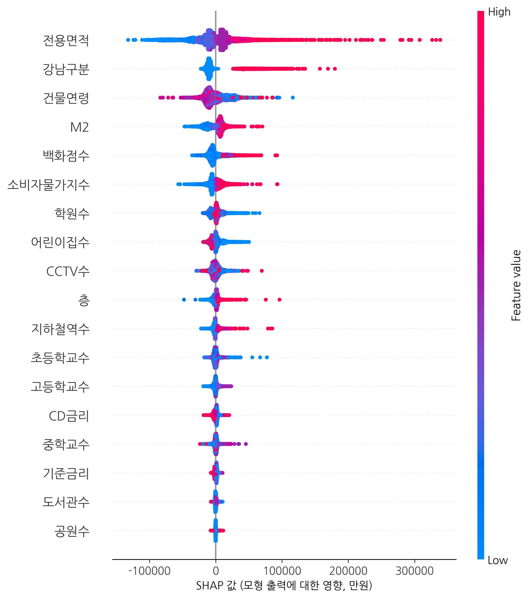
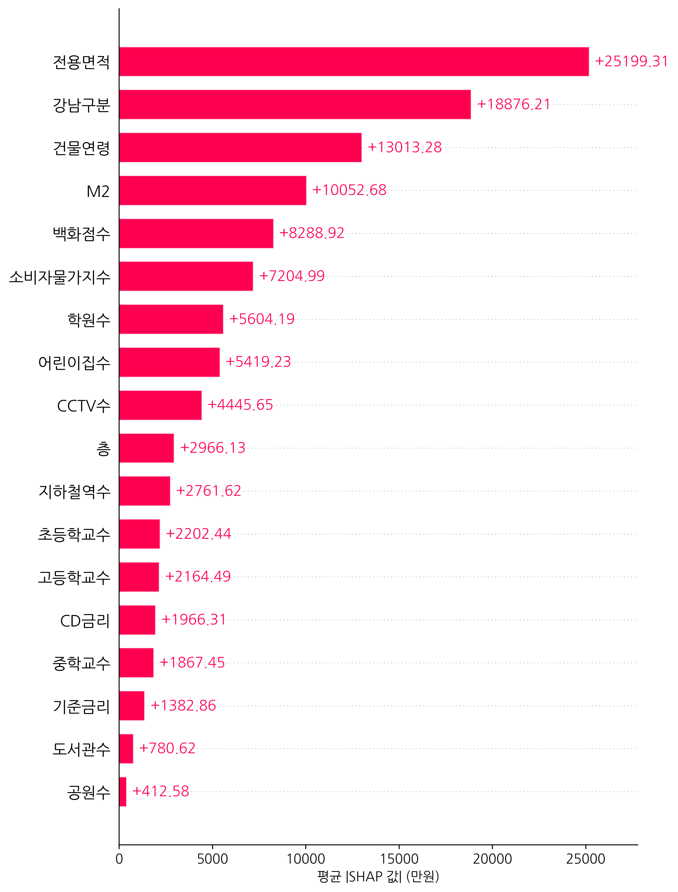
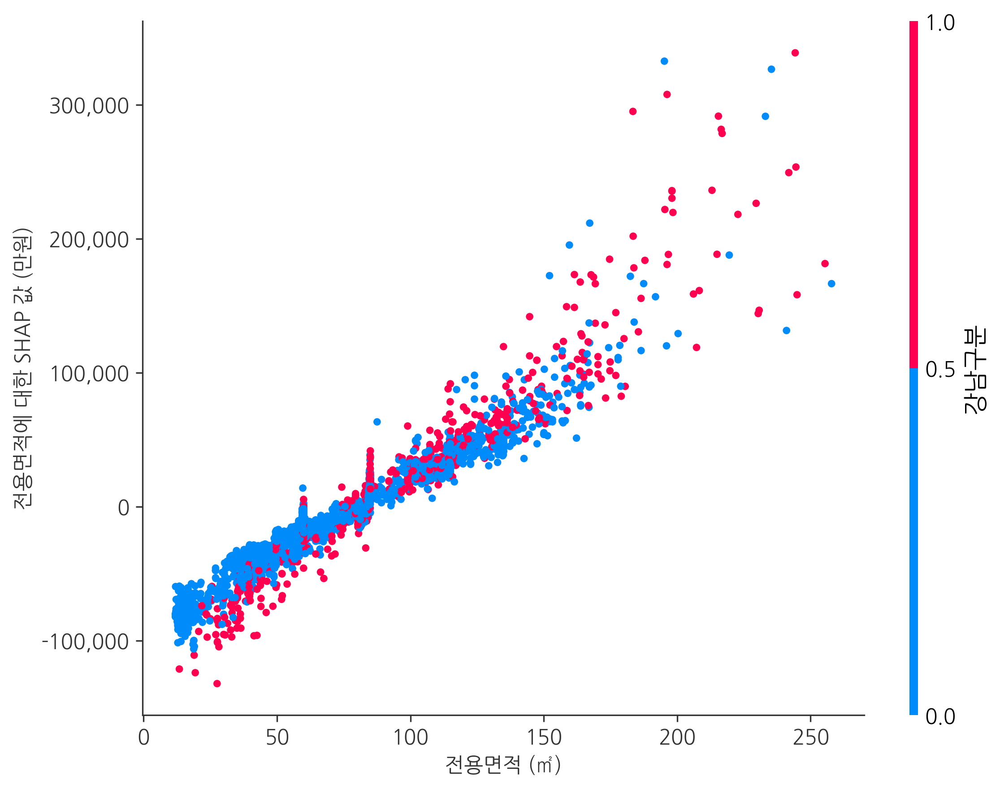
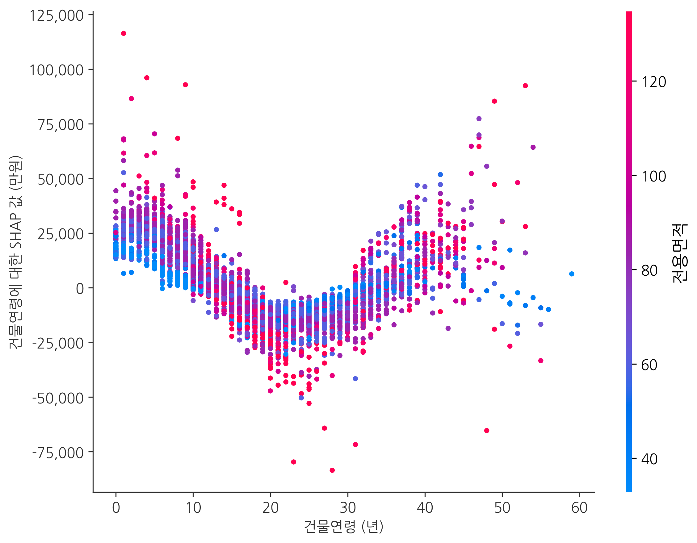
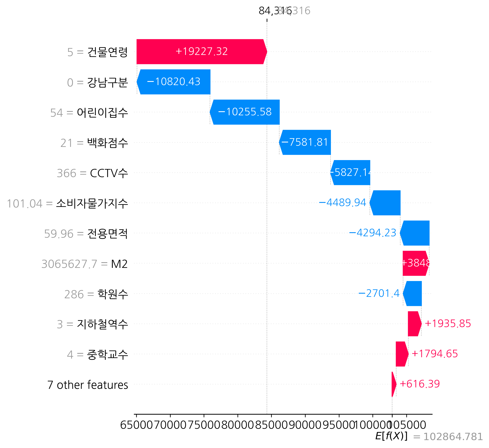
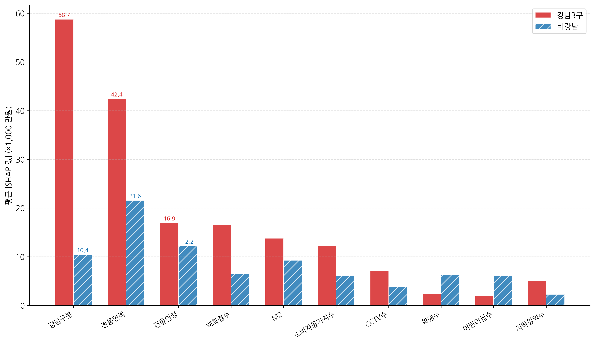

# XGBoost와 SHAP을 활용한 서울시 아파트 매매가격 예측요인 및 설명 패턴 분석

**Analysis of Predictive Factors and Explanatory Patterns of Apartment Sale Prices in Seoul Using XGBoost and SHAP**

한양대학교 부동산융합대학원
도시부동산정책전공

---

# 국문초록

본 연구는 서울시 아파트 매매가격의 예측요인과 예측값 설명 패턴을 머신러닝과 설명가능한 인공지능(eXplainable AI, XAI) 기법을 활용하여 분석하였다. 전통적인 헤도닉 가격모형(Hedonic Price Model)은 부동산 가격을 구성 속성들의 함수로 설명하는 대표적 이론이나, 다중회귀분석(OLS)에 기반한 기존 접근법은 변수 간 비선형 관계와 상호작용 효과를 포착하는 데 한계가 있다. 한편, 딥러닝 등 고성능 예측 모형은 높은 정확도를 달성하지만 '블랙박스(Black Box)' 특성으로 인해 가격 형성 메커니즘을 해석하기 어렵다는 문제가 존재한다.

이러한 한계를 극복하기 위하여, 본 연구에서는 국토교통부 실거래가 공개시스템 등 공공데이터를 활용하여 2019년 1월부터 2025년 12월까지 분석에 포함된 서울시 215개 행정동의 아파트 매매 실거래 데이터 391,826건을 수집하였다. 독립변수로는 물리적 특성(전용면적, 층, 건물연령), 입지 특성(강남3구 여부, 지하철역수), 환경 특성(초등학교수, 중학교수, 고등학교수, CCTV수, 백화점수, 학원수, 어린이집수, 공원수, 도서관수), 거시경제 특성(기준금리, CD금리, 소비자물가지수, M2) 등 18개 변수를 설정하였다. 분석 모형으로 다중회귀분석(OLS), 랜덤 포레스트(Random Forest), XGBoost를 구축하여 예측 성능을 비교하고, 무작위 분할 기준에서 상대적으로 우수한 성능을 보인 XGBoost를 SHAP(SHapley Additive exPlanations) 해석 대상 모형으로 선정하여 각 변수의 예측값 설명 기여도를 분석하였다.

실증 분석 결과, 테스트 데이터 기준 XGBoost 모형은 R² 0.968, RMSE 14,221만원으로 OLS(R² 0.608)와 랜덤 포레스트(R² 0.958)를 상회하였다. 다만 이 무작위 분할 성능은 동일 단지 반복거래와 동일 월 거래 간 거시경제 변수 공유가 존재하는 자료 구조 때문에 실제 일반화 상황보다 다소 낙관적으로 나타났을 가능성이 있다. 현 단계에서는 아파트명·도로명 등을 활용한 단지(group) 기준 분할까지 수행하지 못하였으므로, 해당 수치는 새로운 단지에 대한 외삽 예측력의 확증치라기보다 동일 자료 구조 내부의 상대 비교 기준으로 해석하는 것이 타당하다. 시간순 분할 강건성 점검에서는 랜덤 포레스트(R² 0.797, MAPE 14.62)와 XGBoost(R² 0.795, MAPE 16.58)가 모두 OLS(R² 0.523, MAPE 44.98)를 크게 상회하였으며, 두 트리 기반 모형의 성능 차이는 매우 작게 나타났다. SHAP 분석 결과, 전용면적(22.2%)이 가장 큰 예측 기여도를 보였고, 강남 입지(16.0%), 건물연령(11.4%), 백화점수(6.8%)가 주요 미시 설명 변수로 나타났다. M2 통화량(8.3%)과 소비자물가지수(6.7%)도 상위권에 포함되었으나, 이는 개별 거래의 독립적 효과라기보다 동일 월 거래들에 공통으로 부여된 시장 국면 정보를 반영한 보조 신호로 해석하는 것이 타당하다. 특히 새로 추가한 구 내부 생활 인프라 프록시 변수인 학원수(5.6%)와 어린이집수(5.2%)도 설명 기여를 보였으며, 강남3구와 비강남 지역의 비교분석에서 이들 변수의 평균 절대 SHAP값이 비강남 지역에서 강남보다 약 2~3배 크게 나타났다. 이는 비강남 지역 표본에서 해당 프록시 변수들이 통합 모형의 예측값 설명 과정에서 상대적으로 더 두드러진 패턴으로 관찰되었을 가능성을 시사한다. 다만 이러한 지역 비교는 강남과 비강남의 절대 가격 수준 차이의 영향도 함께 반영하며, 별도 지역 모형을 적합하지 않은 통합 모형 SHAP 재집계 결과라는 점에서 가설 생성적 단서로 제한해 해석할 필요가 있다.

본 연구는 국내 아파트 시장에 XAI 기법을 적용하여 머신러닝 모형의 예측 성능 비교와 해석 가능성 제시를 함께 시도한 실증연구로서, 행정동 분석틀과 생활 인프라 변수 확장을 결합한 탐색적 설계를 통해 부동산 가격 예측 설명 구조에 대한 보다 세밀한 해석 기반을 제공하고, 주택 정책 수립 및 부동산 자동감정평가(AVM) 모형 개선 논의에 참고할 수 있는 근거를 제시한다.

**주제어:** 아파트 매매가격, XGBoost, SHAP, 설명가능한 인공지능(XAI), 헤도닉 가격모형, 서울 부동산 시장

---

# 목차

- 국문초록
- 목차
- 표 목차
- 그림 목차

## 제1장 서론
- 제1절 연구의 배경 및 목적
- 제2절 연구의 범위 및 방법
- 제3절 논문의 구성

## 제2장 이론적 배경 및 선행연구
- 제1절 헤도닉 가격모형
- 제2절 머신러닝 기반 부동산 가격 예측
- 제3절 설명가능한 인공지능(XAI)
- 제4절 선행연구 검토 및 차별성

## 제3장 연구 설계
- 제1절 연구 모형
- 제2절 분석 데이터 및 변수 설정
- 제3절 분석 방법

## 제4장 실증 분석
- 제1절 기술통계량
- 제2절 모형별 예측 성능 비교
- 제3절 SHAP 기반 변수 중요도 분석
- 제4절 강남권과 비강남권 비교분석

## 제5장 결론
- 제1절 연구 결과 요약
- 제2절 시사점
- 제3절 연구의 한계 및 향후 과제

- 참고문헌
- Abstract
- 감사의 글

---

# 표 목차

- <표 1> 독립변수 정의 및 데이터 출처
- <표 2> 기술통계량
- <표 3> 주요 변수 간 상관관계 행렬
- <표 4> 다중공선성 진단 (VIF)
- <표 5> OLS 회귀분석 결과
- <표 5-1> OLS 함수형 보조 강건성 점검
- <표 5-2> 월 단위 강건성 점검(클러스터-강건 표준오차 및 월 고정효과)
- <표 6> 하이퍼파라미터 설정
- <표 7> 모형별 예측 성능 비교
- <표 7-2> 무작위 분할 vs 시간순 분할 예측 성능 비교
- <표 8> SHAP 평균 절대값 기준 변수 중요도 순위
- <표 9> 강남3구와 비강남 지역 기술통계량 비교
- <표 10> 지역별 SHAP 변수 중요도 비교

# 그림 목차

- <그림 1> 연구 흐름도
- <그림 2> XGBoost 알고리즘 개념도
- <그림 3> SHAP 분석 프레임워크
- <그림 4> SHAP Summary Plot (전체)
- <그림 5> SHAP Bar Plot (변수 중요도)
- <그림 6> 전용면적 SHAP Dependence Plot
- <그림 7> 건물연령 SHAP Dependence Plot
- <그림 8> SHAP Waterfall Plot (개별 예측 사례)
- <그림 9> 강남3구 vs 비강남 SHAP 비교

---

# 제1장 서론

## 제1절 연구의 배경 및 목적

### 1. 연구의 배경

부동산은 한국 가계 자산에서 가장 큰 비중을 차지하는 핵심 자산이다. 통계청(2024)에 따르면, 한국 가구의 평균 자산 중 부동산이 약 73%를 차지하고 있으며, 특히 서울 아파트는 자산 축적과 주거 안정의 핵심 수단으로 기능하고 있다. 서울 아파트 매매가격의 변동은 개인의 자산 가치는 물론, 가계 부채, 소비, 건설 투자 등 거시경제 전반에 광범위한 파급효과를 미친다. 이에 따라 아파트 매매가격의 예측요인과 예측값 설명 구조를 정확히 파악하는 것은 학술적으로나 정책적으로 중요한 과제이다.

부동산 가격 설명의 이론적 토대는 Lancaster(1966)와 Rosen(1974)이 정립한 헤도닉 가격모형(Hedonic Price Model)이다. 이 모형은 이질적 재화인 부동산의 가격이 면적, 층수, 건축연도, 입지 등 다양한 속성들의 함수로 설명될 수 있음을 보여준다. 헤도닉 가격모형은 다중회귀분석(Ordinary Least Squares, OLS)을 통해 각 속성의 암묵적 가격(implicit price)을 추정하는 방식으로 널리 활용되어 왔다. 그러나 전통적인 OLS 기반 분석은 변수 간 관계를 선형으로 가정하기 때문에, 실제 부동산 시장에서 관찰되는 비선형적 가격 형성 메커니즘과 변수 간 복잡한 상호작용 효과를 충분히 포착하지 못한다는 한계가 지적되어 왔다(Čeh et al., 2018; Limsombunchai, 2004).

이러한 한계를 극복하기 위해 최근에는 머신러닝(Machine Learning, ML) 기반의 부동산 가격 예측 연구가 활발히 진행되고 있다. 랜덤 포레스트(Random Forest), XGBoost, LightGBM 등의 앙상블 학습 모형과 LSTM(Long Short-Term Memory), GRU(Gated Recurrent Unit) 등의 딥러닝 모형이 전통적 회귀분석을 크게 상회하는 예측 성능을 보여주고 있다(Choy & Ho, 2023; Mora-García et al., 2022). 그러나 이러한 머신러닝 모형들은 대부분 '블랙박스(Black Box)' 특성을 가지고 있어, 높은 예측 정확도에도 불구하고 "왜 특정 아파트의 가격이 이렇게 형성되었는가?"라는 근본적 질문에 답하기 어렵다는 문제가 있다.

이에 대한 대안으로 최근 국제적으로 주목받고 있는 것이 설명가능한 인공지능(eXplainable AI, XAI)이다. 특히 Lundberg와 Lee(2017)가 제안한 SHAP(SHapley Additive exPlanations)은 게임이론의 Shapley value 개념을 머신러닝 모형 해석에 적용하여, 각 특성(feature)이 개별 예측에 미치는 기여도를 이론적으로 일관성 있게 분해할 수 있는 프레임워크이다. 해외에서는 SHAP을 활용한 부동산 가격 결정요인 분석 연구가 빠르게 축적되고 있으나(Neves et al., 2024; Mora-García et al., 2022; Choy & Ho, 2023), 국내에서는 XAI를 아파트 매매가격 분석에 체계적으로 적용한 연구가 매우 부족한 실정이다.

### 2. 연구의 목적

본 연구의 목적은 다음과 같다.

첫째, 서울시 아파트 매매가격에 대하여 다중회귀분석(OLS), 랜덤 포레스트(Random Forest), XGBoost 등 다양한 예측 모형을 구축하고, 각 모형의 예측 성능을 비교·평가한다.

둘째, XGBoost 모형에 SHAP 분석을 적용하여 서울시 아파트 매매가격 예측값 설명에서 나타나는 변수별 기여 패턴을 정량적으로 분석하고, 주요 변수와 SHAP값 간의 비선형 관계를 시각적으로 확인한다.

셋째, 강남3구(강남구, 서초구, 송파구)와 비강남 지역을 구분하여 통합 모형의 SHAP 설명 패턴이 지역별로 어떻게 달라지는지 탐색적으로 비교한다. 이 비교는 별도 지역 모형을 적합한 확인적 검증이 아니라, 통합 모형 내부에서 관찰되는 설명 패턴 차이를 정리하는 보조 분석으로 위치시킨다.

넷째, 분석 결과를 바탕으로 부동산 정책 수립 및 자동감정평가(Automated Valuation Model, AVM) 모형 개선 논의에 참고할 수 있는 시사점을 제시한다.

## 제2절 연구의 범위 및 방법

### 1. 연구의 범위

본 연구의 시간적 범위는 2019년 1월부터 2025년 12월까지 약 7년간이다. 이 기간은 COVID-19 팬데믹(2020~2021), 급격한 금리 인상기(2022~2023), 금리 인하 전환기(2024~2025) 등 주택시장에 큰 영향을 미친 다양한 거시경제적 사건을 포함하고 있어, 거시경제 변수가 예측값 설명 구조에서 어떤 역할을 보이는지 점검하기에 적합하다.

공간적 범위는 분석에 포함된 서울특별시 215개 행정동이며, 분석 대상은 아파트 매매 실거래 데이터이다. 총 391,826건의 거래 데이터를 분석에 활용하였다. 기존 연구들이 자치구(25개) 단위로 환경 변수를 집계한 것과 달리, 본 연구에서는 행정동(215개) 단위로 세분화하여 미시적 입지 효과를 보다 세밀하게 관찰할 수 있는 분석 단위를 구성하였다.

### 2. 연구의 방법

본 연구는 정량적 실증분석 방법을 채택하였으며, 구체적인 분석 절차는 다음과 같다.

첫째, 국토교통부 공공데이터포털(data.go.kr), 서울열린데이터광장(data.seoul.go.kr), 나이스 교육정보 개방 포털(open.neis.go.kr), 한국은행 경제통계시스템(ECOS, ecos.bok.or.kr) 등 공공데이터를 수집하여 연구 데이터셋을 구축하였다.

둘째, 수집된 데이터에 대하여 법정동에서 행정동으로의 매핑, 결측값 처리, 이상값 제거, 변수 변환 등 전처리를 수행하고, 기술통계 분석을 통해 데이터의 분포와 특성을 파악하였다.

셋째, 다중회귀분석(OLS), 랜덤 포레스트(Random Forest), XGBoost의 세 가지 모형을 구축하고, R², RMSE, MAE 등의 지표를 통해 예측 성능을 비교·평가하였다.

넷째, XGBoost 모형에 SHAP 분석을 적용하여 글로벌 변수 중요도(Global Feature Importance)와 개별 예측 해석(Local Explanation)을 수행하였다.

다섯째, 전체 모형의 예측 및 SHAP값을 강남3구와 비강남 지역으로 나누어 지역별 예측값 설명 패턴의 차이를 탐색적으로 비교하였다. 다만 이는 통합 모형의 산출값을 재집계한 보조 분석으로서, 별도 지역 모형을 통한 확인적 비교와는 구분하여 해석하였다.

분석에는 Python 프로그래밍 언어와 scikit-learn, xgboost, shap 등의 오픈소스 라이브러리를 활용하였다.

## 제3절 논문의 구성

본 논문은 총 5개 장으로 구성된다.

제1장 서론에서는 연구의 배경과 목적, 범위 및 방법, 논문의 구성을 기술하였다.

제2장 이론적 배경 및 선행연구에서는 헤도닉 가격모형의 이론적 토대, 머신러닝 기반 부동산 가격 예측 연구의 동향, 설명가능한 인공지능(XAI)의 개념과 방법론을 고찰하고, 선행연구를 검토하여 본 연구의 차별성을 제시하였다.

제3장 연구 설계에서는 연구 모형의 프레임워크, 분석 데이터의 수집과 변수 설정, 각 분석 방법론의 구체적 내용을 기술하였다.

제4장 실증 분석에서는 기술통계량, 모형별 예측 성능 비교, SHAP 기반 변수 중요도 분석, 강남권과 비강남권의 비교분석 결과를 제시하고 논의하였다.

제5장 결론에서는 연구 결과를 요약하고, 학술적·정책적 시사점을 도출하며, 연구의 한계와 향후 과제를 제시하였다.

---

# 제2장 이론적 배경 및 선행연구

## 제1절 헤도닉 가격모형

### 1. 헤도닉 가격모형의 이론적 기초

헤도닉 가격모형(Hedonic Price Model)은 Lancaster(1966)의 소비자 이론과 Rosen(1974)의 암묵적 시장(implicit market) 이론에 근거한다. Lancaster(1966)는 소비자의 효용이 재화 자체가 아닌 재화가 보유한 **속성(characteristics)**에서 파생된다고 주장하였다. 이를 부동산에 적용하면, 주택의 가격은 주택이라는 단일 재화가 아니라 면적, 층수, 입지, 학군, 교통 편의성 등 다양한 속성들의 묶음(bundle)에 의해 결정된다.

Rosen(1974)은 이를 발전시켜 이질적 재화(differentiated products)의 시장에서 각 속성의 **암묵적 가격(implicit price)**을 추정하는 헤도닉 가격함수를 정립하였다. 이를 수식으로 표현하면 다음과 같다.

$$P = f(z_1, z_2, ..., z_n)$$

여기서 $P$는 부동산 가격, $z_i$는 $i$번째 속성을 나타낸다. 각 속성의 암묵적 가격은 헤도닉 가격함수의 편미분으로 도출된다.

$$\frac{\partial P}{\partial z_i} = p_i(z)$$

전통적으로 헤도닉 가격모형은 다중회귀분석(OLS)을 통해 추정되어 왔으며, 다음과 같은 선형 모형이 일반적으로 사용된다.

$$P = \beta_0 + \beta_1 z_1 + \beta_2 z_2 + ... + \beta_n z_n + \epsilon$$

여기서 $\beta_i$는 각 속성의 회귀계수로, 헤도닉 가격모형의 고전적 해석에서는 해당 속성의 한계가격(marginal implicit price)에 대응한다. 다만 실제 관측자료에 OLS를 적용할 때에는 함수형 가정, 누락변수, 다중공선성 등에 따라 이러한 계수를 조건부 연관성 수준에서 해석하는 것이 보다 보수적이다.

### 2. 헤도닉 가격모형의 한계

헤도닉 가격모형은 부동산 가격 결정요인 분석의 표준적 이론 프레임워크로 널리 활용되어 왔으나, OLS에 기반한 추정 방법은 다음과 같은 한계를 가진다.

첫째, 변수 간 관계를 선형으로 가정하므로, 비선형적 가격 형성 메커니즘을 포착하지 못한다. 예를 들어, 전용면적의 증가와 거래금액 간의 연관은 소형 면적에서와 대형 면적에서 상이할 수 있으나, 선형 모형에서는 이를 단일 기울기의 평균적 선형 관계로만 요약한다.

둘째, 변수 간 상호작용 효과(interaction effects)를 명시적으로 지정하지 않는 한 포착하기 어렵다. 가령, 강남 지역과 비강남 지역에서 전용면적과 거래금액 간의 선형 관계가 다를 수 있으나, 기본 OLS 모형에서는 이를 반영하기 어렵다.

셋째, 다중공선성(multicollinearity) 문제에 취약하다. 부동산 가격 관련 변수들(금리, 물가, 통화량 등)은 상호 높은 상관관계를 가지는 경우가 많아, 개별 회귀계수의 추정에 불안정성을 초래할 수 있다.

이러한 한계를 극복하기 위하여 머신러닝 모형의 도입이 활발히 이루어지고 있다.

### 3. 거시경제 변수와 부동산 가격의 관계

헤도닉 가격모형이 주로 물리적·입지적 속성에 초점을 맞추는 반면, 부동산 가격 예측에서는 거시경제 환경을 함께 고려할 필요가 있다. 특히 통화량(M2)과 금리는 부동산 시장과 관련된 유동성·금융 여건을 반영하는 대표적 거시변수이다. 중앙은행의 통화 공급 확대는 시중 유동성 증가와 자산시장 자금 유입 확대와 연관될 수 있으며, 한국처럼 가계자산에서 부동산 비중이 큰 경제에서는 이러한 거시 여건 변화가 주택시장 국면과 함께 움직이는 경우가 많다. 실제로 2020~2021년 COVID-19 대응 국면에서 통화 확대와 서울 아파트 가격 상승이 동시에 관찰되었다.

금리는 주택담보대출 비용과 금융여건을 반영하는 변수로 이해할 수 있다. 기준금리가 인하되면 대출 이자 부담이 낮아지고, 반대로 금리 인상은 자금조달 여건을 제약할 수 있다. 다만 기준금리와 시장금리(CD금리) 간에는 높은 상관관계가 존재하여 다중회귀분석에서는 심각한 다중공선성 문제를 유발할 수 있다. 소비자물가지수(CPI)는 실물자산의 인플레이션 헤지(inflation hedge) 논의와 관련되며, 물가 상승기에는 투자자의 자산배분 판단과 함께 주택시장 국면을 설명하는 보조 정보로 활용될 수 있다. 이처럼 거시경제 변수들은 주택시장의 수요·공급 여건 및 시장 국면과 관련된 설명 변인이므로, 예측모형의 설명 구조를 해석할 때 함께 고려할 필요가 있다.

## 제2절 머신러닝 기반 부동산 가격 예측

### 1. 머신러닝의 부동산 분야 적용

머신러닝은 데이터로부터 패턴을 학습하여 예측을 수행하는 알고리즘의 총칭으로, 변수 간 비선형 관계와 고차원 상호작용을 자동으로 포착할 수 있다는 점에서 전통적 통계 모형의 대안으로 주목받고 있다. 부동산 분야에서의 머신러닝 활용은 Limsombunchai(2004)의 초기 연구 이후 급속히 확대되었으며, 특히 2020년 이후 관련 연구가 급격히 증가하는 추세이다(Choy & Ho, 2023).

Choy와 Ho(2023)의 체계적 문헌 리뷰에 따르면, 부동산 가격 예측에 활용되는 주요 머신러닝 알고리즘은 다음과 같이 분류할 수 있다.

첫째, **회귀 기반 모형**으로 릿지(Ridge), 라쏘(Lasso), 엘라스틱넷(Elastic Net) 등 정규화 회귀 모형이 있다. 이들은 OLS의 과적합 문제를 완화하지만, 기본적으로 선형 가정을 유지한다.

둘째, **트리 기반 앙상블 모형**으로 랜덤 포레스트(Random Forest; Breiman, 2001), 그래디언트 부스팅(Gradient Boosting; Friedman, 2001), XGBoost(Chen & Guestrin, 2016), LightGBM(Ke et al., 2017) 등이 있다. 이들은 비선형 관계와 변수 간 상호작용을 효과적으로 포착할 수 있으며, 특히 부동산 가격 예측에서 우수한 성능을 보여왔다(Čeh et al., 2018).

셋째, **딥러닝 모형**으로 LSTM, GRU 등의 순환신경망(RNN) 모형과 합성곱 신경망(CNN), 그래프 신경망(GNN) 등이 있다. Mora-García et al.(2022)은 COVID-19 시기 딥러닝과 앙상블 모형의 예측력을 비교하였으며, Kim et al.(2022)은 공간회귀분석을 통해 주택가격의 공간적 의존성을 분석하였다.

### 2. XGBoost 알고리즘

XGBoost(eXtreme Gradient Boosting)는 Chen과 Guestrin(2016)이 제안한 트리 기반 그래디언트 부스팅 알고리즘으로, 기존 그래디언트 부스팅 머신(GBM; Friedman, 2001)을 개선한 것이다. XGBoost의 주요 특징은 다음과 같다.

첫째, **정규화(Regularization)**: 목적함수에 L1(Lasso) 및 L2(Ridge) 정규화 항을 포함하여 과적합을 방지한다. XGBoost의 목적함수는 다음과 같다.

$$Obj = \sum_{i=1}^{n} l(y_i, \hat{y}_i) + \sum_{k=1}^{K} \Omega(f_k)$$

여기서 $l$은 손실함수, $\Omega(f_k)$는 $k$번째 트리의 정규화 항이다.

둘째, **축소(Shrinkage)**: 각 트리의 기여도에 학습률(learning rate)을 적용하여 점진적으로 학습함으로써 과적합을 방지하고 일반화 성능을 향상시킨다.

셋째, **컬럼 서브샘플링(Column Subsampling)**: 랜덤 포레스트에서 착안하여, 각 트리 또는 각 분할(split)에서 무작위로 특성의 부분집합을 선택함으로써 모형의 다양성을 확보한다.

넷째, **결측값 자동 처리**: 결측값이 있는 데이터에 대해 최적의 분할 방향을 자동으로 학습한다.

다섯째, **근사 분할 알고리즘(Approximate Split Algorithm)**: 대용량 데이터에서도 효율적인 분할점 탐색이 가능하다.

이러한 특성들로 인해 XGBoost는 다양한 분야의 구조화된 데이터(tabular data) 예측 문제에서 최고 수준의 성능을 보이고 있으며, 부동산 가격 예측에서도 높은 정확도를 달성하는 것으로 보고되고 있다(Čeh et al., 2018; Mora-García et al., 2022). XGBoost의 전체적인 학습 구조와 알고리즘 흐름은 <그림 2>에 제시하였다.

### 3. 랜덤 포레스트

랜덤 포레스트(Random Forest)는 Breiman(2001)이 제안한 앙상블 학습법으로, 다수의 의사결정 트리(decision tree)를 독립적으로 학습시킨 후 예측값의 평균(회귀)이나 다수결(분류)로 최종 결과를 산출하는 배깅(bagging) 기반 알고리즘이다. 각 트리는 전체 학습 데이터의 부트스트랩(bootstrap) 표본을 사용하며, 각 분할(split)에서 전체 특성 중 무작위로 선택된 부분집합만을 고려한다. 이를 통해 개별 트리 간의 상관관계를 줄이고 과적합을 방지한다.

Čeh et al.(2018)은 랜덤 포레스트가 다중회귀분석에 비해 비선형 관계를 효과적으로 포착하여 주택가격 예측에서 우수한 성능을 보임을 실증하였다. 본 연구에서는 랜덤 포레스트를 XGBoost의 비교 모형으로 활용한다.

## 제3절 설명가능한 인공지능(XAI)

### 1. XAI의 개념과 필요성

설명가능한 인공지능(eXplainable Artificial Intelligence, XAI)은 인공지능 모형의 의사결정 과정과 결과를 인간이 이해할 수 있는 형태로 설명하는 기법의 총칭이다. 머신러닝 모형, 특히 앙상블 모형이나 딥러닝 모형은 높은 예측 정확도를 달성하지만, 내부 작동 원리가 불투명하여 '블랙박스' 문제가 발생한다.

부동산 분야에서 XAI의 필요성은 다음과 같다.

첫째, **정책적 활용성**: 주택 정책 수립자에게 "어떤 요인이 예측값 설명에 얼마나 기여하는가"에 대한 정보를 제공함으로써, 정책 설계 과정에서 참고할 수 있는 보조적 근거를 제시한다.

둘째, **시장 참여자의 의사결정 지원**: 매수자, 매도자, 감정평가사 등 시장 참여자들이 가격 형성의 근거를 이해하고 합리적 의사결정을 내릴 수 있도록 한다.

셋째, **모형의 신뢰성 확보**: 자동감정평가(AVM) 모형의 결과에 대한 설명을 제공함으로써 감정평가의 투명성과 신뢰성을 향상시킨다.

넷째, **편향 진단**: 머신러닝 모형에 내재된 지역적·사회경제적 편향을 진단하고 교정하는 데 XAI가 활용될 수 있다.

### 2. 주요 XAI 방법론

XAI 방법론은 크게 모형 비의존적(model-agnostic) 방법과 모형 특화적(model-specific) 방법으로 분류된다.

**모형 비의존적 방법**으로는 LIME(Local Interpretable Model-agnostic Explanations; Ribeiro et al., 2016)과 SHAP(Lundberg & Lee, 2017)이 대표적이다. LIME은 개별 예측의 국소적 근방에서 해석 가능한 대리 모형(surrogate model)을 적합하여 설명을 제공하며, SHAP은 게임이론의 Shapley value에 기반하여 이론적 일관성을 보장한다.

**모형 특화적 방법**으로는 트리 기반 모형의 내장된 특성 중요도(feature importance), 부분 의존성 플롯(Partial Dependence Plot, PDP; Friedman, 2001), 누적 국소 효과(Accumulated Local Effects, ALE) 등이 있다.

### 3. SHAP(SHapley Additive exPlanations)

SHAP은 Lundberg와 Lee(2017)가 제안한 XAI 프레임워크로, 협조적 게임이론(cooperative game theory)의 Shapley value 개념을 머신러닝 모형 해석에 적용한 것이다. Shapley value는 게임에 참여하는 각 플레이어의 기여도를 공정하게 배분하는 유일한 해(unique solution)로, 다음의 네 가지 공리(axiom)를 만족한다: 효율성(Efficiency), 대칭성(Symmetry), 더미(Dummy), 가산성(Additivity).

SHAP에서 각 특성 $j$의 Shapley value $\phi_j$는 다음과 같이 정의된다.

$$\phi_j = \sum_{S \subseteq N \setminus \{j\}} \frac{|S|!(|N|-|S|-1)!}{|N|!} [f(S \cup \{j\}) - f(S)]$$

여기서 $N$은 전체 특성의 집합, $S$는 $N$에서 특성 $j$를 제외한 부분집합, $f(S)$는 특성 집합 $S$만을 사용한 모형의 예측값이다. 즉, SHAP값은 특성 $j$가 모든 가능한 특성 조합에 추가될 때의 한계 기여도의 가중 평균이다.

개별 예측 $\hat{y}_i$는 다음과 같이 분해된다.

$$\hat{y}_i = \phi_0 + \sum_{j=1}^{M} \phi_j^{(i)}$$

여기서 $\phi_0$는 기본값(base value, 전체 데이터의 평균 예측값), $\phi_j^{(i)}$는 관측치 $i$에 대한 특성 $j$의 SHAP값이다. 이를 통해 각 예측이 기본값으로부터 어떤 특성에 의해 얼마만큼 증가 또는 감소하였는지를 정량적으로 분해할 수 있다.

특히 XGBoost 등 트리 기반 모형에 대해서는 TreeSHAP 알고리즘(Lundberg et al., 2020)을 통해 정확한 SHAP값을 다항 시간(polynomial time) 내에 효율적으로 계산할 수 있다. 본 연구에서 적용한 SHAP 분석의 전체 프레임워크는 <그림 3>에 제시하였다.

SHAP 분석의 주요 시각화 도구는 다음과 같다.

- **SHAP Summary Plot**: 모든 특성의 SHAP값 분포를 동시에 표시하여 글로벌 변수 중요도와 영향 방향을 파악한다.
- **SHAP Bar Plot**: 평균 절대 SHAP값(mean |SHAP value|) 기준으로 변수 중요도를 순위화한다.
- **SHAP Dependence Plot**: 특정 변수의 값과 SHAP값 간의 관계를 산점도로 표시하여 비선형 효과를 시각화한다.
- **SHAP Waterfall Plot**: 개별 예측에 대해 기본값에서 각 특성의 기여를 순차적으로 누적하여 최종 예측값에 도달하는 과정을 표시한다.

## 제4절 선행연구 검토 및 차별성

### 1. 국내 선행연구

국내에서 머신러닝을 활용한 부동산 가격 예측 연구는 2020년대 이후 학위논문을 중심으로 활발히 진행되어 왔다. 이를 연구 초점에 따라 분류하면, (1) 머신러닝 예측 성능 비교 연구, (2) 공간 분석 및 비정형 데이터 활용 연구로 구분할 수 있다.

#### 가. 머신러닝 예측 성능 비교 연구

김선현(2022)은 대구광역시 아파트 매매 실거래 데이터를 대상으로 다중회귀분석, 랜덤 포레스트, XGBoost 등 다양한 머신러닝 모형의 예측 성능을 비교하였으며, 트리 기반 앙상블 모형이 OLS 대비 우수한 성능을 달성함을 확인하였다. 이학만(2025)은 부산광역시 부동산 시장을 대상으로 유사한 머신러닝 기반 가격 예측 분석을 수행하였다. 김상진(2023)은 프롭테크(PropTech) 관점에서 머신러닝 모형의 부동산 가격 추정 활용 가능성을 탐색하였다.

조민지(2023)는 서울시 아파트 매매가격을 대상으로 머신러닝 모형을 적용하여 가격 예측 모형을 구축하였다. 이 연구는 본 연구와 동일한 서울 아파트 시장을 대상으로 하고 있으나, 예측 정확도 비교에 초점을 두고 있어 SHAP 등 XAI 기법을 통한 변수별 기여도 분석은 수행하지 않았다는 점에서 본 연구와 차이가 있다.

#### 나. 공간 분석 및 비정형 데이터 활용 연구

진수정(2024)은 서울시 아파트 매매가격 예측에 그래프 신경망(SRGCNN)을 적용하여 공간적 의존성을 반영한 딥러닝 모형을 제안하였다. 이 연구는 전통적 피처 엔지니어링을 넘어 공간적 관계를 모형에 직접 반영하였다는 점에서 방법론적 기여가 크다. 오성훈(2022)은 뉴스 빅데이터와 텍스트 마이닝 기법을 활용하여 부동산 시장 심리가 아파트 가격에 미치는 영향을 분석하였으며, 비정형 데이터의 부동산 분석 활용 가능성을 제시하였다. 이용운(2024)은 서울의 젠트리피케이션 현상과 아파트 가격 변동 간의 관계를 분석하여, 도시 재구조화 과정이 주택가격에 미치는 영향을 실증하였다.

#### 다. 소결

국내 연구의 동향을 종합하면, 머신러닝을 활용한 아파트 가격 예측 연구는 상당히 축적되어 있으나, 대부분 **예측 정확도 비교**에 초점을 맞추고 있다. SHAP 등 XAI 기법을 통해 각 변수의 가격 기여도를 체계적으로 해석하고, 이를 정책적 시사점으로 연결하는 연구는 아직 초기 단계에 머물러 있다. 또한 대부분의 연구가 자치구(구) 단위의 분석에 머물러 있어, 행정동 단위의 세분화된 분석이 부족한 실정이다.

### 2. 해외 선행연구

해외에서는 머신러닝과 XAI를 결합한 부동산 가격 분석 연구가 2023년 이후 빠르게 축적되고 있다. 이를 연구 주제에 따라 (1) XAI 기반 가격 결정요인 분석, (2) 헤도닉 모형과 머신러닝의 비교, (3) 한국 시장 대상 해외 학술지 연구로 분류하여 검토한다.

#### 가. XAI 기반 부동산 가격 결정요인 분석

Neves et al.(2024)은 오픈데이터와 XAI를 결합하여 리스본 스마트시티의 부동산 가격을 분석하였으며, XGBoost 모형에 SHAP을 적용하여 면적, 입지, 건축연도 등의 결정요인을 규명하였다. 이 연구는 본 연구와 방법론적 구조(XGBoost + SHAP)가 유사하나, 대상 시장과 변수 구성에서 차이가 있다.

Mora-García et al.(2022)은 COVID-19 시기 스페인 알리칸테 지역의 주택가격 예측에 랜덤 포레스트와 XGBoost를 적용하여 전통적 회귀분석 대비 우수한 성능을 확인하였다. Čeh et al.(2018)은 슬로베니아 아파트를 대상으로 랜덤 포레스트와 다중회귀분석을 비교하여 머신러닝 모형의 비선형 포착 능력을 실증하였다.

Shahhosseini et al.(2022)은 Ames 주택 데이터셋을 활용하여 앙상블 가중치와 하이퍼파라미터를 동시에 최적화하는 프레임워크를 제안하였으며, 회귀 문제에서 머신러닝 모형의 하이퍼파라미터 튜닝 전략이 예측 성능에 미치는 영향을 체계적으로 분석하였다. 이 연구는 주택가격 데이터에 대한 앙상블 최적화 사례로서 본 연구의 하이퍼파라미터 탐색 설계에 참고하였다.

Revathi와 Devarajan(2025)은 킹카운티 주택 데이터를 대상으로 XGBoost와 SHAP을 결합한 가격 예측 프레임워크를 제안하고, 웹 배포까지 구현하여 XAI 기반 AVM의 실무적 활용 가능성을 보여주었다.

#### 나. 헤도닉 모형과 머신러닝의 비교

An et al.(2025)은 한국 주택시장을 대상으로 전통적 헤도닉 가격모형과 머신러닝 모형의 예측 성능을 체계적으로 비교하였다. 이 연구는 SHAP을 활용하여 머신러닝 모형에 헤도닉 모형 수준의 해석 가능성을 부여할 수 있음을 실증하였으며, 두 접근법의 강점을 결합한 '투명한 주택가격 감정' 프레임워크를 제안하였다.

Tarasov와 Dessoulavy-Śliwiński(2025)는 폴란드 부동산 시장에서 알고리즘 기반 헤도닉 가격 모형에 XAI를 적용하여, 머신러닝이 전통적 헤도닉 접근법을 효과적으로 대체할 수 있음을 보였다.

Choy와 Ho(2023)는 부동산 분야 머신러닝 연구에 대한 체계적 문헌 리뷰(systematic literature review)를 수행하여, 2020년 이후 관련 연구가 급격히 증가하고 있으며 XAI의 적용이 새로운 연구 방향으로 부상하고 있음을 확인하였다.

#### 다. 한국 시장 대상 해외 학술지 연구

Chun et al.(2025)은 서울시 아파트 매매 실거래 데이터를 활용하여 LightGBM, GBDT, XGBoost 등 다양한 머신러닝 모형과 SHAP 기반 XAI 분석을 수행한 연구로, 본 연구와 대상 시장 및 방법론 모두에서 가장 유사하다. 다만 이 연구는 변수 구성과 분석 기간에서 본 연구와 차이가 있으며, 강남/비강남 간 지역 비교분석을 수행하지 않았다는 점에서 본 연구가 보완적 기여를 한다.

Kim, Choi와 Lee(2025)는 한국 주거용 부동산 시장에 XAI 기반 대량감정평가(mass appraisal) 모형을 적용하였다. 이 연구는 SHAP과 PFI(Permutation Feature Importance)를 결합하여 시간에 따른 변수 중요도의 변화를 추적하였으며, 한국 부동산 시장에서 XAI의 실무적 적용 가능성을 제시하였다.

Kim et al.(2022)은 공간회귀분석을 통해 한국 다세대주택 가격의 결정요인을 분석하였으며, 공간적 의존성이 가격 형성에 유의한 영향을 미침을 확인하였다.

### 3. 선행연구의 종합 및 본 연구의 차별성

선행연구를 종합하면, 머신러닝 기반 부동산 가격 예측 연구는 국내외에서 활발히 진행되고 있으나, 다음과 같은 연구 공백(research gap)이 존재한다.

첫째, 국내 연구는 대부분 예측 정확도 비교에 치중하고 있으며, SHAP 등 XAI 기법을 활용한 체계적 변수 해석 연구가 부족하다. 김선현(2022), 조민지(2023), 이학만(2025) 등의 연구가 머신러닝의 우수한 예측 성능을 확인하였으나, 예측값 설명 구조에 대한 심층적 해석은 제한적이다.

둘째, 해외 XAI 부동산 연구는 리스본(Neves et al., 2024), 스페인(Mora-García et al., 2022), 슬로베니아(Čeh et al., 2018), 폴란드(Tarasov & Dessoulavy-Śliwiński, 2025) 등 다양한 시장을 대상으로 축적되고 있으나, 서울 아파트 시장의 고유한 특성(강남 프리미엄, 재건축 기대감 등)을 반영한 XAI 분석은 Chun et al.(2025)의 연구를 제외하면 매우 제한적이다.

셋째, 강남3구와 비강남 지역의 예측값 설명 패턴 차이를 SHAP으로 비교한 사례는 국내외 선행연구에서 상대적으로 드물다. 다만 본 연구 역시 통합 모형의 SHAP값을 지역별로 재집계한 탐색적 비교에 해당하므로, 지역별 구조 차이를 확인적으로 검증한 설계로 보기는 어렵다.

넷째, 기존 연구들은 대부분 자치구(구) 단위의 분석에 그치고 있어, 행정동 수준의 세분화된 입지 효과를 반영하지 못하고 있다.

이러한 연구 공백을 바탕으로, 본 연구의 의의는 다음과 같이 정리된다.

**첫째, 방법론적 의의**: 국내 아파트 가격 연구에서 OLS, 랜덤 포레스트, XGBoost의 3모형 비교와 SHAP 기반 해석을 함께 제시함으로써, 예측 성능 비교와 변수 해석을 하나의 분석 틀 안에서 연결하였다.

**둘째, 분석 단위의 세분화**: 기존 연구들이 자치구(25개) 단위의 분석에 머문 것과 달리, 본 연구에서는 거래자료와 일부 환경 변수를 행정동(215개) 분석틀에 정렬하고, 학원수·어린이집수처럼 구 단위 집계를 행정동 수준에 접합한 프록시 변수도 함께 활용하여 보다 세분화된 공간 분석 틀을 제시하였다. 이를 위해 법정동 기반의 실거래 데이터를 Nominatim 지오코딩과 행정동 경계 GeoJSON을 활용한 공간 결합(spatial join)을 통해 행정동으로 매핑하였다. 다만 이 설계는 모든 환경 변수를 동일한 정밀도의 행정동 자료로 구축한 것이 아니라, 실제 행정동 집계 변수와 구 단위 프록시 변수를 결합한 혼합적 설계이다. 또한 자치구 단위와의 직접 비교 실험도 수행하지 않았으므로, 행정동 단위 전환의 우월성을 실증적으로 확정하는 데에는 한계가 있다.

**셋째, 데이터의 규모와 기간**: 분석에 포함된 서울시 215개 행정동의 391,826건 실거래 데이터를 7년간(2019~2025)에 걸쳐 분석함으로써 대규모 데이터에 기반한 결과를 제시하였다. 이는 기존 국내 연구(김선현, 2022; 조민지, 2023) 대비 데이터 규모와 시간적 범위에서 확장된 것이다.

**넷째, 지역 비교분석**: 강남3구와 비강남 지역의 SHAP값을 비교함으로써, 서울 아파트 시장의 공간적 이질성을 탐색적으로 점검하였다. 이는 Chun et al.(2025)과 Kim, Choi와 Lee(2025)에서 수행되지 않은 비교를 추가로 제시한다는 점에서 의미가 있으나, 별도 지역 모형을 적합한 확인적 비교가 아니라 통합 모형 내부의 설명 패턴 차이를 정리한 수준으로 이해할 필요가 있다.

**다섯째, 거시경제 변수의 통합 분석**: 기존 헤도닉 모형 연구가 주로 물리적·입지적 특성에 초점을 맞추는 반면, 본 연구는 기준금리, CD금리, 소비자물가지수, M2 통화량 등 거시경제 변수를 포함하여 미시적 특성과 거시적 환경을 함께 고려하였다.

---

# 제3장 연구 설계

## 제1절 연구 모형

본 연구의 전체적인 분석 프레임워크는 <그림 1>과 같다.

본 연구의 종속변수는 아파트 매매 실거래가(만원)이며, 독립변수는 물리적 특성, 입지 특성, 환경 특성, 거시경제 특성의 4개 범주로 구성된 18개 변수이다. 베이스라인 모형으로 다중회귀분석(OLS)을 설정하고, 비선형 모형으로 랜덤 포레스트와 XGBoost를 구축하여 예측 성능을 비교한 후, 무작위 분할 기준에서 상대적으로 우수한 성능을 보인 XGBoost를 SHAP 분석의 해석 대상 모형으로 설정하였다. 다만 시간순 분할에서는 Random Forest와 성능 차이가 매우 작고 하이퍼파라미터도 동일하지 않으므로, XGBoost 선택은 절대적 우월성의 확정보다 해석 가능성, TreeSHAP 적용의 일관성, 기존 선행연구와의 비교 가능성을 함께 고려한 분석상의 선택으로 이해할 필요가 있다. 다시 말해, 본 연구에서 XGBoost는 시간순 분할 우위까지 입증된 유일 모형이라기보다 성능 동률권 내에서 설명가능성 분석을 가장 안정적으로 수행하기 위한 대표 해석 모형이다. 따라서 본 연구의 비교 설계는 동일 표본·동일 변수 체계 아래에서 모형 간 예측 설명 구조를 비교하는 데 초점을 두며, 신규 단지에 대한 배치 수준 일반화 성능이나 지역별 구조 차이 자체를 최종 확정하는 설계와는 구분된다.

## 제2절 분석 데이터 및 변수 설정

### 1. 데이터 수집

본 연구에서 사용한 데이터는 다음의 공공데이터 출처로부터 수집하였다.

**종속변수**인 아파트 매매 실거래가는 국토교통부가 운영하는 공공데이터포털(data.go.kr)의 아파트매매 실거래자료 API를 통해 수집하였다. 분석 기간은 2019년 1월부터 2025년 12월까지이며, 분석에 포함된 서울특별시 215개 행정동을 대상으로 총 391,826건의 거래 데이터를 확보하였다. 다만, 부동산 실거래 신고는 계약일로부터 30일 이내에 이루어지므로, 2025년 하반기(특히 11~12월) 거래 데이터는 신고 지연으로 인해 일부 누락되었을 가능성이 있다.

### 2. 법정동-행정동 매핑

국토교통부의 실거래가 데이터는 법정동 기준으로 제공되나, 본 연구의 환경 변수(학교수, CCTV수 등)는 행정동 단위로 집계되어 있다. 법정동과 행정동은 일대일로 대응하지 않으므로, 이를 정확하게 매핑하기 위하여 다음의 2단계 공간 결합(spatial join) 방법론을 적용하였다.

**1단계: 지오코딩(Geocoding)**: 각 거래 건의 법정동 주소를 OpenStreetMap 기반의 Nominatim 지오코딩 서비스를 통해 위경도 좌표로 변환하였다. 이를 통해 법정동 명칭만으로는 파악하기 어려운 실제 공간적 위치를 확보하였다.

**2단계: 공간 결합(Spatial Join)**: 행정안전부에서 제공하는 행정동 경계 GeoJSON 데이터를 활용하여, 각 거래 건의 위경도 좌표가 어떤 행정동 경계 내에 포함되는지를 공간 결합(point-in-polygon)을 통해 판별하였다. 이를 통해 법정동 기반 거래 데이터를 행정동 단위로 정확하게 매핑할 수 있었다.

이러한 법정동-행정동 매핑을 통해 거래자료와 행정동 수준으로 구축 가능한 환경 변수들을 동일한 공간 단위에서 결합할 수 있게 되었고, 구 단위 프록시를 병행한 혼합 설계 아래 행정동(215개) 분석틀의 세분화된 검토가 가능해졌다.

### 3. 환경 특성 변수 구축

**환경 특성 변수** 중 학교 관련 데이터(초등학교수, 중학교수, 고등학교수)는 나이스 교육정보 개방 포털(open.neis.go.kr)에서 수집하였으며, CCTV수는 서울열린데이터광장(data.seoul.go.kr)의 안전CCTV 설치현황 데이터를, 백화점수는 서울열린데이터광장의 대규모점포 인허가 데이터(LOCALDATA_072405)에서 업태구분이 '백화점'인 점포만을 필터링하여 활용하였다. 학원수는 나이스 교육정보 개방 포털의 학원 정보 API(acaInsTiInfo)를 통해 서울시 전체 학원 25,437건을 수집하였으며, 어린이집수는 서울열린데이터광장의 어린이집 정보(ChildCareInfo, 정상 운영 9,529건)를, 공원수는 서울시 공원 데이터(GetParkInfo, 131건)를, 도서관수는 서울시 공공도서관 정보(SeoulPublicLibraryInfo, 215건)를 각각 활용하였다. 공원수와 도서관수는 위경도 좌표를 기반으로 행정동 경계와의 공간 결합(spatial join)을 통해 집계하였으며, 학원수와 어린이집수는 구 단위 집계 후 구 내 행정동 수로 균등 배분하였다. 다만 이들 환경 특성 변수는 거래연도별 패널이 아니라 수집 시점의 인프라 stock 정보를 기준으로 구축되어 분석 기간 전체(2019~2025)에 공통적으로 병합되었다. 따라서 특정 연도의 실제 시설 개폐나 공급 변화를 반영하지 못하며, 특히 초기 연도 거래에 대해서는 시점 불일치(measurement mismatch) 가능성이 존재한다. 이 방식은 구 내 행정동 간 실제 분포 편차를 반영하지 못하는 한계가 있으나, 행정동 단위의 개별 주소 데이터 확보가 제한적이어서 차선의 방법으로 채택하였다. 따라서 본 연구의 행정동 세분화는 모든 환경 변수를 동일한 정밀도로 구축했다기보다, 일부 변수는 실제 행정동 수준으로 집계하고 일부 변수는 구 단위 프록시를 행정동 분석틀에 접합한 혼합적 설계로 이해하는 것이 보다 정확하다.

**거시경제 변수**(기준금리, CD금리, 소비자물가지수, M2 통화량)는 한국은행 경제통계시스템(ECOS, ecos.bok.or.kr)에서 월별 데이터를 수집하였다.

### 4. 변수 설정

본 연구에서 사용한 종속변수와 독립변수의 정의 및 데이터 출처는 <표 1>과 같다.

**<표 1> 독립변수 정의 및 데이터 출처**

| 구분 | 변수명 | 변수 설명 | 단위 | 데이터 출처 |
|------|--------|-----------|------|------------|
| 종속변수 | 실거래가 | 아파트 매매 실거래가격 | 만원 | 국토교통부 (data.go.kr) |
| 물리적 특성 | 전용면적 | 전용면적 | ㎡ | 국토교통부 |
| | 층 | 거래 층수 | 층 | 국토교통부 |
| | 건물연령 | 거래시점 기준 건축 후 경과연수 | 년 | 국토교통부 |
| 입지 특성 | 강남구분 | 강남3구(강남·서초·송파) 여부 | 더미(0/1) | 자체 생성 |
| | 지하철역수 | 행정동 내 지하철역 수 | 개 | 서울열린데이터광장 (data.seoul.go.kr) |
| 환경 특성 | 초등학교수 | 행정동 내 초등학교 수 | 개 | NEIS (open.neis.go.kr) |
| | 중학교수 | 행정동 내 중학교 수 | 개 | NEIS |
| | 고등학교수 | 행정동 내 고등학교 수 | 개 | NEIS |
| | CCTV수 | 행정동 내 안전CCTV 설치 수 | 개 | 서울열린데이터광장 |
| | 백화점수 | 행정동 내 백화점 수 (대규모점포 중 업태구분 '백화점' 필터링) | 개 | 서울열린데이터광장 |
| | 학원수 | 구 단위 학원 총량을 행정동 수로 균등 배분한 프록시 | 개 | NEIS (open.neis.go.kr) |
| | 어린이집수 | 구 단위 어린이집 총량을 행정동 수로 균등 배분한 프록시 | 개 | 서울열린데이터광장 |
| | 공원수 | 행정동 내 공원 수 | 개 | 서울열린데이터광장 |
| | 도서관수 | 행정동 내 공공도서관 수 | 개 | 서울열린데이터광장 |
| 거시경제 | 기준금리 | 한국은행 기준금리 | % | 한국은행 ECOS |
| | CD금리 | 91일물 CD 유통수익률 | % | 한국은행 ECOS |
| | 소비자물가지수 | 소비자물가지수(2020=100) | 지수 | 한국은행 ECOS |
| | M2 | 광의통화(M2) | 백만원 | 한국은행 ECOS |

독립변수는 크게 4개 범주로 구성된다.

**물리적 특성**은 아파트 자체의 물리적 속성으로, 전용면적(㎡), 층수, 건물연령을 포함한다. 전용면적은 주거 공간의 크기를 나타내는 가장 기본적인 가격 결정요인이며, 층수는 조망, 채광, 소음 등과 관련된 주거 쾌적성을 반영한다. 건물연령은 거래시점 기준 건축 후 경과연수로, 건물의 노후도와 재건축 기대감을 동시에 반영하는 변수이다.

**입지 특성**은 강남3구(강남구, 서초구, 송파구) 여부를 더미변수로 설정하고, 지하철역수를 포함하였다. 강남3구 여부는 서울 아파트 시장에서 지속적으로 높은 거래금액 수준과 연관되어 온 대표적 입지 구분으로서, 교육환경, 인프라, 교통 접근성 등 복합적인 입지 우위를 대리(proxy)하는 변수이다. 지하철역수는 해당 행정동의 대중교통 접근성을 반영하는 변수로, 역세권 관련 입지 정보를 대리(proxy)한다. 지하철역수는 서울열린데이터광장의 역사마스터 정보에서 수집한 역의 위경도 좌표를 행정동 경계와 공간 조인(spatial join)하여 행정동별로 집계하였다.

**환경 특성**은 행정동 단위의 교육, 안전, 생활 인프라 변수로 구성된다(각 변수의 데이터 출처 및 집계 방법은 앞의 3항 참조). 초등학교수, 중학교수, 고등학교수는 해당 지역의 공교육 환경 수준을, CCTV수는 지역의 안전 인프라 수준을, 백화점수는 상업 인프라 및 생활편의시설의 수준을 반영한다. 학원수는 구 내부 사교육 인프라 밀도를 대리하는 프록시 변수로, An et al.(2025)이 SKY(서울대) 입학자수를 학군 프록시로 사용한 것과 유사하게, 본 연구에서는 해당 프록시를 통해 교육열과 사교육 인프라 관련 정보가 가격 예측값 설명에 어떤 기여를 보이는지 살펴보고자 하였다. 어린이집수 역시 구 내부 보육 인프라 수준을 대리하는 프록시로 해석하는 것이 적절하며, 공원수는 녹지 접근성을, 도서관수는 문화 인프라의 수준을 각각 반영한다. 다만, 학원수와 어린이집수는 구 단위 집계 후 구 내 행정동 수로 균등 배분하여 산출하였으므로, 동일 구 내에서도 학원가가 밀집한 행정동과 비밀집 행정동 간의 실제 분포 편차가 반영되지 않는다는 한계가 있다. 본 연구는 인과 추정보다 예측과 설명가능성 확보를 주된 목적으로 하므로, 이러한 혼합 설계는 생활 인프라 관련 신호를 보조적으로 결합하는 실무적 선택으로는 허용될 수 있다. 그러나 그 해석 범위는 엄격히 제한되어야 하며, 학원수·어린이집수의 SHAP 기여도는 개별 시설의 정밀한 행정동 효과라기보다 구 내부 생활권 특성을 대리하는 예측 신호로 이해하는 것이 타당하다. 향후 연구에서는 개별 주소의 행정동 수준 지오코딩을 통해 보다 정밀한 집계가 이루어져야 할 것이다.

**거시경제 특성**은 주택시장 전반에 영향을 미치는 거시경제 변수로 구성된다. 기준금리와 CD금리는 주택담보대출 금리를 통해 주택 수요에 직접적 영향을 미치며, 소비자물가지수는 물가수준의 변동을, M2(광의통화)는 시중 유동성의 수준을 반영한다.

### 5. 데이터 분할

수집된 391,826건의 데이터를 학습 데이터(training set) 약 70%, 검증 데이터(validation set) 10%, 테스트 데이터(test set) 20%의 비율로 분할하였다. 실제 분할 결과 학습 데이터 274,277건, 검증 데이터 39,183건, 테스트 데이터 78,366건이 각각 배정되었다. 학습 데이터는 모형의 구축에, 검증 데이터는 XGBoost의 early stopping을 위한 조기 종료 기준으로, 테스트 데이터는 최종적인 예측 성능 평가에 사용하였다. 검증 데이터를 별도로 분리하여 early stopping에 활용함으로써 학습 데이터와 테스트 데이터 간의 정보 유출(data leakage)을 방지하였다.

본 연구의 설계 목적은 단순히 최고 성능 모형 하나를 선발하는 데 있지 않다. 동일 표본·동일 변수 체계·동일 평가 틀 아래에서 OLS, Random Forest, XGBoost의 예측 성능과 예측값 설명 구조를 비교하고, 그 차이를 해석 가능한 형태로 제시하는 데 분석의 초점을 둔다. 따라서 아래의 방법론은 모형 간 절대적 우열 확정보다, 동일 자료 구조 안에서 어떤 예측·설명 패턴이 일관되게 관찰되는지를 비교하기 위한 절차로 이해하는 것이 적절하다.

## 제3절 분석 방법

### 1. 다중회귀분석(OLS)

다중회귀분석(Ordinary Least Squares, OLS)은 종속변수와 독립변수 간의 선형 관계를 추정하는 전통적 통계 방법으로, 본 연구에서 베이스라인 모형으로 활용하였다. OLS는 잔차의 제곱합을 최소화하는 방식으로 회귀계수를 추정하며, 각 독립변수의 회귀계수 방향과 크기를 선형 모형 내 조건부 연관성 수준에서 해석할 수 있다는 장점이 있다.

본 연구에서는 종속변수를 로그 변환하지 않고 실거래가의 수준값(만원) 그대로 사용하였다. 이는 OLS, 랜덤 포레스트, XGBoost의 예측 성능을 동일 척도에서 직접 비교하고, RMSE·MAE를 실제 가격 오차 규모로 해석하기 위함이다. 다만 수준값 회귀는 고가 주택 구간의 오차에 상대적으로 더 큰 가중이 실릴 수 있으므로, 로그 가격 모형과의 비교가 필요하다. 이를 확인하기 위해 동일한 독립변수와 동일한 학습/검증/테스트 분할을 적용한 로그 가격 OLS 보조모형을 추가로 점검한 결과, 테스트 데이터 기준 R²는 0.655로 수준값 OLS(0.608)보다 다소 높게 나타났다. 이는 함수형 선택에 따라 적합도 수준이 일부 달라질 수 있음을 보여주며, 본 연구의 OLS 해석은 수준값 모형 하나만으로 일반화하기보다 보조적 비교 결과와 함께 제한적으로 이해할 필요가 있음을 시사한다. 또한 OLS의 통계적 유의성은 설명적 참고 지표로만 활용하였다. 이를 보완하기 위하여 보조 강건성 점검으로 거래년월 기준 월 클러스터-강건 표준오차(month-clustered robust standard errors)를 재계산하고, 거시경제 변수와 월 더미가 동일한 시계열 정보를 공유한다는 점을 고려하여 거시경제 변수를 제외한 월 고정효과(month fixed effects) OLS를 추가로 추정하였다. 따라서 본문에서 OLS의 p값은 변수 선택이나 실질적 영향력 판단의 결정적 근거로 사용하지 않았으며, 결론 역시 계수의 방향성과 트리 기반 예측·SHAP 분석에서 반복적으로 확인된 패턴을 교차 참조하는 수준으로 제한하였다.

$$\hat{y} = \beta_0 + \beta_1 x_1 + \beta_2 x_2 + ... + \beta_{18} x_{18} + \epsilon$$

OLS 분석에서는 비표준화 회귀계수의 통계적 유의성(t-검정), 모형 전체의 설명력(R², 수정R²), 모형의 적합도(F-검정) 등을 확인하고, 다중공선성(VIF), 잔차의 정규성, 등분산성 등 회귀 가정의 충족 여부를 진단하였다.

### 2. 랜덤 포레스트(Random Forest)

랜덤 포레스트는 Breiman(2001)이 제안한 배깅(bagging) 기반 앙상블 학습법으로, 다수의 의사결정 트리를 독립적으로 학습시켜 그 예측값의 평균으로 최종 예측을 수행한다. 각 트리는 전체 학습 데이터의 부트스트랩(bootstrap) 표본을 사용하며, 각 분할(split)에서 전체 특성 중 무작위로 선택된 부분집합만을 고려함으로써 개별 트리 간의 상관관계를 줄이고 과적합을 방지한다. 주요 하이퍼파라미터로는 트리의 수(n_estimators), 최대 깊이(max_depth), 최소 리프 노드 표본 수(min_samples_leaf) 등이 있다.

랜덤 포레스트는 XGBoost와 비교할 때, 부스팅이 아닌 배깅에 기반하므로 각 트리가 독립적으로 학습된다는 구조적 차이가 있다. 부스팅 방식의 XGBoost가 이전 트리의 잔차를 순차적으로 학습하여 편향(bias)을 줄이는 데 강점을 보이는 반면, 랜덤 포레스트는 병렬적으로 학습된 다수 트리의 평균을 통해 분산(variance)을 줄이는 데 강점을 가진다(Hastie et al., 2009). 이러한 구조적 차이로 인해, 두 모형의 성능 비교는 해당 데이터셋에서 편향과 분산 중 어느 쪽이 예측 오차의 주된 원인인지를 간접적으로 파악할 수 있게 해준다. 부동산 가격 예측 선행연구에서도 랜덤 포레스트는 OLS 대비 우수한 성능을 보이면서도 XGBoost에 비해 다소 낮은 예측력을 보이는 것이 일반적인 결과로 보고되고 있다(Čeh et al., 2018; 김선현, 2022).

본 연구에서는 전체 데이터의 규모(391,826건)를 감안하여 50,000건의 단순 무작위 표본을 추출한 후, 3-Fold 교차검증 기반의 GridSearchCV를 통해 최적의 하이퍼파라미터를 탐색하였다. 전체 데이터에 대한 그리드 탐색은 3-Fold 반복 평가에 따른 계산 비용이 과도하였기 때문에, 전체의 약 12.8%에 해당하는 표본으로 탐색 효율성을 확보하였다. 이 표본은 하이퍼파라미터 탐색 단계에만 사용하였고, 최종 랜덤 포레스트 모형의 적합과 성능 평가는 전체 학습 데이터 및 별도 테스트 데이터에 기반하여 수행하였다. 랜덤 포레스트의 탐색 그리드는 max_depth ∈ {10, 15}, min_samples_leaf ∈ {5, 10}, n_estimators = 200의 조합으로 구성하였으며, 총 4개 조합을 비교하였다. 각 조합의 3-Fold 평균 검증 점수는 0.831~0.866 범위였고, max_depth=15, min_samples_leaf=5, n_estimators=200 조합이 평균 0.866으로 가장 우수하여 최적 파라미터로 선택되었다. 최종 랜덤 포레스트 모형은 이 최적 파라미터를 사용하여 전체 학습 데이터(274,277건)로 학습하였다.

### 3. XGBoost

XGBoost(Chen & Guestrin, 2016)는 그래디언트 부스팅 프레임워크에 정규화, 축소, 컬럼 서브샘플링 등을 결합한 고성능 앙상블 학습 알고리즘이다. 주요 하이퍼파라미터로는 학습률(learning_rate), 최대 깊이(max_depth), 서브샘플링 비율(subsample, colsample_bytree) 등이 있다.

랜덤 포레스트와 동일하게 50,000건의 무작위 표본에 대하여 3-Fold 교차검증 기반의 GridSearchCV를 수행하였다. 탐색 범위는 XGBoost 공식 문서 및 선행연구(Chen & Guestrin, 2016; Shahhosseini et al., 2022)의 설정을 참고하여, learning_rate ∈ {0.05, 0.1}, max_depth ∈ {6, 8}, subsample = 0.8, colsample_bytree = 0.8로 설정하였으며, 최적 파라미터로 learning_rate=0.1, max_depth=8, subsample=0.8, colsample_bytree=0.8이 선택되었다. 최종 XGBoost 모형은 이 최적 파라미터를 사용하여 전체 학습 데이터(274,277건)로 학습하였으며, 검증 데이터(39,183건)를 기반으로 한 early stopping(patience=50)을 적용하였다. 최대 부스팅 라운드를 2,000으로 설정한 결과, 1,999번째 라운드에서 학습이 종료되어 사실상 최대 라운드 근방까지 학습이 진행되었다. 이는 본 데이터셋의 규모(391,826건)와 18개 변수의 복잡한 상호작용 구조에서 부스팅 학습이 2,000라운드까지도 검증 오차의 개선을 지속하였음을 나타낸다.

참고용 적합도 점검을 위하여 전체 데이터에 대해 5-Fold 교차검증을 추가로 수행한 결과, CV R² = 0.966으로 산출되었다. 다만 이 교차검증은 최종 테스트셋과 표본을 완전히 분리한 독립적 일반화 검증이 아니라, 전체 표본 내 무작위 분할 기준의 보조적 적합도 확인으로 해석할 필요가 있다.

### 4. SHAP(SHapley Additive exPlanations)

XGBoost 모형의 예측 결과를 해석하기 위하여 SHAP 분석을 수행하였다. 구체적으로 TreeSHAP 알고리즘(Lundberg et al., 2020)을 사용하여 테스트 데이터 중 5,000건을 랜덤 샘플링하여 SHAP값을 산출하고, 다음의 분석을 실시하였다.

**글로벌 해석(Global Explanation)**: SHAP Bar Plot을 통해 평균 절대 SHAP값(mean |SHAP value|) 기준의 글로벌 변수 중요도를 도출하였다. 이는 각 변수가 전체 예측값 설명에 평균적으로 어느 정도의 기여를 보이는지를 나타낸다.

**변수별 설명 패턴(Feature Effect Pattern)**: SHAP Summary Plot을 통해 각 변수값이 예측값 설명에서 보이는 방향과 크기를 동시에 시각화하였다. 또한 SHAP Dependence Plot을 통해 주요 변수와 SHAP값 간의 관계를 상세히 분석하여 비선형 설명 패턴을 확인하였다.

**개별 해석(Local Explanation)**: SHAP Waterfall Plot을 통해 특정 거래 건의 예측값이 기본값(base value)으로부터 각 변수의 기여에 의해 어떻게 형성되었는지를 시각화하였다.

### 5. 모형 평가 지표

모형의 예측 성능을 비교하기 위하여 다음의 지표를 사용하였다.

**결정계수(R²)**: 모형이 종속변수의 총 변동 중 설명하는 비율을 나타낸다.

$$R^2 = 1 - \frac{\sum_{i=1}^{n}(y_i - \hat{y}_i)^2}{\sum_{i=1}^{n}(y_i - \bar{y})^2}$$

**평균 제곱근 오차(RMSE)**: 예측 오차의 크기를 원래 단위로 나타낸다.

$$RMSE = \sqrt{\frac{1}{n}\sum_{i=1}^{n}(y_i - \hat{y}_i)^2}$$

**평균 절대 오차(MAE)**: 예측 오차의 절대값 평균이다.

$$MAE = \frac{1}{n}\sum_{i=1}^{n}|y_i - \hat{y}_i|$$

**평균 절대 백분율 오차(MAPE)**: 예측 오차를 실제값 대비 백분율로 나타낸 것으로, 가격 수준이 상이한 데이터 간 오차를 비교할 때 유용하다. 본 연구에서는 무작위 분할과 시간순 분할의 성능 비교 시 활용하였다.

$$MAPE = \frac{1}{n}\sum_{i=1}^{n}\left|\frac{y_i - \hat{y}_i}{y_i}\right| \times 100$$

---

# 제4장 실증 분석

## 제1절 기술통계량

### 1. 전체 데이터 기술통계량

본 연구에서 사용한 391,826건의 서울시 아파트 매매 실거래 데이터에 대한 기술통계량은 <표 2>와 같다.

**<표 2> 기술통계량**

| 변수 | 평균 | 표준편차 | 최솟값 | 1사분위 | 중앙값 | 3사분위 | 최댓값 |
|------|------|---------|--------|---------|--------|---------|--------|
| 거래금액(만원) | 102,872 | 79,178 | 5,400 | 55,400 | 83,000 | 127,000 | 2,900,000 |
| 전용면적(㎡) | 75.76 | 30.19 | 10.16 | 59.65 | 79.47 | 84.96 | 273.97 |
| 층 | 9.47 | 6.35 | 1 | 5 | 8 | 13 | 68 |
| 건물연령(년) | 19.85 | 10.76 | 0 | 12 | 20 | 27 | 64 |
| 강남구분 | 0.17 | 0.37 | 0 | 0 | 0 | 0 | 1 |
| 초등학교수(개) | 4.75 | 3.60 | 0 | 2 | 4 | 7 | 17 |
| 중학교수(개) | 2.82 | 2.20 | 0 | 1 | 2 | 4 | 9 |
| 고등학교수(개) | 2.31 | 2.34 | 0 | 1 | 1 | 3 | 9 |
| CCTV수(개) | 304.25 | 135.56 | 0 | 208 | 291 | 366 | 974 |
| 백화점수(개) | 23.07 | 33.80 | 0 | 2 | 16 | 24 | 138 |
| 지하철역수(개) | 1.03 | 1.06 | 0 | 0 | 1 | 2 | 7 |
| 학원수(개) | 167.67 | 139.44 | 16 | 82 | 116 | 241 | 700 |
| 어린이집수(개) | 25.83 | 14.75 | 5 | 15 | 22 | 32 | 62 |
| 공원수(개) | 0.29 | 0.58 | 0 | 0 | 0 | 0 | 3 |
| 도서관수(개) | 0.49 | 0.64 | 0 | 0 | 0 | 1 | 3 |
| 기준금리(%) | 1.92 | 1.13 | 0.50 | 0.75 | 1.75 | 3.00 | 3.50 |
| CD금리(%) | 2.09 | 1.10 | 0.63 | 1.02 | 1.80 | 3.04 | 4.02 |
| 소비자물가지수 | 107.07 | 7.29 | 98.88 | 99.79 | 103.17 | 114.54 | 117.57 |
| M2(백만원) | 3,349,529 | 522,656 | 2,534,604 | 2,905,729 | 3,292,225 | 3,840,923 | 4,099,933 |

분석 기간(2019~2025) 동안 서울시 아파트 매매 실거래가의 평균은 102,872만원(약 10.3억 원) 수준이며, 표준편차가 79,178만원(약 7.9억 원)으로 매우 높은 변동성을 보인다. 이는 서울 아파트 시장 내 가격의 이질성이 크다는 것을 의미하며, 소형 아파트에서 대형 아파트까지, 비강남에서 강남까지 가격 범위가 매우 넓음을 반영한다. 최솟값 5,400만원에서 최댓값 290억 원에 이르는 극단적인 가격 차이가 존재한다.

전용면적의 평균은 75.76㎡이며, 중앙값 79.47㎡로 국민주택규모(85㎡)에 근접하는 중형 아파트가 거래의 주류를 이루고 있음을 보여준다. 강남구분 변수의 평균이 0.17이라는 것은 전체 거래의 약 17%가 강남3구(강남구, 서초구, 송파구)에서 발생하였음을 나타낸다.

건물연령의 평균은 19.85년이며, 이는 서울 아파트 재고의 상당수가 2000년대 초반에 건축되었음을 시사한다. 기준금리는 분석 기간 동안 최저 0.50%에서 최고 3.50%까지 변동하였으며, 이는 COVID-19 대응 완화정책과 이후의 긴축정책 전환, 그리고 2024~2025년의 금리 인하 기조를 반영한다.

행정동 단위로 전환된 환경 변수들의 분포를 살펴보면, 초등학교수의 평균은 4.75개(행정동당), 중학교수 2.82개, 고등학교수 2.31개로 나타났다. CCTV수는 평균 304.25개로 행정동 간 편차(표준편차 135.56)가 크게 나타나, 지역별 안전 인프라의 차이가 상당함을 보여준다. 지하철역수는 행정동 단위에서 평균 1.03개로, 0개인 행정동(역이 없는 지역)부터 최대 7개까지 분포하여 행정동 수준에서의 교통 접근성 차이가 뚜렷하게 드러났다.

### 2. 상관관계 분석

주요 변수 간의 상관관계를 분석하기 위하여 피어슨 상관계수를 산출한 결과는 <표 3>과 같다.

**<표 3> 주요 변수 간 상관관계 행렬 (피어슨 상관계수)**

| | 거래금액 | 전용면적 | 층 | 건물연령 | 강남구분 | 백화점수 | 기준금리 | CD금리 | CPI | M2 |
|---|---|---|---|---|---|---|---|---|---|---|
| 거래금액 | 1.000 | 0.581 | 0.179 | 0.019 | 0.499 | 0.418 | 0.156 | 0.149 | 0.220 | 0.225 |
| 전용면적 | 0.581 | 1.000 | 0.106 | 0.065 | 0.184 | 0.125 | -0.006 | -0.009 | -0.019 | -0.033 |
| 건물연령 | 0.019 | 0.065 | -0.182 | 1.000 | 0.059 | 0.093 | 0.032 | 0.032 | 0.043 | 0.038 |
| 강남구분 | 0.499 | 0.184 | 0.046 | 0.059 | 1.000 | 0.665 | 0.045 | 0.043 | 0.038 | 0.029 |
| 백화점수 | 0.418 | 0.125 | 0.028 | 0.093 | 0.665 | 1.000 | 0.037 | 0.035 | 0.032 | 0.026 |

주: CPI = 소비자물가지수. 지면 제약상 학교수 관련 변수(초등학교수, 중학교수, 고등학교수), CCTV수는 생략하였다.

전용면적과 거래금액 간에는 0.581의 강한 양(+)의 상관관계가 나타나며, 이는 면적이 클수록 거래금액이 높게 관찰되는 직관적 패턴을 확인해 준다. 강남구분 변수와 거래금액 간에도 0.499의 유의한 양의 상관관계가 관찰되어, 강남 표본이 비강남 표본보다 높은 거래금액 수준과 연관되어 있음을 확인할 수 있다. 백화점수와 강남구분 간의 상관계수가 0.665로 높게 나타나, 상업 인프라가 강남 지역에 집중되어 있음을 보여준다.

한편, 거시경제 변수들 간에는 매우 높은 상관관계가 관찰되었다. 이는 OLS 분석 시 심각한 다중공선성 문제가 우려되므로, 구체적인 진단 결과를 다음 항에서 보고한다.

### 3. 다중공선성 진단

OLS 회귀분석에 앞서 독립변수 간의 다중공선성을 진단하기 위하여 분산팽창인자(Variance Inflation Factor, VIF)를 산출한 결과는 <표 4>와 같다.

**<표 4> 다중공선성 진단 (VIF)**

| 변수 | VIF |
|------|-----|
| 기준금리 | 110.11 |
| CD금리 | 96.44 |
| 소비자물가지수 | 42.87 |
| M2 | 28.38 |
| 어린이집수 | 5.99 |
| 중학교수 | 4.13 |
| 초등학교수 | 4.04 |
| 학원수 | 3.92 |
| 고등학교수 | 2.73 |
| 백화점수 | 2.19 |
| 강남구분 | 1.98 |
| CCTV수 | 1.48 |
| 도서관수 | 1.37 |
| 공원수 | 1.32 |
| 지하철역수 | 1.26 |
| 건물연령 | 1.16 |
| 전용면적 | 1.09 |
| 층 | 1.07 |

주: 거시경제 변수(기준금리, CD금리, 소비자물가지수, M2)는 여전히 높은 VIF를 보이나, 트리 기반 모형에서는 다중공선성에 상대적으로 강건하므로 모든 변수를 유지하였다. 새로 추가된 생활 인프라 변수(학원수 3.92, 어린이집수 5.99, 공원수 1.32, 도서관수 1.37)는 대체로 허용 범위 내의 VIF를 보였다.

일반적으로 VIF가 10을 초과하면 심각한 다중공선성이 존재하는 것으로 판단한다(Hair et al., 2010). 거시경제 변수(기준금리, CD금리, 소비자물가지수, M2)에서는 여전히 매우 높은 VIF가 관찰되었다. 이는 금리, 물가, 통화량이 경기순환과 연동되어 시계열적으로 높은 상관관계를 갖기 때문이다. 반면, 행정동 단위의 교육·생활 인프라 변수들은 어린이집수(5.99)를 제외하면 모두 5 이하에 분포하였고, 초등학교수(4.04), 중학교수(4.13), 고등학교수(2.73), 학원수(3.92), 도서관수(1.37), 공원수(1.32)는 대체로 허용 가능한 수준의 다중공선성을 보였다. 이는 보다 세분화된 공간 단위에서 변수 간 중복 정보가 일정 부분 완화되었을 가능성을 시사하지만, 그 효과를 엄밀히 확정하려면 자치구 단위와의 직접 비교 실험이 추가로 필요하다.

이러한 다중공선성은 OLS 회귀계수의 추정에 불안정성을 초래하므로, 개별 변수 계수의 방향과 크기를 조건부 연관성 수준에서 신중하게 읽을 필요가 있다. 다만, 본 연구의 주 분석 모형인 랜덤 포레스트와 XGBoost는 트리 기반 앙상블 모형으로서 다중공선성에 강건(robust)한 특성을 가지므로(Hastie et al., 2009), 모든 변수를 유지하여 분석을 진행하였다.

## 제2절 모형별 예측 성능 비교

### 1. OLS 회귀분석 결과

다중회귀분석(OLS)의 추정 결과는 <표 5>와 같다. <표 5>는 전체 표본 391,826건을 사용한 설명적 회귀 결과이며, 회귀계수의 부호와 크기를 조건부 연관성 차원에서 점검하기 위한 것이다. 반면 뒤의 <표 7> 예측 성능 비교는 동일 변수 구성을 사용하되 학습·검증·테스트로 분할한 뒤 테스트 데이터 78,366건에서 계산한 별도의 예측 실험 결과이다. 따라서 <표 5>의 계수 해석과 <표 7>의 예측 성능 평가는 목적이 서로 다르며, 직접적으로 같은 표본 통계량으로 읽기보다는 설명용 회귀와 예측용 비교라는 서로 다른 역할로 이해할 필요가 있다. R²는 0.608로 독립변수들이 실거래가 변동의 약 60.8%를 설명하는 것으로 나타났다.

**<표 5> OLS 회귀분석 결과**

| 변수 | 비표준화 회귀계수(B) |
|------|---------------------|
| 전용면적 | 1,254.28 |
| 층 | 1,143.93 |
| 건물연령 | -214.56 |
| 강남구분 | 49,136.31 |
| 초등학교수 | -345.04 |
| 중학교수 | 1,838.30 |
| 고등학교수 | 1,707.08 |
| CCTV수 | -40.32 |
| 백화점수 | 204.48 |
| 지하철역수 | 5,970.65 |
| 학원수 | 140.75 |
| 어린이집수 | -1,838.00 |
| 공원수 | 2,792.03 |
| 도서관수 | -686.32 |
| 기준금리 | 9,544.22 |
| CD금리 | -15,929.03 |
| 소비자물가지수 | 280.98 |
| M2 | 0.038 |

주: N = 391,826. R² = 0.608. 종속변수: 거래금액(만원). 기본 OLS에서는 18개 독립변수의 통상적 유의확률이 모두 p < 0.001로 계산되었다. 그러나 이는 월별 거시경제 변수가 다수 거래에 반복 부여된 구조를 충분히 반영하지 못한 값일 수 있으므로, 엄격한 추론의 근거로 사용해서는 안 된다. 특히 거시경제 변수 해석은 아래의 월 클러스터-강건 표준오차 및 월 고정효과 보조 점검과 함께 제한적으로 읽을 필요가 있다. 표 5에 제시한 독립변수 계수와 R² 값은 `results/feature_importance.csv` 및 `results/modeling_v6_dong_results.json`과 대조하여 재확인하였다.

전용면적(B = 1,254.28)은 1㎡ 증가할 때 거래금액과 약 1,254만원의 양(+)의 연관이 있음을, 강남구분(B = 49,136.31)은 다른 조건이 같을 때 강남3구 더미가 약 4.9억 원 높은 수준의 거래금액과 연관됨을 보여준다. 다만 이러한 OLS 계수는 다중공선성과 누락변수 가능성이 존재하는 관측자료 기반 추정치이므로, 개별 변수의 인과효과로 직접 해석하기보다 선형 모형에서의 조건부 연관성으로 이해할 필요가 있다. 초등학교수(B = -345.04)는 음(-)의 계수를 보였는데, 이는 초등학교가 많은 행정동이 대규모 주거단지가 밀집한 외곽 지역에 집중되는 경향이 있어, OLS의 선형 가정하에서 입지 및 가격 수준과의 혼재(confounding) 효과가 반영된 결과로 해석된다. 또한 중학교수·고등학교수와의 공선성(VIF 참조)이 개별 계수의 안정성에 영향을 미쳤을 가능성이 있다. 새로 추가된 구 내부 생활 인프라 프록시 중 학원수(B = 140.75)는 양(+)의 계수를 보여 해당 프록시가 높은 구-행정동 조합일수록 거래금액도 높게 관찰되는 경향을 시사하였으나, 어린이집수(B = -1,838.00)는 음(-)의 계수를 보였다. 이는 어린이집 프록시가 높은 지역이 상대적으로 가격이 낮은 비강남 주거밀집지역과 겹쳐 관측되었을 가능성이 있으며, OLS의 선형 가정하에서 입지 효과와 혼재(confounding)된 결과로 해석된다. 공원수(B = 2,792.03)는 양의 계수를 보여 공원 접근성 관련 정보와 거래금액 사이에 정(+)의 연관이 존재함을 시사하였다.

R²가 0.608에 그치는 것은 OLS의 선형 가정이 실제 부동산 시장의 복잡한 비선형적 가격 형성 메커니즘을 충분히 반영하지 못함을 시사한다. 이를 보완적으로 점검하기 위하여, 동일한 독립변수와 동일한 학습·검증·테스트 분할을 적용한 로그 가격 OLS를 추가 추정하였다. 그 결과 테스트 데이터 기준 R²는 0.655로 수준값 OLS의 0.608보다 다소 높게 나타났으며, 로그 스케일 기준 RMSE는 0.398, MAE는 0.309였다(`results/log_ols_robustness.json`). 이는 함수형 선택에 따라 OLS의 적합도 수준이 일부 달라질 수 있음을 보여준다. 따라서 본 연구의 OLS 결과는 수준값 모형 단독의 강한 추론 근거라기보다, 로그 가격 보조모형과 함께 읽어야 하는 설명적 기준선으로 이해하는 것이 타당하다.

추가로 월별 거시경제 변수 반복 부여 구조가 OLS의 통상적 유의확률을 과도하게 작게 만들 수 있는지 점검하기 위하여, 거래년월 기준 84개 월 클러스터-강건 표준오차를 재계산하고, 거시경제 변수를 제외한 월 고정효과 OLS를 함께 추정하였다. 그 결과 전용면적, 층, 건물연령, 강남구분, 지하철역수, 학원수, 어린이집수 등 주요 미시 변수의 계수 방향과 통계적 유의성은 두 보조 점검에서도 대체로 유지되었다. 반면 기준금리의 월 클러스터-강건 p값은 0.073으로 약화되었고, 소비자물가지수의 p값은 0.513으로 통상적 유의수준을 충족하지 못하였다. 이는 월별 거시경제 변수의 설명 기여를 거래건별 독립 효과로 읽기보다 시장 국면을 대리하는 보조 정보로 해석해야 한다는 본문의 보수적 해석 원칙을 다시 확인해 준다. 또한 거시경제 변수를 제외한 월 고정효과 OLS의 설명력은 R²=0.614로 기본 OLS(0.608)와 큰 차이가 없었으며, 핵심 입지·물리 변수의 방향성도 유지되었다. 따라서 본 연구의 실질적 결론은 거시경제 변수 개별 계수의 유의성보다, 미시 변수와 트리 기반 모형에서 반복적으로 확인된 예측 설명 패턴에 두는 것이 타당하다.

**<표 5-1> OLS 함수형 보조 강건성 점검**

| 구분 | 종속변수 | 테스트 데이터 R² | RMSE | MAE | 해석상 유의점 |
|------|---------|------------------|------|-----|---------------|
| 주 분석 OLS | 거래금액(만원) | 0.608 | 49,426만원 | 31,768만원 | 다른 모형과 동일 척도 비교 가능 |
| 보조 OLS | log(거래금액) | 0.655 | 0.398(log) | 0.309(log) | 함수형 민감도 점검용, 수준값 오차와 직접 비교 곤란 |

주: 보조 OLS의 평가지표는 `results/log_ols_robustness.json`에 기록된 테스트 데이터 기준 결과이며, 로그 변환 스케일에서 계산되었다.

**<표 5-2> 월 단위 강건성 점검(클러스터-강건 표준오차 및 월 고정효과)**

| 변수 | 기본 OLS 계수 | 월 클러스터-강건 p값 | 월 고정효과 OLS 계수 | 월 고정효과+클러스터 p값 | 해석 |
|------|--------------|---------------------|----------------------|---------------------------|------|
| 전용면적 | 1,246.55 | <0.001 | 1,245.37 | <0.001 | 방향·유의성 유지 |
| 층 | 1,156.53 | <0.001 | 1,151.87 | <0.001 | 방향·유의성 유지 |
| 건물연령 | -218.13 | <0.001 | -218.24 | <0.001 | 방향·유의성 유지 |
| 강남구분 | 49,561.03 | <0.001 | 49,302.24 | <0.001 | 방향·유의성 유지 |
| 지하철역수 | 5,890.86 | <0.001 | 5,860.52 | <0.001 | 방향·유의성 유지 |
| 학원수 | 141.24 | <0.001 | 140.32 | <0.001 | 방향·유의성 유지 |
| 어린이집수 | -1,838.36 | <0.001 | -1,828.68 | <0.001 | 방향·유의성 유지 |
| 기준금리 | 9,331.30 | 0.073 | - | - | 월 클러스터 보정 후 유의성 약화 |
| CD금리 | -15,836.94 | 0.001 | - | - | 방향 유지, 유의성은 남음 |
| 소비자물가지수 | 352.12 | 0.513 | - | - | 월 클러스터 보정 후 비유의 |
| M2 | 0.0374 | <0.001 | - | - | 방향 유지, 시장 국면 대리변수로 해석 |

주 1: 월 클러스터-강건 표준오차는 거래년월 기준 84개 월 클러스터를 사용하였다.
주 2: 월 고정효과 OLS에는 월 더미와 완전 공선인 기준금리·CD금리·소비자물가지수·M2를 포함하지 않았다.
주 3: 수치는 월 클러스터-강건 표준오차 및 월 고정효과 보조 재추정 결과를 반영하였다.

### 2. 하이퍼파라미터 설정

랜덤 포레스트와 XGBoost의 최적 하이퍼파라미터는 <표 6>과 같다.

**<표 6> 하이퍼파라미터 설정**

| 구분 | 하이퍼파라미터 | 값 |
|------|--------------|-----|
| **Random Forest** | n_estimators | 200 |
| | max_depth | 15 |
| | min_samples_leaf | 5 |
| **XGBoost** | n_estimators (early stopping) | 1,999 |
| | learning_rate | 0.1 |
| | max_depth | 8 |
| | subsample | 0.8 |
| | colsample_bytree | 0.8 |

주: GridSearchCV는 계산 비용을 고려하여 전체 데이터에서 50,000건을 추출한 표본에 대해 3-Fold 교차검증으로 수행. 탐색 범위는 선행연구 권장값 및 예비 실험 결과에 기반. XGBoost의 n_estimators는 최대 2,000라운드에 검증 데이터 기반 early stopping(patience=50)을 적용한 결과, 1,999번째 라운드에서 종료.

### 3. 모형별 예측 성능 비교

세 가지 모형의 테스트 데이터(78,366건)에 대한 예측 성능을 비교한 결과는 <표 7>과 같다.

**<표 7> 모형별 예측 성능 비교**

| 모형 | R² | RMSE(만원) | MAE(만원) |
|------|-----|-----------|----------|
| OLS | 0.608 | 49,426 | 31,768 |
| Random Forest | 0.958 | 16,115 | 8,063 |
| XGBoost | 0.968 | 14,221 | 7,422 |

주: 참고용 5-Fold CV(전체 데이터 기준) R² = 0.966, CV RMSE = 14,631. 표 7의 테스트셋 성능과 CV 수치는 `results/modeling_v6_dong_results.json` 기준으로 재확인하였다.

머신러닝 모형(Random Forest, XGBoost)은 OLS에 비해 현저히 우수한 예측 성능을 보였다. R² 기준으로 OLS(0.608)에 비해 Random Forest(0.958)와 XGBoost(0.968)는 약 0.35~0.36 포인트 이상 높은 설명력을 달성하였다. 이는 서울 아파트 거래자료의 예측 문제에서 변수 간 비선형 관계와 상호작용 정보가 중요하며, 트리 기반 모형이 이러한 패턴을 보다 효과적으로 포착하고 있음을 시사한다.

RMSE 기준으로 OLS의 49,426만원(약 4.9억 원) 대비 XGBoost는 14,221만원(약 1.4억 원) 수준으로, 예측 오차가 약 71% 감소하였다.

XGBoost가 Random Forest보다 R² 기준 0.010 포인트 높고, RMSE는 약 1,894만원 낮은 성능을 보여, 전반적으로 XGBoost가 가장 우수한 예측 성능을 달성하였다. 참고용으로 산출한 5-Fold 교차검증 R²도 0.966으로 높게 나타났으나, 이는 전체 데이터 기준의 보조적 적합도 점검 결과이므로 최종 테스트셋과 완전히 분리된 독립적 재현성 근거로 해석해서는 안 된다. 또한 무작위 분할에서는 동일 단지·동일 평형의 거래가 학습 데이터와 테스트 데이터에 동시에 포함될 수 있고, 동일 월 거래가 거시경제 변수 값을 공유하므로, R² 0.968은 미지의 신규 단지·미래 시점에 대한 예측력이라기보다 시장 전반의 헤도닉 가격함수 적합도를 상대적으로 낙관적으로 보여주는 수치로 해석해야 한다. 실제 일반화 성능은 시간순 분할(§2.4) 결과를 함께 참조할 필요가 있다.

이러한 결과는 기존 선행연구의 결과와 일관된다. Čeh et al.(2018)은 Random Forest가 다중회귀에 비해 주택가격 예측에서 우수한 성능을 보임을 실증하였으며, Chun et al.(2025)은 본 연구와 동일한 서울 아파트 시장을 대상으로 XGBoost의 우수한 예측 성능을 확인한 바 있다.

### 4. 시간순 분할 강건성 점검

본 연구의 주 분석에서는 데이터를 무작위로 분할하였으나, 부동산 거래 데이터의 반복거래 특성, 거시경제 변수의 시계열성, 시장 국면 변화 등으로 인해 무작위 분할 성능이 다소 낙관적으로 나타날 가능성을 배제하기 어렵다. 이에 따라 특정 단일 원인을 검증한다기보다, 보다 보수적인 일반화 성능을 확인하기 위한 보완적 절차로 시간순 분할(chronological split)에 의한 강건성 점검을 추가로 수행하였다.

시간순 분할에서는 학습 데이터를 2019년 1월~2023년 12월(250,544건, 63.9%)로, 테스트 데이터를 2024년 1월~2025년 12월(141,282건, 36.1%)로 설정하였다. 학습 데이터의 마지막 10%는 XGBoost의 early stopping을 위한 검증 데이터로 활용하였다.

**<표 7-2> 무작위 분할 vs 시간순 분할 예측 성능 비교**

| 모형 | 무작위 분할 R² | 시간순 분할 R² | R² 차이 | 무작위 RMSE(만원) | 시간순 RMSE(만원) | 무작위 MAPE(%) | 시간순 MAPE(%) |
|------|-------------|-------------|---------|----------------|----------------|--------------|--------------|
| OLS | 0.608 | 0.523 | -0.085 | 49,426 | 64,709 | 40.14 | 44.98 |
| Random Forest | 0.958 | 0.797 | -0.161 | 16,115 | 42,236 | 8.57 | 14.62 |
| XGBoost | 0.968 | 0.795 | -0.173 | 14,221 | 42,437 | 8.42 | 16.58 |

주: 표 7-2의 시간순 분할 표본 수와 성능 지표는 `results/temporal_split_results.json` 기준으로 재확인하였다.

시간순 분할 결과, 모든 모형에서 예측 성능이 하락하였다. XGBoost의 R²는 0.968에서 0.795로, Random Forest는 0.958에서 0.797로 감소하였다. RMSE의 경우 XGBoost가 14,221만원에서 42,437만원으로 약 3배 증가하였으나, 상대적 오차 지표인 MAPE로 보면 8.42%에서 16.58%로 약 2배 증가에 그쳐, RMSE의 절대적 증가에는 2024~2025년 테스트 기간의 가격 수준 상승 효과가 일부 반영되어 있음을 알 수 있다. 이러한 성능 하락은 하나의 원인만으로 설명하기보다 복합적 요인의 결과로 해석하는 것이 타당하다.

우선 2024~2025년은 2022~2023년의 급격한 금리 인상 이후 금리 인하 전환기에 해당하며, 이 시기의 시장 구조(가격 수준, 거래량 패턴)가 학습 기간과 상이하다. 특히 2024~2025년 서울 아파트 시장의 가격 회복 국면은 학습 데이터에 충분히 반영되지 않은 새로운 시장 환경이다.

또한 무작위 분할에서는 동일 단지 반복거래, 동일 시점 거래의 공유, 거시경제 변수의 시계열적 정보 사용, 그리고 시간순 실험과 무작위 실험 간 하이퍼파라미터 차이 등이 함께 작용하여 성능이 상대적으로 높게 나타났을 가능성이 있다. 특히 시간순 분할의 XGBoost는 learning_rate=0.05, max_depth=8을 사용한 반면, 주 분석의 XGBoost는 learning_rate=0.1, max_depth=8을 사용하였다. 따라서 무작위 분할의 R² 0.968과 시간순 분할의 R² 0.795 차이를 분할 방식의 순수 효과로 직접 해석해서는 안 되며, 이는 분할 방식 변화와 하이퍼파라미터 차이가 함께 반영된 보완적 강건성 점검 결과로 이해하는 것이 타당하다. 동일 하이퍼파라미터를 고정한 상태의 엄밀한 시간순 비교는 향후 추가 강건성 분석 과제로 남겨 둔다.

다만, 시간순 분할에서도 XGBoost(R² 0.795)와 Random Forest(R² 0.797)가 OLS(R² 0.523)를 약 0.27 포인트 상회하여, 보완적 시간순 검증에서도 머신러닝 모형이 OLS보다 높은 예측력을 보였다는 점은 확인할 수 있었다. Random Forest와 XGBoost의 차이(0.002)는 매우 작고, 두 실험의 하이퍼파라미터 설정도 동일하지 않으므로 어느 모형이 분포 이동에 구조적으로 더 강건한지를 본 결과만으로 단정하기는 어렵다. 따라서 본 연구는 무작위 분할 테스트셋 성능을 동일 시점 표본 내 모형 비교와 SHAP 해석 대상 선정의 기준값으로 사용하되, 미래 시점 일반화 가능성의 평가는 시간순 분할 결과를 함께 참조하는 이중 기준을 취한다. 시간순 분할 결과는 '머신러닝 우위의 재확인'과 '무작위 분할 성능의 보수적 재해석'이라는 수준에서 읽는 것이 타당하다.

## 제3절 SHAP 기반 변수 중요도 분석

### 1. 글로벌 변수 중요도

XGBoost 모형에 SHAP을 적용하여 산출한 글로벌 변수 중요도(평균 절대 SHAP값 기준)는 <표 8> 및 <그림 5>와 같다.

**<표 8> SHAP 평균 절대값 기준 변수 중요도 순위**

| 순위 | 변수 | 평균 SHAP값 (만원) | 비중(%) |
|------|------|-------------------|---------|
| 1 | 전용면적 | 25,302 | 22.2 |
| 2 | 강남구분 | 18,203 | 16.0 |
| 3 | 건물연령 | 12,970 | 11.4 |
| 4 | M2 | 9,407 | 8.3 |
| 5 | 백화점수 | 7,724 | 6.8 |
| 6 | 소비자물가지수 | 7,613 | 6.7 |
| 7 | 학원수 | 6,373 | 5.6 |
| 8 | 어린이집수 | 5,969 | 5.2 |
| 9 | CCTV수 | 4,559 | 4.0 |
| 10 | 층 | 3,144 | 2.8 |
| 11 | 지하철역수 | 2,657 | 2.3 |
| 12 | 초등학교수 | 2,112 | 1.9 |
| 13 | 고등학교수 | 1,898 | 1.7 |
| 14 | 중학교수 | 1,768 | 1.6 |
| 15 | CD금리 | 1,768 | 1.6 |
| 16 | 기준금리 | 1,388 | 1.2 |
| 17 | 도서관수 | 737 | 0.6 |
| 18 | 공원수 | 417 | 0.4 |

SHAP 분석 결과, **전용면적**이 평균 |SHAP값| 25,302만원(약 2.5억 원, 22.2%)으로 가장 큰 예측 설명 기여를 보이는 것으로 나타났다. 이는 통합 XGBoost 모형의 예측값을 설명하는 과정에서 전용면적 정보가 가장 큰 기여를 보였음을 의미하며, 기존 헤도닉 가격모형 연구에서 전용면적이 핵심 변수로 반복 확인된 결과와도 대체로 일치한다.

**강남구분**(18,203만원, 16.0%)이 두 번째로 큰 예측 설명 기여를 보였다. 이는 통합 모형의 설명 구조에서 강남 입지 관련 정보가 건물연령이나 일부 거시경제 변수보다 더 큰 예측 기여를 가졌음을 의미한다. 강남3구 여부라는 단일 더미변수가 평균 |SHAP값| 기준 약 1.8억 원의 설명 기여를 보였다는 점은, 서울 아파트 시장의 공간적 양극화가 모형의 예측 구조에도 강하게 반영되어 있음을 보여준다.

**건물연령**(12,970만원, 11.4%)이 3위의 주요 설명 변수로 나타났다. 이는 건물연령 정보가 예측값 설명에서 중요한 비중을 차지하며, 노후도와 재건축 기대감 같은 시장 맥락과 함께 해석할 필요가 있음을 시사한다.

**M2 통화량**(9,407만원, 8.3%)은 거시경제 변수 중 가장 큰 설명 기여를 보였으며, **백화점수**(7,724만원, 6.8%)와 **소비자물가지수**(7,613만원, 6.7%)가 그 뒤를 이었다. 거시경제 변수의 통합적 설명 기여(기준금리 1.2% + CD금리 1.6% + 소비자물가지수 6.7% + M2 8.3% = 합계 17.8%)는 전용면적(22.2%)에 이어 두 번째로 큰 범주적 비중으로 나타났다. 다만 이들 거시경제 변수는 월별 동일값이 다수 거래에 반복 부여된 구조이므로, 해당 비중은 거래건별 미시 특성과 동일한 수준의 독립 정보량으로 해석하기보다 시장 국면을 대리하는 시계열 정보의 설명 기여로 이해하는 것이 보다 보수적이다.

**학원수**(6,373만원, 5.6%)와 **어린이집수**(5,969만원, 5.2%)는 새로 추가된 생활 인프라 변수로서, 각각 7위와 8위의 설명 기여를 보였다. 이는 사교육·보육 인프라 관련 정보가 예측값 설명에서 무시하기 어려운 비중을 가질 수 있음을 보여준다. 특히 학원수의 높은 기여도(5.6%)는 An et al.(2025)이 지적한 한국 부동산 시장의 교육 관련 입지 요인과도 방향성이 부합한다. 다만 학원수와 어린이집수는 구 단위 집계를 행정동 수준에 균등 배분한 프록시이므로, 해당 SHAP 기여도는 정밀한 시설 분포 자체보다 구 내부 생활 인프라 차이를 대리하는 신호까지 함께 반영한 결과로 이해할 필요가 있다. 한편, 학원수와 어린이집수의 추가로 인해 백화점수의 기여도가 기존 분석 대비 감소하였는데, 이는 백화점수가 포괄적으로 대리(proxy)하던 생활 인프라 관련 설명력이 보다 구체적으로 분리된 변수들로 재배분되었을 가능성을 시사한다.

**CCTV수**(4,559만원, 4.0%)는 안전 인프라 관련 정보가 아파트 가격 예측에서 일정한 설명력을 가짐을 보여주는 결과이다. 이는 행정동 수준의 안전 환경 차이가 예측 구조에 반영되었을 가능성을 시사하나, 이를 곧바로 인과효과로 해석하기에는 주의가 필요하다.

**초등학교수**(2,112만원, 1.9%)는 공교육 변수 중 가장 큰 영향력을 보였으며, **고등학교수**(1,898만원, 1.7%), **중학교수**(1,768만원, 1.6%) 순으로 나타났다.

**도서관수**(737만원, 0.6%)와 **공원수**(417만원, 0.4%)는 18개 변수 중 가장 낮은 기여도를 보였다. 이러한 결과는 다음의 세 가지 요인으로 해석할 수 있다. 첫째, 서울시 공원(131건)과 공공도서관(215건)은 절대적 수량이 적고 행정동 간 분포 편차가 작아(공원수 평균 0.29, 표준편차 0.58; 도서관수 평균 0.49, 표준편차 0.64), 변수 자체의 변별력이 구조적으로 제한적이다. 둘째, 본 연구에서는 행정동 내 공원·도서관의 단순 수량을 변수로 사용하였으나, 주거지와의 실제 접근성(거리)이 예측값 설명에서 더 중요한 정보일 수 있다. Neves et al.(2024)이 리스본에서 공원까지의 거리를 유의미한 가격 결정요인으로 보고한 것은 이러한 해석을 뒷받침한다. 셋째, 서울과 같은 고밀도 도심 환경에서는 공원·도서관보다 교육(학원수, 학교수)이나 교통(지하철역수) 인프라가 예측값 설명에서 상대적으로 더 큰 비중을 차지했을 가능성이 있다. 향후 GIS 기반 최근접 거리(nearest distance) 변수를 구축하여 접근성 효과를 보다 정밀하게 분석할 필요가 있다.

**지하철역수**(2,657만원, 2.3%)는 행정동 단위의 교통 접근성 변수가 SHAP 기준에서 일정한 설명력을 가짐을 보여준다.

### 2. SHAP Dependence Plot을 통한 비선형 효과 분석

전용면적에 대한 SHAP Dependence Plot(<그림 6>)에서는 면적이 증가할수록 SHAP값이 양(+)의 방향으로 증가하는 전반적 패턴이 나타났다. 그러나 그 증가 속도는 선형적이지 않으며, 소형 면적(약 40㎡ 이하)에서 중형 면적(약 60~85㎡)으로의 전환 구간에서 급격한 SHAP값 증가가 나타났고, 대형 면적(약 130㎡ 이상)에서는 SHAP값의 증가 속도가 다소 체감하는 패턴을 보였다. 이는 전용면적과 가격 간의 비선형적 관계를 직관적으로 확인해 주는 결과이다.

건물연령에 대한 SHAP Dependence Plot(<그림 7>)에서는 건물연령이 증가할수록 SHAP값이 음(-)의 방향으로 감소하는 기본적 패턴이 나타났으나, 약 25~30년 이상의 구간에서 SHAP값이 다시 상승 전환하는 U자형(또는 J자형) 패턴이 나타났다. 이는 노후 아파트 구간에서 재건축 기대감, 입지 수준, 표본 구성 등 여러 시장 맥락이 함께 반영된 비선형 설명 패턴으로 볼 수 있으며, 특정 단일 메커니즘으로 환원하여 해석하기에는 주의가 필요하다.

### 3. SHAP Waterfall Plot: 개별 예측 해석

SHAP Waterfall Plot(<그림 8>)은 특정 아파트 거래 건의 예측가격이 기본값(base value, 전체 데이터의 평균 예측가격)으로부터 각 변수의 기여에 의해 어떻게 형성되었는지를 시각적으로 보여준다.

<그림 8>에 제시된 사례는 노원구 월계1동 소재 '꿈의숲SKVIEW' 아파트(전용면적 60.0㎡, 8층, 건물연령 5년, 2021년 1월 거래, 실거래가 80,900만원)이다. 이 사례에서 기본값(전체 평균 예측가격)에서 출발하여, 비강남 입지(강남구분=0)가 음(-)의 기여로 가격을 낮추고, 상대적으로 작은 전용면적(60㎡)이 추가적인 음의 기여를 하는 반면, 낮은 건물연령(5년)이 양(+)의 기여를 하여 최종 예측가격에 도달하는 과정을 확인할 수 있다.

이러한 개별 해석 기능은 부동산 감정평가에서 "해당 물건의 가격이 왜 이렇게 산정되었는가?"에 대한 투명한 근거를 제공할 수 있어, 자동감정평가(AVM) 모형의 실무적 활용성을 크게 높일 수 있다.

## 제4절 강남권과 비강남권 비교분석

### 1. 분석 방법

강남3구(강남구, 서초구, 송파구)와 비강남 지역의 예측값 설명 패턴 차이를 분석하기 위하여, 전체 데이터로 학습한 XGBoost 모형의 예측 및 SHAP값을 지역별로 분리하여 비교 분석하였다. 즉, 별도의 모형을 구축하는 것이 아니라 동일한 모형의 결과를 지역별로 분리하여 SHAP값의 차이를 비교함으로써, 동일한 모형 구조하에서 지역에 따른 설명 변수의 상대적 중요도 패턴을 파악하였다.

### 2. 지역별 데이터 기술통계량

강남3구와 비강남 지역의 기술통계량 비교는 <표 9>와 같다.

**<표 9> 강남3구와 비강남 지역 기술통계량 비교**

| 구분 | 거래 건수 | 평균 실거래가(만원) | 표준편차(만원) |
|------|----------|-------------------|--------------|
| 강남3구 | 65,077 | 191,470 | 115,810 |
| 비강남 | 326,749 | 85,226 | 54,515 |
| 전체 | 391,826 | 102,872 | 79,178 |

주: 전체 데이터 기준

강남3구의 평균 실거래가는 191,470만원(약 19.1억 원)으로 비강남(85,226만원, 약 8.5억 원)의 약 2.2배에 달한다. 강남3구의 표준편차(115,810만원)도 비강남(54,515만원)의 약 2.1배로, 가격 수준뿐 아니라 가격의 분산도 크게 나타났다. 이는 서울 아파트 시장에서 강남과 비강남 간의 극심한 가격 격차를 명확히 보여주는 결과이다.

### 3. 지역별 SHAP 변수 중요도 비교

강남3구와 비강남 지역의 SHAP 변수 중요도 비교는 <표 10> 및 <그림 9>와 같다.

**<표 10> 지역별 SHAP 변수 중요도 비교 (평균 |SHAP값|, 만원)**

| 순위 | 변수 | 강남3구 | 비강남 | 배율 |
|------|------|--------|--------|------|
| 1 | 강남구분 | 56,952 | 9,995 | 5.7배 |
| 2 | 전용면적 | 42,338 | 21,694 | 2.0배 |
| 3 | 건물연령 | 16,743 | 12,171 | 1.4배 |
| 4 | 백화점수 | 16,371 | 5,892 | 2.8배 |
| 5 | 소비자물가지수 | 12,861 | 6,501 | 2.0배 |
| 6 | M2 | 12,773 | 8,694 | 1.5배 |
| 7 | CCTV수 | 7,382 | 3,962 | 1.9배 |
| 8 | 초등학교수 | 5,118 | 1,476 | 3.5배 |
| 9 | 지하철역수 | 4,805 | 2,203 | 2.2배 |
| 10 | 층 | 4,803 | 2,792 | 1.7배 |
| 11 | 고등학교수 | 4,103 | 1,431 | 2.9배 |
| 12 | **학원수** | **3,420** | **6,999** | **0.5배** |
| 13 | 중학교수 | 3,074 | 1,491 | 2.1배 |
| 14 | CD금리 | 2,695 | 1,571 | 1.7배 |
| 15 | **어린이집수** | **2,152** | **6,778** | **0.3배** |
| 16 | 기준금리 | 1,854 | 1,289 | 1.4배 |
| 17 | 도서관수 | 857 | 712 | 1.2배 |
| 18 | 공원수 | 774 | 342 | 2.3배 |

강남3구와 비강남 지역의 SHAP 변수 중요도를 비교하면, 동일 모형 하에서 지역별 중요도 패턴에 차이가 존재함을 확인할 수 있다.

**첫째**, 강남3구에서 **강남구분** 변수의 SHAP값이 56,952만원(약 5.7억 원)으로 가장 크게 나타났다. 이는 통합 XGBoost 모형의 예측값 설명 과정에서 강남 입지 관련 정보가 강남 표본에서 큰 기여도로 포착되었음을 보여준다. 비강남 지역에서도 강남구분의 SHAP값이 9,995만원으로 나타났는데, 이는 통합모형에서 해당 더미변수가 지역 구분 신호로 사용되고 있음을 뜻한다. 다만 이 변수는 지역 더미 자체이므로, 다른 생활·입지 변수와 동일한 수준의 정책 해석을 부여하기보다 통합모형의 기준점 역할을 하는 설명 변수로 이해하는 것이 적절하다.

**둘째**, **전용면적**의 영향력이 강남3구(42,338만원)에서 비강남(21,694만원)보다 약 2.0배 크게 나타났다. 이는 동일 통합 모형의 예측 구조상 전용면적 정보가 강남 표본에서 더 큰 설명 기여를 보였음을 시사한다. 다만 이를 면적 1단위의 인과적 가격 효과나 한계가격으로 직접 해석하기에는 주의가 필요하다.

**셋째**, **백화점수**는 강남3구(16,371만원)에서 비강남(5,892만원)보다 약 2.8배 큰 영향력을 보였다. 이는 행정동 단위 상업 인프라 정보가 강남 표본의 예측값 설명에서 상대적으로 더 큰 비중을 차지했음을 보여준다.

**넷째**, **건물연령**은 강남3구(16,743만원)에서 비강남(12,171만원)보다 약 1.4배 큰 영향력을 가진다. 이는 건물연령 정보가 강남 지역 표본의 예측값 설명에서 상대적으로 더 크게 나타났음을 의미한다. 다만 이를 재건축 기대감과 같은 특정 메커니즘으로 바로 환원하기보다는, 노후도 분포와 가격수준의 지역별 차이가 함께 반영된 결과로 보는 것이 보다 보수적이다.

**다섯째**, 본 연구에서 새로 추가한 **학원수**와 **어린이집수**는 다른 변수들과 정반대의 지역별 패턴을 보였다. **학원수**는 비강남(6,999만원)이 강남3구(3,420만원)보다 약 2.0배 큰 영향력을 보였으며, **어린이집수** 역시 비강남(6,778만원)이 강남3구(2,152만원)보다 약 3.2배 높았다. 이는 통합 모형의 예측값 설명 구조에서 비강남 표본의 행정동 간 변이를 구분할 때 두 변수가 상대적으로 더 두드러진 설명 변수로 나타났을 가능성을 시사한다. 다만 이를 비강남 지역에서 사교육·보육 인프라의 인과효과가 더 크다는 뜻으로 해석할 수는 없으며, 평균 절대 SHAP값 비교에는 지역 간 절대 가격 수준 차이가 함께 반영된다. 또한 학원수와 어린이집수는 구 단위 집계 후 구 내 행정동 수로 균등 배분하여 산출한 변수이므로, 구 내 실제 분포 편차가 반영되지 않았다는 점에서 해석에 유의할 필요가 있다.

**여섯째**, **CCTV수**는 강남3구(7,382만원)에서 비강남(3,962만원)보다 약 1.9배 큰 영향력을 보여, 안전 인프라 관련 정보가 강남 지역의 예측값 설명에서 상대적으로 더 큰 비중을 가졌음을 확인하였다.

**일곱째**, **지하철역수**는 강남3구(4,805만원)에서 비강남(2,203만원)보다 약 2.2배 높은 영향력을 보였다. 이는 행정동 단위 교통 접근성 정보가 강남 표본의 예측값 설명에서 상대적으로 더 크게 작용했음을 보여준다.

### 4. 소결

강남3구와 비강남 지역의 비교분석 결과에서는 동일 XGBoost 모형 하에서 지역별 변수 중요도 패턴의 차이가 관찰되었다. 대부분의 변수에서 강남3구의 평균 |SHAP값|이 비강남보다 크게 나타났으며, 이는 강남 지역의 높은 절대 가격 수준과 큰 가격 변동성이 예측 설명 구조에도 반영되고 있음을 시사한다. 특히 강남구분 변수의 큰 격차는 통합 모형이 지역 더미 정보를 강하게 활용하고 있음을 보여준다. 따라서 본 절의 지역 비교는 '지역 더미를 포함한 통합 모형이 지역별 표본을 설명하는 방식의 차이'를 관찰한 결과이지, 지역 더미 효과를 제거한 순수한 조건부 구조 차이를 분리해 확인한 결과는 아니다. 한편, 학원수와 어린이집수가 비강남에서 오히려 2~3배 높은 값을 보인 것은, 비강남 지역 표본에서 생활 인프라 관련 정보가 행정동 간 예측값 변이를 구분하는 과정에서 상대적으로 더 두드러진 설명 변수로 나타났을 가능성을 시사한다. 다만 이 결과는 평균 절대 SHAP값 기준의 비교이므로, 지역 간 절대 가격 수준 차이가 함께 반영된 해석임을 전제로 이해할 필요가 있다. 또한 본 비교는 단일 통합 모형의 SHAP값을 지역별로 재집계한 결과이므로, 강남·비강남 각각에 대해 별도 모형을 적합했을 때 동일한 패턴이 유지되는지는 추가 검증이 필요하다. 따라서 본 절의 비교는 지역별 설명 패턴의 탐색적 증거로 해석하는 것이 타당하며, 지역별 구조 차이나 차등 정책효과의 강건한 실증으로 제시해서는 안 된다. 다시 말해, 현 단계에서 타당한 결론은 '통합 모형 내부에서 관찰된 설명 패턴 차이'까지이다.

이러한 결과는 지역별 별도 모형과 단지(group) 기준 검증이 추가로 필요한 지점을 식별하는 참고자료로 제한적으로 활용될 수 있으며, Neves et al.(2024)이 리스본 시장에서 확인한 입지 특성의 차별적 가격 영향과도 문제의식을 공유한다. 한편, Chun et al.(2025)은 서울 아파트 시장에 XAI를 적용하였으나 지역 간 비교분석을 수행하지 않았다는 점에서, 본 연구의 강남/비강남 비교분석은 확인적 결론이 아니라 후속 검증이 필요한 탐색적 공백 제시라는 의의를 가진다.

---

# 제5장 결론

## 제1절 연구 결과 요약

본 연구는 서울시 아파트 매매가격의 예측 패턴을 머신러닝(XGBoost)과 설명가능한 인공지능(SHAP)을 활용하여 분석하였다. 2019년 1월부터 2025년 12월까지 분석에 포함된 서울시 215개 행정동의 391,826건 실거래 데이터를 대상으로 OLS, Random Forest, XGBoost의 세 모형을 비교하고, XGBoost 모형에 SHAP 분석을 적용하여 예측값 설명에 나타나는 변수별 기여 패턴과 비선형 관계를 검토하였다. 주요 연구 결과를 요약하면 다음과 같다.

첫째, 예측 성능 측면에서 테스트 데이터 기준 XGBoost(R² 0.968, RMSE 14,221만원)가 Random Forest(R² 0.958)와 OLS(R² 0.608)를 상회하였다. 이는 아파트 가격 예측에서 변수 간 비선형 관계와 상호작용 효과를 고려하는 접근이 유효함을 보여준다. 참고용으로 산출한 5-Fold 교차검증 R²도 0.966으로 높게 나타났으나, 이는 전체 데이터 기준의 보조적 적합도 점검 결과이므로 독립적인 일반화 검증으로 해석하기는 어렵다. 다만, 시간순 분할 강건성 점검에서는 XGBoost의 R²가 0.795로 하락하였고 Random Forest가 0.797로 소폭 높게 나타나, 무작위 분할 기준의 우열이 시간순 검증에서도 그대로 재현되지는 않았다. 이는 무작위 분할 성능의 일부가 동일 단지 반복거래, 동일 월 거래 간 거시경제 변수 공유, 시장 국면 변화, 시간순 실험과 무작위 실험 간 하이퍼파라미터 차이 등 복합적 요인의 영향을 받았을 가능성을 시사한다. 따라서 본 연구는 XGBoost를 '항상 우월한 최종 모형'으로 확정하기보다, 무작위 분할 기준에서 상대적으로 우수한 성능을 보였고 TreeSHAP 기반 설명 체계를 일관되게 적용할 수 있으며 선행연구와의 비교 가능성이 높은 대표 해석 모형으로 선정하였다. 미래 시점 일반화 가능성의 평가는 시간순 분할 결과를 함께 참조하는 이중 기준으로 해석하였다. 다시 말해, 본 연구의 핵심 주장은 미지의 신규 단지에 대한 배치 수준(deployment-grade) 예측력 입증 자체보다, 동일한 서울 실거래 자료 구조 안에서 트리 기반 모형이 선형 기준모형보다 안정적으로 높은 설명력을 보이며 그 예측값 설명 구조를 SHAP으로 분해할 수 있다는 점에 있다. 그럼에도 시간순 분할에서도 두 트리 기반 모형이 모두 OLS(R² 0.523)를 크게 상회하여 비선형 관계 포착의 유효성은 견고하게 유지되었다. 또한 본 연구는 행정동 단위 분석과 생활 인프라 변수 확장을 통해 보다 세분화된 가격 예측·해석의 탐색적 기반을 제시하였다.

둘째, SHAP 분석 결과, 전용면적(22.2%)이 예측값 설명에서 가장 큰 기여를 보였으며, 강남 입지(16.0%), 건물연령(11.4%), 백화점수(6.8%)가 주요 미시 설명 변수로 확인되었다. 새롭게 포함된 구 내부 생활 인프라 프록시인 학원수(5.6%)와 어린이집수(5.2%)도 의미 있는 설명 기여를 보여 생활 인프라 관련 정보의 중요성을 확인하였으며, CCTV수(4.0%) 역시 안전 인프라 관련 정보가 예측값 설명에 포함될 수 있음을 시사하였다. 반면 M2 통화량(8.3%)과 소비자물가지수(6.7%)는 SHAP 상위권에 포함되었으나, 이는 거래건별 미시 특성과 동일한 수준의 독립 정보량이라기보다 동일 월 거래들에 반복 부여된 시장 국면 정보를 반영한 보조 신호로 읽는 것이 보수적이다. 다만 학원수·어린이집수는 구 단위 집계를 행정동 수준에 균등 배분한 프록시이므로, 해당 기여도는 개별 시설의 정밀한 위치효과라기보다 구 내부 생활권 특성을 대리하는 신호를 함께 반영한 결과로 해석할 필요가 있다. 또한 월별 거시경제 변수의 SHAP 비중은 거래건별 미시 특성과 동일한 수준의 독립 정보량이라기보다 시장 국면을 대리하는 시계열 정보의 설명 기여로 읽는 것이 보수적이다. OLS 회귀표의 p값 역시 설명적 참고 지표로만 해석해야 하며, 본 연구의 월 클러스터-강건 표준오차 및 월 고정효과 보조 재추정 결과를 함께 참조할 필요가 있다. 특히 건물연령은 OLS에서 포착하기 어려운 비선형 패턴(U자형)을 보이는 것으로 확인되었다.

셋째, 강남3구와 비강남 지역의 비교분석에서는 서울 아파트 시장의 공간적 이질성을 시사하는 설명 패턴 차이가 관찰되었다. 강남 지역에서는 강남구분 변수의 평균 절대 SHAP값(56,952만원)이 비강남(9,995만원) 대비 5.7배 크게 나타나, 강남 입지 관련 정보가 통합 모형의 예측값 설명에서 매우 큰 비중을 차지함을 보여주었다. 특히 학원수와 어린이집수는 다른 변수들과 반대로 비강남 지역에서 강남보다 2~3배 높은 평균 절대 SHAP값을 보였다. 이는 비강남 지역 표본의 행정동 간 예측값 변이를 구분하는 과정에서 사교육·보육 인프라 관련 정보가 상대적으로 더 두드러진 설명 변수로 나타났을 가능성을 시사한다. 다만 이러한 비교는 지역 간 절대 가격 수준 차이의 영향도 함께 반영한 결과이며, 별도 지역 모형을 통한 추가 검증이 필요하다. 따라서 본 연구는 이 결과를 강남·비강남의 구조적 모형 차이를 확정하는 증거가 아니라, 통합 모형 안에서 관찰된 지역별 설명 패턴의 탐색적 단서로 한정하여 해석한다. 다시 말해, 본 절의 결과만으로 지역별 구조 차이나 차등 정책 효과를 실증적으로 확정했다고 보기는 어렵고, 별도 지역 모형 적합과 단지(group) 기준의 보다 보수적인 일반화 검증이 수행되기 전까지는 지역 이질성에 관한 주장을 확인적 결론으로 확장하지 않는 것이 타당하다. 현 단계에서 방어 가능한 진술은 '동일 통합 모형이 두 지역 표본을 설명하는 과정에서 상대적으로 어떤 변수들이 더 두드러졌는가'까지이며, 지역별 별도 모형의 우열이나 정책 타깃의 차등 효과까지 본문 결과만으로 주장해서는 안 된다.

넷째, SHAP의 개별 해석(Waterfall Plot) 기능을 통해 특정 아파트 거래 건의 예측값 형성 과정을 투명하게 분해할 수 있음을 확인하였으며, 이는 부동산 자동감정평가(AVM) 모형의 실무적 활용 가능성을 검토하는 참고 근거가 될 수 있다. 다만 이러한 설명은 어디까지나 예측모형 내부의 기여도 분해이며, 개별 변수의 구조적·인과적 효과를 식별한 결과로 해석해서는 안 된다.

다섯째, 법정동-행정동 매핑을 위한 Nominatim 지오코딩 및 행정동 경계 GeoJSON 기반 공간 결합 방법론을 개발하여, 기존 자치구(25개) 단위의 분석을 행정동(215개) 단위의 분석틀로 세분화하였다. 이를 통해 보다 미시적인 입지 정보를 모형에 반영할 수 있는 기반을 마련하였다. 다만 생활 인프라 변수 중 학원수·어린이집수는 구 단위 집계를 행정동 수준에 균등 배분한 프록시이므로, 모든 환경 변수가 동일한 정밀도의 행정동 정보로 구축된 것은 아니다. 또한 본 연구는 자치구 단위 대비 직접적인 비교 실험을 수행하지 않았으므로, 행정동 단위 전환 자체가 예측 성능 향상이나 다중공선성 감소를 초래했다고 단정하지는 않는다.

## 제2절 시사점

### 1. 학술적 시사점

첫째, 본 연구는 국내 아파트 시장에 XAI(SHAP)를 체계적으로 적용하여 머신러닝 모형의 예측력과 해석 가능성을 함께 검토한 실증연구로서, 헤도닉 가격모형의 이론적 전통과 머신러닝의 예측 성능을 연결하는 분석 프레임워크를 제시하였다. 특히 본 연구의 기여는 '최고 성능 모형 제시' 자체보다, 서울 아파트 시장에서 예측 성능 비교·설명가능성 분해·지역별 설명 패턴 비교를 하나의 일관된 실증 설계 안에 결합했다는 데 있다.

둘째, 행정동(215개) 단위의 세분화된 분석틀을 통해, 기존 자치구(25개) 단위 연구에서 포착하기 어려웠던 공간적 이질성을 보다 세밀하게 검토할 수 있는 가능성을 제시하였다. 특히 백화점수(6.8%), CCTV수(4.0%) 등 일부 환경 변수는 실제 행정동 수준 집계를 바탕으로 설명 기여가 확인되어, 세분화된 공간 단위가 가격 예측 패턴 분석에 활용될 수 있음을 보여주었다. 다만 학원수·어린이집수는 구 단위 집계 후 균등 배분한 프록시 변수이며, 본 연구는 자치구 단위와의 직접 비교 실험도 수행하지 않았으므로, 이 기여는 '행정동 단위 우월성 입증'이 아니라 실제 행정동 자료와 구 단위 프록시를 결합한 혼합 설계의 탐색적 가능성 제시에 한정하여 이해하는 것이 타당하다. 다시 말해, 본 연구는 행정동 단위 전환의 성능 개선 효과 자체를 실증적으로 확정한 것이 아니라, 보다 세분화된 설명 패턴 검토의 출발점을 제시한 수준에 머문다.

셋째, SHAP 분석을 통해 OLS의 선형 가정으로는 포착되지 않는 변수들의 비선형 설명 패턴(예: 건물연령의 U자형 패턴, 전용면적의 체감 패턴)을 확인함으로써, 부동산 가격 예측구조에 대한 이해를 심화하였다.

넷째, 강남3구와 비강남 지역의 SHAP값 비교를 통해 서울 아파트 시장의 공간적 이질성을 시사하는 설명 패턴을 정량적으로 제시하였으며, 이는 향후 부동산 연구에서 지역 단위의 세분화된 분석 필요성을 검토하는 근거로 활용될 수 있다. 다만 이 기여는 통합 모형 SHAP의 지역별 재집계 결과를 제시한 수준에 머물며, 별도 지역 모형에서 동일 패턴이 재현된다고 주장하는 것은 아니다. 따라서 본 연구의 지역 비교 결과는 후속 검증이 필요한 가설 생성적(hypothesis-generating) 증거로 이해하는 것이 적절하다.

종합하면 본 연구의 학술적 기여는 단순히 예측력이 높은 모형을 제시한 데 있지 않다. 서울 아파트 시장을 대상으로 (1) OLS·Random Forest·XGBoost를 동일 데이터 구조에서 비교하고, (2) SHAP을 통해 예측값 설명 구조를 체계적으로 분해하며, (3) 행정동 분석틀과 지역 비교를 결합해 설명 패턴의 공간적 차이를 탐색적으로 제시했다는 점에서, 국내 부동산 XAI 연구의 실증적 적용 범위를 확장한 데 의의가 있다.

### 2. 정책적 시사점

첫째, 강남3구에서 입지 변수가 예측값을 설명하는 기여도가 크게 나타난 결과는, 서울 아파트 시장의 지역 간 격차를 검토할 때 구조적 입지 정보를 함께 살펴볼 필요가 있음을 시사한다. 따라서 강남 가격 안정화 정책을 논의할 때에도 공급 확대뿐 아니라 비강남 지역의 생활 인프라(교육, 상업, 교통, 안전) 격차를 함께 점검하는 참고자료로 제한적으로 활용할 수 있다. 다만 본 결과는 예측모형의 설명 패턴에 근거한 것으로, 개별 정책 수단의 인과효과를 직접 식별한 것은 아니다.

둘째, M2 통화량(8.3%)과 소비자물가지수(6.7%)가 상대적으로 높은 설명 기여를 보인 것은, 월별 거시경제 정보가 서울 아파트 가격 예측에서 시장 국면을 대리하는 신호로 활용될 가능성을 보여준다. 다만 이 변수들은 동일 월 거래들에 반복 부여된 값이므로, 개별 거래 수준의 독립적 설명력이나 정책효과의 직접 근거로 해석해서는 안 된다. 따라서 금리·유동성·물가와 같은 거시지표는 인과 판단의 근거라기보다 시장 점검 시 함께 참조할 보조 정보로 이해하는 것이 타당하다.

셋째, CCTV수(4.0%)가 유의미한 설명 변수로 나타난 것은, 안전 관련 생활 인프라가 아파트 가격 예측에서 무시하기 어려운 정보를 담고 있음을 시사한다. 다만 이를 곧바로 안전 인프라 투자 자체의 인과효과로 해석할 수는 없으며, 지역 특성과 함께 읽을 필요가 있다.

넷째, SHAP 기반의 투명한 예측값 분해 기능은 부동산 자동감정평가(AVM) 시스템의 설명 가능성을 높이는 방향으로 활용될 수 있으며, 향후 부동산 감정평가의 디지털 전환 논의에 참고할 수 있다.

### 3. 실무적 시사점

첫째, SHAP 분석 결과는 예측값 설명에서 큰 비중을 차지한 요인(전용면적, 입지, 건물연령, 상업 인프라)이 무엇인지 구조적으로 점검하는 참고자료로 활용될 수 있다. 다만 이는 투자 판단이나 가격 적정성 판단을 직접 대체하는 기준이 아니라, 거래 검토 과정에서 추가적으로 확인할 항목을 정리하는 보조 정보에 가깝다.

둘째, 프롭테크(PropTech) 기업들은 XGBoost-SHAP 프레임워크를 활용하여 가격 추정의 근거를 사용자에게 투명하게 제공하는 서비스를 개발할 수 있다. 이는 XAI 기반 AVM의 실무적 구현 가능성을 보여주는 사례로 해석할 수 있다.

셋째, 감정평가 실무에서 머신러닝 모형을 보조 도구로 활용할 경우, SHAP을 통한 해석 기능이 감정평가사의 전문적 판단을 보완하고 평가의 일관성을 점검하는 데 참고자료로 활용될 수 있다.

## 제3절 연구의 한계 및 향후 과제

본 연구의 한계와 향후 연구 과제는 다음과 같다.

첫째, 입지 변수의 공간적·시간적 정밀도가 제한적이다. 본 연구는 행정동 단위로 분석을 세분화하였으나, 개별 아파트와 지하철역·학교·공원 간의 실제 거리를 반영하지 못하였다. 또한 학원수·어린이집수는 구 단위 집계 후 행정동별 균등 배분 방식을 적용하여, 동일 구 내에서도 학원가 밀집 지역과 비밀집 지역 간 편차를 포착하지 못하였다. 더불어 공원수·도서관수·학원수·어린이집수 등 일부 환경 특성 변수는 거래연도별 패널이 아니라 수집 시점의 stock 정보를 분석 기간 전체에 병합한 값이므로, 2019~2025년 동안의 실제 시설 변화와 시차를 충분히 반영하지 못하였다. 향후 GIS 기반 거리 변수 구축, 연도별 인프라 패널 정비, 개별 주소의 행정동 수준 지오코딩(geocoding)을 통해 분석 정밀도를 높일 필요가 있다.

둘째, 단지 브랜드, 조망권, 인테리어 상태, 재건축 추진 단계 등 정량화가 어려운 질적 변수와, 공간적 자기상관(spatial autocorrelation) 효과를 모형에 반영하지 못하였다. 향후 텍스트 마이닝·이미지 분석을 통한 질적 정보의 변수화와 함께, Anselin(1988)의 공간계량경제학적 접근을 결합한 분석이 필요하다.

셋째, 본 연구에서는 주 분석에 무작위 분할(random split)을 적용하고 시간순 분할(chronological split) 강건성 점검을 보완적으로 수행하였으나, 세 가지 측면에서 성능 해석에 주의가 필요하다. 먼저, 무작위 분할 시 동일 단지·동일 평형의 거래가 학습 데이터와 테스트 데이터에 동시에 포함될 수 있다. 부동산 거래 데이터의 특성상 동일 아파트 단지에서 반복적으로 거래가 발생하므로, 테스트 데이터의 상당수가 학습 데이터와 유사한 단지 정보를 공유하게 되며, 이는 무작위 분할 R²(0.968)를 실제 일반화 성능보다 높게 추정하는 요인으로 작용할 수 있다. 현 단계에서는 아파트명·도로명 등으로 단지를 근사한 group split까지는 수행하지 못하였으므로, 본 연구의 성능 평가는 동일 자료 구조 내부의 상대 비교로 한정해 읽는 것이 타당하다. 향후 단지(group) 기준 분할이나 시계열 교차검증(time-series cross-validation)을 통해 보다 보수적인 성능 평가가 이루어질 필요가 있다. 따라서 본 논문에서 무작위 분할 성능은 '새로운 단지에 대한 외삽 예측력'의 확증치라기보다, 동일 자료 구조 안에서 모형 간 상대 성능과 SHAP 해석 대상을 정하기 위한 내부 비교 기준으로 이해하는 것이 적절하다. 다음으로, 기준금리·CD금리·소비자물가지수·M2와 같은 월별 거시경제 변수는 동일 월 거래들 사이에서 동일한 값을 공유하므로, 무작위 분할에서는 거래시점을 대리하는 정보가 학습 데이터와 테스트 데이터에 동시에 들어갈 수 있다. 따라서 무작위 분할 성능과 SHAP 중요도에서 거시경제 변수의 기여가 실제 예측 가능성보다 다소 크게 나타났을 가능성을 배제하기 어렵다. 같은 이유로 OLS 회귀표의 통상적 p값 역시 거래건 수 기준으로 과도하게 작아졌을 가능성이 있으나, 본 연구의 보조 재추정에서 월 클러스터-강건 표준오차를 적용하자 기준금리의 p값은 0.073, 소비자물가지수의 p값은 0.513으로 약화되었다. 이는 거시경제 변수 개별 계수의 통계적 유의성을 강하게 주장하기 어렵고, 해당 변수들은 시장 국면을 대리하는 보조 정보로 제한적으로 해석해야 함을 보여준다. 마지막으로, 시간순 분할 시 R²가 0.795로 하락한 것은 거시경제 변수의 시계열적 정보 사용, 시장 국면 변화, 동일 단지 반복거래 효과, 시간순 실험과 무작위 실험 간 하이퍼파라미터 차이 등이 복합적으로 작용한 결과일 수 있다. 따라서 이를 특정한 하나의 원인, 예컨대 미래 참조(look-ahead bias)만으로 단정해서 해석하기는 어렵다. 또한 분석 기간(2019~2025)이 COVID-19 팬데믹과 급격한 금리 변동 시기를 포함하고 있어 결과의 일반화에 주의가 필요하다. 아울러, 부동산 실거래 신고 지연(계약일로부터 30일 이내 신고)으로 인해 2025년 하반기 데이터가 불완전할 수 있으며, 이는 시간순 분할의 테스트 기간(2024~2025) 후반부 결과에 영향을 미칠 가능성이 있다.

넷째, 함수형 선택과 방법론적 확장의 여지가 남아 있다. 본 연구는 모형 간 성능 비교의 일관성과 오차 규모의 직관적 해석을 위해 실거래가 수준값을 종속변수로 사용하였으나, 보조적 강건성 점검으로 동일한 독립변수와 동일한 분할을 적용한 로그 가격 OLS를 추가 추정한 결과 테스트 데이터 기준 R²는 0.655로 수준값 OLS(0.608)보다 다소 높게 나타났다. 이는 함수형 선택에 따라 적합도와 계수 해석의 강조점이 달라질 수 있음을 보여주므로, OLS 결과는 수준값 모형 하나만의 결론으로 단정하기보다 보조모형과 함께 해석할 필요가 있다. 다만 로그 가격 OLS는 본 연구의 트리 기반 예측모형과 동일 척도 비교를 대체하기 위한 것이 아니라 함수형 민감도를 점검하기 위한 보조 분석에 해당한다. 또한 월 고정효과 OLS를 추가로 점검한 결과, 거시경제 변수를 제외한 상태에서도 핵심 미시 변수의 방향성과 설명력(R²=0.614)은 대체로 유지되었다. 한편 강남·비강남 비교 역시 통합 모형 SHAP의 지역별 재집계에 근거한 탐색적 결과이므로, 별도 지역 모형을 적합하지 않은 현 단계에서 지역별 구조 차이가 강건하게 확인되었다고 보기는 어렵다. 따라서 무작위 분할의 높은 성능과 지역별 SHAP 차이는 배치 수준 일반화 성능이나 지역별 구조 차이의 확증으로 해석하지 않는다. 구두심사 관점에서 정리하면, 본 연구가 현재 답할 수 있는 질문은 '동일 자료 구조와 통합 모형 안에서 어떤 예측 설명 패턴이 관찰되는가'이며, 아직 답하지 못하는 질문은 '새로운 단지에 대해서도 동일 성능이 유지되는가'와 '강남·비강남 별도 모형에서도 같은 구조가 재현되는가'이다. 본 논문의 기여는 단지(group) 기준 일반화 성능이나 지역별 별도 모형의 우열을 최종 확정하는 데 있다기보다, 그러한 후속 검증이 필요한 지점을 명시한 상태에서 통합 자료 구조 안의 예측·설명 패턴을 투명하게 제시했다는 데 있다. 향후 연구에서는 ① 단지(group) 기준 분할을 적용한 보수적 일반화 성능 재평가, ② 로그 가격 보조모형과 수준값 모형의 비교를 보다 체계적으로 확장, ③ 강남·비강남 각각에 대한 별도 지역 모형 적합을 통한 지역 이질성 검증이 필요하다. 아울러 XGBoost 외에 LightGBM, CatBoost 등 다양한 그래디언트 부스팅 알고리즘과의 비교, SHAP 외에 LIME(Ribeiro et al., 2016), ALE 등 다른 XAI 기법과의 교차 검증을 통해 분석의 강건성을 높일 수 있다. 또한 본 연구의 방법론을 수도권이나 지방 대도시에 적용하여 지역별 가격 결정 메커니즘의 차이를 비교하는 연구로 확장할 수 있을 것이다.

---

# 참고문헌

## 국내문헌

- 김상진 (2023). 프롭테크 기반 머신러닝을 활용한 부동산 가격 추정 연구. 숭실대학교 대학원 박사학위논문.
- 김선현 (2022). 머신러닝을 활용한 대구광역시 아파트 매매가격 예측 연구. 경북대학교 대학원 석사학위논문.
- 오성훈 (2022). 뉴스 빅데이터를 활용한 부동산 시장 심리와 아파트 가격 분석. 호서대학교 대학원 박사학위논문.
- 이용운 (2024). 서울시 젠트리피케이션과 아파트 가격 변동에 관한 연구. 광운대학교 대학원 석사학위논문.
- 이학만 (2025). 머신러닝 기반 부산광역시 부동산 가격 예측 분석. 부경대학교 대학원 석사학위논문.
- 조민지 (2023). 머신러닝을 활용한 서울시 아파트 매매가격 예측 모형 연구. 한양대학교 대학원 석사학위논문.
- 진수정 (2024). 그래프 신경망(SRGCNN)을 활용한 서울시 아파트 매매가격 예측. 서울대학교 대학원 석사학위논문.
- 통계청 (2024). 가계금융복지조사 결과. 통계청.

## 해외문헌

- An, S., Song, Y., Jang, H. & Ahn, K. (2025). Toward transparent and accurate housing price appraisal: Hedonic price models versus machine learning algorithms. *Financial Innovation*, 11, Article 48.
- Anselin, L. (1988). *Spatial Econometrics: Methods and Models*. Dordrecht: Kluwer Academic Publishers.
- Breiman, L. (2001). Random forests. *Machine Learning*, 45(1), 5-32.
- Čeh, M., Kilibarda, M., Lisec, A. & Bajat, B. (2018). Estimating the performance of random forest versus multiple regression for predicting prices of the apartments. *ISPRS International Journal of Geo-Information*, 7(5), 168.
- Chen, T. & Guestrin, C. (2016). XGBoost: A scalable tree boosting system. In *Proceedings of the 22nd ACM SIGKDD International Conference on Knowledge Discovery and Data Mining* (pp. 785-794).
- Choy, L. H. T. & Ho, W. K. O. (2023). The use of machine learning in real estate research. *Land*, 12(4), 740.
- Chun, H. J., Lee, U. H. & Lee, B. G. (2025). Predicting housing price in Seoul using explainable AI (XAI) and machine learning. *KSII Transactions on Internet and Information Systems*, 19(1), 59-81.
- Friedman, J. H. (2001). Greedy function approximation: A gradient boosting machine. *Annals of Statistics*, 29(5), 1189-1232.
- Hair, J. F., Black, W. C., Babin, B. J. & Anderson, R. E. (2010). *Multivariate Data Analysis* (7th ed.). Upper Saddle River, NJ: Pearson.
- Hastie, T., Tibshirani, R. & Friedman, J. (2009). *The Elements of Statistical Learning* (2nd ed.). New York: Springer.
- Ke, G., Meng, Q., Finley, T., Wang, T., Chen, W., Ma, W., Ye, Q. & Liu, T.-Y. (2017). LightGBM: A highly efficient gradient boosting decision tree. In *Advances in Neural Information Processing Systems* 30 (pp. 3146-3154).
- Kim, J.-J., Cho, M. & Lee, M.-H. (2022). An analysis of the price determinants of multiplex houses through spatial regression analysis. *Sustainability*, 14(5), 2891.
- Kim, W., Choi, I. & Lee, M. (2025). Explainable AI-based mass appraisal: Insights from machine learning applications in Korea's residential property market. *International Journal of Strategic Property Management*, 29(1), 1-18.
- Lancaster, K. J. (1966). A new approach to consumer theory. *Journal of Political Economy*, 74(2), 132-157.
- Limsombunchai, V. (2004). House price prediction: Hedonic price model vs. artificial neural network. *New Zealand Economic Papers*, 38(2), 175-190.
- Lundberg, S. M. & Lee, S.-I. (2017). A unified approach to interpreting model predictions. In *Advances in Neural Information Processing Systems* 30 (pp. 4765-4774).
- Lundberg, S. M., Erion, G., Chen, H., DeGrave, A., Prutkin, J. M., Nair, B., Katz, R., Himmelfarb, J., Bansal, N. & Lee, S.-I. (2020). From local explanations to global understanding with explainable AI for trees. *Nature Machine Intelligence*, 2(1), 56-67.
- Mora-García, R. T., Cespedes-Lopez, M. F. & Pérez-Sánchez, V. R. (2022). Housing price prediction using machine learning algorithms in COVID-19 times. *Land*, 11(11), 2100.
- Neves, F. T., Aparicio, M. & de Castro Neto, M. (2024). The impacts of open data and explainable AI on real estate price predictions in smart cities. *Applied Sciences*, 14(5), 2209.
- Revathi, T. & Devarajan, S. (2025). A robust ensemble-based framework for house price estimation: Integrating XG-Boost with SHAP and web deployment. *ITM Web of Conferences*, 76, 01023.
- Ribeiro, M. T., Singh, S. & Guestrin, C. (2016). "Why should I trust you?": Explaining the predictions of any classifier. In *Proceedings of the 22nd ACM SIGKDD International Conference on Knowledge Discovery and Data Mining* (pp. 1135-1144).
- Rosen, S. (1974). Hedonic prices and implicit markets: Product differentiation in pure competition. *Journal of Political Economy*, 82(1), 34-55.
- Shahhosseini, M., Hu, G. & Pham, H. (2022). Optimizing ensemble weights and hyperparameters of machine learning models for regression problems. *Machine Learning with Applications*, 7, 100251.
- Tarasov, S. & Dessoulavy-Śliwiński, B. (2025). Algorithm-driven hedonic real estate pricing – an explainable AI approach. *Real Estate Management and Valuation*, 33(1), 22-34.

---

# Abstract

## Analysis of Determinants of Apartment Sale Prices in Seoul Using XGBoost and SHAP

This study analyzes the determinants of apartment sale prices in Seoul by integrating machine learning with eXplainable Artificial Intelligence (XAI). While the traditional Hedonic Price Model based on OLS regression has limited ability to capture nonlinear relationships, machine learning models suffer from a lack of interpretability.

To overcome these limitations, 391,826 apartment transactions across 215 administrative districts (haengjeong-dong) of Seoul from January 2019 to December 2025 were collected from public data sources. Eighteen independent variables spanning physical, locational, environmental, and macroeconomic characteristics were constructed. A spatial mapping methodology combining Nominatim geocoding and GeoJSON spatial joins was developed to convert legal-district-based data to administrative district units, enabling finer-grained analysis than previous district-level studies.

Three models — OLS, Random Forest, and XGBoost — were compared. XGBoost achieved the best performance under the random split (R² = 0.968, RMSE ≈ 142 million KRW), outperforming OLS (R² = 0.608) and Random Forest (R² = 0.958). This random-split performance, however, may be somewhat optimistic relative to out-of-time or out-of-complex generalization because repeated transactions from the same apartment complexes and market-regime changes coexist in the data. A supplementary log-price OLS check on the same train/validation/test split yielded a test R² of 0.655, indicating that the baseline OLS fit is somewhat sensitive to functional-form choice. SHAP analysis applied to the XGBoost model showed that exclusive area (22.2%) contributed the most to model explanations, followed by Gangnam location (16.0%), building age (11.4%), M2 money supply (8.3%), and number of department stores (6.8%). Newly added living-infrastructure variables — private academies (5.6%) and childcare centers (5.2%) — displayed mean absolute SHAP values roughly 2–3 times larger in non-Gangnam areas than in Gangnam, suggesting that they appear as more prominent explanatory variables in model outputs for non-Gangnam districts. This comparison, however, should be interpreted with caution because it also reflects regional differences in absolute price levels. A chronological split robustness check showed that both tree-based models remained far superior to OLS, while Random Forest (R² = 0.797; MAPE = 14.62) was only marginally ahead of XGBoost (R² = 0.795; MAPE = 16.58).

This study contributes to the literature by systematically applying XAI to the Korean apartment market at the administrative-district level and by presenting an integrated empirical framework that combines predictive performance comparison with interpretable decomposition of model outputs.

**Keywords:** Apartment sale prices, XGBoost, SHAP, Explainable Artificial Intelligence (XAI), Hedonic Price Model, Seoul real estate market, administrative district analysis

---

# 감사의 글

본 논문이 완성되기까지 많은 분들의 도움이 있었습니다.

먼저, 연구의 방향 설정부터 논문 완성에 이르기까지 세심한 지도와 격려를 아끼지 않으셨던 지도교수님께 깊은 감사를 드립니다. 교수님의 학문적 통찰과 조언이 없었다면 본 연구는 완성되지 못하였을 것입니다. 또한 바쁘신 가운데에도 논문 심사를 맡아주시고 귀중한 의견을 주신 심사위원 교수님들께도 진심으로 감사드립니다.

대학원 과정 동안 함께 공부하고 토론하며 성장의 동력이 되어준 동기 및 선후배 여러분께도 고마운 마음을 전합니다.

마지막으로, 긴 학업 기간 동안 변함없는 사랑과 응원으로 곁을 지켜주신 가족에게 이 논문을 바칩니다.