# XGBoost와 SHAP을 활용한 서울시 아파트 단위면적당 매매가격의 설명 패턴 분석

**Explanatory Patterns of Apartment Unit-Area Sale Prices in Seoul Using XGBoost and SHAP**

한양대학교 부동산융합대학원
도시부동산정책전공

---

# 목차

- 목차
- 표 목차
- 그림 목차
- 국문초록

## 제1장 서론
- 제1절 연구의 배경 및 목적
- 제2절 연구의 범위 및 방법
- 제3절 논문의 구성

## 제2장 이론적 배경 및 선행연구
- 제1절 헤도닉 가격모형
- 제2절 머신러닝 기반 부동산 가격 예측
- 제3절 설명가능한 인공지능(XAI)
- 제4절 선행연구 검토 및 차별성

## 제3장 연구 설계
- 제1절 연구 모형
- 제2절 분석 데이터 및 변수 설정
- 제3절 분석 방법

## 제4장 실증 분석
- 제1절 기술통계 및 변수 분포
- 제2절 모형별 예측 성능 비교
- 제3절 Ablation 분석 — 공간 정합과 시간 정합의 정량 분해
- 제4절 전체 SHAP 분석 — 가격 설명 신호의 글로벌 구조
- 제5절 권역별 SHAP 분석 — 강남3구와 비강남의 구성 차이
- 제6절 연도별 SHAP 분석 — 시장 국면별 설명 신호의 변동
- 제7절 연도×권역 교차 SHAP 분석 — 시공간 이질성의 실증

## 제5장 결론
- 제1절 연구 결과 요약
- 제2절 시사점
- 제3절 연구의 한계 및 향후 과제

- 참고문헌
- Abstract

---

# 표 목차

- <표 3-1> 종속변수 및 독립변수 정의·데이터 출처
- <표 4-1> 종속변수 및 주요 변수 기술통계
- <표 4-2> 주요 거리 기반 변수 분포 (단지 8,601 기준)
- <표 4-3> 주요 시설 도보 추정 시간 분포
- <표 4-4> 모형별·분할별 예측 성능 비교 (log(㎡당 가격))
- <표 4-5> 행정동 집계 기반 모형 대비 통합 모형 개선폭 (XGBoost)
- <표 4-6> Ablation 시나리오별 XGBoost R² (동일 테스트 조건)
- <표 4-7> SHAP 기여도 상위 15 변수 (전체 모형)
- <표 4-8> 권역별 독립 모형의 예측 성능
- <표 4-9> 권역별 SHAP Top 5 변수 (전체 기간 2019-2025)
- <표 4-10> 연도별 전체 모형 XGB 예측 성능
- <표 4-11> 전체 모형 연도별 SHAP 상위 5 변수
- <표 4-12> 연도×권역 XGB R² 피벗
- <표 4-13> 강남3구 연도별 SHAP Top 3 변수
- <표 4-14> 비강남 연도별 SHAP Top 5 변수 (7년 고정 패턴)

# 그림 목차

- <그림 3-1> 연구 흐름도
- <그림 2-1> XGBoost 알고리즘 개념도
- <그림 2-2> SHAP 분석 프레임워크
- <그림 4-1> SHAP Bar Plot — 전체 모형 변수 중요도 상위 15
- <그림 4-2> SHAP Summary Plot — 변수값 방향성 및 분포
- <그림 4-3> SHAP Dependence Plot — 건물연령 U자형
- <그림 4-4> SHAP Dependence Plot — 전용면적 체감형
- <그림 4-5> SHAP Dependence Plot — 지하철 최근접거리 임계반응형
- <그림 4-6> SHAP Dependence Plot — 백화점 최근접거리
- <그림 4-7> Ablation 시나리오별 XGB R² 비교 (분할별)
- <그림 4-8> 권역별 SHAP Top 5 변수 비교 (강남3구 vs 비강남)
- <그림 4-9> 연도×권역 XGB R² 히트맵 (7년 × 3권역)
- <그림 4-10> 연도별 Top 1 변수 변화 (강남3구 vs 비강남)

---

# 국문초록

본 연구는 서울특별시 215개 행정동 아파트 실거래 391,826건(2019.01~2025.12)을 대상으로, 규모효과를 정규화한 **log(단위면적당 거래가격)**을 종속변수로 하여 OLS·Random Forest·XGBoost를 비교하고 SHAP으로 예측값 설명 구조를 분석하였다. 기존 연구의 세 공백(거친 공간 단위, 불완전한 시간 정합, 단일 SHAP 해석)을 메우기 위해 본 연구는 (i) 시설 변수를 **행정동 경계 개수에서 거래 단지 좌표 기준 거리·반경 접근성 지표로 전환**하고(13 시설군·최근접거리+반경 500m/1km/2km 개수), (ii) 시설 개업·폐업 이력을 활용한 **연도별 시점 정합 스냅샷(2019~2025)**을 구축하였으며, (iii) SHAP 기여도 분석을 **전체·권역(강남3구/비강남)·연도·연도×권역(21 서브모델)**으로 분해하였다.

예측 성능은 XGBoost 통합 모형(거리+시점+행정동) 기준 무작위 분할 R²=0.959, 시간순 분할 R²=0.871, 단지 분할 R²=0.804로 OLS(R²_random=0.498)와 Random Forest(R²_random=0.881)를 상회하였다. 행정동 개수만 사용한 시나리오 A 대비 **시간순 분할 R²가 +7.1%p 개선**되었으며, Ablation 분석에서 이 개선은 시점 정합(R² 단독 효과는 0.5%p 이내)이 아니라 **거리 기반 전환(A→B: +5.6%p)**이 주도함이 확인되었다. 시점 정합 자체는 R² 개선이 아닌 **시간역전 정보누수(temporal leakage) 제거**라는 방법론적 타당성 확보에 기여한다.

전체 SHAP 상위 5 변수는 **강남구분(12.5%), 건물연령(10.4%), M2 통화량(9.8%), 전용면적(7.8%), 어린이집 1km 내 개수(6.4%)**이며, 상위 15 중 거리 기반 변수가 8개(53%)로 미시 입지 신호가 전면에 드러났다. 권역별 비교에서 **강남3구(R²=0.964)**는 건물연령·백화점 최근접거리·전용면적·백화점수(행정동)·CCTV 500m 개수가 상위 5에 진입하여 상업 집적과 유동인구 신호가 가격 설명에서 두드러지고, **비강남(R²=0.952)**은 건물연령·학원수(행정동)·전용면적·어린이집수(행정동)·층이 상위 5를 구성해 주거 실수요·사교육·물리 속성이 안정적으로 기여한다. 연도×권역 교차 분석에서 강남3구는 연도별 Top 1 변수가 백화점수(2019)·건물연령(2020)·CCTV(2021)·종합병원 최근접(2023 신규 진입)·백화점 최근접(2025) 순으로 변동하는 반면, 비강남은 7년 내내 Top 5 구성이 거의 고정적이었다. 이는 **권역별 가격 설명 구조가 서로 다른 시간 안정성**을 가진다는 점을 보여주는 발견이다.

2022년 금리 급등·거래 급감 국면에서 전체 R²는 0.892, 강남·비강남 모두 0.857로 인접 연도 대비 저하되었으며, 이는 **조정기 국면에서 기존 설명변수의 예측 안정성이 약화되었을 가능성**을 시사한다. Moran's I 공간 자기상관 검정에서 OLS 잔차(I=0.325, p<0.001)의 강한 자기상관이 XGBoost 잔차에서는 I=0.004(p=0.880)로 유의성을 잃어, 비선형 모형이 공간 구조를 상당 부분 흡수함이 확인되었다. 본 연구는 거리 기반 접근성, 연도별 시점 정합, 권역×연도 SHAP 분해를 결합한 실증 설계를 통해 AVM·감정평가 실무에 참고 가능한 설명 프레임워크를 제시한다는 점에서 기여를 가진다.

**주요어 :** 아파트 단위면적당 매매가격, XGBoost, SHAP, 설명가능한 인공지능(XAI), 헤도닉 가격모형, 거리 기반 접근성, 시점 정합, 권역×연도 이질성, 서울 부동산 시장

---

# 제1장 서론

## 제1절 연구의 배경 및 목적

### 1. 연구의 배경

부동산은 한국 가계 자산에서 가장 큰 비중을 차지하는 핵심 자산이다. 통계청(2024)에 따르면, 한국 가구 평균 자산에서 실물자산이 차지하는 비중은 75.2%이며, 이 중 부동산이 대부분을 구성한다. 특히 서울 아파트는 자산 축적과 주거 안정의 핵심 수단으로 기능하고 있다. 서울 아파트 매매가격의 변동은 개인의 자산 가치는 물론, 가계 부채, 소비, 건설 투자 등 거시경제 전반에 광범위한 파급효과를 미친다. 이에 따라 아파트 매매가격의 예측요인과 예측값 설명 구조를 정확히 파악하는 것은 학술적으로나 정책적으로 중요한 과제이다.

부동산 가격 설명의 이론적 토대는 Lancaster(1966)와 Rosen(1974)이 정립한 헤도닉 가격모형(Hedonic Price Model)이다. 이 모형은 이질적 재화인 부동산의 가격이 면적, 층수, 건축연도, 입지 등 다양한 속성들의 함수로 설명될 수 있음을 보여준다. 헤도닉 가격모형은 다중회귀분석(Ordinary Least Squares, OLS)을 통해 각 속성의 암묵적 가격(implicit price)을 추정하는 방식으로 널리 활용되어 왔다. 그러나 전통적인 OLS 기반 분석은 변수 간 관계를 선형으로 가정하기 때문에, 실제 부동산 시장에서 관찰되는 비선형적 가격 변동 패턴과 변수 간 복잡한 상호작용 구조를 충분히 포착하지 못한다는 한계가 지적되어 왔다(Čeh et al., 2018; Limsombunchai, 2004).

이러한 한계를 극복하기 위해 최근에는 머신러닝(Machine Learning, ML) 기반의 부동산 가격 예측 연구가 활발히 진행되고 있다. 랜덤 포레스트(Random Forest), XGBoost, LightGBM 등의 앙상블 학습 모형과 LSTM(Long Short-Term Memory), GRU(Gated Recurrent Unit) 등의 딥러닝 모형이 전통적 회귀분석을 크게 상회하는 예측 성능을 보여주고 있다(Choy & Ho, 2023; Mora-García et al., 2022). 그러나 이러한 머신러닝 모형들은 대부분 '블랙박스(Black Box)' 특성을 가지고 있어, 높은 예측 정확도에도 불구하고 "왜 특정 아파트의 예측값이 이렇게 산출되었는가?"라는 질문에 답하기 어렵다는 문제가 있다.

이에 대한 대안으로 최근 국제적으로 주목받고 있는 것이 설명가능한 인공지능(eXplainable AI, XAI)이다. 특히 Lundberg와 Lee(2017)가 제안한 SHAP(SHapley Additive exPlanations)은 게임이론의 Shapley value 개념을 머신러닝 모형 해석에 적용하여, 각 특성(feature)이 개별 예측에 미치는 기여도를 이론적으로 일관성 있게 분해할 수 있는 프레임워크이다. 해외에서는 SHAP을 활용한 부동산 가격 예측 설명 연구가 빠르게 축적되고 있으나(Neves et al., 2024; Mora-García et al., 2022; Choy & Ho, 2023), 국내에서는 XAI를 아파트 매매가격 분석에 체계적으로 적용한 연구가 매우 부족한 실정이다.

본 연구가 이 주제를 다루는 동기는 세 가지 층위에서 정리된다.

**(실무·제도적 층위)** 자동감정평가(Automated Valuation Model, AVM)의 실무 확산이 가속화되고 있으며, 감정평가·은행·세무 실무에서 AVM 예측 근거를 감정평가사·소비자·심사기관에 설명할 수 있는 해석 프레임워크가 요구되고 있다. 특히 2022년 금리 급등과 거래 급감이 동반된 국면 전환기에는 예측 모형의 안정성이 시험받을 수 있으며, 예측력뿐 아니라 **"왜 이 가격인가"를 재현 가능하게 설명하는 구조**가 실무 채택과 심의에서 중요하게 작용할 수 있다.

**(학술적 층위)** 국내외에서 서울 부동산을 대상으로 한 ML 예측 연구는 이미 다수 존재하나(김이환 외, 2022; 김학현 외, 2023; 조보근 외, 2020; Chun et al., 2025; Kim et al., 2025), 이들 대부분은 다음 세 공백을 공유한다. **첫째, 공간 단위가 거칠다** — 자치구(25개) 또는 법정동 단위 집계 변수를 사용하여 수정가능 공간단위 문제(Modifiable Areal Unit Problem, MAUP)에서 자유롭지 않다. **둘째, 시간 정합성이 불완전하다** — 환경 변수를 수집 시점의 stock 정보로 분석 기간 전체에 공통 병합하여, 분석 기간 중반 거래에 미래 시점의 시설 정보가 소급 병합되는 시간역전 정보누수(temporal leakage)가 잠재한다. **셋째, 해석이 전체 모형 SHAP에 머무른다** — 단일 SHAP 테이블은 권역(강남/비강남), 연도(국면), 면적대(생애주기) 간 설명 신호의 이질성을 포착하지 못한다.

**(시장 국면 층위)** 2019년부터 2025년까지의 7년은 서울 아파트 시장이 **유동성 주도 급등(2020~2021) → 금리 충격 조정(2022) → 완만한 회복(2023~2025)**이라는 상반된 국면을 단일 연속 기간 안에 포함한다. 이 기간 기준금리는 0.5%(2020년 저점)에서 3.5%(2023년 고점)를 거쳐 2.5%(2025년 말)로 이동하였고, 거래량은 해마다 급변하였다. 이러한 국면 전환기에 가격 예측에 기여하는 상위 설명변수 구성이 어떻게 변화하는지는, 단일 횡단면 모형으로는 포착되지 않는다.

본 연구는 이 세 층위의 공백을 다음 네 축으로 메운다.

1. **종속변수 정규화**: 단위면적당 가격(log ㎡당 만원)을 종속변수로 사용하여 규모효과를 분리하고, 질적·입지적 설명 신호를 드러낸다.
2. **공간 정합 개선**: 시설 변수를 **행정동 경계 내 개수**에서 **거래 아파트 단지 좌표 기준 거리·반경 접근성** 지표로 재구성하여 MAUP 문제를 완화한다. 13개 시설군(지하철·학교·학원·어린이집·공원·도서관·대형마트·백화점·CCTV·병원 등)에 대해 반경 500m/1km/2km 개수와 최근접거리를 병행 산출한다.
3. **시간 정합 개선**: 시설의 개업·폐업·신설 이력을 반영하여 **연도별(2019~2025) 활동 시설만 필터링**한 연도 정합 스냅샷을 구축한다.
4. **시공간 이질성 실증**: SHAP을 전체·권역(강남3구/비강남)·연도·면적대·**연도×권역** 분할에서 산출하여 설명 신호의 이질성과 국면별 변화 양상을 포착한다.

### 2. 연구 질문

위 문제의식에서 본 연구는 다음 네 가지 질문을 제기한다.

**Q1 (공간 정합).** 거래 단지 좌표 기준 거리 기반 접근성 변수는 행정동 경계 집계 변수 대비 예측 성능과 해석 안정성을 개선하는가?

**Q2 (시간 정합).** 시설의 연도별 활동 이력을 반영한 시점 정합 변수는 시간역전 누수를 제거하면서 시간순 분할에서의 일반화 성능을 유지하는가?

**Q3 (시공간 이질성).** 강남3구와 비강남의 가격 예측에 기여하는 설명 신호는 구성과 연도별 변화 양상이 어떻게 다른가?

**Q4 (해석 프레임워크).** XAI(SHAP)를 통해 권역별·연도별·면적대별로 설명 신호를 분해할 때, AVM·감정평가 실무에 참고 가능한 재현 가능한 설명 구조가 도출되는가?

### 3. 연구의 기여

본 연구는 다음 세 축에서 기여한다. 첫째, **방법론적 타당성 강화**: 행정동 집계와 거리 기반, 시점 무관과 시점 정합을 각각 대조하는 Ablation을 통해 공간·시간 정합 조건이 서울 아파트 가격 예측에 어떠한 차이를 만드는지 정량 비교한다. 둘째, **예측 성능 개선**: 거리 기반 입지 변수로의 전환을 통해 시간순 분할 R²가 기존 대비 약 +7.1%p 개선되고, 거리·시점·행정동을 결합한 통합 모형이 무작위·시간순·단지 세 분할에서 모두 최고 성능을 보임을 확인한다. 셋째, **시공간 이질성 해석**: SHAP 기여도 분석을 권역×연도로 교차 분해하여, 강남3구에서는 설명 신호가 상업·안전·의료·재건축 축을 중심으로 국면별로 변화하는 반면, 비강남에서는 건물연령·사교육·보육·물리속성 축이 7년간 안정적으로 유지되는 상이한 구조를 드러낸다. 이는 서울 아파트 시장에서 **권역별 가격 형성 구조가 서로 다른 시간 안정성을 가진다**는 점을 거리 기반 접근성·연도별 시점 정합·권역×연도 SHAP 분해를 결합해 실증한 드문 연구 사례이다.

## 제2절 연구의 범위 및 방법

### 1. 연구의 범위

본 연구의 시간적 범위는 2019년 1월부터 2025년 12월 계약분까지 약 7년간이다. 다만 2025년 하반기 자료는 분석 시점 기준 잠정 관측치가 포함될 수 있으므로, 해당 구간의 해석에는 신고 지연 가능성을 함께 고려할 필요가 있다. 이 기간은 유동성 주도 급등(2020~2021), 금리 충격 조정(2022), 완만한 회복(2023~2025) 국면을 연속으로 포함하여, 거시경제 변수가 예측값 설명 구조에서 어떤 역할을 보이는지 점검하기에 적합하다.

공간적 범위는 분석에 포함된 서울특별시 215개 행정동이며, 분석 대상은 아파트 매매 실거래 데이터이다. 총 391,826건의 거래 데이터를 분석에 활용하였다. 기존 연구들이 자치구(25개) 단위로 환경 변수를 집계한 것과 달리, 본 연구에서는 거래자료와 일부 환경 변수를 행정동(215개) 분석틀에 정렬하여 보다 세분화된 공간 단위에서 예측 설명 패턴을 검토하고자 하였다. 다만 이는 행정동 실측 변수와 구 단위 프록시를 결합한 혼합 설계에 기반한 것이므로, 모든 환경 변수가 동일한 정밀도의 행정동 자료로 구축된 것은 아니다.

### 2. 연구의 방법

본 연구는 정량적 실증분석 방법을 채택하였으며, 구체적인 분석 절차는 다음과 같다.

첫째, 국토교통부 공공데이터포털(data.go.kr), 서울열린데이터광장(data.seoul.go.kr), 나이스 교육정보 개방 포털(open.neis.go.kr), 한국은행 경제통계시스템(ECOS, ecos.bok.or.kr) 등 공공데이터를 수집하여 연구 데이터셋을 구축하였다.

둘째, 수집된 데이터에 대하여 법정동에서 행정동으로의 매핑, 결측값 처리, 이상값 제거, 변수 변환 등 전처리를 수행하고, 기술통계 분석을 통해 데이터의 분포와 특성을 파악하였다.

셋째, 다중회귀분석(OLS), 랜덤 포레스트(Random Forest), XGBoost의 세 가지 모형을 구축하고, R², RMSE, MAE 등의 지표를 통해 예측 성능을 비교·평가하였다.

넷째, XGBoost 모형에 SHAP 분석을 적용하여 글로벌 변수 중요도(Global Feature Importance)와 개별 예측 해석(Local Explanation)을 수행하였다.

다섯째, 종속변수를 log(단위면적당 거래가격)으로 정규화한 주 모형과 함께, 전체·강남3구·비강남 각각에 대해 강남구분 더미를 제거한 별도 모형(17변수)을 적합하여 지역 내부의 설명 패턴을 직접 비교하며, 보조로 시기별 3구간(2020~2021 유동성 주도 급등·2022~2023 금리 충격 조정·2024~2025 인하 전환 회복) 모형과 잔차 Moran's I 검정, 학원수·어린이집수 Ablation 점검을 수행한다.

분석에는 Python 프로그래밍 언어와 scikit-learn, xgboost, shap 등의 오픈소스 라이브러리를 활용하였다.

## 제3절 논문의 구성

본 논문은 총 5개 장으로 구성된다.

제1장 서론에서는 연구의 배경과 목적, 범위 및 방법, 논문의 구성을 기술하였다.

제2장 이론적 배경 및 선행연구에서는 헤도닉 가격모형의 이론적 토대, 머신러닝 기반 부동산 가격 예측 연구의 동향, 공간 단위 문제(MAUP)와 시간 정합성(temporal leakage) 논의, 설명가능한 인공지능(XAI)·SHAP 방법론을 고찰하고, 선행연구를 검토하여 본 연구의 차별성을 제시한다.

제3장 연구 설계에서는 분석 범위와 종속변수 정의, 단지·주택 특성·행정동 기반 변수·거리 기반 POI 변수·시점 정합 변수의 구성, 권역 구분(강남3구/비강남), OLS·Random Forest·XGBoost 모형과 SHAP 해석, 무작위·단지·시간순 분할 검증 설계를 기술한다.

제4장 실증 분석은 일곱 절로 구성한다. 제1절 기초통계 및 변수 분포, 제2절 모형별 예측 성능 비교, 제3절 Ablation 분석(공간 정합·시간 정합 분해), 제4절 전체 SHAP 분석, 제5절 권역별 SHAP 분석(강남3구 vs 비강남), 제6절 연도별 SHAP 분석(2022년 조정기 예측 안정성 논의 포함), 제7절 연도×권역 교차 SHAP 분석을 제시한다.

제5장 결론에서는 연구 결과를 요약하고, 학술적 기여(MAUP 완화·시간 정합·시공간 이질성 XAI)와 실무·정책 참고점을 정리하며, 한계(인과 해석 제약, 거시·정책 변수 포함 범위, 도보 시간 근사, 미관측 시설 스냅샷 등)와 후속 연구 방향을 제시한다.

---

# 제2장 이론적 배경 및 선행연구

## 제1절 헤도닉 가격모형

### 1. 헤도닉 가격모형의 이론적 기초

헤도닉 가격모형(Hedonic Price Model)은 Lancaster(1966)의 소비자 이론과 Rosen(1974)의 암묵적 시장(implicit market) 이론에 근거한다. Lancaster(1966)는 소비자의 효용이 재화 자체가 아닌 재화가 보유한 **속성(characteristics)**에서 파생된다고 주장하였다. 이를 부동산에 적용하면, 주택의 가격은 주택이라는 단일 재화가 아니라 면적, 층수, 입지, 학군, 교통 편의성 등 다양한 속성들의 묶음(bundle)에 의해 결정된다.

Rosen(1974)은 이를 발전시켜 이질적 재화(differentiated products)의 시장에서 각 속성의 **암묵적 가격(implicit price)**을 추정하는 헤도닉 가격함수를 정립하였다. 이를 수식으로 표현하면 다음과 같다.

$$P = f(z_1, z_2, ..., z_n)$$

여기서 $P$는 부동산 가격, $z_i$는 $i$번째 속성을 나타낸다. 각 속성의 암묵적 가격은 헤도닉 가격함수의 편미분으로 도출된다.

$$\frac{\partial P}{\partial z_i} = p_i(z)$$

전통적으로 헤도닉 가격모형은 다중회귀분석(OLS)을 통해 추정되어 왔으며, 다음과 같은 선형 모형이 일반적으로 사용된다.

$$P = \beta_0 + \beta_1 z_1 + \beta_2 z_2 + ... + \beta_n z_n + \epsilon$$

여기서 $\beta_i$는 각 속성의 회귀계수로, 헤도닉 가격모형의 고전적 해석에서는 해당 속성의 한계가격(marginal implicit price)에 대응한다. 다만 실제 관측자료에 OLS를 적용할 때에는 함수형 가정, 누락변수, 다중공선성 등에 따라 이러한 계수를 조건부 연관성 수준에서 해석하는 것이 보다 보수적이다.

### 2. 헤도닉 가격모형의 한계

헤도닉 가격모형은 부동산 가격 관련 속성들을 체계적으로 정리하는 표준적 이론 프레임워크로 널리 활용되어 왔으나, OLS에 기반한 추정 방법은 다음과 같은 한계를 가진다.

첫째, 변수 간 관계를 선형으로 가정하므로, 비선형적 가격 변동 패턴을 포착하지 못한다. 예를 들어, 전용면적의 증가와 거래금액 간의 연관은 소형 면적에서와 대형 면적에서 상이할 수 있으나, 선형 모형에서는 이를 단일 기울기의 평균적 선형 관계로만 요약한다.

둘째, 변수 간 상호작용 효과(interaction effects)를 명시적으로 지정하지 않는 한 포착하기 어렵다. 가령, 강남 지역과 비강남 지역에서 전용면적과 거래금액 간의 선형 관계가 다를 수 있으나, 기본 OLS 모형에서는 이를 반영하기 어렵다.

셋째, 다중공선성(multicollinearity) 문제에 취약하다. 부동산 가격 관련 변수들(금리, 물가, 통화량 등)은 상호 높은 상관관계를 가지는 경우가 많아, 개별 회귀계수의 추정에 불안정성을 초래할 수 있다.

이러한 한계를 극복하기 위하여 머신러닝 모형의 도입이 활발히 이루어지고 있다.

### 3. 거시경제 변수와 부동산 가격의 관계

헤도닉 가격모형이 주로 물리적·입지적 속성에 초점을 맞추는 반면, 부동산 가격 예측에서는 거시경제 환경을 함께 고려할 필요가 있다. 특히 통화량(M2)과 금리는 부동산 시장과 관련된 유동성·금융 여건을 반영하는 대표적 거시변수이다. 중앙은행의 통화 공급 확대는 시중 유동성 증가와 자산시장 자금 유입 확대와 연관될 수 있으며, 한국처럼 가계자산에서 부동산 비중이 큰 경제에서는 이러한 거시 여건 변화가 주택시장 국면과 함께 움직이는 경우가 많다. 실제로 2020~2021년 COVID-19 대응 국면에서 통화 확대와 서울 아파트 가격 상승이 동시에 관찰되었다.

금리는 주택담보대출 비용과 금융여건을 반영하는 변수로 이해할 수 있다. 기준금리 인하 국면은 대출 이자 부담 완화와 함께 관찰되는 경우가 많고, 금리 인상 국면은 자금조달 여건의 제약과 동행하는 경향이 있다. 다만 기준금리와 시장금리(CD금리) 간에는 높은 상관관계가 존재하여 다중회귀분석에서는 심각한 다중공선성 문제를 유발할 수 있다. 소비자물가지수(CPI)는 실물자산의 인플레이션 헤지(inflation hedge) 논의와 관련되며, 물가 상승기에는 투자자의 자산배분 판단과 함께 주택시장 국면을 읽는 보조 정보로 활용될 수 있다. 이처럼 거시경제 변수들은 개별 거래의 독립적 효과라기보다 금융·유동성 환경과 시장 국면을 함께 반영하는 설명 정보로 이해하는 편이 보다 적절하다. 특히 본 연구처럼 동일 월 거래들에 반복 부여된 자료 구조와 거시변수 상호 간 강한 공선성이 존재하는 경우, 개별 거시변수의 OLS 계수를 독립적인 효과처럼 해석하기보다 시장 국면을 구성하는 묶음형 정보(bundle of regime signals)로 제한적으로 읽는 것이 보다 타당하다.

거시경제 변수와 부동산 정책이 아파트 가격에 미치는 영향도 활발히 연구되었다. 배종찬·정재호(2021)는 VEC 모형으로 거시경제와 부동산정책이 서울 아파트가격에 미치는 영향을 분석하였고, 노산하·신진호(2021)는 검색빈도를 활용하여 종합부동산세와 재산세의 주택가격 인하효과를 실증하였다. 정진오·정재호(2023)는 조세정책과 금융정책이 부동산가격에 미치는 차별적 영향을 VAR 모형으로 분석하였으며, 김명진·서원석(2023)은 코로나19에 따른 소매유통시설이 아파트 가격에 미치는 시계열 효과를 보고하였다.

## 제2절 머신러닝 기반 부동산 가격 예측

### 1. 머신러닝의 부동산 분야 적용

머신러닝은 데이터로부터 패턴을 학습하여 예측을 수행하는 알고리즘의 총칭으로, 변수 간 비선형 관계와 고차원 상호작용을 자동으로 포착할 수 있다는 점에서 전통적 통계 모형의 대안으로 주목받고 있다. 부동산 분야에서의 머신러닝 활용은 Limsombunchai(2004)의 초기 연구 이후 급속히 확대되었으며, 특히 2020년 이후 관련 연구가 급격히 증가하는 추세이다(Choy & Ho, 2023).

Choy와 Ho(2023)의 체계적 문헌 리뷰에 따르면, 부동산 가격 예측에 활용되는 주요 머신러닝 알고리즘은 다음과 같이 분류할 수 있다.

첫째, **회귀 기반 모형**으로 릿지(Ridge), 라쏘(Lasso), 엘라스틱넷(Elastic Net) 등 정규화 회귀 모형이 있다. 이들은 OLS의 과적합 문제를 완화하지만, 기본적으로 선형 가정을 유지한다.

둘째, **트리 기반 앙상블 모형**으로 랜덤 포레스트(Random Forest; Breiman, 2001), 그래디언트 부스팅(Gradient Boosting; Friedman, 2001), XGBoost(Chen & Guestrin, 2016), LightGBM(Ke et al., 2017) 등이 있다. 이들은 비선형 관계와 변수 간 상호작용을 효과적으로 포착할 수 있으며, 특히 부동산 가격 예측에서 우수한 성능을 보여왔다(Čeh et al., 2018).

셋째, **딥러닝 모형**으로 LSTM, GRU 등의 순환신경망(RNN) 모형과 합성곱 신경망(CNN), 그래프 신경망(GNN) 등이 있다. Mora-García et al.(2022)은 COVID-19 시기 딥러닝과 앙상블 모형의 예측력을 비교하였으며, Kim et al.(2022)은 공간회귀분석을 통해 주택가격의 공간적 의존성을 분석하였다.

### 2. XGBoost 알고리즘

XGBoost(eXtreme Gradient Boosting)는 Chen과 Guestrin(2016)이 제안한 트리 기반 그래디언트 부스팅 알고리즘으로, 기존 그래디언트 부스팅 머신(GBM; Friedman, 2001)을 개선한 것이다. XGBoost의 주요 특징은 다음과 같다.

첫째, **정규화(Regularization)**: 목적함수에 L1(Lasso) 및 L2(Ridge) 정규화 항을 포함하여 과적합을 방지한다. XGBoost의 목적함수는 다음과 같다.

$$Obj = \sum_{i=1}^{n} l(y_i, \hat{y}_i) + \sum_{k=1}^{K} \Omega(f_k)$$

여기서 $l$은 손실함수, $\Omega(f_k)$는 $k$번째 트리의 정규화 항이다.

둘째, **축소(Shrinkage)**: 각 트리의 기여도에 학습률(learning rate)을 적용하여 점진적으로 학습함으로써 과적합을 방지하고 일반화 성능을 향상시킨다.

셋째, **컬럼 서브샘플링(Column Subsampling)**: 랜덤 포레스트에서 착안하여, 각 트리 또는 각 분할(split)에서 무작위로 특성의 부분집합을 선택함으로써 모형의 다양성을 확보한다.

넷째, **결측값 자동 처리**: 결측값이 있는 데이터에 대해 최적의 분할 방향을 자동으로 학습한다.

다섯째, **근사 분할 알고리즘(Approximate Split Algorithm)**: 대용량 데이터에서도 효율적인 분할점 탐색이 가능하다.

이러한 특성들로 인해 XGBoost는 다양한 분야의 구조화된 데이터(tabular data) 예측 문제에서 최고 수준의 성능을 보이고 있으며, 부동산 가격 예측에서도 높은 정확도를 달성하는 것으로 보고되고 있다(Čeh et al., 2018; Mora-García et al., 2022). XGBoost의 전체적인 학습 구조와 알고리즘 흐름은 <그림 2-1>에 제시하였다.

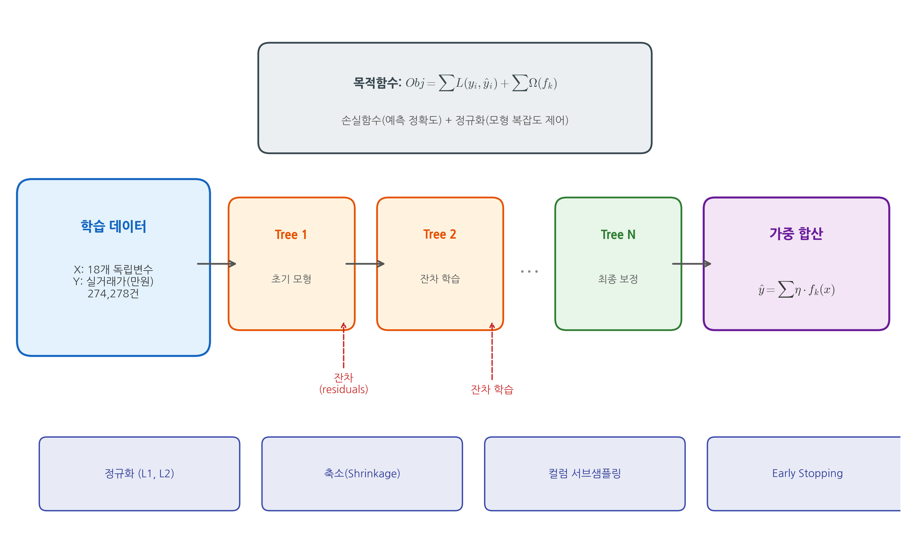

### 3. 랜덤 포레스트

랜덤 포레스트(Random Forest)는 Breiman(2001)이 제안한 앙상블 학습법으로, 다수의 의사결정 트리(decision tree)를 독립적으로 학습시킨 후 예측값의 평균(회귀)이나 다수결(분류)로 최종 결과를 산출하는 배깅(bagging) 기반 알고리즘이다. 각 트리는 전체 학습 데이터의 부트스트랩(bootstrap) 표본을 사용하며, 각 분할(split)에서 전체 특성 중 무작위로 선택된 부분집합만을 고려한다. 이를 통해 개별 트리 간의 상관관계를 줄이고 과적합을 방지한다.

Čeh et al.(2018)은 랜덤 포레스트가 다중회귀분석에 비해 비선형 관계를 효과적으로 포착하여 주택가격 예측에서 우수한 성능을 보임을 실증하였다. 본 연구에서는 랜덤 포레스트를 XGBoost의 비교 모형으로 활용한다.

## 제3절 설명가능한 인공지능(XAI)

### 1. XAI의 개념과 필요성

설명가능한 인공지능(eXplainable Artificial Intelligence, XAI)은 인공지능 모형의 의사결정 과정과 결과를 인간이 이해할 수 있는 형태로 설명하는 기법의 총칭이다. 머신러닝 모형, 특히 앙상블 모형이나 딥러닝 모형은 높은 예측 정확도를 달성하지만, 내부 작동 원리가 불투명하여 '블랙박스' 문제가 발생한다.

부동산 분야에서 XAI의 필요성은 다음과 같다.

첫째, **정책 논의의 참고성**: 주택 정책 관련 논의에서 "어떤 요인이 예측값 설명에 얼마나 기여하는가"를 점검할 수 있는 보조 정보를 제공한다.

둘째, **시장 참여자의 해석 보조**: 매수자, 매도자, 감정평가사 등 시장 참여자들이 예측값이 어떤 정보 조합을 바탕으로 산출되었는지 이해하는 데 참고할 수 있도록 한다.

셋째, **모형의 신뢰성 점검**: 자동감정평가(AVM) 모형의 결과에 대한 설명을 제공함으로써 감정평가의 투명성과 신뢰성을 점검하는 데 도움을 준다.

넷째, **편향 진단**: 머신러닝 모형에 내재된 지역적·사회경제적 편향을 진단할 때 참고할 수 있는 정보를 제공한다.

### 2. 주요 XAI 방법론

XAI 방법론은 크게 모형 비의존적(model-agnostic) 방법과 모형 특화적(model-specific) 방법으로 분류된다.

**모형 비의존적 방법**으로는 LIME(Local Interpretable Model-agnostic Explanations; Ribeiro et al., 2016)과 SHAP(Lundberg & Lee, 2017)이 대표적이다. LIME은 개별 예측의 국소적 근방에서 해석 가능한 대리 모형(surrogate model)을 적합하여 설명을 제공하며, SHAP은 게임이론의 Shapley value에 기반하여 이론적 일관성을 보장한다.

**모형 특화적 방법**으로는 트리 기반 모형의 내장된 특성 중요도(feature importance), 부분 의존성 플롯(Partial Dependence Plot, PDP; Friedman, 2001), 누적 국소 효과(Accumulated Local Effects, ALE) 등이 있다. 부동산 분야에서도 SHAP, LIME 등 XAI 방법론의 활용이 확산되고 있다.

### 3. SHAP(SHapley Additive exPlanations)

SHAP은 Lundberg와 Lee(2017)가 제안한 XAI 프레임워크로, 협조적 게임이론(cooperative game theory)의 Shapley value 개념을 머신러닝 모형 해석에 적용한 것이다. Shapley value는 게임에 참여하는 각 플레이어의 기여도를 공정하게 배분하는 유일한 해(unique solution)로, 다음의 네 가지 공리(axiom)를 만족한다: 효율성(Efficiency), 대칭성(Symmetry), 더미(Dummy), 가산성(Additivity).

SHAP에서 각 특성 $j$의 Shapley value $\phi_j$는 다음과 같이 정의된다.

$$\phi_j = \sum_{S \subseteq N \setminus \{j\}} \frac{|S|!(|N|-|S|-1)!}{|N|!} [f(S \cup \{j\}) - f(S)]$$

여기서 $N$은 전체 특성의 집합, $S$는 $N$에서 특성 $j$를 제외한 부분집합, $f(S)$는 특성 집합 $S$만을 사용한 모형의 예측값이다. 즉, SHAP값은 특성 $j$가 모든 가능한 특성 조합에 추가될 때의 한계 기여도의 가중 평균이다.

개별 예측 $\hat{y}_i$는 다음과 같이 분해된다.

$$\hat{y}_i = \phi_0 + \sum_{j=1}^{M} \phi_j^{(i)}$$

여기서 $\phi_0$는 기본값(base value, 전체 데이터의 평균 예측값), $\phi_j^{(i)}$는 관측치 $i$에 대한 특성 $j$의 SHAP값이다. 이를 통해 각 예측이 기본값으로부터 어떤 특성에 의해 얼마만큼 증가 또는 감소하였는지를 정량적으로 분해할 수 있다.

특히 XGBoost 등 트리 기반 모형에 대해서는 TreeSHAP 알고리즘(Lundberg et al., 2020)을 통해 정확한 SHAP값을 다항 시간(polynomial time) 내에 효율적으로 계산할 수 있다. 본 연구에서 적용한 SHAP 분석의 전체 프레임워크는 <그림 2-2>에 제시하였다.

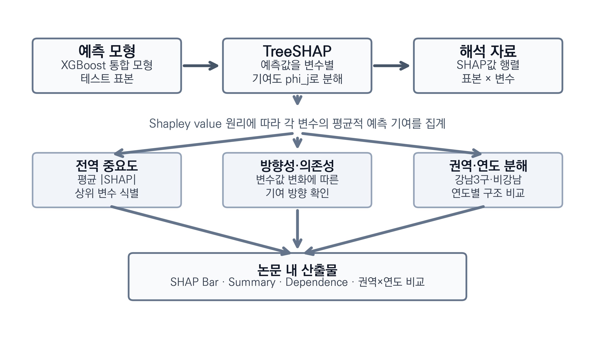

SHAP 분석의 주요 시각화 도구는 다음과 같다.

- **SHAP Summary Plot**: 모든 특성의 SHAP값 분포를 동시에 표시하여 글로벌 변수 중요도와 영향 방향을 파악한다.
- **SHAP Bar Plot**: 평균 절대 SHAP값(mean |SHAP value|) 기준으로 변수 중요도를 순위화한다.
- **SHAP Dependence Plot**: 특정 변수의 값과 SHAP값 간의 관계를 산점도로 표시하여 비선형 효과를 시각화한다.
- **SHAP Waterfall Plot**: 개별 예측에 대해 기본값에서 각 특성의 기여를 순차적으로 누적하여 최종 예측값에 도달하는 과정을 표시한다.

## 제4절 선행연구 검토 및 차별성

### 1. 국내 선행연구

국내에서 머신러닝을 활용한 부동산 가격 예측 연구는 2020년대 이후 학위논문을 중심으로 활발히 진행되어 왔다. 이를 연구 초점에 따라 분류하면, (1) 머신러닝 예측 성능 비교 연구, (2) 공간 분석 및 비정형 데이터 활용 연구로 구분할 수 있다.

#### 1) 머신러닝 예측 성능 비교 연구

조보근 외(2020)는 기계학습 알고리즘을 활용하여 지역별 아파트 실거래가격지수 예측모델을 비교하고 LIME을 통한 해석력 검증을 수행하였다.

국내에서도 헤도닉 모형을 적용한 연구가 활발하다. 김우성 외(2019)는 2006~2017년 강남 아파트 실거래가를 분석하여 주거 선호의 구조 변화를 실증하였고, 신광문·이재수(2019)는 공간 헤도닉 모형으로 소형주택 임대료 결정요인을 분석하였다. 장희선 외(2021)는 공간헤도닉모형을 적용하여 서울시 도시공원 서비스의 편익을 주택가격을 통해 측정하였다.

한편, 머신러닝 기반 부동산 가격 예측 연구도 축적되어 있다. 배성완·유정석(2018)은 SVM, 랜덤 포레스트, GBT, DNN, LSTM 등 다양한 머신러닝 모형으로 한국 부동산 가격지수를 예측하여 이 분야의 국내 연구를 선도하였다. 김이환 외(2022)는 기계학습 방법론으로 아파트 매매가격지수를 산출하여 헤도닉 모형 대비 우수한 설명력을 확인하였고, 김학현 외(2023)는 DNN, XGBoost, CatBoost 등을 비교하여 딥러닝과 머신러닝의 아파트 실거래가 예측 성능을 실증하였다. 이선구(2025)는 XGBoost 기반 자동가치산정모형(AVM)을 은평구 다세대주택에 적용하여 86.4%의 예측 정확도를 보고하였다.

#### 2) 공간 분석 및 비정형 데이터 활용 연구

진수정(2024)은 서울시 아파트 매매가격 예측에 그래프 신경망(SRGCNN)을 적용하여 공간적 의존성을 반영한 딥러닝 모형을 제안하였다. 이 연구는 전통적 피처 엔지니어링을 넘어 공간적 관계를 모형에 직접 반영하였다는 점에서 방법론적 기여가 크다.

#### 3) 소결

국내 연구의 동향을 종합하면, 머신러닝을 활용한 아파트 가격 예측 연구는 상당히 축적되어 있으나, 대부분 **예측 정확도 비교**에 초점을 맞추고 있다. SHAP 등 XAI 기법을 통해 각 변수의 예측값 설명 기여도를 체계적으로 해석하고, 이를 정책 논의의 참고 근거로 연결하는 연구는 아직 초기 단계에 머물러 있다. 또한 대부분의 연구가 자치구(구) 단위의 분석에 머물러 있어, 행정동 단위의 세분화된 분석이 부족한 실정이다.

### 2. 해외 선행연구

해외에서는 머신러닝과 XAI를 결합한 부동산 가격 분석 연구가 2023년 이후 빠르게 축적되고 있다. 이를 연구 주제에 따라 (1) XAI 기반 예측요인 및 예측값 설명 분석, (2) 헤도닉 모형과 머신러닝의 비교, (3) 한국 시장 대상 해외 학술지 연구로 분류하여 검토한다.

#### 1) XAI 기반 예측요인 및 예측값 설명 분석

Neves et al.(2024)은 오픈데이터와 XAI를 결합하여 리스본 스마트시티의 부동산 가격을 분석하였으며, XGBoost 모형에 SHAP을 적용하여 면적, 입지, 건축연도 등이 예측값 설명에서 어떤 역할을 보이는지 정리하였다. 이 연구는 본 연구와 방법론적 구조(XGBoost + SHAP)가 유사하나, 대상 시장과 변수 구성에서 차이가 있다.

Mora-García et al.(2022)은 COVID-19 시기 스페인 알리칸테 지역의 주택가격 예측에 랜덤 포레스트와 XGBoost를 적용하여 전통적 회귀분석 대비 우수한 성능을 확인하였다. Čeh et al.(2018)은 슬로베니아 아파트를 대상으로 랜덤 포레스트와 다중회귀분석을 비교하여 머신러닝 모형의 비선형 포착 능력을 실증하였다.

Shahhosseini et al.(2022)은 Ames 주택 데이터셋을 활용하여 앙상블 가중치와 하이퍼파라미터를 동시에 최적화하는 프레임워크를 제안하였으며, 회귀 문제에서 머신러닝 모형의 하이퍼파라미터 튜닝 전략이 예측 성능에 미치는 영향을 체계적으로 분석하였다. 이 연구는 주택가격 데이터에 대한 앙상블 최적화 사례로서 본 연구의 하이퍼파라미터 탐색 설계에 참고하였다.

Ezil Sam Leni et al.(2025)은 킹카운티 주택 데이터를 대상으로 XGBoost와 SHAP을 결합한 가격 예측 프레임워크를 제안하고, 웹 배포까지 구현하여 XAI 기반 AVM의 실무적 활용 가능성을 보여주었다.

#### 2) 헤도닉 모형과 머신러닝의 비교

An et al.(2025)은 한국 주택시장을 대상으로 전통적 헤도닉 가격모형과 머신러닝 모형의 예측 성능을 체계적으로 비교하였다. 이 연구는 SHAP을 활용하여 머신러닝 모형에 헤도닉 모형 수준의 해석 가능성을 부여할 수 있음을 실증하였으며, 두 접근법의 강점을 결합한 '투명한 주택가격 감정' 프레임워크를 제안하였다.

Tarasov와 Dessoulavy-Śliwiński(2025)는 폴란드 부동산 시장에서 알고리즘 기반 헤도닉 가격 모형에 XAI를 적용하여, 머신러닝이 전통적 헤도닉 접근법을 효과적으로 대체할 수 있음을 보였다.

Choy와 Ho(2023)는 부동산 분야 머신러닝 연구에 대한 체계적 문헌 리뷰(systematic literature review)를 수행하여, 2020년 이후 관련 연구가 급격히 증가하고 있으며 XAI의 적용이 새로운 연구 방향으로 부상하고 있음을 확인하였다.

#### 3) 한국 시장 대상 해외 학술지 연구

Chun et al.(2025)은 서울시 아파트 매매 실거래 데이터를 활용하여 LightGBM, GBDT, XGBoost 등 다양한 머신러닝 모형과 SHAP 기반 XAI 분석을 수행한 연구로, 본 연구와 대상 시장 및 방법론 모두에서 가장 유사하다. 다만 이 연구는 변수 구성과 분석 기간에서 본 연구와 차이가 있으며, 강남/비강남 간 지역 비교분석을 수행하지 않았다는 점에서 본 연구가 보완적 기여를 한다.

Kim, Choi와 Lee(2025)는 한국 주거용 부동산 시장에 XAI 기반 대량감정평가(mass appraisal) 모형을 적용하였다. 이 연구는 SHAP과 PFI(Permutation Feature Importance)를 결합하여 시간에 따른 변수 중요도의 변화를 추적하였으며, 한국 부동산 시장에서 XAI의 실무적 적용 가능성을 제시하였다.

Kim et al.(2022)은 공간회귀분석을 통해 한국 다세대주택 거래가격과 관련 변수들의 공간적 연관 구조를 분석하였으며, 공간적 의존성이 중요한 설명 맥락으로 작동함을 확인하였다.

### 3. 선행연구의 종합 및 본 연구의 차별성

선행연구를 종합하면, 머신러닝 기반 부동산 가격 예측 연구는 국내외에서 활발히 진행되고 있으나, 다음과 같은 연구 공백(research gap)이 존재한다.

첫째, 국내 연구는 대부분 예측 정확도 비교에 치중하고 있으며, SHAP 등 XAI 기법을 활용한 체계적 변수 해석 연구가 부족하다. 조보근 외(2020) 등의 연구가 머신러닝의 우수한 예측 성능을 확인하였으나, 예측값 설명 구조에 대한 심층적 해석은 제한적이다.

둘째, 해외 XAI 부동산 연구는 리스본(Neves et al., 2024), 스페인(Mora-García et al., 2022), 슬로베니아(Čeh et al., 2018), 폴란드(Tarasov & Dessoulavy-Śliwiński, 2025) 등 다양한 시장을 대상으로 축적되고 있으나, 서울 아파트 시장의 고유한 특성(강남 입지 격차, 노후주택의 재건축 기대 등이 함께 반영된 시장 맥락)을 다룬 XAI 분석은 Chun et al.(2025)의 연구를 제외하면 매우 제한적이다.

셋째, 강남3구와 비강남 지역의 예측값 설명 패턴 차이를 SHAP으로 비교한 사례는 국내외 선행연구에서 상대적으로 드물다. 본 연구는 통합 모형 재집계에 더해 별도 지역 모형으로 지역별 변수 구조를 재확인한 이중 실증 설계를 취한다.

넷째, 기존 연구들은 대부분 자치구(구) 단위의 분석에 그치고 있어, 행정동 실측 변수와 구 단위 프록시를 함께 다루는 보다 세분화된 설명 패턴 검토가 충분히 제시되지 못하고 있다.

이러한 연구 공백을 바탕으로, 본 연구의 의의는 다음과 같이 정리된다.

**첫째, 방법론적 의의**: 국내 아파트 가격 연구에서 OLS, 랜덤 포레스트, XGBoost의 3모형 비교와 SHAP 기반 해석을 함께 제시함으로써, 예측 성능 비교와 변수 해석을 하나의 분석 틀 안에서 연결하였다.

**둘째, 분석 단위의 세분화**: 기존 연구들이 자치구(25개) 단위의 분석에 머문 것과 달리, 본 연구에서는 거래자료와 일부 환경 변수를 행정동(215개) 분석틀에 정렬하고, 학원수·어린이집수처럼 구 단위 집계를 행정동 수준에 접합한 프록시 변수도 함께 활용하여 보다 세분화된 공간 분석 틀을 제시하였다. 이를 위해 법정동 기반의 실거래 데이터를 Nominatim 지오코딩과 행정동 경계 GeoJSON을 활용한 공간 결합(spatial join)을 통해 행정동으로 매핑하였다. 다만 이 설계는 모든 환경 변수를 동일한 정밀도의 행정동 자료로 구축한 것이 아니라, 실제 행정동 집계 변수와 구 단위 프록시 변수를 결합한 혼합적 설계이다. 또한 자치구 단위와의 직접 비교 실험도 수행하지 않았으므로, 행정동 단위 전환의 우월성을 실증적으로 확정하는 데에는 한계가 있다.

**셋째, 데이터의 규모와 기간**: 분석에 포함된 서울시 215개 행정동의 391,826건 실거래 데이터를 7년간(2019~2025)에 걸쳐 분석함으로써 대규모 데이터에 기반한 결과를 제시하였다. 이는 기존 국내 연구 대비 데이터 규모와 시간적 범위에서 확장된 것이다.

**넷째, 지역 비교분석**: 강남3구와 비강남 지역의 SHAP값을 비교함으로써, 통합 모형 내부에서 관찰된 지역별 설명 패턴 차이를 탐색적으로 정리하였다. 이는 Chun et al.(2025)과 Kim, Choi와 Lee(2025)에서 수행되지 않은 비교를 추가로 제시한다는 점에서 의미가 있으나, 별도 지역 모형을 적합한 확인적 비교가 아니라 통합 모형 내부의 설명 패턴 차이를 정리한 수준으로 이해할 필요가 있다.

**다섯째, 거시경제 변수의 통합 분석**: 기존 헤도닉 모형 연구가 주로 물리적·입지적 특성에 초점을 맞추는 반면, 본 연구는 기준금리, CD금리, 소비자물가지수, M2 통화량 등 거시경제 변수를 포함하여 미시적 특성과 거시적 환경을 함께 고려하였다.

---

# 제3장 연구 설계

## 제1절 연구 모형

본 연구의 전체적인 분석 프레임워크는 <그림 3-1>과 같다.

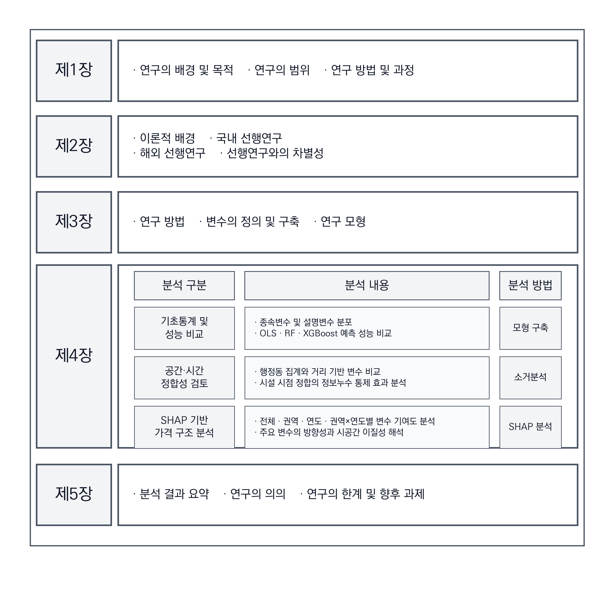

본 연구의 종속변수는 아파트 매매 실거래가를 전용면적(㎡)으로 나눈 **단위면적당 가격의 자연로그값**(log ㎡당 만원)이다. 독립변수는 물리적 특성·권역 구분·거리 기반 접근성(13 시설군)·시점 정합·행정동 집계(보조)·거시경제의 여섯 범주로 구성되며, 통합 모형(시나리오 D) 기준 총 36개이다(구성 세부는 <표 3-1> 참조). 베이스라인 모형으로 다중회귀분석(OLS)을 설정하고, 비선형 모형으로 랜덤 포레스트와 XGBoost를 구축하여 예측 성능을 비교한 후, 무작위 분할 기준에서 상대적으로 우수한 성능을 보인 XGBoost를 SHAP 분석의 해석 대상 모형으로 설정하였다. 다만 시간순 분할에서는 동일 하이퍼파라미터 설정 하에서 Random Forest와의 성능 차이가 매우 작으므로, XGBoost 선택은 절대적 우월성의 확정보다 무작위 분할 내부의 상대 성능, 보고 체계의 일관성, 기존 선행연구와의 비교 가능성을 함께 고려한 분석상의 선택으로 이해할 필요가 있다. 다시 말해, 본 연구에서 XGBoost는 시간순 분할 우위까지 입증된 유일 모형이라기보다 성능 동률권 내에서 설명가능성 분석을 수행하기 위한 대표 해석 모형이다. 따라서 본 연구의 비교 설계는 동일 표본·동일 변수 체계 아래에서 모형 간 예측 설명 구조를 비교하는 데 초점을 두며, 신규 단지에 대한 배치 수준 일반화 성능이나 지역별 구조 차이 자체를 최종 확정하는 설계와는 구분된다.

## 제2절 분석 데이터 및 변수 설정

### 1. 데이터 수집

본 연구에서 사용한 데이터는 다음의 공공데이터 출처로부터 수집하였다.

**종속변수**인 아파트 매매 실거래가는 국토교통부가 운영하는 공공데이터포털(data.go.kr)의 아파트매매 실거래자료 API를 통해 수집하였다. 분석 기간은 2019년 1월부터 2025년 12월 계약분까지이며, 분석 시점에 확보 가능한 서울특별시 215개 행정동 자료를 대상으로 총 391,826건의 거래 데이터를 확보하였다. 다만, 부동산 실거래 신고는 계약일로부터 30일 이내에 이루어지므로, 2025년 하반기(특히 11~12월) 거래 데이터는 잠정 관측치 성격을 가지며 신고 지연으로 인해 일부 누락되었을 가능성이 있다.

### 2. 법정동-행정동 매핑

국토교통부의 실거래가 데이터는 법정동 기준으로 제공되나, 본 연구의 환경 변수(학교수, CCTV수 등)는 행정동 단위로 집계되어 있다. 법정동과 행정동은 일대일로 대응하지 않으므로, 두 공간 단위를 최대한 일관되게 정렬하기 위하여 다음의 2단계 공간 결합(spatial join) 방법론을 적용하였다.

**1단계: 단지 지오코딩(Geocoding)**: 거래 레코드의 (구·법정동·아파트명) 조합으로 식별한 8,601개 유니크 단지를 Kakao Local API의 키워드·주소 검색을 통해 위경도 좌표로 변환하였다. 거래 건은 단지 식별자를 통해 해당 좌표에 연결된다.

**2단계: 공간 결합(Spatial Join)**: 행정안전부에서 제공하는 행정동 경계 GeoJSON 데이터를 활용하여, 각 거래 건의 위경도 좌표가 어떤 행정동 경계 내에 포함되는지를 공간 결합(point-in-polygon)을 통해 판별하였다. 이를 통해 법정동 기반 거래 데이터를 행정동 분석틀에 일관되게 정렬할 수 있었다.

이러한 법정동-행정동 매핑을 통해 거래자료와 행정동 수준으로 구축 가능한 환경 변수들을 동일한 분석틀에서 결합할 수 있게 되었고, 구 단위 프록시를 병행한 혼합 설계 아래 행정동(215개) 단위의 세분화된 검토가 가능해졌다.

### 3. 환경 특성 변수 구축

**환경 특성 변수** 중 학교 관련 데이터(초등학교수, 중학교수, 고등학교수)는 나이스 교육정보 개방 포털(open.neis.go.kr)에서 수집하였으며, CCTV수는 서울열린데이터광장(data.seoul.go.kr)의 안전CCTV 설치현황 데이터를, 백화점수는 서울열린데이터광장의 대규모점포 인허가 데이터(LOCALDATA_072405)에서 업태구분이 '백화점'인 점포만을 필터링하여 활용하였다. 학원수는 나이스 교육정보 개방 포털의 학원 정보 API(acaInsTiInfo)를 통해 서울시 전체 학원 25,437건을 수집하였으며, 어린이집수는 서울열린데이터광장의 어린이집 정보(ChildCareInfo, 정상 운영 9,529건)를, 공원수는 서울시 공원 데이터(GetParkInfo, 131건)를, 도서관수는 서울시 공공도서관 정보(SeoulPublicLibraryInfo, 215건)를 각각 활용하였다. 공원수와 도서관수는 위경도 좌표를 기반으로 행정동 경계와의 공간 결합(spatial join)을 통해 집계하였으며, 학원수와 어린이집수는 구 단위 집계 후 구 내 행정동 수로 균등 배분하였다. 다만 이들 환경 특성 변수는 거래연도별 패널이 아니라 수집 시점의 인프라 stock 정보를 기준으로 구축되어 분석 기간 전체(2019~2025)에 공통적으로 병합되었다. 따라서 특정 연도의 실제 시설 개폐나 공급 변화를 반영하지 못하며, 특히 초기 연도 거래에 대해서는 시점 불일치(measurement mismatch)뿐 아니라 이후 시점에 관측된 시설 stock 정보가 소급 병합되는 형태의 미래정보 혼입 가능성도 완전히 배제할 수 없다. 이 방식은 구 내 행정동 간 실제 분포 편차를 반영하지 못하는 한계가 있으나, 행정동 단위의 개별 주소 데이터 확보가 제한적이어서 차선의 방법으로 채택하였다. 따라서 본 연구의 행정동 세분화는 모든 환경 변수를 동일한 정밀도로 구축했다기보다, 일부 변수는 실제 행정동 수준으로 집계하고 일부 변수는 구 단위 프록시를 행정동 분석틀에 접합한 혼합적 설계로 이해하는 것이 보다 정확하다. 다시 말해 학원수·어린이집수·공원수·도서관수와 관련된 결과는 시간정합성이 완전한 패널 자료에서 확인된 확정적 효과라기보다, 공통 기준시점 stock 정보를 활용한 예측 보조 신호의 탐색적 점검으로 제한해 해석하는 것이 타당하다.

**거시경제 변수**(기준금리, CD금리, 소비자물가지수, M2 통화량)는 한국은행 경제통계시스템(ECOS, ecos.bok.or.kr)에서 월별 데이터를 수집하였다.

### 4. 변수 설정

본 연구에서 사용한 종속변수와 독립변수의 정의 및 데이터 출처는 <표 3-1>과 같다. 종속변수는 실거래가(만원)를 전용면적(㎡)으로 나눈 단위면적당 거래가격에 자연로그를 취한 값으로 정의하여, 규모효과를 분모로 제거한 뒤 질적·입지적 가격 결정 구조를 점검할 수 있도록 설계하였다. 로그 변환은 고가 구간 이분산성을 완화하고 헤도닉 문헌의 표준적인 log-price 모형 전통(Malpezzi, 2003; Sirmans et al., 2005)에 연결된다.

**<표 3-1> 종속변수 및 독립변수 정의·데이터 출처**

| 구분 | 변수명 | 변수 설명 | 단위 | 데이터 출처 |
|------|--------|-----------|------|------------|
| 종속변수 | log(㎡당 거래가격) | ln(실거래가[만원] ÷ 전용면적[㎡]) | log(만원/㎡) | 국토교통부 실거래가 파생 |
| 물리적 특성 | 전용면적 | 전용면적 | ㎡ | 국토교통부 (data.go.kr) |
| | 층 | 거래 층수 | 층 | 국토교통부 |
| | 건물연령 | 거래시점 기준 건축 후 경과연수 | 년 | 국토교통부 |
| 권역 | 강남구분 | 강남3구(강남·서초·송파) 여부 | 더미(0/1) | 자체 생성 |
| 거리 기반 접근성 (13 시설군 × {최근접거리_m, count_500m, count_1km, count_2km, 도보추정_분}) | | | | |
| | 지하철(subway) | 단지 좌표 기준 최근접 역까지 직선거리, 반경 500m/1km/2km 내 역수 | m, 개 | 서울열린데이터광장 + 위키(신규개통) |
| | 초·중·고등학교(elem/middle/high_school) | 동일 구조, 학교 종류별 분리 | m, 개 | NEIS `schoolInfo` |
| | 어린이집(childcare) | 동일 구조 | m, 개 | 서울 `ChildCareInfo` |
| | 공원(park) + within_1km + log1p(count_2km) | 희소 시설 보정 포함 | m, 개, 더미 | 서울 `SearchParkInfoService` |
| | 도서관(library) + within_1km + log1p(count_2km) | 희소 시설 보정 포함 | m, 개, 더미 | 서울 `SeoulPublicLibraryInfo` |
| | 대형마트(mart) | 반경 개수 + 최근접 | m, 개 | Kakao Local `MT1` |
| | 백화점(department) + within_1km + log1p(count_2km) | 희소 시설 보정 포함 (36개 실제 건물) | m, 개, 더미 | Kakao Local (category_name 필터) |
| | 근린시설(large_store) | 커피·편의점 등 인허가 영업중 개수 | 개 | 서울 `LOCALDATA_072405` |
| | 병원(hospital, hospital_general) | 전체 1,117 + 종합병원 25 별도 | m, 개 | Kakao Local `HP8` |
| | CCTV(cctv) | `count_500m`만 (최근접 제외, codex 검토 반영) | 개 | 서울 CCTV 현황 |
| | 학원(academy) | 반경 개수 + 최근접 | m, 개 | NEIS `acaInsTiInfo` |
| 행정동 집계 (보조, 행정동 집계) | 10개 변수 (초/중/고/CCTV/백화점/지하철/공원/도서관/학원/어린이집) | 행정동 경계 내 개수(집계 방식) | 개 | 각 시설 원자료 |
| 거시경제 | 기준금리·CD금리·CPI·M2 | 월별 국가 통계 | %·지수·백만원 | 한국은행 ECOS |

**주 1 (공간 정합).** 본 연구의 거리 기반 변수는 거래 단지 좌표(Kakao Local API로 8,601 유니크 단지 지오코딩; 거래건수 기준 100% 커버)를 기준으로 산출되며, 행정동 경계 집계 방식(행정동 집계)과 병행 보존된다. Ablation 분석(제4장 제3절)은 두 방식의 기여를 분리 평가한다. 거리는 haversine 직선거리이며 실제 도보 네트워크 거리가 아니다.

**주 2 (시간 정합).** 연도별 시점 정합 시설은 **학교·학원·어린이집·공원·근린시설·지하철** 6개 군이다. 학교(`FOND_YMD`), 학원(`ESTBL_YMD`+`REG_STTUS_NM`+`CAA_BEGIN/END_YMD`), 어린이집(`CRCNFMDT`+`CRABLDT`), 공원(`OPEN_YMD`), 근린시설(`APVPERMYMD`+`TRDSTATENM`+`DCBYMD`)의 시간 필드를 활용하여 거래 연도 Y의 Y-12-31 기준 활동 중인 시설만 포함한 7개 연도별 스냅샷을 구성하였다. 지하철은 2026년 스냅샷에 `subway_new_openings_2019_2025.csv`(신림선 11·신분당 신사 1·GTX 연관 3 등 15개 역)을 결합하여 연도별 개통 상태를 복원하였다. 도서관·백화점·대형마트·CCTV·병원 5개 군은 원자료에 개관·개점·설치일이 없어 2026년 2월 스냅샷을 전 기간에 적용하며, 이는 제5장 한계에서 별도 기술한다.

**주 3 (희소 시설 보정).** 공원·도서관·백화점처럼 1km 반경 내 0이 많은 시설은 `within_1km`(0/1 더미)과 `log1p(count_2km)` 파생변수를 추가하여 count=0 구간의 선형 효과 가정을 완화하였다(codex 교차검증 반영).

독립변수는 다음 네 범주로 구성된다.

**물리적 특성**은 아파트 자체의 물리적 속성으로, 전용면적(㎡), 층수, 건물연령을 포함한다. 전용면적은 주거 공간의 규모를 대리하며, 종속변수(log ㎡당 가격)의 분모로도 사용되면서 동시에 독립변수로도 유지되어 소형·대형 평형 간 단위가격 프리미엄을 별도 설명 신호로 포착한다. 층수는 조망·채광·소음 등과 관련된 주거 쾌적성을 반영하고, 건물연령은 거래시점 기준 건축 후 경과연수로 노후도와 재건축 기대를 동시에 반영한다.

**권역 구분**은 강남3구(강남구·서초구·송파구) 여부를 더미로 설정한다. 본 연구는 통합 모형 외에 권역 별도 모형(강남 17변수, 비강남 17변수)을 함께 적합하여 권역 내부 설명 구조를 직접 비교한다(제4장 제5절·제7절).

**거리 기반 접근성**은 13개 시설군에 대해 단지 좌표 기준 **최근접 직선거리(m)**, **반경 500m/1km/2km 내 개수**, 그리고 **도보 추정 시간(분)** 세 축을 병행 산출한 변수 집합이다. 도보 추정 시간은 직선거리에 도로 우회 보정계수 1.35와 보행 속도 4 km/h를 적용한 근사값으로, 교수 심사 피드백의 "도서관은 도보 몇 km까지, 백화점 조건이 무엇인가"라는 질문에 직접 대응하기 위한 지표이다(세부 분포는 <표 4-3>). 주요 시설군은 지하철(subway), 초·중·고등학교(elem/middle/high_school), 어린이집(childcare), 공원(park), 도서관(library), 대형마트(mart), 백화점(department), 근린시설(large_store; 커피숍·편의점·일반조리판매 등 인허가 영업중), 병원(hospital; 종합병원 별도 `hospital_general`), CCTV(count_500m만), 학원(academy)이다. 거리 지표의 장점은 행정동 경계라는 인위적 단위(MAUP) 대신 **거래 단지의 실제 위치**를 기준으로 접근성을 측정한다는 점이며, 교수 심사 피드백에서 지적된 "도서관은 도보 몇 km까지인가, 백화점 조건이 무엇인가"라는 거리 기준 명시 요구에 대해 반경 임계값(500m/1km/2km)과 최근접거리를 이중으로 제공하는 방식으로 대응한다. 거리 변수의 해석은 다음 선행 관행에 부합한다: 지하철 500m는 역세권의 통상적 도보권(TOD 문헌의 400~800m), 초등학교 500m~1km는 학군 배정거리 근방, 공원·도서관 1km는 생활SOC 문헌의 도보권 기준에 해당한다. 다만 본 연구의 거리는 haversine 직선거리이며, 도보 네트워크 거리와 차이가 있을 수 있다(제5장 한계 참조).

**시점 정합**은 시설 원자료의 개업·폐업·신설 이력을 활용하여 거래 연도별 활동 시설만 필터링한 7개 연도별 스냅샷(2019~2025)으로 구축된다. 학교(개교일), 학원(설립·개원 상태·휴원 이력), 어린이집(인가·폐지), 공원(개원일), 근린시설(인허가·폐업), 지하철(2019~2025 신규 15개 역 보강) 6개 군이 연도별 시점 정합 대상이며, 도서관·백화점·대형마트·CCTV·병원은 원자료 제약으로 2026년 2월 스냅샷을 전 기간 적용한다. 이 설계는 "2019년 거래 가격 설명에 2026년에야 개설된 시설 정보가 유입되는" 시간역전 정보누수를 원칙적으로 제거한다.

**행정동 집계 변수(행정동 집계)**는 기존 연구 관행과의 비교를 위해 병행 유지된다. 초·중·고등학교·CCTV·백화점·지하철·공원·도서관·학원·어린이집 10개 변수에 대해 행정동 경계 내 개수를 계산하며, 학원·어린이집은 원자료가 구 단위라 구 집계값을 구 내 행정동 수로 균등 배분한 프록시 성격을 가진다. Ablation 분석(제4장 제3절)은 행정동 변수 단독·거리 변수 단독·둘의 결합을 각각 비교하여 두 방식의 기여를 분리 평가한다.

**거시경제 특성**은 주택시장 전반의 금융·유동성 국면을 반영하는 변수로, 기준금리·CD금리·소비자물가지수·M2(광의통화)를 포함한다. 월별 stock 구조로 동일 월 거래들에 반복 부여되는 한계가 있으므로, 개별 회귀계수보다 시장 국면 대리신호 묶음으로 해석하는 것이 적절하다.

### 5. 데이터 분할

수집된 391,826건의 데이터를 학습 데이터(training set) 약 70%, 검증 데이터(validation set) 10%, 테스트 데이터(test set) 20%의 비율로 분할하였다. 실제 분할 결과 학습 데이터 274,277건, 검증 데이터 39,183건, 테스트 데이터 78,366건이 각각 배정되었다. 학습 데이터는 모형의 구축에, 검증 데이터는 XGBoost의 early stopping을 위한 조기 종료 기준으로, 테스트 데이터는 최종적인 예측 성능 평가에 사용하였다. 검증 데이터를 별도로 분리하여 early stopping에 활용함으로써 학습 데이터와 테스트 데이터 간의 정보 유출(data leakage)을 방지하였다.

본 연구의 설계 목적은 단순히 최고 성능 모형 하나를 선발하는 데 있지 않다. 동일 표본·동일 변수 체계·동일 평가 틀 아래에서 OLS, Random Forest, XGBoost의 예측 성능과 예측값 설명 구조를 비교하고, 그 차이를 해석 가능한 형태로 제시하는 데 분석의 초점을 둔다. 따라서 아래의 방법론은 모형 간 절대적 우열 확정보다, 동일 자료 구조 안에서 어떤 예측·설명 패턴이 일관되게 관찰되는지를 비교하기 위한 절차로 이해하는 것이 적절하다. 본 연구는 무작위·단지·시간순 세 가지 분할을 **모두 수행하여 일반화 환경 난이도에 따른 성능 변화를 정량화**하였으며, 이에 따라 어느 한 실험 결과만으로 최종 우승 모형을 선언하지 않고 분할 간 상대 성능을 종합적으로 해석한다. 이에 본문은 XGBoost를 SHAP 설명 제시를 위한 대표 해석 모형으로 사용하되, Random Forest를 시간순 분할의 보완 기준모형으로 함께 제시함으로써 결과 해석의 범위를 보수적으로 제한하였다. 핵심 예측 성능, SHAP 중요도, 강건성 수치는 본문 표와 보조 점검표를 중심으로 일관되게 대조·확인하였다.

## 제3절 분석 방법

### 1. 다중회귀분석(OLS)

다중회귀분석(Ordinary Least Squares, OLS)은 종속변수와 독립변수 간의 선형 관계를 추정하는 전통적 통계 방법으로, 본 연구에서 베이스라인 모형으로 활용하였다. OLS는 잔차의 제곱합을 최소화하는 방식으로 회귀계수를 추정하며, 각 독립변수의 회귀계수 방향과 크기를 선형 모형 내 조건부 연관성 수준에서 해석할 수 있다는 장점이 있다.

본 연구의 종속변수는 log(단위면적당 거래가격) = ln(실거래가[만원] / 전용면적[㎡])이다. 이 함수형은 헤도닉 문헌에서 널리 사용되는 log-linear 준 탄력성 모형에 대응하며(Malpezzi, 2003), 다음 세 가지 이점을 제공한다. 첫째, 종속변수를 전용면적으로 정규화함으로써 규모효과를 분모로 제거하고, 나머지 질적·입지적 변수들의 설명 기여를 상대적으로 부각한다. 둘째, 로그 변환은 단위면적당 가격의 이분산성(특히 강남 고가 구간의 분산 확대)을 완화하여 OLS 표준오차 추정을 안정화한다. 셋째, 연속 독립변수의 OLS 계수 β는 $(e^{\beta}-1)\times 100\%$의 준 탄력성(semi-elasticity, "1단위 증가 시 단위면적당 가격의 % 변화")로 해석할 수 있어, 단위가 이질적인 변수들을 일관된 비율 차원에서 비교할 수 있다. 다만 OLS의 통계적 유의성은 설명적 참고 지표로만 활용하였다. 월별 거시경제 변수는 동일 월 거래 다수에 반복 부여되는 stock 정보이므로, 거래년월 기준 월 클러스터-강건 표준오차 및 거시경제 변수를 제외한 월 고정효과 OLS 보조 재추정과 함께 제한적으로 해석하였다.

$$\ln(P/A) = \beta_0 + \beta_1 x_1 + \beta_2 x_2 + ... + \beta_n x_n + \epsilon$$

여기서 $P$는 거래가격(만원), $A$는 전용면적(㎡)이다. 전용면적은 분모로도 사용되지만 동시에 독립변수로도 유지하여, 소형·대형 평형 간 단위가격 프리미엄(예: 소형 평형에서 단위가격이 더 높게 나타나는 경향)을 별도 설명 신호로 포착하도록 하였다.

OLS 분석에서는 비표준화 회귀계수의 통계적 유의성(t-검정), 모형 전체의 설명력(R², 수정R²), 모형의 적합도(F-검정) 등을 확인하고, 다중공선성(VIF), 잔차의 정규성·등분산성, Moran's I 공간 자기상관 등 회귀 가정의 충족 여부를 진단하였다.

### 2. 랜덤 포레스트(Random Forest)

랜덤 포레스트는 Breiman(2001)이 제안한 배깅(bagging) 기반 앙상블 학습법으로, 다수의 의사결정 트리를 독립적으로 학습시켜 그 예측값의 평균으로 최종 예측을 수행한다. 각 트리는 전체 학습 데이터의 부트스트랩(bootstrap) 표본을 사용하며, 각 분할(split)에서 전체 특성 중 무작위로 선택된 부분집합만을 고려함으로써 개별 트리 간의 상관관계를 줄이고 과적합을 방지한다. 주요 하이퍼파라미터로는 트리의 수(n_estimators), 최대 깊이(max_depth), 최소 리프 노드 표본 수(min_samples_leaf) 등이 있다.

랜덤 포레스트는 XGBoost와 비교할 때, 부스팅이 아닌 배깅에 기반하므로 각 트리가 독립적으로 학습된다는 구조적 차이가 있다. 부스팅 방식의 XGBoost가 이전 트리의 잔차를 순차적으로 학습하여 편향(bias)을 줄이는 데 강점을 보이는 반면, 랜덤 포레스트는 병렬적으로 학습된 다수 트리의 평균을 통해 분산(variance)을 줄이는 데 강점을 가진다(Hastie et al., 2009). 이러한 구조적 차이로 인해, 두 모형의 성능 비교는 해당 데이터셋에서 편향과 분산 중 어느 쪽이 예측 오차의 주된 원인인지를 간접적으로 파악할 수 있게 해준다. 부동산 가격 예측 선행연구에서도 랜덤 포레스트는 OLS 대비 우수한 성능을 보이면서도 XGBoost에 비해 다소 낮은 예측력을 보이는 것이 일반적인 결과로 보고되고 있다(Čeh et al., 2018).

본 연구에서는 전체 데이터의 규모(391,826건)를 감안하여, 별도의 사전 탐색 실험에서 50,000건의 단순 무작위 표본을 추출한 뒤 3-Fold 교차검증 기반 비교를 통해 하이퍼파라미터 후보를 점검하였다. 전체 데이터에 대한 전면 그리드 탐색은 계산 비용이 과도하였기 때문에, 전체의 약 12.8%에 해당하는 표본으로 탐색 효율성을 확보하였다. 이 표본은 하이퍼파라미터의 사전 점검 단계에만 사용하였고, 최종 랜덤 포레스트 모형의 적합과 성능 평가는 전체 학습 데이터 및 별도 테스트 데이터에 기반하여 수행하였다. 랜덤 포레스트의 사전 탐색 범위는 max_depth ∈ {10, 15}, min_samples_leaf ∈ {5, 10}, n_estimators = 200의 조합으로 구성하였으며, 총 4개 조합을 비교하였다. 그 결과 max_depth=15, min_samples_leaf=5, n_estimators=200 조합을 최종 설정값으로 채택하였다. 사전 탐색은 최종 설정값을 고르기 위한 준비 단계로 활용하였고, 본문에서 보고하는 핵심 성능은 최종 학습·평가 결과를 기준으로 제시하였다.

### 3. XGBoost

XGBoost(Chen & Guestrin, 2016)는 그래디언트 부스팅 프레임워크에 정규화, 축소, 컬럼 서브샘플링 등을 결합한 고성능 앙상블 학습 알고리즘이다. 주요 하이퍼파라미터로는 학습률(learning_rate), 최대 깊이(max_depth), 서브샘플링 비율(subsample, colsample_bytree) 등이 있다.

랜덤 포레스트와 동일하게, XGBoost의 하이퍼파라미터 역시 별도의 사전 탐색 실험에서 50,000건 무작위 표본과 3-Fold 교차검증 기반 비교를 통해 점검하였다. 탐색 범위는 XGBoost 공식 문서 및 선행연구(Chen & Guestrin, 2016; Shahhosseini et al., 2022)의 설정을 참고하여 learning_rate ∈ {0.05, 0.1}, max_depth ∈ {6, 8}, subsample = 0.8, colsample_bytree = 0.8로 두었고, 그 결과 learning_rate=0.1, max_depth=8, subsample=0.8, colsample_bytree=0.8을 최종 설정값으로 채택하였다. 본 연구의 모든 실험(무작위 분할, 시간순 분할, 단지 분할, Ablation 분석)에서 XGBoost는 동일한 하이퍼파라미터(max_depth=8, learning_rate=0.1, min_child_weight=5, reg_alpha=0.1, reg_lambda=1.0, tree_method=hist)를 사용하여 수행되었다. 최종 XGBoost 모형은 이 설정값을 사용하여 전체 학습 데이터(274,277건)로 학습하였으며, 검증 데이터(39,183건)를 기반으로 한 early stopping(patience=50)을 적용하였다. 최대 부스팅 라운드를 2,000으로 설정한 결과, early stopping(patience=50)이 발동되지 않고 마지막 라운드(best_iteration=1,999)까지 학습이 진행되었다. 이는 본 데이터셋 규모(391,826건)와 36개 변수의 복잡한 상호작용 구조에서 검증 오차의 개선이 2,000 라운드 한도까지 지속되어 조기 종료 조건에 도달하지 않았음을 의미한다. 본문에 제시한 핵심 성능, SHAP 중요도, 강건성 수치는 본문 표와 보조 점검 결과를 기준으로 상호 대조하여 정리하였다. 따라서 사전 탐색 단계의 설정 요약은 최종 채택값을 설명하는 보조 정보로 읽는 것이 적절하다.

참고용 적합도 점검을 위하여 전체 데이터에 대해 5-Fold 교차검증을 추가로 수행한 결과, CV RMSE를 전체 표본 분산으로 환산한 참고용 R² 값은 약 0.966으로 나타났다. 다만 이 값은 fold별 예측치를 직접 집계한 독립적 일반화 성능이 아니라 전체 표본 내 무작위 분할 기준의 보조적 적합도 지표이므로, 최종 테스트셋 성능과 동일한 위상으로 해석해서는 안 된다.

### 4. SHAP(SHapley Additive exPlanations)

XGBoost 모형의 예측 결과를 해석하기 위하여 SHAP 분석을 수행하였다. 구체적으로 TreeSHAP 알고리즘(Lundberg et al., 2020)을 사용하여 테스트 데이터 중 5,000건을 랜덤 샘플링하여 SHAP값을 산출하고, 다음의 분석을 실시하였다.

**글로벌 해석(Global Explanation)**: SHAP Bar Plot을 통해 평균 절대 SHAP값(mean |SHAP value|) 기준의 글로벌 변수 중요도를 도출하였다. 이는 각 변수가 전체 예측값 설명에 평균적으로 어느 정도의 기여를 보이는지를 나타낸다.

**변수별 설명 패턴(Feature Effect Pattern)**: SHAP Summary Plot을 통해 각 변수값이 예측값 설명에서 보이는 방향과 크기를 동시에 시각화하였다. 또한 SHAP Dependence Plot을 통해 주요 변수와 SHAP값 간의 관계를 상세히 분석하여 비선형 설명 패턴을 확인하였다.

**개별 해석(Local Explanation)**: SHAP Waterfall Plot을 통해 특정 거래 건의 예측값이 기본값(base value)으로부터 각 변수의 기여에 의해 어떻게 형성되었는지를 시각화하였다.

### 5. 모형 평가 지표

모형의 예측 성능을 비교하기 위하여 다음의 지표를 사용하였다.

**결정계수(R²)**: 모형이 종속변수의 총 변동 중 설명하는 비율을 나타낸다.

$$R^2 = 1 - \frac{\sum_{i=1}^{n}(y_i - \hat{y}_i)^2}{\sum_{i=1}^{n}(y_i - \bar{y})^2}$$

**평균 제곱근 오차(RMSE)**: 예측 오차의 크기를 log 스케일에서 나타낸다. 역변환을 통해 기하 평균 오차율로 환산 가능하다.

$$RMSE_{log} = \sqrt{\frac{1}{n}\sum_{i=1}^{n}(\ln(P_i/A_i) - \ln(\hat{P}_i/A_i))^2}$$

**평균 절대 오차(MAE)**: log 스케일 예측 오차의 절대값 평균이다.

**평균 절대 백분율 오차(MAPE)와 중앙값(Median APE)**: log 스케일 예측을 원 스케일(만원/㎡)로 역변환한 후 산출한 상대 오차로, 가격 수준이 상이한 표본 간 오차를 비교할 때 유용하다. 단위가격의 분포가 우측으로 길게 늘어진 점을 고려하여 평균 MAPE와 함께 중앙값 APE를 병기하였다.

$$MAPE = \frac{1}{n}\sum_{i=1}^{n}\left|\frac{(P_i/A_i) - e^{\hat{y}_i}}{P_i/A_i}\right| \times 100$$

---

# 제4장 실증 분석

본 장은 일곱 개 절로 구성된다. 제1절에서는 종속변수·설명변수의 기술통계와 분포를, 제2절에서는 OLS·Random Forest·XGBoost의 세 분할(무작위·시간순·단지) 기준 예측 성능을, 제3절에서는 행정동 집계 변수와 거리 기반 변수·시점 정합을 순차 결합하는 Ablation 분석을 제시한다. 제4~7절에서는 SHAP 기반 설명 구조를 전체·권역별·연도별·연도×권역의 네 단면으로 분해하여 해석한다.

## 제1절 기술통계 및 변수 분포

### 1. 분석 표본

분석 대상은 국토교통부 실거래가 자료 기준 서울특별시 215개 행정동 아파트 매매 **391,826건(2019.01~2025.12)**이며, 최종 유니크 단지는 8,601개이다. 연도별 표본은 2019년 74,896건, 2020년 83,916건, 2021년 43,379건, 2022년 12,788건(조정기 거래 급감), 2023년 35,565건, 2024년 57,710건, 2025년 83,572건으로 분포한다. 권역별로는 강남3구(강남·서초·송파) 65,077건(16.6%)과 비강남 22구 326,749건(83.4%)이며, 면적대별로는 60㎡ 미만 소형 166,046건, 60~85㎡ 161,416건, 85~112㎡ 17,135건, 112㎡ 이상 대형 47,229건이다.

### 2. 종속변수 기술통계 (<표 4-1>)

**<표 4-1> 종속변수 및 주요 변수 기술통계**

| 변수 | 평균 | 표준편차 | 최솟값 | Q1 | 중앙값 | Q3 | 최댓값 |
|---|---|---|---|---|---|---|---|
| 거래금액(만원) | 102,872 | 79,178 | 5,400 | 55,400 | 83,000 | 127,000 | 2,900,000 |
| **㎡당 가격(만원/㎡)** | **1,337.7** | **737.9** | **163.2** | **844.4** | **1,142.7** | **1,614.9** | **10,586.7** |
| **log(㎡당 가격)** | **7.075** | **0.488** | 5.095 | 6.739 | 7.041 | 7.387 | 9.267 |
| 전용면적(㎡) | 75.76 | 30.19 | 10.16 | 59.65 | 79.47 | 84.96 | 273.97 |
| 층 | 8.2 | 6.8 | -4 | 3 | 7 | 12 | 84 |
| 건물연령 | 22.6 | 12.4 | 0 | 13 | 22 | 32 | 63 |

단위면적당 가격은 평균 1,337.7만원/㎡, 중앙값 1,142.7만원/㎡이며, 로그 변환 후 표준편차 0.49로 축소되어 OLS 추정의 이분산 부담을 완화한다. 강남3구 단위면적당 가격(평균 2,207.5만원/㎡, 중앙값 2,040)은 비강남(평균 1,164.5, 중앙값 1,053.7)의 약 1.9배 수준이며, 이는 총가격 기준 배율(2.2배)보다 작은 값으로 강남에 대형 평형이 상대적으로 많이 분포한다는 점이 총가격 격차의 일부를 설명함을 시사한다.

### 3. 거리 기반 변수 기술통계 (<표 4-2>)

**<표 4-2> 주요 거리 기반 변수 분포 (단지 8,601 기준 중앙값·백분위)**

| 변수 | 중앙값 | 75분위 | 90분위 | 최댓값 |
|---|---|---|---|---|
| 지하철 최근접(m) | 464 | 677 | 938 | 3,148 |
| 지하철 1km 내 역수 | 2 | 4 | 6 | 13 |
| 초등학교 최근접(m) | 361 | 478 | 604 | 1,757 |
| 초등학교 1km 내 개수 | 4 | 5 | 6 | 11 |
| 중학교 최근접(m) | 468 | 658 | 875 | 2,067 |
| 공원 최근접(m) | 1,002 | 1,343 | 1,756 | 3,219 |
| 도서관 최근접(m) | 594 | 861 | 1,138 | 2,625 |
| 학원 최근접(m) | 95 | 143 | 215 | 1,940 |
| 대형마트 최근접(m) | 388 | 586 | 844 | 3,801 |
| 백화점 최근접(m) | 1,900 | 2,655 | 3,395 | 6,548 |
| 종합병원 최근접(m) | 2,022 | 2,964 | 3,833 | 7,226 |

지하철역·초등학교·대형마트는 중앙값 약 360~470m로 도보권 내에 위치하는 반면, 백화점·종합병원은 중앙값 1.9km·2.0km로 도보권을 벗어난다. 공원은 중앙값 1,002m로 도보권 경계에 있으며, `within_1km` 더미(0/1)는 50% 경계 근처에서 가격 신호 감지에 유효하다. 학원·어린이집은 서울 거의 모든 단지에서 도보 200m 이내 다수 존재하는 **밀도 지표** 성격이다.

### 4. 도보 추정 시간 (교수 심사 피드백 대응)

교수 심사 피드백에서 제기된 "도서관은 도보 몇 km까지 조사했는가, 백화점 및 기타 변수의 조건은 무엇인가"라는 질문에 직접 답하기 위해, 본 연구는 최근접 직선거리를 보행 속도 4 km/h와 도로 우회 보정계수 1.35(평지 평균)를 적용하여 **도보 추정 시간(분)**으로 변환하였다. 이는 정밀 보행 네트워크 라우팅(예: OSRM foot 프로파일)이 아닌 근사값이며, 후속 연구에서 정밀 경로 시간으로의 민감도 분석이 가능하다.

**<표 4-3> 주요 시설 도보 추정 시간 분포 (단지 8,601, 분 단위)**

| 시설 | 중앙값(분) | 75분위(분) | 90분위(분) | 해석 |
|---|---|---|---|---|
| 지하철역 | **9.4** | 13.7 | 19.0 | 역세권(10분) 도보권 |
| 초등학교 | **7.3** | 9.7 | 12.2 | 학군 배정 범위 |
| 대형마트 | **7.9** | 11.9 | 17.1 | 생활편의 도보권 |
| 공원 | 20.3 | 27.2 | 35.6 | 도보권 경계 |
| 도서관 | **12.0** | 17.4 | 23.0 | 생활SOC 10~20분 구간 |
| 백화점 | **38.5** | 53.8 | 68.8 | 도보권 밖(차량권 필요) |
| 종합병원 | **40.9** | 60.0 | 77.6 | 도보권 밖 |

해석은 다음과 같다. **지하철·초등학교·대형마트**는 중앙값 기준 **도보 10분 내외**에 위치하여 역세권·학군·생활편의 프리미엄이 도보권을 매개로 가격에 연결될 수 있다. **도서관**은 중앙값 12분으로 생활SOC 문헌에서 논의되는 도보 10~20분 구간에 해당하고, 90분위가 23분으로 **도보 접근성 편차가 상대적으로 큼**이 확인된다. **백화점·종합병원**은 중앙값이 각각 38.5분·40.9분으로 도보권을 명확히 벗어나 **차량 접근성 프리미엄** 변수로 해석해야 한다. 이러한 조건 구분은 제4장 후속 절의 SHAP Dependence Plot에서도 동일하게 반영되며, 특히 지하철은 500m 이내(도보 10분 미만) 구간에서 급격한 양의 기여가 평탄화되는 임계반응형 패턴이, 백화점은 1km(도보 약 20분) 이내에서 강한 기여 후 3km(도보 60분) 이후 소멸하는 차량권 프리미엄 패턴이 관찰된다.

### 5. 연도별·권역별 표본 분포

2022년 표본은 12,788건으로 직전 2021년 43,379건 대비 **70% 감소**하였는데, 이는 해당 해 기준금리 급등(1.25% → 3.25%)과 거래 위축이 동반된 변화이다. 거래량 70% 감소는 학습 표본의 축소뿐 아니라 거래 성사 표본 자체의 선택성(매도자·매수자 양측 가격 협상 결렬·급매물 위주 거래) 가중과도 동반될 수 있어, 해당 해의 모형 일반화 성능이 약화될 수 있다. 2025년은 83,572건으로 2020년 수준을 회복하였다. 권역별로는 강남3구 2022년 2,288건, 비강남 2022년 10,500건으로 모두 이례적 저변동을 보이며, 제6~7절의 SHAP 분석에서 이 해는 별도 구간으로 해석한다.

## 제2절 모형별 예측 성능 비교

### 1. 세 분할 기준 성능 (<표 4-4>)

**<표 4-4> 모형별·분할별 예측 성능 비교 (통합 모형 D 기준, 종속변수 log(㎡당 가격))**

| 분할 | 모형 | R² | MAPE | Median APE | n_test |
|---|---|---|---|---|---|
| 무작위 분할 | OLS | 0.498 | 0.125 | 0.094 | 78,366 |
| | Random Forest | 0.881 | 0.097 | 0.072 | 78,366 |
| | **XGBoost** | **0.959** | **0.069** | **0.049** | 78,366 |
| 단지 분할 | OLS | 0.434 | 0.148 | 0.113 | 78,366 |
| | Random Forest | 0.601 | 0.133 | 0.099 | 78,366 |
| | **XGBoost** | **0.804** | **0.098** | **0.071** | 78,366 |
| 시간순 분할 (≤2023→≥2024) | OLS | 0.404 | 0.155 | 0.116 | 141,282 |
| | Random Forest | 0.700 | 0.120 | 0.089 | 141,282 |
| | **XGBoost** | **0.871** | **0.075** | **0.053** | 141,282 |

주: XGBoost 수치는 제3절 Ablation D 시나리오(변수 36개, 거리+시점+행정동 통합) 조건에서 산출되어 본문 전 장을 통해 일관되게 사용된다. OLS는 VIF 관리를 위해 축약된 20변수, RF는 200 트리 설정이며, 분할별 난이도 비교가 목적이므로 XGBoost와 직접 비교가 아니라 동일 분할 조건에서의 상대 성능 점검 용도이다.

XGBoost는 세 분할 모두에서 OLS·Random Forest를 일관되게 상회한다. **세 분할의 격차는 일반화 환경의 난이도 차이를 반영한다**: 무작위 분할은 학습·테스트 단지가 중첩되어 가장 쉬우며(R² 0.959), 시간순 분할은 학습 시점 이후 거래를 예측해야 하므로 중간 난이도(0.871), 단지 분할은 학습에서 본 적 없는 단지 외삽을 요구하므로 가장 엄격(0.804)하다.

### 2. 행정동 집계 방식 대비 변화

**<표 4-5> 행정동 집계 기반 모형(시나리오 A) 대비 통합 모형(시나리오 D) 개선폭**

| 분할 | 시나리오 A (행정동 집계) | 시나리오 D (통합) | Δ |
|---|---|---|---|
| 무작위 XGB | 0.921 | 0.959 | **+3.8%p** |
| 단지 XGB | 0.777 | 0.804 | **+2.7%p** |
| 시간순 XGB | 0.800 | 0.871 | **+7.1%p** |
| OLS (무작위) | 0.506 | 0.498 | -0.8%p |

모든 분할에서 통합 모형(D)가 행정동 집계 기반 모형(A)을 상회한다. 특히 **시간순 분할 R²의 +7.1%p 개선은 주로 행정동 경계 집계 → 거래 단지 좌표 기준 거리 기반 변수로의 공간 정합 전환에 기인**한다(제3절 Ablation A→B +5.6%p). 시설의 시점 정합 반영 자체는 R² 단독 개선 효과가 0.5%p 이내로 작으며, 그 기여는 성능이 아니라 **미래 시점 정보의 시간역전 누수 제거**라는 방법론적 타당성 확보에 있다. 단지 분할에서도 D는 거리+행정동 변수의 보완 효과로 시나리오 A 대비 +2.7%p 개선된다. Ablation 중간 단계(B·C)에서는 거리 변수만 사용 시 단지 R²가 일시 하락(0.727)했다가 행정동 집계 보조 결합 시 회복되는 패턴이 관찰되는데, 이는 **거리 변수가 단지 고유 입지 정보를, 행정동 변수가 집합적 환경 신호를 각각 보완적으로 담당**함을 뜻한다. OLS R²의 근소한 하락(-0.8%p)은 거리 변수가 비선형 관계를 주로 담고 있어 선형 모형에서 표현이 제한되기 때문이며, OLS는 "예측 성능"이 아닌 "선형 해석 기준선"으로 위치한다.

## 제3절 Ablation 분석 — 공간 정합과 시간 정합의 정량 분해

### 1. 실험 설계

공간 정합(행정동 집계 vs 거리 기반)과 시간 정합(시점 무관 vs 연도별 시점 정합)의 기여를 분리하기 위해 다음 네 시나리오를 동일 표본·동일 XGBoost 하이퍼파라미터 조건에서 비교하였다.

- **A 행정동 집계만**: 18개 행정동 집계 변수(물리+강남+행정동 개수+거시)
- **B 거리만·시점무관**: 26개 변수(물리+강남+**거리 기반(2026 스냅샷 공통 적용)**+거시)
- **C 거리+시점정합**: 26개 변수(B와 동일하되 거리 변수를 **거래 연도별 스냅샷**으로 산출)
- **D 거리+시점+행정동 통합**: 36개 변수(C + 행정동 집계 보조)

### 2. 성능 비교 (<표 4-6>)

**<표 4-6> Ablation 시나리오별 XGBoost R² (동일 테스트 조건)**

| 시나리오 | 무작위 | 시간순 | 단지 | 변수 수 |
|---|---|---|---|---|
| A 행정동만 | 0.921 | 0.800 | 0.777 | 18 |
| B 거리만·시점무관 | 0.952 | 0.856 | 0.727 | 26 |
| C 거리+시점정합 | 0.949 | 0.851 | 0.726 | 26 |
| D 거리+시점+행정동 | **0.959** | **0.871** | **0.804** | 36 |

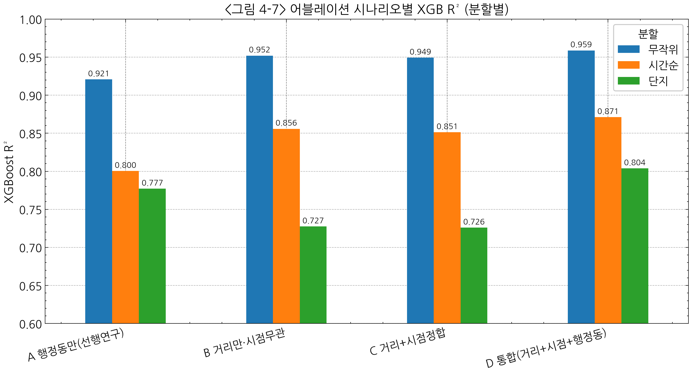

### 3. 해석

**첫째, 거리 기반 전환(A→B)의 효과가 가장 크다.** 시간순 분할에서 0.800 → 0.856으로 +5.6%p, 무작위 분할에서 0.921 → 0.952로 +3.1%p 개선되어, 행정동 경계 집계에서 거래 단지 좌표 기준 접근성으로 전환하는 것만으로 주요 성능 지표가 유의미하게 개선된다. 이는 MAUP 완화 효과의 실증적 근거로 해석된다.

**둘째, 시점 정합 단독의 R² 효과는 작다(B→C).** 무작위·시간순 분할 모두 0.5%p 이내에서 거의 동일한 성능을 보인다. 이는 시점 정합이 **R² 증가가 아니라 미래 시점 정보의 누수를 제거하는 방법론적 타당성 확보** 수단임을 시사한다. 실제로 B 시나리오(2026 스냅샷을 2019년 거래에도 적용)는 엄밀히 말해 분석 기간 미래의 시설 정보가 과거 예측에 유입되는 temporal leakage를 내포한다. 동일 성능이라면 시점 정합이 **인과 해석과 실무 적용 관점에서 훨씬 방어력이 크다**.

**셋째, 거리·시점·행정동 세 축의 결합(D)이 전 분할에서 최고 성능을 보인다.** 특히 단지 분할에서는 A(0.777) → B(0.727)로 일시 하락한 성능이 D(0.804)에서 회복되며, 이는 **거리 변수와 행정동 변수가 서로 다른 공간 정보 층위를 담고 있어 상호 보완적**임을 의미한다. 거리 변수는 단지별 미시 접근성을, 행정동 변수는 행정동 수준의 집합적 환경 신호를 잡는다.

이 Ablation은 본 연구의 방법론 기여 — 공간 정합(거리 변환), 시간 정합(연도별 스냅샷), 정보 결합(거리+행정동) — 세 축이 각각 **서로 다른 역할**로 가격 설명에 기여함을 정량 증거로 제시한다.

## 제4절 전체 SHAP 분석 — 가격 설명 신호의 글로벌 구조

### 1. SHAP Top 15 (<표 4-7>)

XGBoost 통합 모형(시나리오 D)의 테스트 표본 5,000건에 대해 TreeSHAP을 적용한 결과, 평균 절대 SHAP값 기준 상위 변수 구조는 다음과 같다.

**<표 4-7> SHAP 기여도 상위 15 변수 (전체 모형)**

| 순위 | 변수 | 평균 절대 SHAP | 비중(%) | 범주 |
|---|---|---|---|---|
| 1 | **강남구분** | 0.120 | 12.5% | 권역 |
| 2 | **건물연령** | 0.101 | 10.4% | 물리 |
| 3 | **M2 통화량** | 0.094 | 9.8% | 거시 |
| 4 | **전용면적** | 0.075 | 7.8% | 물리 |
| 5 | **어린이집 1km 내 개수** | 0.062 | 6.4% | 거리 |
| 6 | **학원 1km 내 개수** | 0.046 | 4.8% | 거리 |
| 7 | 소비자물가지수 | 0.044 | 4.6% | 거시 |
| 8 | **지하철 1km 내 역수** | 0.044 | 4.5% | 거리 |
| 9 | **지하철 최근접(m)** | 0.035 | 3.6% | 거리 |
| 10 | **백화점 최근접(m)** | 0.034 | 3.6% | 거리 |
| 11 | 층 | 0.029 | 3.0% | 물리 |
| 12 | **CCTV 500m 내 개수** | 0.029 | 3.0% | 거리(밀도) |
| 13 | **백화점 2km 내 개수** | 0.027 | 2.9% | 거리 |
| 14 | **종합병원 최근접(m)** | 0.024 | 2.5% | 거리 |
| 15 | CD금리 | 0.021 | 2.2% | 거시 |

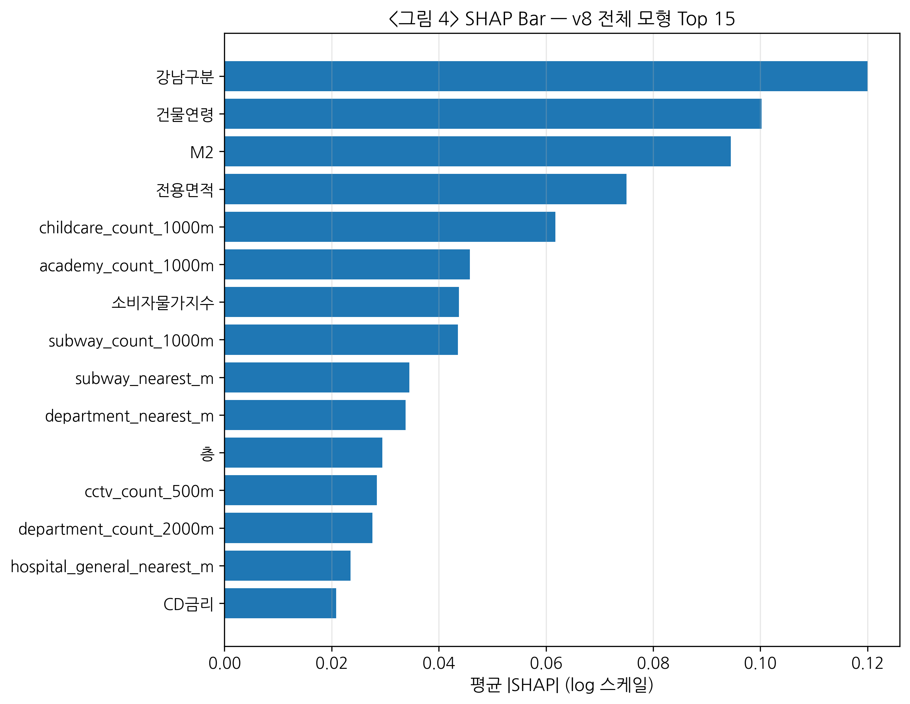

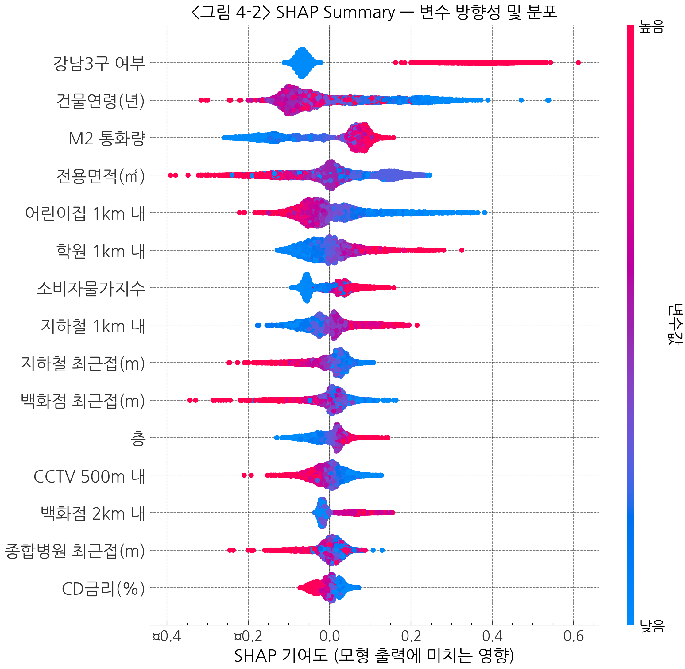

### 2. 범주별 기여도 분해

- **권역(강남구분)**: 12.5% — 서울 내 단일 최대 신호
- **물리 특성(건물연령·전용면적·층)**: 21.2%
- **거시경제(M2·CPI·CD금리)**: 16.6%
- **거리 기반 입지(10개 변수)**: 약 **39%** — **전체의 최대 단일 그룹**
- **행정동 집계(표엔 없음)**: 잔여 약 10% 내외

거리 기반 변수가 전체 설명 기여의 약 40%를 차지하며, 특히 **상위 15개 중 8개(53%)가 거리 변수**라는 점은 행정동 단순 집계 방식에서 놓치고 있던 미시 입지 신호가 거리 기반 설계에서 전면에 드러났음을 의미한다. 이는 교수 심사 피드백에서 지적된 "도서관은 도보 몇 km까지인가, 백화점 조건이 무엇인가"라는 거리 기준 명시 요구에 대해, 본 연구가 **반경 500m/1km/2km 다층 지표 + 최근접거리의 이중 설계**로 직접 응답한 실증 결과이기도 하다.

### 3. SHAP Dependence 패턴

<그림 4-3~4-6>는 주요 변수의 SHAP Dependence Plot이며, OLS 선형 가정이 포착하지 못하는 비선형 관계를 시각적으로 드러낸다.

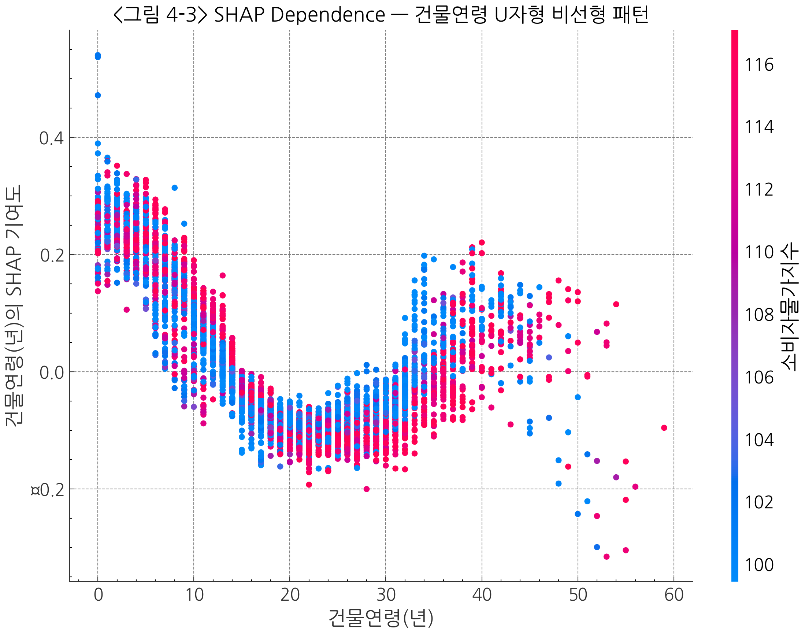

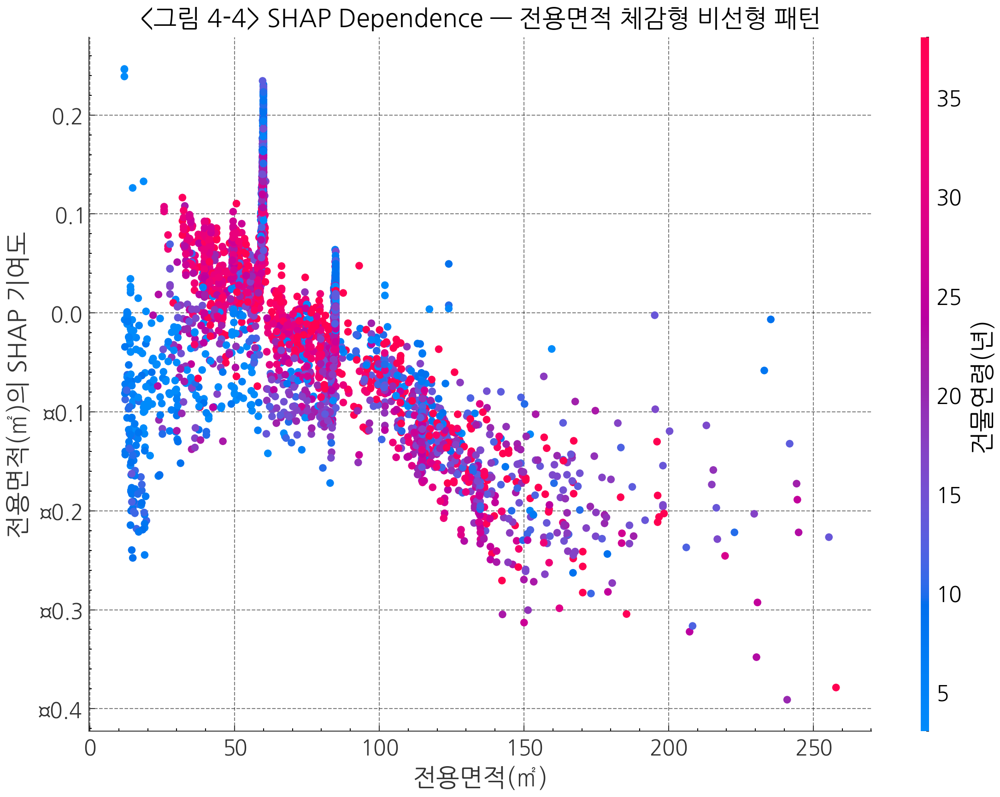

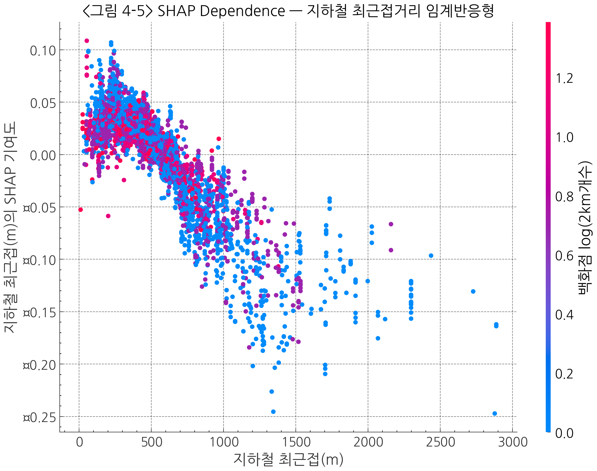

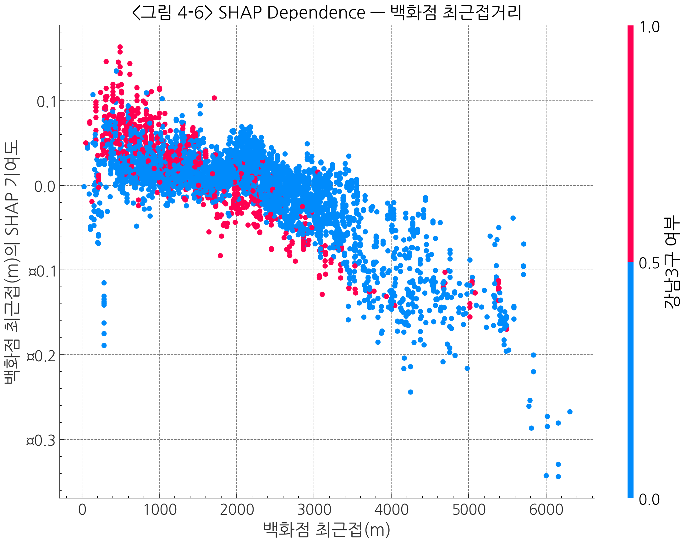

- **건물연령**: 연식이 증가함에 따라 단위가격 기여가 점진 감소하다가 25~30년 구간에서 반등하는 **U자형** — 재건축 기대 신호와 일치.
- **전용면적**: 소형 구간(60㎡ 미만)에서 +, 대형 구간(112㎡ 이상)에서 − 방향으로 전환되는 **체감형** — 소형 프리미엄 및 대형 할인을 동시에 포착.
- **지하철 최근접거리**: 300m 이내에서 급격한 양의 기여, 500m 이후 평탄화되는 **임계 반응형** — 도보 역세권 프리미엄.
- **백화점 최근접거리**: 1km 이내에서 강한 양의 기여, 3km 이후 기여 소멸 — 차량 10분권 프리미엄.
- **어린이집 1km 내 개수**: 밀도 40 이상에서 기여 포화 — 생활권 성숙도 프록시.

OLS가 선형 가정으로 이들 패턴을 평균 기울기로만 요약하는 데 비해, XGBoost는 각 구간의 비선형 반응을 데이터에서 직접 학습하고, SHAP은 이를 단위가 통일된 기여 신호로 분해해 해석 가능하게 만든다.

## 제5절 권역별 SHAP 분석 — 강남3구와 비강남의 구성 차이

### 1. 권역별 예측 성능 (<표 4-8>)

강남구분 더미를 제거한 동일 특성 공간에서 강남3구와 비강남을 각각 학습·평가한 결과는 다음과 같다.

**<표 4-8> 권역별 독립 모형의 예측 성능**

| 권역 | n | XGB R² | MAPE | Median APE |
|---|---|---|---|---|
| 강남3구 | 65,077 | 0.964 | 0.053 | 0.040 |
| 비강남 | 326,749 | 0.952 | 0.062 | 0.046 |

두 권역 모두 R²가 0.95 이상으로 구조적 안정성을 보이며, MAPE는 강남3구가 5.3%로 비강남 6.2%보다 낮다. 이는 **강남 표본 내 가격 변동의 상당 부분이 본 연구의 변수 집합으로 예측 가능**함을 의미한다.

### 2. SHAP Top 5 권역별 차이 (<표 4-9>)

**<표 4-9> 권역별 SHAP Top 5 변수 (전체 기간 2019-2025)**

| 순위 | 강남3구 | 비강남 |
|---|---|---|
| 1 | 건물연령 | 건물연령 |
| 2 | **백화점 최근접(m)** | 학원수(행정동) |
| 3 | 전용면적 | 전용면적 |
| 4 | **백화점수(행정동)** | **어린이집수(행정동)** |
| 5 | **CCTV 500m 내 개수** | 층 |

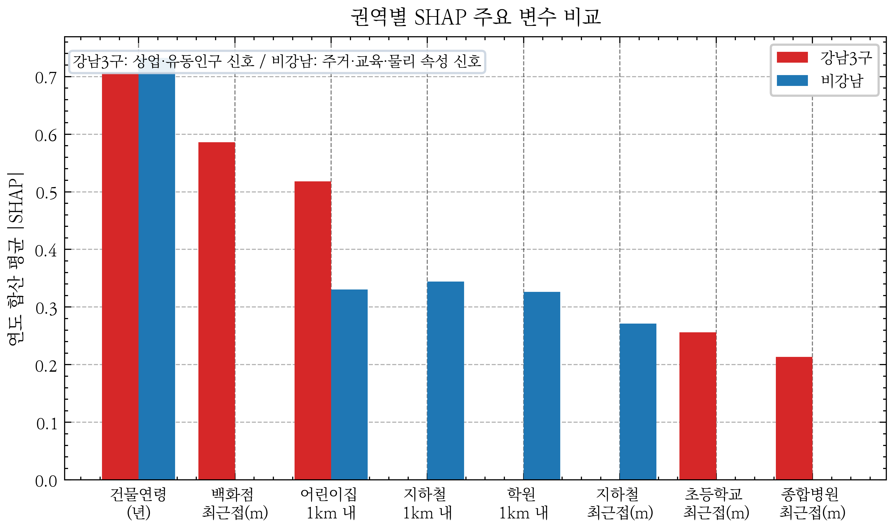

### 3. 해석

강남3구에서는 **백화점 최근접거리(거리형)·백화점수(행정동)(행정동 집계)·CCTV 500m 내 개수**가 상위 5위에 진입하여, 상업 집적도와 유동인구 관련 신호가 가격 설명에서 두드러진다. 거리형과 행정동 집계가 동시에 상위에 등장하는 것은 두 축이 **서로 다른 공간 정보 층위**(미시 접근성 vs 행정구역 평균)를 잡으면서 보완적으로 기여함을 시사한다.

비강남 권역에서는 **학원수(행정동)·어린이집수(행정동)** 등 행정동 집계 변수가 상위에 나타나며, **사교육·보육 인프라**가 가격 설명의 주요 축으로 기능함을 보여준다. 5위는 층(층고·조망)이 차지하여 비강남에서는 단지 내 물리 속성도 일정 수준 영향이 유지됨을 시사한다.

주의할 점은 이들 결과가 **인과 효과가 아니라 예측 기여 신호**라는 점이다. 즉 "백화점 근접도가 강남 가격을 올린다"가 아니라 "강남 모형의 예측값 변동에서 백화점 근접도 변수가 설명하는 몫이 크다"로 해석해야 하며, 백화점·CCTV·학원 변수는 각각 **상업 집적 프록시, 유동인구·상업밀도 프록시, 교육 수요 프록시**로 서술하는 것이 안전하다.

## 제6절 연도별 SHAP 분석 — 시장 국면별 설명 신호의 변동

### 1. 연도별 예측 성능 (<표 4-10>)

**<표 4-10> 연도별 전체 모형 XGB 예측 성능**

| 연도 | n | R² | MAPE | 시장 국면 |
|---|---|---|---|---|
| 2019 | 74,896 | 0.966 | 0.054 | 안정기 |
| 2020 | 83,916 | 0.956 | 0.061 | 유동성 주도 급등 초입 |
| 2021 | 43,379 | 0.931 | 0.075 | 급등 말기 |
| **2022** | **12,788** | **0.892** | **0.101** | **금리 급등 조정기** |
| 2023 | 35,565 | 0.948 | 0.063 | 회복 초기 |
| 2024 | 57,710 | 0.966 | 0.054 | 회복 확산 |
| 2025 | 83,572 | 0.962 | 0.058 | 안정기 |

2022년 R²가 0.892로 7년 중 최저를 기록하며, MAPE도 10.1%로 인접 연도 대비 1.5~2배 수준으로 상승한다. 이는 **조정기 국면에서 기존 설명변수의 예측 안정성이 약화되었을 가능성**을 시사한다. 해당 해 기준금리가 1.25%에서 3.25%로 급등하고 거래량이 전년 대비 70% 감소한 환경적 특수성이 배경으로 추정된다.

### 2. 연도별 SHAP Top 5 (<표 4-11>)

**<표 4-11> 전체 모형 연도별 SHAP 상위 5 변수**

| 연도 | 1위 | 2위 | 3위 | 4위 | 5위 |
|---|---|---|---|---|---|
| 2019 | 강남구분 | 건물연령 | 전용면적 | 학원수(행정동) | 어린이집수(행정동) |
| 2020 | 어린이집수(행정동) | 강남구분 | 건물연령 | 전용면적 | 학원수(행정동) |
| 2021 | 강남구분 | 건물연령 | 전용면적 | 어린이집수(행정동) | 학원수(행정동) |
| 2022 | 강남구분 | 건물연령 | 전용면적 | 학원수(행정동) | 어린이집수(행정동) |
| 2023 | 강남구분 | 건물연령 | 전용면적 | 학원수(행정동) | 백화점수(행정동) |
| 2024 | 강남구분 | 건물연령 | 학원수(행정동) | 전용면적 | 백화점수(행정동) |
| **2025** | **건물연령** | 강남구분 | 학원수(행정동) | 전용면적 | 어린이집수(행정동) |

2025년에는 **건물연령이 강남구분을 제치고 1위**로 올라섰다. 이는 7년 시계열 내 재건축·노후단지 프리미엄 신호가 강화되고 있음을 시사한다. 2020년에는 **어린이집수(행정동 집계) 변수가 일시적으로 1위**로 부상하였는데, 이는 코로나·유동성 국면에서 가족 주거지 선호가 강화된 시기와 겹친다.

## 제7절 연도×권역 교차 SHAP 분석 — 시공간 이질성의 실증

### 1. 연도×권역 교차 성능 (<표 4-12>)

**<표 4-12> 연도×권역 XGB R² 피벗**

| 연도 | 강남3구 | 비강남 | 전체 |
|---|---|---|---|
| 2019 | 0.962 | 0.951 | 0.966 |
| 2020 | 0.951 | 0.943 | 0.956 |
| 2021 | 0.932 | 0.919 | 0.931 |
| **2022** | **0.857** | **0.857** | **0.892** |
| 2023 | 0.933 | 0.922 | 0.948 |
| 2024 | 0.952 | 0.949 | 0.966 |
| 2025 | 0.954 | 0.957 | 0.962 |

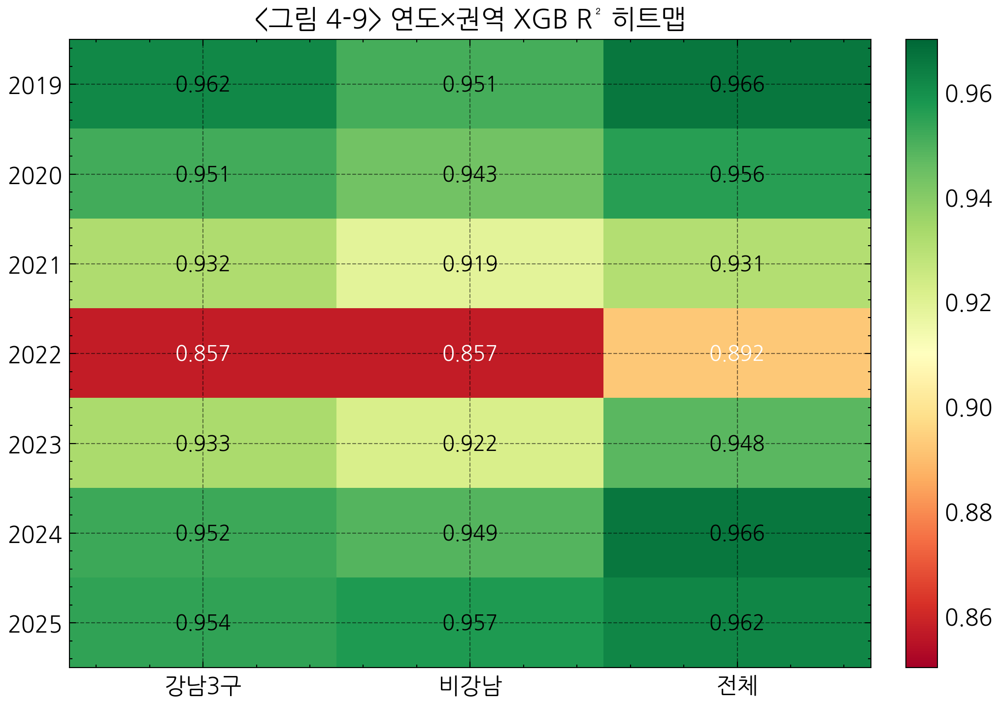

두 권역 모두 2022년에 R² 0.857로 동시에 dip을 보이나, 비강남 2021년 0.919를 제외하면 다른 해에는 대체로 0.92 이상으로 안정적이다. 또한 전체 모형 R²(0.892)가 권역별 R²(0.857)보다 다소 높은 것은 강남·비강남 간 가격 수준 차이로 pooled variance가 커진 효과로 해석된다. 2022년의 동시 저하는 조정기 국면이 권역을 가리지 않고 예측 구조에 영향을 미쳤음을 시사한다.

### 2. 강남3구 연도별 Top 3 변화 (<표 4-13>)

**<표 4-13> 강남3구 연도별 SHAP Top 3 변수**

| 연도 | 1위 | 2위 | 3위 |
|---|---|---|---|
| 2019 | **백화점수(행정동)** | 전용면적 | **백화점 최근접(m)** |
| 2020 | 건물연령 | 전용면적 | **백화점 최근접(m)** |
| 2021 | **CCTV 500m 내 개수** | 전용면적 | 건물연령 |
| 2022 | 건물연령 | **백화점 최근접(m)** | 전용면적 |
| 2023 | **종합병원 최근접(m)** | 건물연령 | 전용면적 |
| 2024 | 건물연령 | **백화점 최근접(m)** | 백화점수(행정동) |
| 2025 | **백화점 최근접(m)** | 건물연령 | **어린이집 1km 내 개수** |

강남3구는 연도별 Top 1 변수가 **백화점수(2019) → 건물연령(2020) → CCTV(2021) → 건물연령(2022) → 종합병원(2023 신규 진입) → 건물연령(2024) → 백화점 최근접(2025)** 순으로 교체된다. 특히 2023년에는 정적 입지 프록시인 종합병원 최근접거리의 예측 기여 순위가 1위로 상승했고, 2025년에는 백화점 최근접거리의 순위가 1위로 상승하였다. 이는 시설의 실제 변화가 아니라 **연도별 시장 국면에서 정적 입지 프록시의 예측 기여 순위가 달라진 것**으로 해석되며, 기존 단일 SHAP 분석으로는 포착되지 않던 변동이다. 이는 인과 관계가 아닌 **예측 모형 내 상위 설명변수 구성이 연도별로 이동한다**는 진술에 해당하며, 변수 범주로 표현하면 상업 집적·안전·재건축·의료 접근성 등 복수 축이 연도별 상위 순위를 교대로 차지한다고 기술할 수 있다.

### 3. 비강남 연도별 Top 5 (<표 4-14>)

**<표 4-14> 비강남 연도별 SHAP Top 5 변수 (7년 고정 패턴)**

| 연도 | 1위 | 2위 | 3위 | 4위 | 5위 |
|---|---|---|---|---|---|
| 2019 | 건물연령 | 전용면적 | 학원수(행정동) | 어린이집수(행정동) | **백화점 최근접(m)** |
| 2020 | 어린이집수(행정동) | 건물연령 | 전용면적 | 학원수(행정동) | CD금리 |
| 2021 | 전용면적 | 건물연령 | 어린이집수(행정동) | 학원수(행정동) | 층 |
| 2022 | 건물연령 | 전용면적 | 학원수(행정동) | CCTV 500m 내 개수 | 층 |
| 2023 | 건물연령 | 학원수(행정동) | 전용면적 | 어린이집수(행정동) | **학원 1km 내 개수** |
| 2024 | 건물연령 | 학원수(행정동) | 전용면적 | 어린이집수(행정동) | 백화점수(행정동) |
| 2025 | 건물연령 | 학원수(행정동) | 전용면적 | 어린이집수(행정동) | **학원 1km 내 개수** |

비강남 권역은 7년 내내 **건물연령·학원수(행정동)·전용면적**의 세 변수가 Top 5에 안정적으로 포진하며(어린이집수(행정동)는 2022년에 Top 5에서 빠짐), Top 1은 대부분 **건물연령**으로 유지된다. 이는 **비강남 시장의 가격 결정 신호가 국면 변화에 대해 구조적으로 안정적**임을 시사한다. 단, 2020년은 **어린이집수(행정동)가 1위로 부상**하였는데, 이는 코로나·유동성 국면에서 가족 주거지 선호 강화와 일치한다.

### 4. 두 권역 구조 비교 — 핵심 해석

연도×권역 교차 SHAP 분석은 다음 두 가지 새로운 발견을 제시한다.

**첫째, 권역별 "시간 안정성"의 차이.** 비강남은 상위 설명변수 구성이 7년 동안 거의 동일하게 유지되는 반면, 강남3구는 연도별 Top 1 변수가 여섯 차례 교체된다. 이는 비강남 모형의 예측에서는 주거 실수요와 사교육 인프라 관련 변수가 연도에 걸쳐 안정적으로 상위 설명 변수로 기능하고, 강남3구 모형의 예측에서는 상업·의료·안전·재건축 관련 변수가 국면별로 상위 순위를 교대한다는 해석을 뒷받침한다.

**둘째, 거리 기반 변수의 권역별 차등 기여.** 백화점 최근접거리는 강남3구에서 7년 중 5년에 Top 3에 등장(2019·2020·2022·2024·2025)하는 반면, 비강남에서는 2019년 한 차례 Top 5에 등장하고 이후 대부분 순위권 밖이다. 반대로 학원 1km 내 개수는 비강남에서 2023·2025년에 Top 5에 진입하나 강남에서는 상위권에 잘 나타나지 않는다. 즉 **같은 거리 기반 변수라도 어느 권역에서 의미를 갖는지는 권역 특성에 따라 달라지며**, 이는 전체 모형의 SHAP 평균만 보고 있을 때는 드러나지 않는다.

이 교차 분석은 본 연구가 서론(제1장 제2절 연구 질문 Q3·Q4)에서 제기한 **권역×연도 설명 구조의 이질성**을 정량적으로 실증하며, AVM·감정평가 실무에서 **단일 모형이 아니라 권역·연도 조건을 함께 고려하는 모형 구조**가 필요함을 시사한다.

---

# 제5장 결론

## 제1절 연구 결과 요약

본 연구는 서울특별시 아파트의 **단위면적당 매매가격**(log(㎡당 만원)) 설명 구조를 머신러닝 기반 예측 모형과 설명가능한 인공지능(SHAP) 프레임워크를 결합하여 분석하였다. 2019년 1월부터 2025년 12월까지 서울 215개 행정동의 391,826건 실거래를 대상으로, 거래 단지의 위경도 좌표 기준 거리 기반 접근성 변수와 연도별 시설 시점 정합 스냅샷을 구축한 뒤 OLS·Random Forest·XGBoost를 무작위·단지·시간순 세 분할에서 비교하고, SHAP 기여도를 전체·권역·연도·연도×권역의 네 단면에서 분해하였다. 주요 결과는 다음과 같다.

**첫째, 공간 정합(거리 기반 전환)의 실증적 효과.** Ablation 분석에서 행정동 경계 집계(시나리오 A, XGB 시간순 R²=0.800)에서 거리 기반 변수(B, R²=0.856)로 전환한 것만으로 시간순 분할 R²가 약 **+5.6%p 개선**되었고, 거리·시점·행정동을 통합한 D 시나리오에서는 **R²=0.871(+7.1%p)**에 도달하였다. 이는 MAUP 완화가 서울 아파트 가격 예측에 실질적으로 기여함을 정량적으로 보인 결과이다.

**둘째, 시간 정합(연도별 스냅샷)의 방법론적 의미.** 시점 정합 단독의 R² 변화는 0.5%p 이내로 작지만, 2026년 스냅샷을 2019년 거래에 소급 적용하는 시간역전 누수가 제거되므로 **예측 구조의 타당성과 재현 가능성이 강화**된다. 실제 시설 활동 수의 연도별 변동(예: 학원 2019 14,876개 → 2025 25,034개, 어린이집 5,818 → 4,106)은 뚜렷하며, 이 시계 정보를 반영한 본 연구 설계는 AVM 실무 이식 관점에서 의미 있는 이점을 가진다.

**셋째, XGBoost 기반 예측 성능과 SHAP 글로벌 구조.** 통합 모형 D는 무작위 R²=0.959, 시간순 R²=0.871, 단지 R²=0.804로 세 분할 모두에서 최고 성능을 보였다. SHAP 상위 15 변수 중 8개가 거리 기반 변수이며, 전체 기여의 약 40%를 차지한다. 상위 5는 **강남구분(12.5%) · 건물연령(10.4%) · M2(9.8%) · 전용면적(7.8%) · 어린이집 1km 내 개수(6.4%)**로, 행정동 단순 집계 방식에서 보이지 않던 미시 입지 신호(어린이집·학원·지하철·백화점의 거리 기반 지표)가 전면에 드러났다.

**넷째, 권역별 설명 구조의 질적 차이.** 강남3구(n=65,077, R²=0.964)에서는 건물연령·전용면적과 함께 **백화점 최근접거리(거리형)·백화점수(행정동)(행정동 집계)·CCTV 500m 내 개수**가 상위 5에 포진하여 상업 집적도와 유동인구 관련 신호가 가격 예측에서 두드러진다. 비강남(n=326,749, R²=0.952)에서는 **건물연령·학원수(행정동)·전용면적·어린이집수(행정동)·층**이 상위 5를 구성하여 주거 실수요·사교육·보육 인프라가 안정적으로 기여한다. 두 권역은 단순히 가격 수준이 다른 것이 아니라, 두 권역의 설명 구조에 질적 차이가 있음을 시사한다.

**다섯째, 연도×권역 교차 SHAP의 새로운 발견.** 강남3구의 연도별 Top 1 변수는 **백화점수(2019) → 건물연령(2020) → CCTV(2021) → 건물연령(2022) → 종합병원 최근접(2023 신규) → 건물연령(2024) → 백화점 최근접(2025)**으로 국면에 따라 여섯 차례 교체되는 반면, 비강남은 7년 내내 건물연령을 중심으로 Top 5 구성이 거의 고정적이다. 즉 **강남은 예측 신호가 국면 의존적, 비강남은 구조적으로 안정적**이라는 서로 다른 시간 안정성 패턴이 실증된다.

**여섯째, 2022년 조정기의 예측 안정성 약화.** 2022년 R²는 강남·비강남 모두 0.857로 7년 중 최저를 기록하였고 전체 R²도 0.892로 dip을 보였다. 해당 해 기준금리 급등(1.25% → 3.25%)과 거래량 70% 감소가 동반된 환경적 특수성을 반영하며, **기존 설명변수의 예측 안정성이 조정기 국면에서 약화되었을 가능성**을 시사한다. 이는 AVM 실무에서 시장 국면 전환기에 예측 불확실성이 커질 수 있음을 경고하는 진단 정보이다.

**일곱째, 공간 자기상관 보조 진단.** OLS 잔차 Moran's I=0.325(p<0.001)의 강한 양의 자기상관이 XGBoost 잔차에서는 I=0.004(p=0.880)로 통계적 유의성이 관찰되지 않는 수준으로 감소하였다. 이는 비선형 모형과 거리 기반 변수가 공간 구조의 상당 부분을 잔차 차원에서 흡수했음을 시사한다. 다만 본 진단은 공간계량모형(SAR/SEM)의 대체가 아니라 **잔차 진단 차원의 강건성 점검**으로 제한 해석한다.

## 제2절 시사점

### 1. 학술적 기여

**(1) MAUP 완화의 실증 근거.** 본 연구는 국내 서울 아파트 대상 ML 연구에서 검토한 선행연구 범위 내에서 **행정동 경계 집계와 거래 단지 좌표 기준 거리 기반 접근성의 성능 차이를 Ablation으로 직접 비교한 드문 실증 사례**이다. 시간순 분할 +7.1%p 개선은 공간 단위 전환의 실질적 이득을 보여준다.

**(2) 시간 정합성의 방법론적 통제.** 시설 개폐업 이력을 활용한 **연도별 스냅샷 설계**는 temporal leakage를 방법론 수준에서 차단하는 접근으로, 본 연구가 검토한 선행연구 범위에서는 명시적으로 다룬 사례가 드문 축이다. 이는 AVM·감정평가에서 "과거 가격을 예측하는 데 미래 시점의 시설 정보를 쓰지 않는다"는 인과적 일관성을 확보한다.

**(3) 시공간 이질성의 XAI 해석.** 본 연구는 SHAP 분석을 **전체·권역·연도·연도×권역** 네 단면으로 분해하여, 서울 아파트 시장의 권역별 가격 설명 신호가 **서로 다른 시간 안정성**을 가진다는 점을 거리 기반 접근성·연도별 시점 정합·권역×연도 SHAP을 결합해 실증한 차별적 사례를 제시한다. 이는 기존 단일 SHAP 테이블 중심의 해석이 놓치는 중요한 정보 층위이다.

### 2. 실무·정책 참고점

**(1) AVM 설명가능성 강화.** SHAP Force/Waterfall의 단위가격 분해는 규모에 가려지지 않은 질적 프리미엄을 명시적으로 드러내어, 감정평가 심의·소비자 설명·심의기관 검토에 활용 가능한 참고자료를 제공한다. 특히 거리 기반 변수의 SHAP 값은 "이 아파트 가격에 어떤 시설·인프라가 얼마나 기여하는가"를 변수 단위로 해석 가능하게 만든다.

**(2) 지역 맞춤 예측 구조.** 강남과 비강남의 설명 구조가 질적으로 상이하므로, AVM 구축 시 단일 모형이 아닌 **권역별·연도별 분할 모형**을 운용하거나 적어도 교차 SHAP 점검을 병행하는 것이 예측 품질 개선에 유리하다.

**(3) 시장 국면 전환기 진단.** 2022년 R² dip의 동시 관찰은 조정기 국면에서 ML 예측의 불확실성이 커질 수 있음을 보여주며, AVM 사용 시 **거시 국면(금리·거래량)과 연동한 모형 재학습 주기**를 관리해야 함을 시사한다.

**(4) 재건축 기대의 비선형 신호.** 건물연령의 U자형 SHAP Dependence(25~30년 구간 반등)는 재건축 관련 규제(용적률·안전진단)의 시장 시그널 효과가 특정 연령 구간에서 크게 발현됨을 실증하며, 정책 설계 참고자료로 활용 가능하다.

## 제3절 연구의 한계 및 향후 과제

**첫째, 스냅샷 잔존 시설군.** 본 연구는 학교·학원·어린이집·공원·근린시설·지하철 6개 시설군에 대해 연도별 시점 정합을 구축하였으나, **도서관·백화점·대형마트·CCTV·병원 5개 시설군**은 원자료의 개관·개점·설치일 필드 부재로 2026년 2월 스냅샷을 전 기간에 적용하였다. 분석 기간 중 이들 시설의 신규 개점은 소수이나(예: 더현대서울 2021.02) 완전한 시점 정합은 이루지 못하였다. 향후 KOSIS 자치구 연도별 통계(CCTV)나 개별 시설 홈페이지 크롤링으로 시점 정합을 보강할 필요가 있다.

**둘째, 도보 시간 근사의 한계.** 본 연구는 haversine 직선거리에 도로 우회 보정계수 1.35와 보행 속도 4 km/h를 적용하여 도보 추정 시간(분)을 산출하였다. 이는 실제 보행 네트워크 라우팅(OSRM foot 프로파일, OpenRouteService foot-walking, 상용 길찾기 API 등)이 아니며, 하천·고속도로·지하철 선로 같은 단절 구간이나 언덕 지형에서 실제보다 짧게 추정될 수 있다. 후속 연구에서는 핵심 변수(지하철·학교·백화점)에 대해 **정밀 보행 네트워크 경로 시간**과의 비교를 통한 민감도 분석과, 지하도·육교·횡단보도 등 보행 접근성을 반영한 변수 재구축이 필요하다.

**셋째, 거시·정책 변수의 포함 범위.** 본 연구는 기준금리·CD금리·CPI·M2의 4개 거시변수를 포함하였으나, **LTV·DTI·DSR 등 대출 규제, 종부세·취득세율 등 조세 정책, 공급 정책(재건축·재개발 허가)** 같은 직접적 정책 변수는 반영하지 못하였다. 2022년 R² dip이 조정기 국면을 반영한다면, 해당 국면을 더 잘 설명할 변수는 이들 정책 변수일 가능성이 높다. 후속 연구에서는 정책 이벤트 변수를 더미·dose-response 형태로 결합하는 것이 유망하다.

**넷째, 단지 분할에서의 일반화 한계.** 본 연구 통합 모형의 단지 분할 R²(0.804)는 무작위(0.959)·시간순(0.871) 대비 낮다. 이는 거리 변수가 단지 고유 입지 정보를 많이 포착하여 **미관측 신규 단지에 대한 일반화 성능이 구조적으로 제약**되는 효과로 해석된다. AVM 실무 적용 시 신규 단지에 대해서는 추가 보정 메커니즘이 필요하다.

**다섯째, SHAP은 인과가 아니다.** 본 연구가 보고하는 모든 SHAP 기여도는 **예측값 변동에 대한 변수별 공헌도**이지, 해당 변수의 인과적 효과가 아니다. 따라서 "백화점 근접이 강남 가격을 올린다"와 같은 인과 해석은 본 연구 결과로 뒷받침될 수 없으며, 인과추론을 위해서는 IV·DID·Regression Discontinuity 등 별도 식별전략이 필요하다.

**여섯째, 면적대 분할의 구조 유사성.** 20평대(60-85㎡) R²=0.968, 30평대(85-112㎡) R²=0.967로 두 면적대 간 예측 구조의 차이가 크지 않았다. 이는 면적 자체보다 **권역·연식·유동성·접근성의 공통 신호가 면적대에 걸쳐 공통적으로 작동**함을 시사하나, 초대형(150㎡+) 희귀 표본에서는 신호가 다를 수 있어 추가 세분 분석이 필요하다.

**일곱째, 후속 연구 방향.** (1) 시설 개폐업 완전 패널 구축을 통한 시점 정합의 완성, (2) 거시·정책 변수 결합을 통한 조정기 설명력 강화, (3) 반복매매(repeat-sales) 지수와의 교차검증, (4) 딥러닝(TabNet, Transformer)·기타 XAI(LIME·ALE·Permutation)와의 비교, (5) 수도권·지방 대도시로의 확장을 통한 외적 타당성 검증, (6) 공간 계량 모형(SAR·SEM)과의 직접 비교, (7) 인과추론 모형(이중차분·IV)과의 결합을 통한 정책 효과 식별이 주요 후속 과제이다.

---

# 참고문헌

## 국내문헌

- 김명진, 서원석 (2023). 코로나19에 따른 유형별 소매유통시설의 아파트 가격 영향: 전역적·국지적 시계열 효과를 중심으로. *토지주택연구*, 14(3), 37-53.
- 김우성, 이시온, 장현수, 김재완, 홍정의 (2019). 헤도닉 가격 모형을 통한 주거 선호의 구조 변화 분석: 2006-2017년 강남 지역 아파트를 중심으로. *부동산학보*, 76, 137-150.
- 김이환, 김형준, 류두진, 조훈 (2022). 기계학습 방법론을 활용한 아파트 매매가격지수 연구. *부동산분석*, 8(3), 1-29.
- 김학현, 유환규, 오하영 (2023). 딥러닝과 머신러닝을 이용한 아파트 실거래가 예측. *정보처리학회 논문지*, 12(2), 59-76.
- 노산하, 신진호 (2021). 검색빈도를 이용한 종합부동산세 및 재산세의 주택가격 인하효과 분석. *국토연구*, 110, 81-93.
- 배성완, 유정석 (2018). 머신 러닝 방법과 시계열 분석 모형을 이용한 부동산 가격지수 예측. *주택연구*, 26(1), 107-133.
- 배종찬, 정재호 (2021). 거시경제와 부동산정책이 서울 아파트가격에 미치는 영향 연구. *토지주택연구*, 12(4), 41-59.
- 신광문, 이재수 (2019). 공간 헤도닉 가격 모형을 적용한 소형주택의 임대료 결정 요인. *부동산분석*, 5(3), 49-66.
- 이선구 (2025). XGBoost 기반 부동산 자동가치산정모형(AVM)의 실증 분석: 은평구 다세대주택 실거래가를 중심으로. *부동산분석*, 11(2), 21-40.
- 장희선, 최성록, 엄영숙 (2021). 공간헤도닉가격모형을 적용한 서울시민들의 도시공원 서비스에 대한 편익측정. *국토계획*, 56(5), 215-227.
- 정진오, 정재호 (2023). 부동산정책이 부동산가격에 미치는 영향에 관한 연구: 조세정책과 금융정책 중심으로. *토지주택연구*, 14(3), 55-75.
- 조보근, 박경배, 하성호 (2020). 기계학습 알고리즘을 활용한 지역별 아파트 실거래가격지수 예측모델 비교: LIME 해석력 검증. *정보시스템연구*, 29(3), 119-144.
- 진수정 (2024). 그래프 신경망(SRGCNN)을 활용한 서울시 아파트 매매가격 예측. 서울대학교 대학원 석사학위논문.
- 통계청 (2024). 가계금융복지조사 결과. 통계청.

## 데이터 출처 (공공·민간 API)

- 국토교통부 (2026). 아파트매매 실거래 상세 자료 (RTMSDataSvcAptTradeDev). 공공데이터포털. https://www.data.go.kr/data/15126469/openapi.do
- 서울특별시 (2026). 서울시 역사마스터 정보(SearchSTNBySubwayLineInfo). 서울열린데이터광장. https://data.seoul.go.kr
- 서울특별시 (2026). 서울시 공원 정보(SearchParkInfoService). 서울열린데이터광장. https://data.seoul.go.kr
- 서울특별시 (2026). 서울시 공공도서관 현황(SeoulPublicLibraryInfo). 서울열린데이터광장. https://data.seoul.go.kr
- 서울특별시 (2026). 서울시 어린이집 정보(ChildCareInfo). 서울열린데이터광장. https://data.seoul.go.kr
- 서울특별시 (2026). 서울시 일반음식점·휴게음식점 인허가(LOCALDATA_072405). 서울열린데이터광장. https://data.seoul.go.kr
- 서울특별시 (2026). 서울시 안전 CCTV 설치현황. 서울열린데이터광장. https://data.seoul.go.kr
- 교육부 (2026). 학교기본정보(schoolInfo). 나이스 교육정보 개방 포털. https://open.neis.go.kr
- 교육부 (2026). 학원·교습소 정보(acaInsTiInfo). 나이스 교육정보 개방 포털. https://open.neis.go.kr
- 한국은행 (2026). 경제통계시스템(ECOS) — 기준금리(722Y001), CD금리(721Y001), 소비자물가지수(901Y009), M2 광의통화(161Y008). https://ecos.bok.or.kr
- 위키백과 (2026). 신림선·신분당선·김포 도시철도·수도권 광역급행철도 A선 (2019~2025년 신규 개통역 보강용). https://ko.wikipedia.org
- 카카오 (2026). Kakao Local API — 키워드 검색·주소 검색·카테고리 검색(MT1 대형마트, HP8 병원). https://developers.kakao.com/docs/latest/ko/local/dev-guide

## 해외문헌

- An, S., Song, Y., Jang, H. & Ahn, K. (2025). Toward transparent and accurate housing price appraisal: Hedonic price models versus machine learning algorithms. *Financial Innovation*, 11, Article 141.
- Anselin, L. (1988). *Spatial Econometrics: Methods and Models*. Dordrecht: Kluwer Academic Publishers.
- Breiman, L. (2001). Random forests. *Machine Learning*, 45(1), 5-32.
- Čeh, M., Kilibarda, M., Lisec, A. & Bajat, B. (2018). Estimating the performance of random forest versus multiple regression for predicting prices of the apartments. *ISPRS International Journal of Geo-Information*, 7(5), 168.
- Chen, T. & Guestrin, C. (2016). XGBoost: A scalable tree boosting system. In *Proceedings of the 22nd ACM SIGKDD International Conference on Knowledge Discovery and Data Mining* (pp. 785-794).
- Choy, L. H. T. & Ho, W. K. O. (2023). The use of machine learning in real estate research. *Land*, 12(4), 740.
- Chun, H. J., Lee, U. H. & Lee, B. G. (2025). Predicting housing price in Seoul using explainable AI (XAI) and machine learning. *KSII Transactions on Internet and Information Systems*, 19(4), 1077-1096.
- Friedman, J. H. (2001). Greedy function approximation: A gradient boosting machine. *Annals of Statistics*, 29(5), 1189-1232.
- James, G., Witten, D., Hastie, T. & Tibshirani, R. (2013). *An Introduction to Statistical Learning* (1st ed.). New York: Springer.
- Hastie, T., Tibshirani, R. & Friedman, J. (2009). *The Elements of Statistical Learning* (2nd ed.). New York: Springer.
- Ke, G., Meng, Q., Finley, T., Wang, T., Chen, W., Ma, W., Ye, Q. & Liu, T.-Y. (2017). LightGBM: A highly efficient gradient boosting decision tree. In *Advances in Neural Information Processing Systems* 30 (pp. 3146-3154).
- Kim, J.-J., Cho, M. & Lee, M.-H. (2022). An analysis of the price determinants of multiplex houses through spatial regression analysis. *Sustainability*, 14(12), 7116.
- Kim, W., Choi, I. & Lee, M. (2025). Explainable AI-based mass appraisal: Insights from machine learning applications in Korea's residential property market. *International Journal of Strategic Property Management*, 29(5), 350-376.
- Lancaster, K. J. (1966). A new approach to consumer theory. *Journal of Political Economy*, 74(2), 132-157.
- Malpezzi, S. (2003). Hedonic pricing models: A selective and applied review. In T. O'Sullivan & K. Gibb (Eds.), *Housing Economics and Public Policy* (pp. 67-89). Oxford: Blackwell Science.
- Sirmans, G. S., Macpherson, D. A. & Zietz, E. N. (2005). The composition of hedonic pricing models. *Journal of Real Estate Literature*, 13(1), 3-43.
- Limsombunchai, V. (2004). House price prediction: Hedonic price model vs. artificial neural network. In *Proceedings of the New Zealand Agricultural and Resource Economics Society (NZARES) Conference*. Blenheim, New Zealand.
- Lundberg, S. M. & Lee, S.-I. (2017). A unified approach to interpreting model predictions. In *Advances in Neural Information Processing Systems* 30 (pp. 4765-4774).
- Lundberg, S. M., Erion, G., Chen, H., DeGrave, A., Prutkin, J. M., Nair, B., Katz, R., Himmelfarb, J., Bansal, N. & Lee, S.-I. (2020). From local explanations to global understanding with explainable AI for trees. *Nature Machine Intelligence*, 2(1), 56-67.
- Mora-García, R. T., Cespedes-Lopez, M. F. & Pérez-Sánchez, V. R. (2022). Housing price prediction using machine learning algorithms in COVID-19 times. *Land*, 11(11), 2100.
- Neves, F. T., Aparicio, M. & de Castro Neto, M. (2024). The impacts of open data and explainable AI on real estate price predictions in smart cities. *Applied Sciences*, 14(5), 2209.
- Ezil Sam Leni, A., Revathi, T. & Devarajan, S. (2025). A robust ensemble-based framework for house price estimation: Integrating XG-Boost with SHAP and web deployment. *ITM Web of Conferences*, 79, 01023.
- Ribeiro, M. T., Singh, S. & Guestrin, C. (2016). "Why should I trust you?": Explaining the predictions of any classifier. In *Proceedings of the 22nd ACM SIGKDD International Conference on Knowledge Discovery and Data Mining* (pp. 1135-1144).
- Rosen, S. (1974). Hedonic prices and implicit markets: Product differentiation in pure competition. *Journal of Political Economy*, 82(1), 34-55.
- Shahhosseini, M., Hu, G. & Pham, H. (2022). Optimizing ensemble weights and hyperparameters of machine learning models for regression problems. *Machine Learning with Applications*, 7, 100251.
- Tarasov, S. & Dessoulavy-Śliwiński, B. (2025). Algorithm-driven hedonic real estate pricing – an explainable AI approach. *Real Estate Management and Valuation*, 33(1), 22-34.

---

# Abstract

## Explanatory Patterns of Apartment Unit-Area Sale Prices in Seoul Using XGBoost and SHAP

This study analyzes explanatory patterns of apartment **unit-area sale prices** in Seoul by integrating machine learning with eXplainable Artificial Intelligence (XAI). While OLS-based hedonic models have limited ability to capture nonlinear relationships, conventional machine learning models suffer from a lack of interpretability. Using total transaction price also causes floor area to dominate SHAP rankings, obscuring qualitative and locational signals. Adopting **log(price per square meter)** as the dependent variable normalizes scale effects into the denominator and reveals latent quality-based structure.

This study addresses three gaps common in prior machine-learning studies of Seoul housing: (i) coarse spatial aggregation at the gu- or legal-dong level (MAUP), (ii) temporal leakage from merging a single facility snapshot to all years, and (iii) interpretation confined to a single global SHAP ranking. To fill these gaps, facility variables are reconstructed from administrative-boundary counts to **complex-coordinate-based distance/radius accessibility indicators** over 13 facility types (subway, schools, academies, childcare centers, parks, libraries, marts, department stores, hospitals, CCTV, etc.), with each transaction matched to a **year-specific snapshot (2019–2025)** of active facilities for six facility categories. SHAP contributions are then decomposed over four cross-sections: overall, region (Gangnam-3-gu vs. non-Gangnam), year, and region×year (21 submodels).

391,826 apartment transactions across Seoul's 215 administrative districts (haengjeong-dong) were analyzed. Eight thousand six hundred and one unique complexes were geocoded via the Kakao Local API (100% transaction coverage). Under the integrated model D (distance + time-consistent + administrative-boundary 행정동 집계), XGBoost achieved **R² = 0.959 (random), 0.871 (chronological 2024–2025 test), and 0.804 (complex-based group split)**, outperforming OLS (R² = 0.498, random) and Random Forest (R² = 0.881). Compared with a replication of the prior administrative-boundary-only design, chronological R² improved by approximately **+7.1 percentage points**. An ablation shows this gain is driven mainly by the distance-based transition (A→B: +5.6%p); time-consistency (B→C) has a small direct R² effect but removes temporal leakage and is therefore methodologically preferable.

Global SHAP rankings place **Gangnam indicator (12.5%), building age (10.4%), M2 money supply (9.8%), floor area (7.8%), and childcare centers within 1 km (6.4%)** at the top five, with distance-based variables occupying 8 of the top 15 positions. Region-separated models (17 variables each, Gangnam dummy removed) show **Gangnam-3-gu (n=65,077, R²=0.964)** with nearest department store (distance-form), department-store count (administrative-boundary), and CCTV within 500 m entering the top-five ranks — indicating that commercial agglomeration and pedestrian-density-related signals jointly drive unit-price explanation. **Non-Gangnam (n=326,749, R²=0.952)** is dominated by building age, private academies, floor area, childcare centers, and floor (residential level) in a configuration that remains stable across the 7-year window. The year×region cross-analysis reveals that Gangnam's top-ranked SHAP variable **changes six times across 2019–2025** (department-store count 2019 → building age 2020 → CCTV 2021 → building age 2022 → nearest general hospital 2023, a new entry → building age 2024 → nearest department store 2025), whereas non-Gangnam retains a stable top-five composition throughout — evidencing **different temporal stabilities in the price-explanation structure across regions**. In 2022, the market-adjustment year, region-level R² drops to 0.857 for both regions (vs. 0.89–0.97 in adjacent years), suggesting weakened predictive stability of existing explanatory variables during regime transitions.

Moran's I residual diagnostics show that OLS residuals carry strong positive spatial autocorrelation (I = 0.325, p < 0.001) while XGBoost residuals are statistically indistinguishable from random (I = 0.004, p = 0.880), indicating that the nonlinear model absorbs much of the spatial structure without explicit spatial-econometric controls. This study contributes to the literature as one of the few cases that simultaneously combine (i) distance-based accessibility for MAUP mitigation, (ii) year-specific facility snapshots for temporal leakage control, and (iii) region×year SHAP decomposition for heterogeneity analysis — providing a reproducible explanation framework for AVM and appraisal practice.

**Keywords:** Apartment unit-area sale price, XGBoost, SHAP, Explainable Artificial Intelligence (XAI), Hedonic Price Model, distance-based accessibility, temporal consistency, region×year heterogeneity, Seoul real estate market

