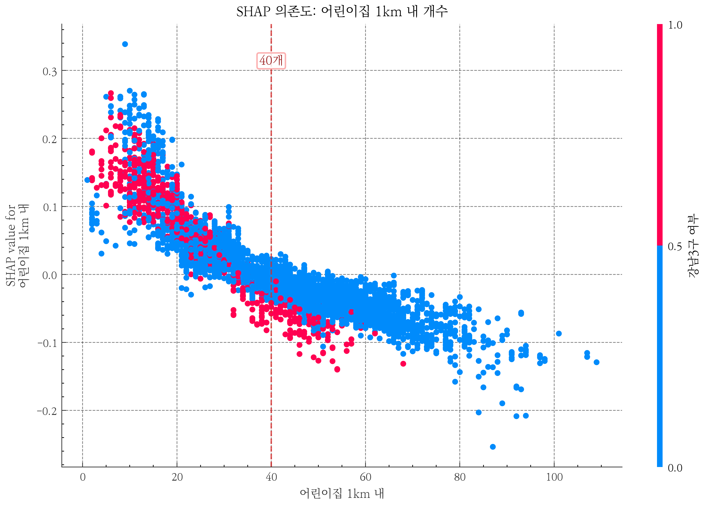

# 서울시 아파트 단위면적당 매매가격 구조 분석: 거리 기반 접근성과 시공간 이질성을 중심으로

An Analysis of Apartment Unit-Area Sale Price Structure in Seoul: Focusing on Distance-Based Accessibility and Spatiotemporal Heterogeneity

한양대학교 부동산융합대학원
도시·부동산빅데이터전공

---

# 목차

## 제1장 서론
- 제1절 연구의 배경 및 목적
- 제2절 연구의 범위
- 제3절 연구 방법 및 과정

## 제2장 이론적 배경 및 선행연구
- 제1절 헤도닉 가격모형
- 제2절 머신러닝 기반 부동산 가격 예측
- 제3절 설명가능한 인공지능 (XAI)
- 제4절 선행연구 검토 및 차별성

## 제3장 분석의 틀
- 제1절 연구 방법
- 제2절 변수의 정의 및 구축
- 제3절 연구 모형

## 제4장 실증 분석
- 제1절 기술통계 및 변수 분포
- 제2절 모형별 예측 성능 비교
- 제3절 소거분석(Ablation) — 공간 정합과 시간 정합의 정량 분해
- 제4절 전체 SHAP 분석 — 가격 예측 기여 구조
- 제5절 권역별 SHAP 분석 — 강남3구와 비강남의 구성 차이
- 제6절 연도별 SHAP 분석 — 시장 국면별 기여도 변동
- 제7절 연도×권역 교차 SHAP 분석 — 시공간 이질성의 실증

## 제5장 결론
- 제1절 연구 결과 요약
- 제2절 연구의 한계 및 향후 과제

- 참고문헌
- Abstract

---

# 표 목차

- <표 3-1> 종속변수 및 독립변수 정의 · 데이터 출처
- <표 4-1> 종속변수 및 주요 변수 기술통계
- <표 4-2> 주요 거리 기반 변수 분포 (단지 8,601 기준)
- <표 4-3> 주요 시설 도보 추정 시간 분포
- <표 4-4> 모형별 · 분할별 예측 성능 비교 (log (㎡당 가격))
- <표 4-5> 행정동 집계 기준선 대비 거리 기반 비교모형 변화
- <표 4-6> 소거분석 시나리오 구성
- <표 4-7> 소거분석 시나리오별 XGBoost R² (동일 테스트 조건)
- <표 4-8> SHAP 기여도 상위 15 변수 (전체 모형)
- <표 4-9> 권역별 독립 모형의 예측 성능
- <표 4-10> 권역별 SHAP 상위 5개 변수 (전체 기간 2019-2025)
- <표 4-11> 연도별 전체 모형 XGBoost 예측 성능
- <표 4-12> 전체 모형 연도별 SHAP 상위 5 변수
- <표 4-13> 연도×권역 XGBoost R² 피벗
- <표 4-14> 강남3구 연도별 SHAP 상위 3개 변수
- <표 4-15> 비강남 연도별 SHAP 상위 5개 변수 (7년 고정 패턴)

# 그림 목차

- <그림 1-1> 연구의 흐름도
- <그림 2-1> XGBoost 알고리즘 개념도
- <그림 2-2> SHAP 분석 프레임워크
- <그림 4-1> 소거분석 시나리오별 XGBoost R² 비교 (분할별)
- <그림 4-2> 전체 모형 SHAP 변수 중요도 상위 15
- <그림 4-3> SHAP 요약도 — 변수 방향성 및 분포
- <그림 4-4> SHAP 의존도 — 건물연령 U자형
- <그림 4-5> SHAP 의존도 — 어린이집 1km 내 개수
- <그림 4-6> SHAP 의존도 — 지하철 최근접거리 임계반응형
- <그림 4-7> SHAP 의존도 — 백화점 최근접거리
- <그림 4-8> 권역별 SHAP 상위 5개 변수 비교 (강남3구 vs 비강남)
- <그림 4-9> 연도×권역 XGBoost R² 히트맵 (7년 × 3권역)
- <그림 4-10> 연도별 최상위 변수 변화 (강남3구 vs 비강남)

---

# 국문초록

본 연구는 서울특별시 아파트 단위면적당 매매가격 구조를 거리 기반 접근성과 시공간 이질성의 관점에서 분석하였다. 기존 부동산 머신러닝 연구는 예측 정확도 향상에 초점을 두는 경우가 많았으나, 행정구역 단위 집계에 따른 공간 단위 왜곡, 분석 시점 이후의 시설 정보가 과거 거래에 결합될 수 있는 시간 정합성 문제, 단일 SHAP 결과만으로 권역·연도별 차이를 설명하기 어려운 한계가 남아 있다. 이에 본 연구는 2019년 1월부터 2025년 12월까지의 아파트 실거래 391,826건과 8,601개 단지 좌표를 대상으로, 기존 연구의 공간·시간·해석 단면의 한계를 보완하는 분석틀을 구성하였다. 좌표 기반 행정동 공간결합 결과 표본 단지는 서울시 426개 행정동 중 424개 행정동에 분포하였다. 종속변수는 규모효과를 정규화한 log(단위면적당 거래가격)으로 설정하고, OLS · Random Forest · XGBoost의 예측 성능을 비교하였다. 전용면적은 종속변수 산식에만 사용하고 설명변수에서는 제외하여, 단위면적당 가격과 면적 변수 사이의 기계적 결합을 피하였다. 연구 설계의 핵심은 시설 변수를 거래 단지 좌표 기준 거리 · 반경 접근성 지표로 전환하고, 시설 개업 · 폐업 이력을 반영한 연도별 시점 정합 스냅샷을 구축하며, SHAP 기여도를 전체 · 권역 · 연도 · 연도×권역 단위로 분해하는 데 있다.

최종 XGBoost 모형은 무작위 분할 R²=0.927, 시간순 분할 R²=0.812, 단지 분할 R²=0.638로 OLS와 Random Forest를 상회하였다. 다만 무작위 분할의 높은 성능은 동일·유사 단지 거래가 학습·평가 표본에 함께 포함되는 구조의 영향을 받을 수 있으므로, 본 연구는 시간순 분할과 단지 분할 결과를 함께 제시하여 일반화 난이도에 따른 성능 하락을 명시하였다. 소거분석(Ablation)에서는 행정동 집계 기준선 대비 거리 기반 변수 전환이 무작위·시간순 분할 성능을 개선하였으나, 단지 분할에서는 신규 단지 외삽 성능이 낮아지는 한계도 확인되었다. 시점 정합은 직접적인 R² 개선보다 시간역전 정보누수(temporal leakage)를 제거하여 분석의 방법론적 타당성을 높이는 데 기여하였다.

전체 SHAP 상위 변수는 강남구분, M2 통화량, 건물연령, 어린이집 1km 내 개수, 소비자물가지수였으며, 상위 15개 중 거리 기반 변수가 9개로 나타났다. 권역별로는 강남3구에서 건물연령, 백화점 최근접거리, 어린이집 1km 내 개수, 초등학교 최근접거리, 종합병원 최근접거리가 상위권을 구성한 반면, 비강남에서는 건물연령, 지하철 1km 내 역수, 어린이집 1km 내 개수, 학원 1km 내 개수, 지하철 최근접거리가 안정적으로 기여하였다. CCTV 500m 내 개수는 안전시설 자체의 인과효과가 아니라 유동인구, 상업밀도, 공공 안전 인프라 배치가 결합된 근린 환경 대리 지표로 해석하였다. 본 연구는 거리 기반 접근성, 연도별 시점 정합, 권역×연도 SHAP 분해를 결합하여 서울 아파트 단위면적당 매매가격 구조를 실증적으로 제시한다는 점에서 의의가 있다.

주요어 : 아파트 단위면적당 매매가격, XGBoost, SHAP, 설명가능한 인공지능 (XAI), 헤도닉 가격모형, 거리 기반 접근성, 시점 정합, 권역×연도 이질성, 서울 부동산 시장

---

# 제1장 서론

## 제1절 연구의 배경 및 목적

### 1. 연구의 배경

부동산은 한국 가계 자산에서 가장 큰 비중을 차지하는 핵심 자산이다. 통계청 (2024)에 따르면, 한국 가구 평균 자산에서 실물자산이 차지하는 비중은 75.2%이며, 이 중 부동산이 대부분을 구성한다. 특히 서울 아파트는 자산 축적과 주거 안정의 핵심 수단으로 기능하고 있다. 서울 아파트 매매가격의 변동은 개인의 자산 가치는 물론, 가계 부채, 소비, 건설 투자 등 거시경제 전반에 광범위한 파급효과를 미친다. 이에 따라 단위면적당 매매가격이 어떤 공간 접근성 조건과 시장 국면, 권역별 특성 속에서 설명되는지를 파악하는 것은 학술적으로나 정책적으로 중요한 과제이다.

부동산 가격 설명의 이론적 토대는 Lancaster (1966)와 Rosen (1974)이 정립한 헤도닉 가격모형 (Hedonic Price Model)이다. 이 모형은 이질적 재화인 부동산의 가격이 면적, 층수, 건축연도, 입지 등 다양한 속성들의 함수로 설명될 수 있음을 보여준다. 헤도닉 가격모형은 다중회귀분석 (Ordinary Least Squares, OLS)을 통해 각 속성의 암묵적 가격 (implicit price)을 추정하는 방식으로 널리 활용되어 왔다. 그러나 전통적인 OLS 기반 분석은 변수 간 관계를 선형으로 가정하기 때문에, 실제 부동산 시장에서 관찰되는 비선형적 가격 변동 패턴과 변수 간 복잡한 상호작용 구조를 충분히 포착하지 못한다는 한계가 지적되어 왔다 (Čeh et al., 2018; Limsombunchai, 2004).

이러한 한계를 극복하기 위해 최근에는 머신러닝 (Machine Learning, ML) 기반의 부동산 가격 예측 연구가 활발히 진행되고 있다. 랜덤 포레스트 (Random Forest), XGBoost, LightGBM 등의 앙상블 학습 모형과 LSTM (Long Short-Term Memory), GRU (Gated Recurrent Unit) 등의 딥러닝 모형이 전통적 회귀분석을 크게 상회하는 예측 성능을 보여주고 있다 (Choy & Ho, 2023; Mora-García et al., 2022). 그러나 이러한 머신러닝 모형들은 내부 작동 원리를 직접 해석하기 어려운 경우가 많아, 높은 예측 정확도에도 불구하고 "왜 특정 아파트의 예측값이 이렇게 산출되었는가?"라는 질문에 답하기 어렵다는 문제가 있다.

이에 대한 대안으로 최근 국제적으로 주목받고 있는 것이 설명가능한 인공지능 (eXplainable AI, XAI)이다. 특히 Lundberg와 Lee (2017)가 제안한 SHAP (SHapley Additive exPlanations)은 게임이론의 Shapley value 개념을 머신러닝 모형 해석에 적용하여, 각 특성(feature)이 개별 예측에 미치는 기여도를 이론적으로 일관성 있게 분해할 수 있는 프레임워크이다. 해외에서는 SHAP을 활용한 부동산 가격 예측 해석 연구가 빠르게 축적되고 있으나 (Neves et al., 2024; Mora-García et al., 2022; Choy & Ho, 2023), 국내에서는 거리 기반 접근성과 연도별 시점 정합, 권역별 예측 기여 구조를 결합해 서울 아파트 가격을 체계적으로 분석한 연구가 아직 부족하다. 따라서 본 연구에서 머신러닝과 SHAP은 연구 제목의 대상 자체라기보다, 단위면적당 매매가격의 예측 기여 구조를 추정하고 해석하기 위한 방법론적 도구로 사용된다.

본 연구가 이 주제를 다루는 이유는 자동감정평가(Automated Valuation Model, AVM)의 실무 확산과도 관련된다. 감정평가 · 은행 · 세무 실무에서 예측값을 활용하려면 예측 정확도뿐 아니라, 그 예측값이 어떤 변수 조합에 의해 산출되었는지를 설명할 수 있어야 한다. 특히 2022년처럼 금리 급등과 거래 급감이 함께 나타난 국면에서는 기존 가격 예측 모형의 안정성이 약화될 수 있으므로, 모형의 성능 변화와 변수 기여 구조를 함께 점검할 필요가 있다.

국내외 서울 부동산 머신러닝 연구는 이미 다수 축적되어 있으나 (김이환 외, 2022; 김학현 외, 2023; 조보근 외, 2020; Chun et al., 2025; Kim et al., 2025), 분석 단위와 시간 정합성, 해석 단면에서 보완 여지가 남아 있다. 기존 연구 상당수는 자치구 또는 법정동 단위 집계 변수를 사용하여 수정가능 공간단위 문제(Modifiable Areal Unit Problem, MAUP)의 영향을 받을 수 있고, 환경 변수를 수집 시점의 스냅샷으로 분석 기간 전체에 병합하는 경우에는 과거 거래에 미래 시설 정보가 결합되는 시간역전 정보누수(temporal leakage)가 발생할 수 있다. 또한 단일 SHAP 결과표만 제시하면 권역, 연도, 면적대에 따라 달라지는 예측 기여 구조를 충분히 확인하기 어렵다. 따라서 본 연구는 단순히 높은 예측 성능을 보이는 모형을 선택하는 데 그치지 않고, 기존 연구에서 상대적으로 약하게 다루어진 공간 단위 왜곡, 시점 불일치, 지역·시기별 해석 차이를 동시에 점검하는 것을 연구의 출발점으로 삼는다.

2019년부터 2025년까지의 분석 기간은 서울 아파트 시장이 유동성 주도 급등(2020 ~ 2021), 금리 충격 조정(2022), 완만한 회복(2023 ~ 2025)을 순차적으로 경험한 시기이다. 기준금리는 2020년 저점 0.5%에서 2023년 고점 3.5%를 거쳐 2025년 말 2.5%로 이동하였고, 거래량도 해마다 크게 변동하였다. 이처럼 시장 국면이 바뀌는 기간에는 가격 예측에 기여하는 변수의 순위와 방향이 고정되어 있다고 보기 어렵다.

이에 본 연구는 단위면적당 가격(log ㎡당 만원)을 종속변수로 설정하되, 전용면적은 설명변수에서 제외하여 종속변수 산식과 설명변수 사이의 기계적 결합을 피하였다. 시설 변수는 행정동 경계 내 개수 대신 거래 아파트 단지 좌표 기준 거리 · 반경 접근성 지표로 재구성하였고, 시설의 개업 · 폐업 · 신설 이력을 반영하여 연도별(2019 ~ 2025) 활동 시설 스냅샷을 구축하였다. 이때 시설 개업 · 폐업 정보는 가격에 대한 직접 인과효과가 아니라, 거래 시점에 실제 이용 가능한 시설만 설명변수로 사용하기 위한 시간 정합 장치로 해석한다. 이후 SHAP 기여도를 전체 · 권역(강남3구 / 비강남) · 연도 · 연도×권역 단위에서 산출하여 예측 기여도의 이질성과 국면별 변화 양상을 검토하였다.

### 2. 연구의 기여

본 연구의 기여는 공간 · 시간 정합 조건을 실증적으로 비교하고, 예측 성능을 보수적으로 제시하며, SHAP 기여도 구조를 권역과 연도 단위로 세분해 해석한 데 있다. 행정동 집계 기준선과 거리 기반 접근성, 시점 무관 설계와 시점 정합 설계를 각각 대조하는 소거분석(Ablation)을 통해 공간 · 시간 정합 조건이 서울 아파트 가격 예측에 미치는 차이를 정량 비교하였다. 또한 전용면적을 설명변수에서 제외한 뒤에도 XGBoost가 OLS와 Random Forest를 상회함을 확인하되, 단지 분할 성능 하락을 함께 제시하여 무작위 분할 성능이 과장되지 않도록 하였다. 마지막으로 SHAP 기여도 분석을 권역×연도로 교차 분해하여, 강남3구에서는 상업 · 안전 · 의료 · 재건축 관련 변수의 기여 순위가 국면별로 이동하고, 비강남에서는 건물연령 · 교통 · 생활권 접근성 변수의 기여가 상대적으로 안정적으로 유지되는 구조를 확인하였다.

## 제2절 연구의 범위

본 연구의 시간적 범위는 2019년 1월부터 2025년 12월 계약분까지 약 7년간이다. 다만 2025년 하반기 자료는 분석 시점 기준 잠정 관측치가 포함될 수 있으므로, 해당 구간의 해석에는 신고 지연 가능성을 함께 고려할 필요가 있다. 이 기간은 유동성 주도 급등 (2020 ~ 2021), 금리 충격 조정 (2022), 완만한 회복 (2023 ~ 2025) 국면을 연속으로 포함하여, 거시경제 변수가 예측값 기여 구조에서 어떤 역할을 보이는지 점검하기에 적합하다.

공간적 범위는 서울특별시 아파트 매매 실거래 데이터이다. 서울시 전체 행정동 단위는 426개로 확인되며, 본 연구의 단지 좌표 기반 공간결합 재검증 결과 최종 표본 391,826건은 8,601개 단지를 통해 424개 행정동에 분포하였다. 공간결합에서 제외된 행정동은 종로구 삼청동과 가회동 2개로, 분석 기간의 실거래 자료와 단지 좌표가 결합된 아파트 표본이 확인되지 않은 지역이다. 기존 연구들이 자치구(25개) 단위로 환경 변수를 집계한 것과 달리, 본 연구에서는 거래 단지 좌표 기준 거리 · 반경 접근성 변수를 구축하여 보다 미시적인 공간 단위에서 가격 구조를 검토한다.

## 제3절 연구 방법 및 과정

본 연구는 정량적 실증분석 방법을 채택하였다. 국토교통부 공공데이터포털(data.go.kr), 서울열린데이터광장(data.seoul.go.kr), 나이스 교육정보 개방 포털(open.neis.go.kr), 한국은행 경제통계시스템(ECOS, ecos.bok.or.kr) 등에서 원자료를 수집한 뒤, 법정동에서 행정동으로의 매핑, 결측값 처리, 이상값 제거, 변수 변환을 수행하였다. 이후 기술통계 분석을 통해 거래가격과 접근성 변수의 분포를 파악하였다.

예측 모형은 다중회귀분석(OLS), 랜덤 포레스트(Random Forest), XGBoost로 구성하고, R², RMSE, MAE 등의 지표를 통해 성능을 비교하였다. 최종 해석은 XGBoost 모형에 SHAP 분석을 적용하여 전체 수준 변수 중요도와 개별 예측 기여 구조를 산출하는 방식으로 진행하였다. 주 모형은 종속변수를 log(단위면적당 거래가격)으로 정규화하며, 전체 · 강남3구 · 비강남 각각에 대해 강남구분 더미를 제거한 별도 모형을 적합하여 지역 내부의 예측 구조를 비교하였다. 보조 분석으로는 연도별 · 권역별 SHAP 분석과 소거분석을 수행하였다.

분석에는 Python 프로그래밍 언어와 scikit-learn, xgboost, shap 등의 오픈소스 라이브러리를 활용하였다.

본 논문은 총 5개 장으로 구성된다.

제1장 서론에서는 연구의 배경과 목적, 연구 범위, 연구 방법 및 과정을 기술하였다.

제2장 이론적 배경 및 선행연구에서는 헤도닉 가격모형의 이론적 토대, 머신러닝 기반 부동산 가격 예측 연구의 동향, 공간 단위 문제 (MAUP)와 시간 정합성(temporal leakage) 논의, 설명가능한 인공지능 (XAI) · SHAP 방법론을 고찰하고, 선행연구를 검토하여 본 연구의 차별성을 제시한다.

제3장 분석의 틀에서는 분석 범위와 종속변수 정의, 단지 · 주택 특성 · 행정동 기반 변수 · 거리 기반 POI 변수 · 시점 정합 변수의 구성, 권역 구분 (강남3구 / 비강남), OLS · Random Forest · XGBoost 모형과 SHAP 해석, 무작위 · 단지 · 시간순 분할 검증 설계를 기술한다.

제4장 실증 분석은 일곱 절로 구성한다. 제1절 기초통계 및 변수 분포, 제2절 모형별 예측 성능 비교, 제3절 소거분석(Ablation) (공간 정합 · 시간 정합 분해), 제4절 전체 SHAP 분석, 제5절 권역별 SHAP 분석 (강남3구 vs 비강남), 제6절 연도별 SHAP 분석 (2022년 조정기 예측 안정성 논의 포함), 제7절 연도×권역 교차 SHAP 분석을 제시한다.

제5장 결론에서는 연구 결과를 요약하고, 인과 해석 제약, 거시 · 정책 변수 포함 범위, 도보 시간 근사, 미관측 시설 스냅샷 등 연구의 한계와 후속 연구 방향을 제시한다.

본 연구의 전체 구성과 분석 절차는 <그림 1-1>과 같다.

---

# 제2장 이론적 배경 및 선행연구

## 제1절 헤도닉 가격모형

### 1. 헤도닉 가격모형의 이론적 기초

헤도닉 가격모형 (Hedonic Price Model)은 Lancaster (1966)의 소비자 이론과 Rosen (1974)의 암묵적 시장 (implicit market) 이론에 근거한다. Lancaster (1966)는 소비자의 효용이 재화 자체가 아닌 재화가 보유한 속성 (characteristics)에서 파생된다고 주장하였다. 이를 부동산에 적용하면, 주택의 가격은 주택이라는 단일 재화가 아니라 면적, 층수, 입지, 학군, 교통 편의성 등 다양한 속성들의 묶음 (bundle)에 의해 결정된다.

Rosen (1974)은 이를 발전시켜 이질적 재화 (differentiated products)의 시장에서 각 속성의 암묵적 가격 (implicit price)을 추정하는 헤도닉 가격함수를 정립하였다. 이를 수식으로 표현하면 다음과 같다.

$$P = f(z_1, z_2, ..., z_n)$$

여기서 $P$는 부동산 가격, $z_i$는 $i$번째 속성, $n$은 모형에 포함된 속성의 수를 나타낸다. 각 속성의 암묵적 가격은 헤도닉 가격함수의 편미분으로 도출된다.

$$\frac{\partial P}{\partial z_i} = p_i (z)$$

전통적으로 헤도닉 가격모형은 다중회귀분석 (OLS)을 통해 추정되어 왔으며, 다음과 같은 선형 모형이 일반적으로 사용된다.

$$P = \beta_0 + \beta_1 z_1 + \beta_2 z_2 + ... + \beta_n z_n + \epsilon$$

여기서 $p_i(z)$는 속성 $z_i$의 조건부 한계가격, $\beta_0$는 상수항, $\beta_i$는 각 속성의 회귀계수, $\epsilon$은 오차항이다. 헤도닉 가격모형의 고전적 해석에서 $\beta_i$는 해당 속성의 한계가격(marginal implicit price)에 대응한다. 다만 실제 관측자료에 OLS를 적용할 때에는 함수형 가정, 누락변수, 다중공선성 등에 따라 이러한 계수를 조건부 연관성 수준에서 해석하는 것이 보다 보수적이다.

### 2. 헤도닉 가격모형의 한계

헤도닉 가격모형은 부동산 가격 관련 속성들을 체계적으로 정리하는 표준적 이론 프레임워크로 널리 활용되어 왔으나, OLS에 기반한 추정 방법은 다음과 같은 한계를 가진다.

첫째, 변수 간 관계를 선형으로 가정하므로, 비선형적 가격 변동 패턴을 포착하지 못한다. 예를 들어, 전용면적의 증가와 거래금액 간의 연관은 소형 면적에서와 대형 면적에서 상이할 수 있으나, 선형 모형에서는 이를 단일 기울기의 평균적 선형 관계로만 요약한다.

둘째, 변수 간 상호작용 효과 (interaction effects)를 명시적으로 지정하지 않는 한 포착하기 어렵다. 가령, 강남 지역과 비강남 지역에서 전용면적과 거래금액 간의 선형 관계가 다를 수 있으나, 기본 OLS 모형에서는 이를 반영하기 어렵다.

셋째, 다중공선성 (multicollinearity) 문제에 취약하다. 부동산 가격 관련 변수들 (금리, 물가, 통화량 등)은 상호 높은 상관관계를 가지는 경우가 많아, 개별 회귀계수의 추정에 불안정성을 초래할 수 있다.

이러한 한계를 극복하기 위하여 머신러닝 모형의 도입이 활발히 이루어지고 있다.

### 3. 거시경제 변수와 부동산 가격의 관계

헤도닉 가격모형이 주로 물리적 · 입지적 속성에 초점을 맞추는 반면, 부동산 가격 예측에서는 거시경제 환경을 함께 고려할 필요가 있다. 특히 통화량 (M2)과 금리는 부동산 시장과 관련된 유동성 · 금융 여건을 반영하는 대표적 거시변수이다. 중앙은행의 통화 공급 확대는 시중 유동성 증가와 자산시장 자금 유입 확대와 연관될 수 있으며, 한국처럼 가계자산에서 부동산 비중이 큰 경제에서는 이러한 거시 여건 변화가 주택시장 국면과 함께 움직이는 경우가 많다. 실제로 2020 ~ 2021년 COVID-19 대응 국면에서 통화 확대와 서울 아파트 가격 상승이 동시에 관찰되었다.

금리는 주택담보대출 비용과 금융여건을 반영하는 변수로 이해할 수 있다. 기준금리 인하 국면은 대출 이자 부담 완화와 함께 관찰되는 경우가 많고, 금리 인상 국면은 자금조달 여건의 제약과 동행하는 경향이 있다. 다만 기준금리와 시장금리 (CD금리) 간에는 높은 상관관계가 존재하여 다중회귀분석에서는 심각한 다중공선성 문제를 유발할 수 있다. 소비자물가지수 (CPI)는 실물자산의 인플레이션 헤지 (inflation hedge) 논의와 관련되며, 물가 상승기에는 투자자의 자산배분 판단과 함께 주택시장 국면을 읽는 보조 정보로 활용될 수 있다. 이처럼 거시경제 변수들은 개별 거래의 독립적 효과라기보다 금융 · 유동성 환경과 시장 국면을 함께 반영하는 설명 정보로 이해하는 편이 보다 적절하다. 특히 본 연구처럼 동일 월 거래들에 반복 부여된 자료 구조와 거시변수 상호 간 강한 공선성이 존재하는 경우, 개별 거시변수의 OLS 계수를 독립적인 효과처럼 해석하기보다 시장 국면을 구성하는 묶음형 정보 (bundle of regime signals)로 제한적으로 읽는 것이 보다 타당하다.

거시경제 변수와 부동산 정책이 아파트 가격에 미치는 영향도 활발히 연구되었다. 배종찬 · 정재호 (2021)는 VEC 모형으로 거시경제와 부동산정책이 서울 아파트가격에 미치는 영향을 분석하였고, 노산하 · 신진호 (2021)는 검색빈도를 활용하여 종합부동산세와 재산세의 주택가격 인하효과를 실증하였다. 정진오 · 정재호 (2023)는 조세정책과 금융정책이 부동산가격에 미치는 차별적 영향을 VAR 모형으로 분석하였으며, 김명진 · 서원석 (2023)은 코로나19에 따른 소매유통시설이 아파트 가격에 미치는 시계열 효과를 보고하였다.

## 제2절 머신러닝 기반 부동산 가격 예측

### 1. 머신러닝의 부동산 분야 적용

머신러닝은 데이터로부터 패턴을 학습하여 예측을 수행하는 알고리즘의 총칭으로, 변수 간 비선형 관계와 고차원 상호작용을 자동으로 포착할 수 있다는 점에서 전통적 통계 모형의 대안으로 주목받고 있다. 부동산 분야에서의 머신러닝 활용은 Limsombunchai (2004)의 초기 연구 이후 급속히 확대되었으며, 특히 2020년 이후 관련 연구가 급격히 증가하는 추세이다 (Choy & Ho, 2023).

Choy와 Ho (2023)의 체계적 문헌 리뷰에 따르면, 부동산 가격 예측에 활용되는 주요 머신러닝 알고리즘은 다음과 같이 분류할 수 있다.

첫째, 회귀 기반 모형으로 릿지 (Ridge), 라쏘 (Lasso), 엘라스틱넷 (Elastic Net) 등 정규화 회귀 모형이 있다. 이들은 OLS의 과적합 문제를 완화하지만, 기본적으로 선형 가정을 유지한다.

둘째, 트리 기반 앙상블 모형으로 랜덤 포레스트 (Random Forest; Breiman, 2001), 그래디언트 부스팅 (Gradient Boosting; Friedman, 2001), XGBoost (Chen & Guestrin, 2016), LightGBM (Ke et al., 2017) 등이 있다. 이들은 비선형 관계와 변수 간 상호작용을 효과적으로 포착할 수 있으며, 특히 부동산 가격 예측에서 우수한 성능을 보여왔다 (Čeh et al., 2018).

셋째, 딥러닝 모형으로 LSTM, GRU 등의 순환신경망 (RNN) 모형과 합성곱 신경망 (CNN), 그래프 신경망 (GNN) 등이 있다. Mora-García et al.(2022)은 COVID-19 시기 딥러닝과 앙상블 모형의 예측력을 비교하였으며, Kim et al.(2022)은 공간회귀분석을 통해 주택가격의 공간적 의존성을 분석하였다.

### 2. XGBoost 알고리즘

XGBoost (eXtreme Gradient Boosting)는 Chen과 Guestrin (2016)이 제안한 트리 기반 그래디언트 부스팅 알고리즘으로, 기존 그래디언트 부스팅 머신 (GBM; Friedman, 2001)을 개선한 것이다. XGBoost의 주요 특징은 다음과 같다.

첫째, 정규화 (Regularization): 목적함수에 L1 (Lasso) 및 L2 (Ridge) 정규화 항을 포함하여 과적합을 방지한다. XGBoost의 목적함수는 다음과 같다.

$$\mathcal{L} = \sum_{i = 1}^{n} l(y_i, \hat{y}_i) + \sum_{k = 1}^{K} \Omega (f_k)$$

여기서 $n$은 관측치 수, $y_i$는 관측치 $i$의 실제값, $\hat{y}_i$는 예측값, $l$은 손실함수, $K$는 앙상블에 포함된 트리 수, $f_k$는 $k$번째 회귀트리, $\Omega(f_k)$는 해당 트리의 정규화 항이다. XGBoost의 트리 정규화 항은 일반적으로 다음과 같이 표현된다.

$$\Omega(f_k) = \gamma T_k + \frac{1}{2}\lambda \sum_{t = 1}^{T_k} w_{kt}^{2} + \alpha \sum_{t = 1}^{T_k}|w_{kt}|$$

여기서 $T_k$는 $k$번째 트리의 리프 수, $w_{kt}$는 리프 $t$의 가중치이며, $\gamma$, $\lambda$, $\alpha$는 각각 트리 복잡도, L2, L1 정규화 강도를 조절한다.

둘째, 축소 (Shrinkage): 각 트리의 기여도에 학습률 (learning rate)을 적용하여 점진적으로 학습함으로써 과적합을 방지하고 일반화 성능을 향상시킨다.

셋째, 컬럼 서브샘플링 (Column Subsampling): 랜덤 포레스트에서 착안하여, 각 트리 또는 각 분할 (split)에서 무작위로 특성의 부분집합을 선택함으로써 모형의 다양성을 확보한다.

넷째, 결측값 자동 처리: 결측값이 있는 데이터에 대해 최적의 분할 방향을 자동으로 학습한다.

다섯째, 근사 분할 알고리즘 (Approximate Split Algorithm): 대용량 데이터에서도 효율적인 분할점 탐색이 가능하다.

이러한 특성들로 인해 XGBoost는 다양한 분야의 구조화된 자료(tabular data) 예측 문제에서 높은 성능을 보이고 있으며, 부동산 가격 예측에서도 높은 정확도를 달성하는 것으로 보고되고 있다 (Čeh et al., 2018; Mora-García et al., 2022). XGBoost의 전체적인 학습 구조와 알고리즘 흐름은 <그림 2-1>에 제시하였다.

### 3. 랜덤 포레스트

랜덤 포레스트 (Random Forest)는 Breiman (2001)이 제안한 앙상블 학습법으로, 다수의 의사결정 트리 (decision tree)를 독립적으로 학습시킨 후 예측값의 평균 (회귀)이나 다수결 (분류)로 최종 결과를 산출하는 배깅 (bagging) 기반 알고리즘이다. 각 트리는 전체 학습 데이터의 부트스트랩 (bootstrap) 표본을 사용하며, 각 분할 (split)에서 전체 특성 중 무작위로 선택된 부분집합만을 고려한다. 이를 통해 개별 트리 간의 상관관계를 줄이고 과적합을 방지한다.

Čeh et al.(2018)은 랜덤 포레스트가 다중회귀분석에 비해 비선형 관계를 효과적으로 포착하여 주택가격 예측에서 우수한 성능을 보임을 실증하였다. 본 연구에서는 랜덤 포레스트를 XGBoost의 비교 모형으로 활용한다.

## 제3절 설명가능한 인공지능(XAI)

### 1. XAI의 개념과 필요성

설명가능한 인공지능 (eXplainable Artificial Intelligence, XAI)은 인공지능 모형의 의사결정 과정과 결과를 인간이 이해할 수 있는 형태로 설명하는 기법의 총칭이다. 머신러닝 모형, 특히 앙상블 모형이나 딥러닝 모형은 높은 예측 정확도를 달성하지만, 내부 작동 원리가 불투명하여 해석 가능성 문제가 발생한다.

부동산 분야에서 XAI의 필요성은 다음과 같다.

첫째, 정책 논의의 참고성: 주택 정책 관련 논의에서 "어떤 요인이 예측값 설명에 얼마나 기여하는가"를 점검할 수 있는 보조 정보를 제공한다.

둘째, 시장 참여자의 해석 보조: 매수자, 매도자, 감정평가사 등 시장 참여자들이 예측값이 어떤 정보 조합을 바탕으로 산출되었는지 이해하는 데 참고할 수 있도록 한다.

셋째, 모형의 신뢰성 점검: 자동감정평가 (AVM) 모형의 결과에 대한 설명을 제공함으로써 감정평가의 투명성과 신뢰성을 점검하는 데 도움을 준다.

넷째, 편향 진단: 머신러닝 모형에 내재된 지역적 · 사회경제적 편향을 진단할 때 참고할 수 있는 정보를 제공한다.

### 2. 주요 XAI 방법론

XAI 방법론은 크게 모형 비의존적 (model-agnostic) 방법과 모형 특화적 (model-specific) 방법으로 분류된다.

모형 비의존적 방법으로는 LIME (Local Interpretable Model-agnostic Explanations; Ribeiro et al., 2016)과 SHAP (Lundberg & Lee, 2017)이 대표적이다. LIME은 개별 예측의 국소적 근방에서 해석 가능한 대리 모형 (surrogate model)을 적합하여 설명을 제공하며, SHAP은 게임이론의 Shapley value에 기반하여 이론적 일관성을 보장한다.

모형 특화적 방법으로는 트리 기반 모형의 내장된 특성 중요도 (feature importance), 부분 의존성 플롯 (Partial Dependence Plot, PDP; Friedman, 2001), 누적 국소 효과 (Accumulated Local Effects, ALE) 등이 있다. 부동산 분야에서도 SHAP, LIME 등 XAI 방법론의 활용이 확산되고 있다.

### 3. SHAP(SHapley Additive exPlanations)

SHAP은 Lundberg와 Lee (2017)가 제안한 XAI 프레임워크로, 협조적 게임이론 (cooperative game theory)의 Shapley value 개념을 머신러닝 모형 해석에 적용한 것이다. Shapley value는 게임에 참여하는 각 플레이어의 기여도를 공정하게 배분하는 유일한 해(unique solution)로, 다음의 네 가지 공리 (axiom)를 만족한다: 효율성 (Efficiency), 대칭성 (Symmetry), 더미 (Dummy), 가산성 (Additivity).

SHAP에서 각 특성 $j$의 Shapley value $\phi_j$는 다음과 같이 정의된다.

$$\phi_j = \sum_{S \subseteq N \setminus \{j\}} \frac{|S|!(|N|-|S|-1)!}{|N|!} [v(S \cup \{j\}) - v(S)]$$

여기서 $N$은 전체 특성의 집합, $S$는 $N$에서 특성 $j$를 제외한 부분집합, $v(S)$는 특성 부분집합 $S$가 주어졌을 때의 조건부 기대 예측값 또는 배경분포에 대한 value function이다. 즉, SHAP값은 특성 $j$가 모든 가능한 특성 조합에 추가될 때의 한계 기여도의 가중 평균이다.

개별 예측 $\hat{y}_i$는 다음과 같이 분해된다.

$$\hat{y}_i = \phi_0 + \sum_{j = 1}^{M} \phi_j^{(i)}$$

여기서 $\phi_0$는 기본값 (base value, 전체 데이터의 평균 예측값), $M$은 모형에 투입된 특성 수, $\phi_j^{(i)}$는 관측치 $i$에 대한 특성 $j$의 SHAP값이다. 이를 통해 각 예측이 기본값으로부터 어떤 특성에 의해 얼마만큼 증가 또는 감소하였는지를 정량적으로 분해할 수 있다.

특히 XGBoost 등 트리 기반 모형에 대해서는 TreeSHAP 알고리즘 (Lundberg et al., 2020)을 통해 정확한 SHAP값을 다항 시간 (polynomial time) 내에 효율적으로 계산할 수 있다. 본 연구에서 적용한 SHAP 분석의 전체 프레임워크는 <그림 2-2>에 제시하였다.

본 연구에서는 SHAP 시각화 도구를 분석 목적에 따라 구분하여 사용하였다. SHAP 막대그래프는 평균 절대 SHAP값(mean |SHAP value|) 기준으로 변수 중요도를 순위화하고, SHAP 요약도는 모든 특성의 SHAP값 분포와 변수값 방향성을 함께 표시한다. SHAP 의존도 그림은 특정 변수값과 SHAP값 사이의 관계를 산점도로 제시하여 비선형 효과를 확인하는 데 활용하며, SHAP 워터폴 그림은 개별 예측값이 기본값에서 각 특성의 기여를 거쳐 형성되는 과정을 설명하는 데 사용한다.

## 제4절 선행연구 검토 및 차별성

### 1. 아파트 가격 결정요인 연구

아파트 가격 결정요인 연구는 헤도닉 가격모형을 토대로 주택의 물리적 특성, 입지, 교통 접근성, 생활 인프라, 지역 환경이 가격에 어떻게 반영되는지를 분석해 왔다. 김우성 외(2019)는 2006 ~ 2017년 강남 아파트 실거래가를 분석하여 주거 선호의 구조 변화를 실증하였고, 신광문 · 이재수 (2019)는 공간 헤도닉 모형으로 소형주택 임대료 결정요인을 분석하였다. 장희선 외(2021)는 공간헤도닉모형을 적용하여 서울시 도시공원 서비스의 편익을 주택가격을 통해 측정하였다. 이러한 연구들은 부동산 가격이 단순한 면적이나 거래 시점만으로 결정되지 않고, 입지와 주변 환경의 복합적 속성을 함께 반영한다는 점을 보여준다.

### 2. 머신러닝 기반 부동산 가격 예측 연구

머신러닝 기반 부동산 가격 예측 연구는 2020년대 이후 국내외에서 빠르게 확대되었다. 조보근 외(2020)는 기계학습 알고리즘을 활용하여 지역별 아파트 실거래가격지수 예측모델을 비교하고 LIME을 통한 해석력 검증을 수행하였다. 배성완 · 유정석 (2018)은 SVM, 랜덤 포레스트, GBT, DNN, LSTM 등 다양한 머신러닝 모형으로 한국 부동산 가격지수를 예측하여 이 분야의 국내 연구를 선도하였다. 김이환 외(2022)는 기계학습 방법론으로 아파트 매매가격지수를 산출하여 헤도닉 모형 대비 우수한 설명력을 확인하였고, 김학현 외(2023)는 DNN, XGBoost, CatBoost 등을 비교하여 딥러닝과 머신러닝의 아파트 실거래가 예측 성능을 실증하였다. 이선구 (2025)는 XGBoost 기반 자동가치산정모형 (AVM)을 은평구 다세대주택에 적용하여 86.4%의 예측 정확도를 보고하였다.

공간 정보를 직접 반영하려는 시도도 나타난다. 진수정 (2024)은 서울시 아파트 매매가격 예측에 그래프 신경망 (SRGCNN)을 적용하여 공간적 의존성을 반영한 딥러닝 모형을 제안하였다. 해외 연구에서는 Mora-García et al.(2022)이 COVID-19 시기 스페인 알리칸테 지역의 주택가격 예측에 랜덤 포레스트와 XGBoost를 적용하여 전통적 회귀분석 대비 우수한 성능을 확인하였고, Čeh et al.(2018)은 슬로베니아 아파트를 대상으로 랜덤 포레스트와 다중회귀분석을 비교하여 머신러닝 모형의 비선형 포착 능력을 실증하였다. Shahhosseini et al.(2022)은 Ames 주택 자료 세트를 활용하여 앙상블 가중치와 하이퍼파라미터를 동시에 최적화하는 프레임워크를 제안하였다. 이들 연구는 머신러닝 모형이 비선형 관계와 변수 간 상호작용을 포착하는 데 강점을 가질 수 있음을 보여준다.

### 3. XAI 기반 부동산 가격 해석 연구

머신러닝 모형의 예측 성능이 높아질수록, 예측값을 어떤 변수 구조로 해석할 수 있는지에 대한 관심도 커지고 있다. Neves et al.(2024)은 오픈데이터와 XAI를 결합하여 리스본 스마트시티의 부동산 가격을 분석하였으며, XGBoost 모형에 SHAP을 적용하여 면적, 입지, 건축연도 등이 예측값 설명에서 어떤 역할을 보이는지 정리하였다. Ezil Sam Leni et al.(2025)은 킹카운티 주택 데이터를 대상으로 XGBoost와 SHAP을 결합한 가격 예측 프레임워크를 제안하고, 웹 배포까지 구현하여 XAI 기반 AVM의 실무적 활용 가능성을 보여주었다.

헤도닉 모형과 머신러닝을 비교하면서 해석 가능성을 함께 다룬 연구도 있다. An et al.(2025)은 한국 주택시장을 대상으로 전통적 헤도닉 가격모형과 머신러닝 모형의 예측 성능을 비교하고, SHAP을 활용하여 머신러닝 모형에 헤도닉 모형 수준의 해석 가능성을 부여할 수 있음을 실증하였다. Tarasov와 Dessoulavy-Śliwiński (2025)는 폴란드 부동산 시장에서 알고리즘 기반 헤도닉 가격 모형에 XAI를 적용하여, 머신러닝이 전통적 헤도닉 접근법을 효과적으로 대체할 수 있음을 보였다. Choy와 Ho (2023)는 부동산 분야 머신러닝 연구에 대한 체계적 문헌 리뷰를 수행하여, 2020년 이후 관련 연구가 급격히 증가하고 있으며 XAI의 적용이 새로운 연구 방향으로 부상하고 있음을 확인하였다.

국내 시장을 대상으로 한 국제 학술지 연구도 확인된다. Chun et al.(2025)은 서울시 아파트 매매 실거래 데이터를 활용하여 LightGBM, GBDT, XGBoost 등 다양한 머신러닝 모형과 SHAP 기반 XAI 분석을 수행한 연구로, 본 연구와 대상 시장 및 방법론 모두에서 가장 유사하다. 다만 이 연구는 변수 구성과 분석 기간에서 본 연구와 차이가 있으며, 강남 / 비강남 간 지역 비교분석을 수행하지 않았다는 점에서 본 연구가 보완적 기여를 한다. Kim, Choi와 Lee (2025)는 한국 주거용 부동산 시장에 XAI 기반 대량감정평가 모형을 적용하고, SHAP과 PFI를 결합하여 시간에 따른 변수 중요도의 변화를 추적하였다.

### 4. 선행연구와의 차별성

선행연구를 종합하면, 머신러닝 기반 부동산 가격 예측 연구는 국내외에서 활발히 진행되고 있으나, 다음과 같은 연구 공백이 존재한다.

첫째, 국내 연구는 대부분 예측 정확도 비교에 치중하고 있으며, SHAP 등 XAI 기법을 활용한 체계적 변수 해석 연구가 부족하다. 조보근 외(2020) 등의 연구가 머신러닝의 우수한 예측 성능을 확인하였으나, 예측값 기여 구조에 대한 심층적 해석은 제한적이다.

둘째, 해외 XAI 부동산 연구는 리스본 (Neves et al., 2024), 스페인 (Mora-García et al., 2022), 슬로베니아 (Čeh et al., 2018), 폴란드 (Tarasov & Dessoulavy-Śliwiński, 2025) 등 다양한 시장을 대상으로 축적되고 있으나, 서울 아파트 시장의 고유한 특성 (강남 입지 격차, 노후주택의 재건축 기대 등이 함께 반영된 시장 맥락)을 다룬 XAI 분석은 Chun et al.(2025)의 연구를 제외하면 매우 제한적이다.

셋째, 강남3구와 비강남 지역의 예측 기여 패턴 차이를 SHAP으로 비교한 사례는 국내외 선행연구에서 상대적으로 드물다. 본 연구는 통합 모형 재집계에 더해 별도 지역 모형으로 지역별 변수 구조를 재확인한 이중 실증 설계를 취한다.

넷째, 기존 연구들은 대부분 자치구 (구) 단위의 분석에 그치고 있어, 행정동 실측 변수와 구 단위 대리 지표를 함께 다루는 보다 세분화된 기여 구조 검토가 충분히 제시되지 못하고 있다.

이러한 연구 공백을 바탕으로, 본 연구의 의의는 다음과 같이 정리된다.

첫째, 방법론적 의의: 국내 아파트 가격 연구에서 OLS, 랜덤 포레스트, XGBoost의 3모형 비교와 SHAP 기반 해석을 함께 제시함으로써, 예측 성능 비교와 변수 해석을 하나의 분석 틀 안에서 연결하였다.

둘째, 분석 단위의 세분화: 기존 연구들이 자치구(25개) 또는 행정동 경계 집계에 머문 것과 달리, 본 연구에서는 법정동 기반 실거래 데이터를 단지 좌표로 정렬하고, 각 단지에서 시설까지의 최근접거리와 반경 내 개수를 산출하였다. 이를 통해 행정구역 경계 안에 들어오는 시설 수만을 세는 방식보다 거래 단지의 실제 위치에 가까운 접근성 정보를 반영하였다. 다만 행정동 공간결합은 분석 표본 확인과 기준선 비교를 위한 절차이며, 최종 주모형의 핵심 설명변수는 거리 기반 접근성 변수이다.

셋째, 데이터의 규모와 기간: 서울시 전체 426개 행정동 중 좌표 기반 최종 표본이 분포한 424개 행정동의 391,826건 실거래 데이터를 7년간(2019 ~ 2025)에 걸쳐 분석함으로써 대규모 데이터에 기반한 결과를 제시하였다. 이는 기존 국내 연구 대비 데이터 규모와 시간적 범위에서 확장된 것이다.

넷째, 지역 비교분석: 강남3구와 비강남 지역의 SHAP값을 비교함으로써, 통합 모형 내부에서 관찰된 지역별 예측 기여 패턴 차이를 탐색적으로 정리하였다. 이는 Chun et al.(2025)과 Kim, Choi와 Lee (2025)에서 수행되지 않은 비교를 추가로 제시한다는 점에서 의미가 있으나, 별도 지역 모형을 적합한 확인적 비교가 아니라 통합 모형 내부의 기여 패턴 차이를 정리한 수준으로 이해할 필요가 있다.

다섯째, 거시경제 변수의 통합 분석: 기존 헤도닉 모형 연구가 주로 물리적 · 입지적 특성에 초점을 맞추는 반면, 본 연구는 기준금리, CD금리, 소비자물가지수, M2 통화량 등 거시경제 변수를 포함하여 미시적 특성과 거시적 환경을 함께 고려하였다.

---

# 제3장 분석의 틀

## 제1절 연구 방법

본 연구의 분석틀은 네 가지 검토 과제를 중심으로 구성된다. 첫째, 거래 단지 좌표 기준 거리 기반 접근성 변수가 행정동 경계 집계 변수 대비 예측 성능과 해석 안정성을 개선하는지 검토한다. 둘째, 시설의 연도별 활동 이력을 반영한 시점 정합 변수가 시간역전 정보누수를 제거하면서 시간순 분할의 일반화 성능을 유지하는지 확인한다. 셋째, 강남3구와 비강남의 가격 예측에 기여하는 SHAP 기여도의 구성과 연도별 변화 양상을 비교한다. 넷째, 권역별 · 연도별 · 면적대별 예측 기여도 분해를 통해 AVM · 감정평가 실무에서 참고 가능한 재현 가능한 해석 구조가 도출되는지 검토한다.

본 연구의 종속변수는 아파트 매매 실거래가를 전용면적(㎡)으로 나눈 단위면적당 가격의 자연로그값(log ㎡당 만원)이다. 전용면적은 이 종속변수 산식에 이미 포함되므로 최종 설명변수에서는 제외하였다. 독립변수는 층, 건물연령, 권역 구분, 거리 기반 접근성(13개 시설군), 연도별 시점 정합, 거시경제 변수로 구성되며, 최종 XGBoost 모형 기준 총 34개이다(구성 세부는 <표 3-1> 참조). 기준 모형으로 다중회귀분석(OLS)을 설정하고, 비선형 모형으로 랜덤 포레스트와 XGBoost를 구축하여 예측 성능을 비교한 후, XGBoost를 SHAP 분석의 해석 대상 모형으로 설정하였다. 다만 단지 분할에서는 무작위 분할 대비 성능이 크게 하락하므로, XGBoost의 성능 우위는 학습에서 관찰된 단지와 유사한 공간 구조가 일부 공유되는 조건에서 더 강하게 나타나는 결과로 해석할 필요가 있다.

## 제2절 변수의 정의 및 구축

### 1. 데이터 수집

본 연구에서 사용한 데이터는 다음의 공공데이터 출처로부터 수집하였다.

종속변수인 아파트 매매 실거래가는 국토교통부가 운영하는 공공데이터포털(data.go.kr)의 아파트매매 실거래자료 API를 통해 수집하였다. 분석 기간은 2019년 1월부터 2025년 12월 계약분까지이며, 실거래·단지 좌표·행정동 경계 공간결합 절차를 통과한 총 391,826건 거래 데이터를 확보하였다. 서울시 전체 행정동 수는 426개이고, 단지 좌표 기준 최종 표본은 424개 행정동에 분포하였다. 부동산 실거래 신고는 계약일로부터 30일 이내에 이루어지므로, 2025년 하반기 거래 데이터는 잠정 관측치 성격을 가지며 신고 지연으로 인해 일부 누락되었을 가능성이 있다.

### 2. 법정동-행정동 매핑

국토교통부의 실거래가 데이터는 법정동 기준으로 제공되며, 본 연구는 거래 단지 좌표 기준 거리 접근성을 구축하기 위해 법정동·아파트명 조합을 위경도 좌표로 변환하였다. 또한 행정동 집계 기준선과 표본 범위를 확인하기 위해 법정동 기반 거래자료를 행정동 경계와 공간 결합하였다. 법정동과 행정동은 일대일로 대응하지 않으므로, 두 공간 단위를 최대한 일관되게 정렬하기 위하여 다음의 2단계 공간 결합 방법론을 적용하였다.

1단계: 단지 지오코딩 (Geocoding): 거래 레코드의 (구 · 법정동 · 아파트명) 조합으로 식별한 8,601개 유니크 단지를 Kakao Local API의 키워드 · 주소 검색을 통해 위경도 좌표로 변환하였다. 거래 건은 단지 식별자를 통해 해당 좌표에 연결된다.

2단계: 공간 결합(Spatial Join): 행정동 경계 GeoJSON 데이터를 활용하여, 각 거래 건의 위경도 좌표가 어떤 행정동 경계 내에 포함되는지를 점-다각형 포함 판정(point-in-polygon)으로 확인하였다. 이를 통해 법정동 기반 거래 데이터를 행정동 분석틀에 일관되게 정렬할 수 있었다.

이러한 좌표 기반 공간결합을 통해 최종 표본이 426개 행정동 중 424개 행정동에 분포함을 확인하였다. 따라서 본 연구의 공간적 포괄 범위는 법정동 명칭 매핑값이 아니라 거래 단지 좌표와 행정동 경계를 결합한 결과를 기준으로 기술한다.

### 3. 환경 특성 변수 구축

환경 특성 변수는 학교, 학원, 어린이집, 공원, 도서관, 대형마트, 백화점, 근린시설, 병원, CCTV, 지하철 등 공공 POI 원자료에서 구축하였다. 학교 관련 데이터는 나이스 교육정보 개방 포털(open.neis.go.kr), CCTV · 백화점 · 어린이집 · 공원 · 도서관 · 근린시설 관련 데이터는 서울열린데이터광장(data.seoul.go.kr), 병원과 대형마트 좌표는 Kakao Local API 등을 활용하였다. 최종 주모형에서는 이들 원자료를 단지 좌표 기준 최근접거리와 반경 내 개수로 변환하여 사용하였다. 행정동 경계 내 개수는 최종 SHAP 해석 대상이 아니라, 기존 행정구역 집계 방식과의 비교를 위한 소거분석 기준선으로만 사용하였다.

거시경제 변수(기준금리, CD금리, 소비자물가지수, M2 통화량)는 한국은행 경제통계시스템 (ECOS, ecos.bok.or.kr)에서 월별 데이터를 수집하였다.

### 4. 변수 설정

본 연구에서 사용한 종속변수와 독립변수의 정의 및 데이터 출처는 <표 3-1>과 같다. 종속변수는 실거래가 (만원)를 전용면적 (㎡)으로 나눈 단위면적당 거래가격의 자연로그값이다. 이는 규모효과를 분모로 제거하고 고가 구간 이분산성을 완화하기 위한 설정이다 (Malpezzi, 2003; Sirmans et al., 2005).

<표 3-1> 종속변수 및 독립변수 정의 · 데이터 출처

| 구분 | 변수명 | 변수 설명 | 단위 | 데이터 출처 |
|------|--------|-----------|------|------------|
| 종속변수 | log(㎡당 거래가격) | ln(실거래가[만원] ÷ 전용면적[㎡]) | log(만원/㎡) | 국토교통부 실거래가 파생 |
| 물리적 특성 | 층, 건물연령 | 거래 층수, 거래시점 기준 건축 후 경과연수 | 층, 년 | 국토교통부 |
| 권역 | 강남구분 | 강남3구(강남·서초·송파) 여부 | 더미(0/1) | 자체 생성 |
| 거리 기반 접근성 | 13개 시설군 접근성 | 최근접거리, 반경 500m/1km/2km 내 개수, 도보 추정 시간 | m, 개, 분 | 공공 POI 원자료, Kakao Local |
| 시점 정합 | 연도별 활동 시설 스냅샷 | 거래연도 기준 활동 중인 시설만 매칭 | 연도 | 개업·폐업·개통일 파생 |
| 희소 시설 보정 | 1km 반경 내 존재 여부, 2km 반경 내 개수 로그값 | 공원·도서관·백화점의 0값 편중 보정 | 더미, 로그 | 거리 변수 파생 |
| 행정동 집계 기준선 | 10개 시설 개수 | 최종 주모형이 아닌 소거분석 기준선 비교용 | 개 | 각 시설 원자료 |
| 거시경제 | 기준금리, CD금리, CPI, M2 | 월별 금융·물가·유동성 지표 | %, 지수, 백만원 | 한국은행 ECOS |

주 1 (공간 정합). 본 연구의 거리 기반 변수는 거래 단지 좌표(Kakao Local API로 8,601 유니크 단지 지오코딩)를 기준으로 산출된다. Haversine 거리는 위도 · 경도 두 점 사이의 대권거리(great-circle distance)를 구하는 공식으로 계산한 직선거리이며, 실제 도로망을 따라 이동하는 보행 네트워크 거리가 아니다. 소거분석(제4장 제3절)은 행정동 경계 집계 기준선과 거리 기반 설계의 차이를 비교한다.

주 2 (시간 정합). 연도별 시점 정합 시설은 학교, 학원, 어린이집, 공원, 근린시설, 지하철의 6개 군이다. 학교의 개교일, 학원의 설립일 · 운영상태 · 휴원 이력, 어린이집의 인가일 · 폐지일, 공원의 개원일, 근린시설의 인허가일 · 영업상태 · 폐업일을 활용하여 거래 연도 Y의 Y-12-31 기준 활동 중인 시설만 포함한 7개 연도별 스냅샷을 구성하였다. 지하철은 2026년 스냅샷에 신림선 11개 역, 신분당선 신사역 1개 역, GTX 연계역 3개 역 등 신규 개통역 총 15개를 결합하여 연도별 개통 상태를 복원하였다. 도서관, 백화점, 대형마트, CCTV, 병원 5개 군은 원자료에 개관 · 개점 · 설치일이 없어 2026년 2월 스냅샷을 전 기간에 적용하며, 이는 제5장 한계에서 별도 기술한다.

주 3 (희소 시설 보정). 공원 · 도서관 · 백화점처럼 1km 반경 내 관측값이 0에 집중되는 시설은 1km 반경 내 존재 여부 더미와 2km 반경 내 개수의 로그 변환 변수를 추가하여 0값 구간의 선형 효과 가정을 완화하였다.

독립변수는 다음 여섯 범주와 파생 보정 변수로 구성된다.

물리적 특성은 최종 설명변수에서 층수와 건물연령으로 구성된다. 전용면적은 log(실거래가/전용면적) 산식에 사용되므로 설명변수에서는 제외하고, 면적대별 보조 분석에서만 표본 구분 기준으로 사용한다. 층수는 조망 · 채광 · 소음 등과 관련된 주거 쾌적성을 반영하고, 건물연령은 거래시점 기준 건축 후 경과연수로 노후도와 재건축 기대를 동시에 반영한다.

권역 구분은 강남3구 (강남구 · 서초구 · 송파구) 여부를 더미로 설정한다. 본 연구는 통합 모형 외에 권역 별도 모형 (강남 17변수, 비강남 17변수)을 함께 적합하여 권역 내부 예측 구조를 직접 비교한다 (제4장 제5절 · 제7절).

거리 기반 접근성은 13개 시설군에 대해 단지 좌표 기준 최근접 직선거리(m), 반경 500m / 1km / 2km 내 개수, 그리고 도보 추정 시간(분)을 병행 산출한 변수 집합이다. 도보 추정 시간은 직선거리에 도로 우회 보정계수 1.35와 보행 속도 4 km/h를 적용한 근사값이다. 다만 1.35는 서울 전역의 보행 네트워크를 실측해 추정한 상수가 아니라, 직선거리 기반 접근성을 분 단위로 해석하기 위한 휴리스틱 환산값이므로 모형의 핵심 설명변수는 직선거리와 반경 개수 지표로 제한하고 도보 시간은 보조 해석에만 사용한다. 주요 시설군은 지하철, 초·중·고등학교, 어린이집, 공원, 도서관, 대형마트, 백화점, 근린시설, 병원, 종합병원, CCTV, 학원이다.

시점 정합은 시설 원자료의 개업 · 폐업 · 신설 이력을 활용하여 거래 연도별 활동 시설만 필터링한 7개 연도별 스냅샷 (2019 ~ 2025)으로 구축된다. 학교 (개교일), 학원 (설립 · 개원 상태 · 휴원 이력), 어린이집 (인가 · 폐지), 공원 (개원일), 근린시설 (인허가 · 폐업), 지하철 (2019 ~ 2025 신규 15개 역 보강) 6개 군이 연도별 시점 정합 대상이며, 도서관 · 백화점 · 대형마트 · CCTV · 병원은 원자료 제약으로 2026년 2월 스냅샷을 전 기간 적용한다. 이 설계는 시점 필드가 확보된 시설군에 대해 "2019년 거래 가격 설명에 2026년에야 개설된 시설 정보가 유입되는" 시간역전 정보누수를 제거하고, 잔존 스냅샷 시설군은 한계로 분리하여 해석한다.

행정동 집계 변수는 최종 주모형의 설명변수가 아니라 기존 행정구역 집계 방식과 거리 기반 설계를 비교하기 위한 소거분석 기준선으로만 사용한다. 초·중·고등학교 · CCTV · 백화점 · 지하철 · 공원 · 도서관 · 학원 · 어린이집 10개 변수에 대해 행정동 경계 내 개수를 계산하며, 학원 · 어린이집은 원자료 제약으로 구 집계값을 구 내 행정동 수로 균등 배분한 대리 지표 성격을 가진다. 따라서 해당 변수들은 최종 SHAP 해석 대상에서 제외하고, 제4장 제3절에서 기준선 비교용으로만 보고한다.

거시경제 특성은 주택시장 전반의 금융 · 유동성 국면을 반영하는 변수로, 기준금리 · CD금리 · 소비자물가지수 · M2 (광의통화)를 포함한다. 월별 스냅샷 구조로 동일 월 거래들에 반복 부여되는 한계가 있으므로, 개별 회귀계수보다 시장 국면 대리 신호 묶음으로 해석하는 것이 적절하다.

### 5. 데이터 분할

수집된 391,826건의 데이터에 대해 세 가지 분할을 적용하였다. 무작위 분할은 전체 표본의 80%를 학습, 20%를 테스트로 배정하였다. 시간순 분할은 2019 ~ 2023년 거래를 학습 표본, 2024 ~ 2025년 거래를 테스트 표본으로 사용하였다. 단지 분할은 동일 단지가 학습과 테스트에 동시에 포함되지 않도록 구 · 법정동 · 아파트명 조합을 그룹으로 설정한 GroupKFold 방식으로 수행하였다.

본 연구의 설계 목적은 단순히 단일 최우수 성능 모형을 선발하는 데 있지 않다. 동일 표본 · 동일 변수 체계 · 동일 평가 틀 아래에서 OLS, Random Forest, XGBoost의 예측 성능과 예측값 구조를 비교하고, 그 차이를 해석 가능한 형태로 제시하는 데 분석의 초점을 둔다. 본 연구는 무작위 · 단지 · 시간순 세 가지 분할을 모두 수행하여 일반화 환경 난이도에 따른 성능 변화를 정량화하였으며, 어느 한 실험 결과만으로 최종 우월 모형을 선언하지 않고 분할 간 상대 성능을 종합적으로 해석한다.

## 제3절 연구 모형

### 1. 다중회귀분석(OLS)

다중회귀분석 (Ordinary Least Squares, OLS)은 종속변수와 독립변수 간의 선형 관계를 추정하는 전통적 통계 방법으로, 본 연구에서 기준 모형으로 활용하였다. OLS는 잔차의 제곱합을 최소화하는 방식으로 회귀계수를 추정하며, 각 독립변수의 회귀계수 방향과 크기를 선형 모형 내 조건부 연관성 수준에서 해석할 수 있다는 장점이 있다.

본 연구의 종속변수는 log (단위면적당 거래가격) = ln (실거래가[만원] / 전용면적[㎡])이다. 이 함수형은 헤도닉 문헌에서 널리 사용되는 log-linear 준 탄력성 모형에 대응하며 (Malpezzi, 2003), 다음 세 가지 이점을 제공한다. 첫째, 종속변수를 전용면적으로 정규화함으로써 규모효과를 분모로 제거하고, 나머지 질적 · 입지적 변수들의 설명 기여를 상대적으로 부각한다. 둘째, 로그 변환은 단위면적당 가격의 이분산성 (특히 강남 고가 구간의 분산 확대)을 완화하여 OLS 표준오차 추정을 안정화한다. 셋째, 수준형 연속 변수 또는 더미 변수의 OLS 계수 β는 $(e^{\beta}-1)\times 100\%$의 준 탄력성 (semi-elasticity, "해당 변수 1단위 증가 또는 더미 전환 시 단위면적당 가격의 % 변화")으로 해석할 수 있다. 다만 거리 · 개수 · 로그 변환 변수는 각 변수의 측정 단위와 변환 방식에 맞추어 해석해야 하며, OLS의 통계적 유의성은 설명적 참고 지표로만 활용하였다. 월별 거시경제 변수는 동일 월 거래 다수에 반복 부여되는 월별 수준값 정보이므로, 거래년월 기준 월 클러스터-강건 표준오차 및 거시경제 변수를 제외한 월 고정효과 OLS 보조 재추정과 함께 제한적으로 해석하였다.

$$\ln (P / A) = \beta_0 + \beta_1 x_1 + \beta_2 x_2 + ... + \beta_n x_n + \epsilon$$

여기서 $P$는 거래가격(만원), $A$는 전용면적(㎡), $x_j$는 최종 설명변수, $n$은 설명변수의 수, $\beta_0$는 상수항, $\beta_j$는 $j$번째 설명변수의 회귀계수, $\epsilon$은 오차항이다. 전용면적은 $A$로 종속변수 산식에만 사용하며, 최종 설명변수 $x_j$에서는 제외한다.

OLS 분석에서는 비표준화 회귀계수의 통계적 유의성 (t-검정), 모형 전체의 설명력 (R², 수정R²), 모형의 적합도 (F-검정) 등을 확인하고, 다중공선성 (VIF), 잔차의 정규성 · 등분산성, Moran's I 공간 자기상관 등 회귀 가정의 충족 여부를 진단하였다.

### 2. 랜덤 포레스트(Random Forest)

랜덤 포레스트는 Breiman (2001)이 제안한 배깅 (bagging) 기반 앙상블 학습법으로, 다수의 의사결정 트리를 독립적으로 학습시켜 그 예측값의 평균으로 최종 예측을 수행한다. 각 트리는 전체 학습 데이터의 부트스트랩 (bootstrap) 표본을 사용하며, 각 분할 (split)에서 전체 특성 중 무작위로 선택된 부분집합만을 고려함으로써 개별 트리 간의 상관관계를 줄이고 과적합을 방지한다. 주요 하이퍼파라미터로는 트리의 수(n_estimators), 최대 깊이 (max_depth), 최소 리프 노드 표본 수(min_samples_leaf) 등이 있다.

랜덤 포레스트는 XGBoost와 비교할 때, 부스팅이 아닌 배깅에 기반하므로 각 트리가 독립적으로 학습된다는 구조적 차이가 있다. 부스팅 방식의 XGBoost가 이전 트리의 잔차를 순차적으로 학습하여 편향 (bias)을 줄이는 데 강점을 보이는 반면, 랜덤 포레스트는 병렬적으로 학습된 다수 트리의 평균을 통해 분산 (variance)을 줄이는 데 강점을 가진다 (Hastie et al., 2009). 이러한 구조적 차이로 인해, 두 모형의 성능 비교는 해당 자료 세트에서 편향과 분산 중 어느 쪽이 예측 오차의 주된 원인인지를 간접적으로 파악할 수 있게 해준다. 부동산 가격 예측 선행연구에서도 랜덤 포레스트는 OLS 대비 우수한 성능을 보이면서도 XGBoost에 비해 다소 낮은 예측력을 보이는 것이 일반적인 결과로 보고되고 있다 (Čeh et al., 2018).

본 연구에서는 전체 데이터의 규모 (391,826건)를 감안하여, 별도의 사전 탐색 실험에서 50,000건의 단순 무작위 표본을 추출한 뒤 3-Fold 교차검증 기반 비교를 통해 하이퍼파라미터 후보를 점검하였다. 전체 데이터에 대한 전면 그리드 탐색은 계산 비용이 과도하였기 때문에, 전체의 약 12.8%에 해당하는 표본으로 탐색 효율성을 확보하였다. 이 표본은 하이퍼파라미터의 사전 점검 단계에만 사용하였고, 최종 랜덤 포레스트 모형의 적합과 성능 평가는 전체 학습 데이터 및 별도 테스트 데이터에 기반하여 수행하였다. 랜덤 포레스트의 사전 탐색 범위는 max_depth ∈ {10, 15}, min_samples_leaf ∈ {5, 10}, n_estimators = 200의 조합으로 구성하였으며, 총 4개 조합을 비교하였다. 그 결과 max_depth = 15, min_samples_leaf = 5, n_estimators = 200 조합을 최종 설정값으로 채택하였다. 사전 탐색은 최종 설정값을 고르기 위한 준비 단계로 활용하였고, 본문에서 보고하는 핵심 성능은 최종 학습 · 평가 결과를 기준으로 제시하였다.

### 3. XGBoost

XGBoost (Chen & Guestrin, 2016)는 그래디언트 부스팅 프레임워크에 정규화, 축소, 컬럼 서브샘플링 등을 결합한 고성능 앙상블 학습 알고리즘이다. 주요 하이퍼파라미터로는 학습률 (learning_rate), 최대 깊이 (max_depth), 서브샘플링 비율 (subsample, colsample_bytree) 등이 있다.

XGBoost의 하이퍼파라미터는 구조화 데이터 예측 연구에서 일반적으로 사용되는 보수적 설정을 바탕으로 하였다. 최종 모형은 n_estimators = 600, max_depth = 8, learning_rate = 0.05, subsample = 0.8, colsample_bytree = 0.8, tree_method = hist를 사용하였다. 소거분석 및 연도×권역 하위모형은 반복 실험의 계산 비용을 고려하여 동일한 max_depth와 learning_rate를 유지하되 n_estimators = 400으로 설정하였다. 본문에 제시한 핵심 성능, SHAP 중요도, 강건성 수치는 재실행된 결과 파일을 기준으로 상호 대조하여 정리하였다.

### 4. SHAP(SHapley Additive exPlanations)

XGBoost 모형의 예측 결과를 해석하기 위하여 SHAP 분석을 수행하였다. 구체적으로 TreeSHAP 알고리즘 (Lundberg et al., 2020)을 사용하여 테스트 데이터 중 5,000건을 무작위 표본추출하여 SHAP값을 산출하고, 다음의 분석을 실시하였다.

전체 수준 해석: SHAP 막대그래프를 통해 평균 절대 SHAP값(mean |SHAP value|) 기준의 전체 변수 중요도를 도출하였다. 이는 각 변수가 전체 예측값 해석에서 평균적으로 어느 정도의 기여를 보이는지를 나타낸다.

변수별 기여 패턴: SHAP 요약도를 통해 각 변수값이 예측값 해석에서 보이는 방향과 크기를 동시에 시각화하였다. 또한 SHAP 의존도 그림을 통해 주요 변수와 SHAP값 간의 관계를 상세히 분석하여 비선형 기여 패턴을 확인하였다.

개별 예측 해석: SHAP 워터폴 그림을 통해 특정 거래 건의 예측값이 기본값(base value)으로부터 각 변수의 기여에 의해 어떻게 형성되었는지를 시각화하였다.

### 5. 모형 평가 지표

모형의 예측 성능을 비교하기 위하여 다음의 지표를 사용하였다.

결정계수 (R²): 모형이 종속변수의 총 변동 중 설명하는 비율을 나타낸다.

$$R^2 = 1 - \frac{\sum_{i = 1}^{n}(y_i - \hat{y}_i)^2}{\sum_{i = 1}^{n}(y_i - \bar{y})^2}$$

평균 제곱근 오차 (RMSE): 예측 오차의 크기를 log 스케일에서 나타낸다. 역변환을 통해 기하 평균 오차율로 환산 가능하다.

$$RMSE_{log} = \left(\frac{1}{n}\sum_{i = 1}^{n}(y_i - \hat{y}_i)^2\right)^{1/2}$$

여기서 $y_i = \ln(P_i / A_i)$이고 $\hat{y}_i$는 모형이 예측한 log 단위면적당 가격이다.

평균 절대 오차 (MAE): log 스케일 예측 오차의 절대값 평균이다.

$$MAE_{log} = \frac{1}{n}\sum_{i = 1}^{n}|y_i - \hat{y}_i|$$

평균 절대 백분율 오차 (MAPE)와 중앙값 (Median APE): log 스케일 예측을 원 스케일 (만원/㎡)로 역변환한 후 산출한 상대 오차로, 가격 수준이 상이한 표본 간 오차를 비교할 때 유용하다. 단위가격의 분포가 우측으로 길게 늘어진 점을 고려하여 평균 MAPE와 함께 중앙값 APE를 병기하였다.

$$MAPE = \frac{1}{n}\sum_{i = 1}^{n}\left|\frac{u_i - \hat{u}_i}{u_i}\right| \times 100$$

여기서 $u_i = P_i / A_i$이고 $\hat{u}_i = e^{\hat{y}_i}$이다.

---

# 제4장 실증 분석

본 장은 일곱 개 절로 구성된다. 제1절에서는 종속변수 · 설명변수의 기술통계와 분포를, 제2절에서는 OLS · Random Forest · XGBoost의 세 분할 (무작위 · 시간순 · 단지) 기준 예측 성능을, 제3절에서는 행정동 집계 변수와 거리 기반 변수 · 시점 정합을 순차 결합하는 소거분석을 제시한다. 제4 ~ 7절에서는 SHAP 기반 예측 기여 구조를 전체 · 권역별 · 연도별 · 연도×권역의 네 단면으로 분해하여 해석한다.

## 제1절 기술통계 및 변수 분포

### 1. 분석 표본

분석 대상은 국토교통부 실거래가 자료 기준 서울특별시 아파트 매매 391,826건(2019.01 ~ 2025.12)이며, 최종 유니크 단지는 8,601개이다. 서울시 전체 426개 행정동 중 단지 좌표 기반 공간결합 절차를 통과한 표본은 424개 행정동에 분포하였다. 연도별 표본은 2019년 74,896건, 2020년 83,916건, 2021년 43,379건, 2022년 12,788건(조정기 거래 급감), 2023년 35,565건, 2024년 57,710건, 2025년 83,572건으로 분포한다. 권역별로는 강남3구(강남 · 서초 · 송파) 65,077건(16.6%)과 비강남 22구 326,749건(83.4%)이며, 면적대별로는 60㎡ 미만 소형 166,046건, 60 ~ 85㎡ 161,416건, 85 ~ 112㎡ 17,135건, 112㎡ 이상 대형 47,229건이다.

### 2. 종속변수 기술통계 (<표 4-1>)

<표 4-1> 종속변수 및 주요 변수 기술통계

| 변수 | 평균 | 표준편차 | 최솟값 | Q1 | 중앙값 | Q3 | 최댓값 |
|---|---|---|---|---|---|---|---|
| 거래금액(만원) | 102,872 | 79,178 | 5,400 | 55,400 | 83,000 | 127,000 | 2,900,000 |
| ㎡당 가격(만원/㎡) | 1,337.7 | 737.9 | 163.2 | 844.4 | 1,142.7 | 1,614.9 | 10,586.7 |
| log(㎡당 가격) | 7.075 | 0.488 | 5.095 | 6.739 | 7.041 | 7.387 | 9.267 |
| 전용면적(㎡) | 75.76 | 30.19 | 10.16 | 59.65 | 79.47 | 84.96 | 273.97 |
| 층 | 9.47 | 6.35 | 1 | 5 | 8 | 13 | 68 |
| 건물연령 | 19.85 | 10.76 | 0 | 12 | 20 | 27 | 64 |

단위면적당 가격은 평균 1,337.7만원/㎡, 중앙값 1,142.7만원/㎡이며, 로그 변환 후 표준편차 0.49로 축소되어 OLS 추정의 이분산 부담을 완화한다. 강남3구 단위면적당 가격 (평균 2,207.5만원/㎡, 중앙값 2,040)은 비강남 (평균 1,164.5, 중앙값 1,053.7)의 약 1.9배 수준이며, 이는 총가격 기준 배율 (2.2배)보다 작은 값으로 강남에 대형 평형이 상대적으로 많이 분포한다는 점이 총가격 격차의 일부를 설명함을 시사한다.

이 분포는 본 연구가 총거래가격이 아니라 단위면적당 가격을 종속변수로 설정한 이유와 연결된다. 총거래가격은 입지 가치와 주택 규모 효과가 함께 반영되므로, 강남과 비강남의 가격 차이를 해석할 때 면적 구성의 차이가 결과에 혼입될 수 있다. 반면 단위면적당 가격은 규모 효과를 우선 통제하므로, 층·건물연령·거시경제·거리 기반 접근성의 설명 구조를 비교하는 데 적합하다. 다만 전용면적은 종속변수 산식에 이미 포함되므로 설명변수에서는 제외하고, 면적대별 결과는 보조 해석으로만 활용한다.

### 3. 거리 기반 변수 기술통계 (<표 4-2>)

<표 4-2> 주요 거리 기반 변수 분포 (단지 8,601 기준 중앙값 · 백분위)

| 변수 | 중앙값 | 75분위 | 90분위 | 최댓값 |
|---|---|---|---|---|
| 지하철 최근접(m) | 464 | 677 | 938 | 3,148 |
| 지하철 1km 내 역수 | 2 | 4 | 6 | 13 |
| 초등학교 최근접(m) | 361 | 478 | 604 | 1,757 |
| 초등학교 1km 내 개수 | 4 | 5 | 6 | 11 |
| 중학교 최근접(m) | 468 | 658 | 875 | 2,067 |
| 공원 최근접(m) | 1,002 | 1,343 | 1,756 | 3,219 |
| 도서관 최근접(m) | 594 | 861 | 1,138 | 2,625 |
| 학원 최근접(m) | 95 | 143 | 215 | 1,940 |
| 대형마트 최근접(m) | 388 | 586 | 844 | 3,801 |
| 백화점 최근접(m) | 1,900 | 2,655 | 3,395 | 6,548 |
| 종합병원 최근접(m) | 2,022 | 2,964 | 3,833 | 7,226 |

지하철역 · 초등학교 · 대형마트는 중앙값 약 360 ~ 470m로 도보권 내에 위치하는 반면, 백화점 · 종합병원은 중앙값 1.9km · 2.0km로 도보권을 벗어난다. 공원은 중앙값 1,002m로 도보권 경계에 있으며, 1km 반경 내 존재 여부 더미는 50% 경계 근처에서 가격 신호 감지에 유효하다. 학원 · 어린이집은 서울 거의 모든 단지에서 도보 200m 이내 다수 존재하는 밀도 지표 성격이다.

### 4. 도보 추정 시간

시설별 도보 가능 임계거리와 적용 조건을 분 단위로 설명하기 위해, 본 연구는 최근접 직선거리를 보행 속도 4 km/h와 도로 우회 보정계수 1.35를 적용하여 도보 추정 시간(분)으로 변환하였다. 이 값은 정밀 보행 네트워크 라우팅이 아니라 보조 해석을 위한 휴리스틱 근사값이며, 최종 모형의 핵심 입력은 직선거리와 반경 개수 지표이다.

시설별 도보 추정 시간 분포는 <표 4-3>과 같다.

<표 4-3> 주요 시설 도보 추정 시간 분포 (단지 8,601, 분 단위)

| 시설 | 중앙값(분) | 75분위(분) | 90분위(분) | 해석 |
|---|---|---|---|---|
| 지하철역 | 9.4 | 13.7 | 19.0 | 역세권(10분) 도보권 |
| 초등학교 | 7.3 | 9.7 | 12.2 | 학군 배정 범위 |
| 대형마트 | 7.9 | 11.9 | 17.1 | 생활편의 도보권 |
| 공원 | 20.3 | 27.2 | 35.6 | 도보권 경계 |
| 도서관 | 12.0 | 17.4 | 23.0 | 생활SOC 10~20분 구간 |
| 백화점 | 38.5 | 53.8 | 68.8 | 도보권 밖(차량권 필요) |
| 종합병원 | 40.9 | 60.0 | 77.6 | 도보권 밖 |

해석은 다음과 같다. 지하철 · 초등학교 · 대형마트는 중앙값 기준 도보 10분 내외에 위치하여 역세권 · 학군 · 생활편의 프리미엄이 도보권을 매개로 가격에 연결될 수 있다. 도서관은 중앙값 12분으로 생활SOC 문헌에서 논의되는 도보 10 ~ 20분 구간에 해당하고, 90분위가 23분으로 도보 접근성 편차가 상대적으로 큼이 확인된다. 백화점 · 종합병원은 중앙값이 각각 38.5분 · 40.9분으로 도보권을 명확히 벗어나 차량 접근성 프리미엄 변수로 해석해야 한다. 이러한 조건 구분은 제4장 후속 절의 SHAP 의존도 그림에서도 동일하게 반영되며, 특히 지하철은 500m 이내 (도보 10분 미만) 구간에서 급격한 양의 기여가 평탄화되는 임계반응형 패턴이, 백화점은 1km (도보 약 20분) 이내에서 강한 기여 후 3km (도보 60분) 이후 소멸하는 차량권 프리미엄 패턴이 관찰된다.

### 5. 연도별·권역별 표본 분포

2022년 표본은 12,788건으로 직전 2021년 43,379건 대비 70% 감소하였는데, 이는 해당 해 기준금리 급등 (1.25% → 3.25%)과 거래 위축이 동반된 변화이다. 거래량 70% 감소는 학습 표본의 축소뿐 아니라 거래 성사 표본 자체의 선택성 (매도자 · 매수자 양측 가격 협상 결렬 · 급매물 위주 거래) 가중과도 동반될 수 있어, 해당 해의 모형 일반화 성능이 약화될 수 있다. 2025년은 83,572건으로 2020년 수준을 회복하였다. 권역별로는 강남3구 2022년 2,288건, 비강남 2022년 10,500건으로 모두 이례적 저변동을 보이며, 제6 ~ 7절의 SHAP 분석에서 이 해는 별도 구간으로 해석한다.

## 제2절 모형별 예측 성능 비교

### 1. 세 분할 기준 성능 (<표 4-4>)

세 분할 기준의 예측 성능은 모형의 일반화 조건이 달라질 때 성능이 어떻게 변하는지를 확인하기 위한 것이다. XGBoost는 전용면적을 설명변수에서 제외한 후에도 세 분할 모두에서 OLS · Random Forest를 상회하였다. 다만 세 분할의 성능 격차는 일반화 환경의 난이도 차이를 반영하므로, 본 연구는 무작위 R²만으로 모형 성능을 주장하지 않고 시간순 및 단지 분할 결과를 함께 제시하여 성능 해석의 범위를 제한한다. 이를 수치로 제시하면 <표 4-4>와 같다.

<표 4-4> 모형별 · 분할별 예측 성능 비교 (종속변수 log (㎡당 가격))

| 분할 | 모형 | R² | MAPE | Median APE | n_test |
|---|---|---|---|---|---|
| 무작위 분할 | OLS | 0.494 | 0.288 | 0.227 | 78,366 |
| | Random Forest | 0.860 | 0.138 | 0.098 | 78,366 |
| | XGBoost | 0.927 | 0.100 | 0.075 | 78,366 |
| 단지 분할 | OLS | 0.434 | 0.296 | 0.224 | 78,366 |
| | Random Forest | 0.538 | 0.230 | 0.185 | 78,366 |
| | XGBoost | 0.638 | 0.204 | 0.173 | 78,366 |
| 시간순 분할 | OLS | 0.406 | 0.312 | 0.249 | 141,282 |
| | Random Forest | 0.675 | 0.186 | 0.153 | 141,282 |
| | XGBoost | 0.812 | 0.146 | 0.122 | 141,282 |

주: 전용면적과 행정동 집계 기준선 변수는 최종 주모형 설명변수에서 제외하였다. XGBoost 최종 주모형은 거리 기반 접근성, 시점 정합, 거시경제, 층·건물연령, 권역 구분으로 구성된 34개 변수를 사용한다.

<표 4-4>에서 무작위 분할은 학습 · 테스트 단지가 중첩되어 가장 쉬운 조건(R² 0.927)이며, 시간순 분할은 학습 시점 이후 거래를 예측해야 하므로 중간 난이도(R² 0.812), 단지 분할은 학습에서 본 적 없는 단지 외삽을 요구하므로 가장 엄격한 조건(R² 0.638)이다. 무작위 분할 R²는 0.927로 높게 나타나지만, 전용면적 포함 설계에서 관찰될 수 있는 과도한 설명력은 완화되었다.

### 2. 행정동 집계 방식 대비 변화

행정동 집계 기준선과 거리 기반 비교모형의 성능 변화는 다음과 같이 해석할 수 있다. 거리 기반 비교모형은 무작위 분할과 시간순 분할에서 행정동 집계 기준선을 상회한다. 특히 시간순 분할의 +13.4%p 개선은 행정동 경계 집계에서 거래 단지 좌표 기준 접근성으로 전환하는 것이 시간 외삽 조건에서 유용함을 보여준다. 반면 단지 분할에서는 거리 기반 비교모형이 기준선보다 낮다. 이는 거리 기반 변수가 단지 고유 입지 정보를 강하게 학습하는 대신, 학습에서 본 적 없는 단지에 대한 외삽에서는 성능이 제약될 수 있음을 의미한다. 따라서 본 연구의 기여는 모든 일반화 조건에서 일관되게 우수한 예측기를 제시하는 것이 아니라, 거리 기반 접근성과 시점 정합이 어떤 조건에서 유효하고 어떤 조건에서 한계를 갖는지를 함께 밝히는 데 있다. 이를 요약하면 <표 4-5>와 같다.

<표 4-5> 행정동 집계 기준선 대비 거리 기반 비교모형 변화

| 분할 | 시나리오 A (행정동 집계 기준선) | 시나리오 C (거리+시점정합 비교모형) | Δ |
|---|---|---|---|
| 무작위 XGBoost | 0.852 | 0.916 | +6.4%p |
| 단지 XGBoost | 0.676 | 0.621 | -5.5%p |
| 시간순 XGBoost | 0.665 | 0.799 | +13.4%p |
| OLS (무작위) | 0.499 | 0.526 | +2.6%p |

## 제3절 소거분석(Ablation) — 공간 정합과 시간 정합의 정량 분해

### 1. 실험 설계

공간 정합(행정동 집계 vs 거리 기반)과 시간 정합(시점 무관 vs 연도별 시점 정합)의 기여를 분리하기 위해 다음 세 시나리오를 동일 표본 · 동일 XGBoost 하이퍼파라미터 조건에서 비교하였다. 시나리오 A의 행정동 집계 변수는 최종 주모형에 포함하지 않고, 기존 행정구역 집계 방식과의 비교를 위한 기준선으로만 사용한다. 소거분석 시나리오 구성은 <표 4-6>과 같다.

<표 4-6> 소거분석 시나리오 구성

| 시나리오 | 구성 | 목적 |
|---|---|---|
| A 행정동 집계 기준선 | 층·건물연령·강남구분·거시경제 + 행정동 경계 내 시설 개수 | 기존 행정구역 집계 방식과의 비교 |
| B 거리만·시점무관 | 층·건물연령·강남구분·거시경제 + 2026년 스냅샷 거리 변수 | 거리 기반 전환 효과 확인 |
| C 거리+시점정합 비교모형 | B와 동일하되 거래연도별 활동 시설 스냅샷 사용 | 시간역전 정보누수 제거 |

### 2. 성능 비교 (<표 4-7>)

<표 4-7> 소거분석 시나리오별 XGBoost R² (동일 테스트 조건)

| 시나리오 | 무작위 | 시간순 | 단지 | 변수 수 |
|---|---|---|---|---|
| A 행정동 집계 기준선 | 0.852 | 0.665 | 0.676 | 17 |
| B 거리만·시점무관 | 0.920 | 0.816 | 0.643 | 25 |
| C 거리+시점정합 비교모형 | 0.916 | 0.799 | 0.621 | 25 |

<그림 4-1>은 <표 4-7>의 세 시나리오를 분할 방식별로 시각화한 것이다.

### 3. 해석

첫째, 거리 기반 전환(A → B)은 무작위 분할과 시간순 분할에서 성능을 개선한다. 시간순 분할은 0.665에서 0.816으로 +15.0%p 상승하여, 단지 좌표 기준 접근성이 행정동 경계 개수보다 시점 외삽 조건에서 유용한 정보를 제공함을 보여준다. 둘째, 시점 정합(B → C)은 R²를 직접 높이기보다 미래 시점 시설 정보가 과거 거래에 유입되는 시간역전 정보누수를 제거하는 역할을 한다. 셋째, 단지 분할에서는 거리 기반 비교모형의 성능이 기준선보다 낮아진다. 이 결과는 거리 기반 접근성이 학습 표본과 유사한 단지·시점 조건에서는 강하지만, 완전히 새로운 단지로 외삽할 때에는 추가적인 단지 고정효과, 공간계량모형, 반복매매 구조 보정이 필요함을 시사한다.

## 제4절 전체 SHAP 분석 — 가격 예측 기여 구조

### 1. SHAP 상위 15개 변수 (<표 4-8>)

XGBoost 최종 모형의 테스트 표본 5,000건에 대해 TreeSHAP을 적용한 결과, 평균 절대 SHAP값 기준 상위 변수 구조는 다음과 같다.

---

<표 4-8> SHAP 기여도 상위 15 변수 (전체 모형)

| 순위 | 변수 | 평균 절대 SHAP | 비중(%) | 범주 |
|---|---|---|---|---|
| 1 | 강남구분 | 0.123 | 13.6% | 권역 |
| 2 | M2 통화량 | 0.103 | 11.4% | 거시 |
| 3 | 건물연령 | 0.095 | 10.5% | 물리 |
| 4 | 어린이집 1km 내 개수 | 0.050 | 5.5% | 거리 |
| 5 | 소비자물가지수 | 0.043 | 4.7% | 거시 |
| 6 | 지하철 1km 내 역수 | 0.041 | 4.6% | 거리 |
| 7 | 학원 1km 내 개수 | 0.040 | 4.4% | 거리 |
| 8 | 백화점 최근접(m) | 0.037 | 4.0% | 거리 |
| 9 | 지하철 최근접(m) | 0.036 | 4.0% | 거리 |
| 10 | CCTV 500m 내 개수 | 0.035 | 3.9% | 거리(밀도) |
| 11 | 층 | 0.029 | 3.2% | 물리 |
| 12 | 종합병원 최근접(m) | 0.027 | 2.9% | 거리 |
| 13 | 초등학교 최근접(m) | 0.025 | 2.8% | 거리 |
| 14 | 백화점 2km 내 개수 | 0.020 | 2.2% | 거리 |
| 15 | 병원 1km 내 개수 | 0.019 | 2.1% | 거리 |

<그림 4-2>는 <표 4-8>의 순위 구조를 시각화한 것으로, 강남구분 · M2 통화량 · 건물연령이 상위권을 형성하고 거리 기반 입지 변수가 중위권에 다수 분포함을 보여준다. 전용면적은 종속변수 산식에만 사용되므로 SHAP 순위에 등장하지 않는다. 이는 물리적 특성, 거시경제 국면, 미시 입지 신호가 최종 모형의 예측값 구조에 동시에 작용한다는 점을 시사한다.

<그림 4-3>은 SHAP값의 분포와 변수값의 방향성을 동시에 보여준다. 붉은 점은 변수값이 큰 관측치, 푸른 점은 변수값이 작은 관측치를 의미하며, 오른쪽은 단위면적당 가격 예측값을 높이는 방향, 왼쪽은 낮추는 방향의 기여를 나타낸다. 강남구분, M2 통화량, 건물연령은 분포 폭이 넓어 예측값 변동을 크게 설명하고, 어린이집 · 지하철 · 학원 등 거리 기반 변수는 중위권에서 관측치별 방향성이 달라지는 생활권 접근성 신호로 해석된다.

### 2. 범주별 기여도 분해

상위 15개 변수 중 거리 기반 변수는 9개이며, SHAP 비중 합계는 약 32.6%이다. 권역 변수인 강남구분은 13.6%, 거시경제 변수인 M2와 CPI는 합산 16.1%, 물리 변수인 건물연령과 층은 합산 13.7%를 차지한다. 거리 기반 변수가 단일 변수 순위의 최상위는 아니지만, 여러 생활 인프라 지표가 중위권에 넓게 분포한다는 점은 행정동 경계 집계 방식에서 놓치기 쉬운 미시 입지 신호가 거리 기반 설계에서 포착되고 있음을 보여준다.

### 3. SHAP 의존도 패턴

<그림 4-4 ~ 4-7>은 주요 변수의 SHAP 의존도 그림이며, OLS 선형 가정이 포착하지 못하는 비선형 관계를 시각적으로 제시한다.

<그림 4-4>에서 건물연령은 연식이 증가함에 따라 단위가격 기여가 점진 감소하다가 25 ~ 30년 구간에서 반등하는 U자형 패턴을 보인다. 이는 노후화에 따른 가격 하락과 재건축 기대가 같은 변수 안에서 함께 작동할 가능성을 시사한다. <그림 4-5>에서 어린이집 1km 내 개수는 일정 밀도 이상에서 기여가 포화되는 경향을 보여, 보육시설 자체의 직접 효과라기보다 생활권 성숙도와 가족 주거 수요가 결합된 대리 지표로 해석하는 것이 적절하다. <그림 4-6>에서 지하철 최근접거리는 300m 이내에서 양의 기여가 커지고 500m 이후 평탄화되는 임계 반응형 패턴을 보인다. <그림 4-7>에서 백화점 최근접거리는 1km 이내에서 상대적으로 큰 기여를 보인 뒤 거리가 멀어질수록 기여가 약화되어, 도보권보다는 광역 중심지 접근성 또는 상업 집적 대리 지표로 해석할 수 있다.

OLS가 선형 가정으로 이들 패턴을 평균 기울기로만 요약하는 데 비해, XGBoost는 각 구간의 비선형 반응을 데이터에서 직접 학습하고, SHAP은 이를 단위가 통일된 변수별 기여도로 분해해 해석 가능하게 만든다.

## 제5절 권역별 SHAP 분석 — 강남3구와 비강남의 구성 차이

### 1. 권역별 예측 성능 (<표 4-9>)

강남구분 더미를 제거한 동일 특성 공간에서 강남3구와 비강남을 각각 학습 · 평가한 결과는 다음과 같다.

<표 4-9> 권역별 독립 모형의 예측 성능

| 권역 | n | XGBoost R² | MAPE | Median APE |
|---|---|---|---|---|
| 강남3구 | 65,077 | 0.923 | 0.090 | 0.064 |
| 비강남 | 326,749 | 0.907 | 0.098 | 0.073 |

두 권역 모두 무작위 분할 기준 R²가 0.90 이상으로 나타난다. MAPE는 강남3구가 9.0%, 비강남이 9.8%로 강남3구에서 다소 낮다. 이 결과는 권역별 독립 모형에서도 거리 기반 접근성과 시점 정합 변수가 일정한 예측 정보를 제공하지만, 성능 해석은 무작위 분할 조건에 한정해야 함을 의미한다.

### 2. SHAP 상위 5개 변수의 권역별 차이 (<표 4-10>)

<표 4-10> 권역별 SHAP 상위 5개 변수 (전체 기간 2019-2025)

| 순위 | 강남3구 | 비강남 |
|---|---|---|
| 1 | 건물연령 | 건물연령 |
| 2 | 백화점 최근접(m) | 지하철 1km 내 역수 |
| 3 | 어린이집 1km 내 개수 | 어린이집 1km 내 개수 |
| 4 | 초등학교 최근접(m) | 학원 1km 내 개수 |
| 5 | 종합병원 최근접(m) | 지하철 최근접(m) |

### 3. 해석

<그림 4-8>은 <표 4-10>의 권역별 상위 5개 SHAP 변수를 비교한 것이다. 강남3구에서는 백화점 최근접거리, 초등학교 최근접거리, 종합병원 최근접거리 등 중심지 접근성과 생활 인프라의 거리형 변수가 상위 5위에 진입한다. 이는 강남3구의 예측값 구조에서 상업 중심지, 교육 접근성, 고차 의료 접근성이 함께 작동하는 신호로 해석할 수 있다.

비강남 권역에서는 지하철 1km 내 역수, 어린이집 1km 내 개수, 학원 1km 내 개수, 지하철 최근접거리 등 대중교통과 생활 · 교육 인프라 접근성이 상위권을 구성한다. 이는 비강남 시장의 예측값 구조에서 직주 접근성과 가족 주거 수요 관련 생활권 지표가 상대적으로 안정적으로 기능함을 보여준다.

주의할 점은 이들 결과가 인과 효과가 아니라 예측 기여도라는 점이다. 즉 "백화점 근접도가 강남 가격을 올린다"가 아니라 "강남 모형의 예측값 변동에서 백화점 근접도 변수가 설명하는 몫이 크다"로 해석해야 한다. CCTV 500m 내 개수 역시 안전시설 자체의 직접 효과가 아니라 유동인구, 상업밀도, 공공 안전 인프라 설치 수준이 결합된 근린 환경 대리 지표로 해석하는 것이 안전하다.

## 제6절 연도별 SHAP 분석 — 시장 국면별 기여도 변동

### 1. 연도별 예측 성능 (<표 4-11>)

<표 4-11> 연도별 전체 모형 XGBoost 예측 성능

| 연도 | n | R² | MAPE | 시장 국면 |
|---|---|---|---|---|
| 2019 | 74,896 | 0.921 | 0.096 | 안정기 |
| 2020 | 83,916 | 0.903 | 0.104 | 유동성 주도 급등 초입 |
| 2021 | 43,379 | 0.883 | 0.110 | 급등 말기 |
| 2022 | 12,788 | 0.841 | 0.132 | 금리 급등 조정기 |
| 2023 | 35,565 | 0.909 | 0.095 | 회복 초기 |
| 2024 | 57,710 | 0.928 | 0.093 | 회복 확산 |
| 2025 | 83,572 | 0.916 | 0.104 | 안정기 |

2022년 R²가 0.841로 7년 중 최저를 기록하며, MAPE도 13.2%로 상승한다. 이는 조정기 국면에서 기존 설명변수의 예측 안정성이 약화되었을 가능성을 시사한다. 해당 해 기준금리가 1.25%에서 3.25%로 급등하고 거래량이 전년 대비 70% 감소한 환경적 특수성이 배경으로 추정된다.

### 2. 연도별 SHAP 상위 5개 변수 (<표 4-12>)

<표 4-12> 전체 모형 연도별 SHAP 상위 5 변수

| 연도 | 1위 | 2위 | 3위 | 4위 | 5위 |
|---|---|---|---|---|---|
| 2019 | 강남구분 | 건물연령 | 어린이집 1km 내 개수 | 백화점 최근접(m) | 지하철 1km 내 역수 |
| 2020 | 건물연령 | 강남구분 | 어린이집 1km 내 개수 | 지하철 1km 내 역수 | 백화점 최근접(m) |
| 2021 | 강남구분 | 건물연령 | 어린이집 1km 내 개수 | CCTV 500m 내 개수 | 학원 1km 내 개수 |
| 2022 | 강남구분 | 건물연령 | CCTV 500m 내 개수 | 어린이집 1km 내 개수 | 학원 1km 내 개수 |
| 2023 | 강남구분 | 건물연령 | 어린이집 1km 내 개수 | 학원 1km 내 개수 | 지하철 1km 내 역수 |
| 2024 | 강남구분 | 건물연령 | 어린이집 1km 내 개수 | 학원 1km 내 개수 | 지하철 1km 내 역수 |
| 2025 | 건물연령 | 강남구분 | 어린이집 1km 내 개수 | 학원 1km 내 개수 | 지하철 1km 내 역수 |

2025년에는 건물연령이 강남구분을 제치고 1위로 올라섰다. 이는 7년 시계열 내 재건축 · 노후단지 관련 신호가 강화되고 있음을 시사한다. 어린이집 1km 내 개수는 모든 연도에서 상위 5위 안에 포함되어, 가족 주거 수요와 생활권 성숙도를 함께 반영하는 안정적 대리 지표로 해석된다.

## 제7절 연도×권역 교차 SHAP 분석 — 시공간 이질성의 실증

### 1. 연도×권역 교차 성능 (<표 4-13>)

<표 4-13> 연도×권역 XGBoost R² 피벗

| 연도 | 강남3구 | 비강남 | 전체 |
|---|---|---|---|
| 2019 | 0.894 | 0.887 | 0.921 |
| 2020 | 0.881 | 0.878 | 0.903 |
| 2021 | 0.872 | 0.854 | 0.883 |
| 2022 | 0.831 | 0.788 | 0.841 |
| 2023 | 0.885 | 0.859 | 0.909 |
| 2024 | 0.902 | 0.889 | 0.928 |
| 2025 | 0.906 | 0.891 | 0.916 |

<그림 4-9>에서 두 권역 모두 2022년에 R²가 하락하며, 특히 비강남은 0.788로 가장 낮다. 전체 모형 R²가 권역별 R²보다 다소 높은 것은 강남 · 비강남 간 가격 수준 차이로 pooled variance가 커진 효과를 일부 반영한다. 2022년의 동시 저하는 조정기 국면이 권역을 가리지 않고 예측 구조에 영향을 미쳤음을 시사한다.

### 2. 강남3구 연도별 상위 3개 변수 변화 (<표 4-14>)

<표 4-14> 강남3구 연도별 SHAP 상위 3개 변수

| 연도 | 1위 | 2위 | 3위 |
|---|---|---|---|
| 2019 | 건물연령 | 백화점 최근접(m) | 어린이집 1km 내 개수 |
| 2020 | 건물연령 | 백화점 최근접(m) | 어린이집 1km 내 개수 |
| 2021 | 건물연령 | CCTV 500m 내 개수 | 백화점 최근접(m) |
| 2022 | 건물연령 | 백화점 최근접(m) | 초등학교 최근접(m) |
| 2023 | 종합병원 최근접(m) | 건물연령 | 어린이집 1km 내 개수 |
| 2024 | 건물연령 | 백화점 최근접(m) | 어린이집 1km 내 개수 |
| 2025 | 어린이집 1km 내 개수 | 건물연령 | 백화점 최근접(m) |

강남3구는 건물연령과 백화점 최근접거리가 여러 해에 걸쳐 상위권을 유지하면서도, 2021년에는 CCTV 500m 내 개수, 2023년에는 종합병원 최근접거리, 2025년에는 어린이집 1km 내 개수가 상위에 등장한다. 이는 시설의 실제 변화가 아니라 연도별 시장 국면에서 정적 입지 대리 지표의 예측 기여 순위가 달라진 것으로 해석되며, 인과 관계가 아닌 예측 모형 내 상위 설명변수 구성이 연도별로 이동한다는 진술에 해당한다.

### 3. 비강남 연도별 상위 5개 변수 (<표 4-15>)

<표 4-15> 비강남 연도별 SHAP 상위 5개 변수 (7년 고정 패턴)

| 연도 | 1위 | 2위 | 3위 | 4위 | 5위 |
|---|---|---|---|---|---|
| 2019 | 건물연령 | 어린이집 1km 내 개수 | 지하철 1km 내 역수 | 지하철 최근접(m) | 학원 1km 내 개수 |
| 2020 | 건물연령 | 지하철 1km 내 역수 | 어린이집 1km 내 개수 | 지하철 최근접(m) | 백화점 최근접(m) |
| 2021 | 건물연령 | 어린이집 1km 내 개수 | 지하철 1km 내 역수 | 학원 1km 내 개수 | CCTV 500m 내 개수 |
| 2022 | 건물연령 | CCTV 500m 내 개수 | 층 | 어린이집 1km 내 개수 | 학원 1km 내 개수 |
| 2023 | 건물연령 | 학원 1km 내 개수 | 지하철 1km 내 역수 | 어린이집 1km 내 개수 | 층 |
| 2024 | 건물연령 | 지하철 1km 내 역수 | 학원 1km 내 개수 | 어린이집 1km 내 개수 | 지하철 최근접(m) |
| 2025 | 건물연령 | 지하철 1km 내 역수 | 학원 1km 내 개수 | 어린이집 1km 내 개수 | 지하철 최근접(m) |

비강남 권역은 7년 내내 건물연령이 1위를 유지하고, 지하철 접근성, 어린이집 1km 내 개수, 학원 1km 내 개수가 반복적으로 상위권에 포진한다. 이는 비강남 시장의 예측 신호가 국면 변화에 대해 상대적으로 안정적이며, 교통 접근성과 가족 주거 수요 관련 생활권 지표가 지속적으로 작동함을 시사한다.

<그림 4-10>은 강남3구와 비강남에서 연도별 최상위 SHAP 변수가 어떻게 교체되는지를 요약한다.

### 4. 두 권역 구조 비교 — 핵심 해석

연도×권역 교차 SHAP 분석은 다음 두 가지 새로운 발견을 제시한다.

첫째, 권역별 "시간 안정성"의 차이. 비강남은 건물연령과 교통 · 생활권 접근성 변수가 7년 동안 반복적으로 상위권을 유지하는 반면, 강남3구는 건물연령을 중심으로 백화점, CCTV, 종합병원, 어린이집 접근성의 순위가 국면별로 이동한다. 이는 비강남 모형의 예측에서는 주거 실수요와 교통 접근성이 안정적으로 상위 설명 변수로 기능하고, 강남3구 모형의 예측에서는 상업 · 의료 · 안전 · 재건축 관련 변수가 국면별로 상위 순위를 교대한다는 해석을 뒷받침한다.

둘째, 거리 기반 변수의 권역별 차등 기여. 백화점 최근접거리는 강남3구에서 여러 해에 걸쳐 상위 3개 변수에 포함되는 반면, 비강남에서는 지속적인 상위 변수로 나타나지 않는다. 반대로 지하철 1km 내 역수와 학원 1km 내 개수는 비강남에서 반복적으로 상위권에 진입한다. 즉 같은 거리 기반 변수라도 어느 권역에서 의미를 갖는지는 권역 특성에 따라 달라지며, 이는 전체 모형의 SHAP 평균만으로는 확인하기 어렵다.

이 교차 분석은 제3장 분석의 틀에서 설정한 권역×연도 예측 기여 구조의 이질성을 정량적으로 실증하며, AVM · 감정평가 실무에서 단일 모형이 아니라 권역 · 연도 조건을 함께 고려하는 모형 구조가 필요함을 시사한다.

---

# 제5장 결론

## 제1절 연구 결과 요약

본 연구는 서울특별시 아파트의 단위면적당 매매가격(log(㎡당 만원)) 구조를 거리 기반 접근성과 시공간 이질성의 관점에서 분석하였다. 분석 대상은 2019년 1월부터 2025년 12월까지의 실거래 391,826건과 8,601개 단지 좌표이며, 좌표 기반 공간결합 결과 표본 단지는 서울시 426개 행정동 중 424개 행정동에 분포하였다. 거래 단지의 위경도 좌표를 기준으로 거리 기반 접근성 변수를 구축하고, 시설의 연도별 활동 여부를 반영한 시점 정합 스냅샷을 사용하였다. 전용면적은 종속변수 산식에만 사용하고 설명변수에서는 제외하였으며, OLS · Random Forest · XGBoost의 예측 성능을 무작위 · 단지 · 시간순 세 분할에서 비교하였다. 이후 SHAP 기여도를 전체 · 권역 · 연도 · 연도×권역 단면으로 나누어 검토하였다.

소거분석에서는 행정동 집계 기준선(A, XGBoost 시간순 R²=0.665)을 거리 기반 시점무관 비교모형(B, R²=0.816)으로 전환할 때 시간순 분할 R²가 약 +15.0%p 개선되었다. 이는 거래 단지 좌표 기준 접근성이 행정동 경계 개수보다 시점 외삽 조건에서 유용한 정보를 제공할 수 있음을 보여준다. 시점 정합 설계는 R² 자체를 크게 높이기보다, 2026년 스냅샷을 2019년 거래에 소급 적용하는 시간역전 정보누수를 제거한다는 점에서 방법론적 의미가 있다. 따라서 시설 개업 · 폐업 정보는 가격의 직접 인과요인이 아니라, 거래 시점에 실제 이용 가능한 접근성을 맞추기 위한 분석 절차로 해석해야 한다.

최종 XGBoost 모형은 무작위 R²=0.927, 시간순 R²=0.812, 단지 R²=0.638로 세 분할 모두에서 OLS와 Random Forest를 상회하였다. 그러나 단지 분할 성능은 무작위 분할보다 낮게 나타나, 미관측 신규 단지에 대한 외삽에서는 예측 성능이 제한될 수 있음을 확인하였다. 전체 SHAP 상위 5개 변수는 강남구분(13.6%), M2 통화량(11.4%), 건물연령(10.5%), 어린이집 1km 내 개수(5.5%), 소비자물가지수(4.7%)였으며, 상위 15개 변수 중 9개가 거리 기반 변수로 나타났다.

권역별 분석에서는 강남3구와 비강남의 예측 기여 구조가 서로 다르게 나타났다. 강남3구(n=65,077, R²=0.923)에서는 건물연령, 백화점 최근접거리, 어린이집 1km 내 개수, 초등학교 최근접거리, 종합병원 최근접거리가 상위권을 구성하였다. 비강남(n=326,749, R²=0.907)에서는 건물연령, 지하철 1km 내 역수, 어린이집 1km 내 개수, 학원 1km 내 개수, 지하철 최근접거리가 상위권을 구성하였다. 두 권역은 가격 수준만 다른 것이 아니라, 예측값 구조에 기여하는 접근성 변수의 종류와 순위도 다르다.

연도×권역 교차 SHAP 분석에서는 시간 안정성의 차이가 확인되었다. 강남3구는 건물연령을 중심으로 백화점, CCTV, 종합병원, 어린이집 접근성의 순위가 국면별로 이동한 반면, 비강남은 7년 동안 건물연령과 교통 · 생활권 접근성 변수가 반복적으로 상위권을 유지하였다. 2022년에는 강남3구 R²=0.831, 비강남 R²=0.788, 전체 R²=0.841로 7년 중 가장 낮은 성능을 보였는데, 이는 기준금리 급등과 거래량 감소가 동반된 조정기 국면에서 기존 변수 조합의 예측 안정성이 약화되었을 가능성과 관련된다.

이상의 결과는 자동감정평가와 감정평가 실무에서 단일 평균 성능만으로 모형을 판단하기 어렵다는 점을 보여준다. 권역과 시장 국면에 따라 예측 기여 구조가 달라지므로, AVM 운용에서는 전체 성능뿐 아니라 권역별 · 연도별 SHAP 점검을 병행할 필요가 있다. 다만 본 연구의 SHAP 기여도는 인과효과가 아니라 예측값 변동에 대한 변수별 공헌도이다. CCTV 500m 내 개수, 백화점 최근접거리, 어린이집 1km 내 개수 등은 안전, 상업 중심성, 가족 주거 수요 자체를 직접 식별한 효과가 아니라 관련 근린 환경의 대리 지표로 해석하는 것이 타당하다.

## 제2절 연구의 한계 및 향후 과제

본 연구의 한계는 자료의 시점 정합성, 접근성 측정 방식, 정책 변수의 포괄 범위, 신규 단지 일반화 성능, 해석 범위에서 확인된다. 학교 · 학원 · 어린이집 · 공원 · 근린시설 · 지하철 6개 시설군은 연도별 시점 정합을 구축하였으나, 도서관 · 백화점 · 대형마트 · CCTV · 병원 5개 시설군은 원자료의 개관 · 개점 · 설치일 필드 부재로 2026년 2월 스냅샷을 전 기간에 적용하였다. 분석 기간 중 이들 시설의 신규 개점은 소수이나(예: 더현대서울 2021.02), 완전한 시점 정합이 이루어졌다고 보기는 어렵다. 후속 연구에서는 KOSIS 자치구 연도별 통계, 개별 시설 홈페이지, 지자체 시설 이력 자료를 활용하여 시점 정합 범위를 보강할 필요가 있다.

도보 시간 산정에서도 한계가 있다. 본 연구는 haversine 직선거리에 도로 우회 보정계수 1.35와 보행 속도 4km/h를 적용하여 도보 추정 시간을 산출하였다. 이는 실제 보행 네트워크 라우팅(OSRM foot 프로파일, OpenRouteService foot-walking, 상용 길찾기 API 등)이 아니므로, 하천 · 고속도로 · 지하철 선로 같은 단절 구간이나 언덕 지형에서는 실제 접근 시간이 다르게 나타날 수 있다. 후속 연구에서는 지하철, 학교, 백화점 등 핵심 시설에 대해 정밀 보행 네트워크 경로 시간과의 민감도 분석을 수행하고, 지하도 · 육교 · 횡단보도 등 보행 접근성을 반영한 변수 재구축을 검토할 필요가 있다.

거시 · 정책 변수의 범위도 확장될 수 있다. 본 연구는 기준금리, CD금리, CPI, M2의 4개 거시변수를 포함하였으나, LTV · DTI · DSR 등 대출 규제, 종부세 · 취득세율 등 조세 정책, 공급 정책(재건축 · 재개발 허가) 같은 직접적 정책 변수는 반영하지 못하였다. 2022년 R² 하락이 조정기 국면과 관련된다면, 해당 국면을 더 잘 설명하는 변수는 이러한 정책 이벤트일 가능성이 있다. 향후 연구에서는 정책 이벤트 변수를 더미 또는 강도 변수로 결합하는 방식의 보완이 필요하다.

일반화 성능 측면에서는 단지 분할 결과를 유의해서 해석해야 한다. 최종 모형의 단지 분할 R²(0.638)는 무작위 분할(0.927)과 시간순 분할(0.812)에 비해 낮다. 이는 거리 변수가 단지 고유 입지 정보를 많이 포착하기 때문에, 학습 표본에 포함되지 않은 신규 단지로 확장할 때 예측 성능이 제한될 수 있음을 의미한다. AVM 실무 적용에서는 신규 단지에 대해 단지 고정효과, 반복매매 정보, 공간계량 보정 등 추가 메커니즘을 결합하는 방안을 검토해야 한다.

마지막으로, 본 연구가 보고하는 모든 SHAP 기여도는 예측값 변동에 대한 변수별 공헌도이며 해당 변수의 인과적 효과가 아니다. 따라서 "백화점 근접이 강남 가격을 올린다"와 같은 인과 해석은 본 연구 결과만으로 뒷받침될 수 없다. 인과추론을 위해서는 도구변수, 차분의 차분, 회귀불연속 등 별도의 식별전략이 필요하다. 또한 전용면적은 설명변수에서 제외하였으나, 보조적으로 면적대별 표본을 나누어 적합한 결과는 주모형의 해석을 보완하는 참고 결과로 제한된다. 향후 연구에서는 시설 개폐업 패널 보강, 거시 · 정책 변수 결합, 반복매매 지수 교차검증, 다른 XAI 방법과의 비교, 수도권 · 지방 대도시 확장, 공간계량모형 및 인과추론 모형과의 결합을 추가로 검토할 수 있다.

---

# 참고문헌

## 국내문헌

- 김명진, 서원석 (2023). 코로나19에 따른 유형별 소매유통시설의 아파트 가격 영향: 전역적 · 국지적 시계열 효과를 중심으로. *토지주택연구*, 14 (3), 37-53.
- 김우성, 이시온, 장현수, 김재완, 홍정의 (2019). 헤도닉 가격 모형을 통한 주거 선호의 구조 변화 분석: 2006-2017년 강남 지역 아파트를 중심으로. *부동산학보*, 76, 137-150.
- 김이환, 김형준, 류두진, 조훈 (2022). 기계학습 방법론을 활용한 아파트 매매가격지수 연구. *부동산분석*, 8(3), 1-29.
- 김학현, 유환규, 오하영 (2023). 딥러닝과 머신러닝을 이용한 아파트 실거래가 예측. *정보처리학회 논문지*, 12 (2), 59-76.
- 노산하, 신진호 (2021). 검색빈도를 이용한 종합부동산세 및 재산세의 주택가격 인하효과 분석. *국토연구*, 110, 81-93.
- 배성완, 유정석 (2018). 머신 러닝 방법과 시계열 분석 모형을 이용한 부동산 가격지수 예측. *주택연구*, 26 (1), 107-133.
- 배종찬, 정재호 (2021). 거시경제와 부동산정책이 서울 아파트가격에 미치는 영향 연구. *토지주택연구*, 12 (4), 41-59.
- 신광문, 이재수 (2019). 공간 헤도닉 가격 모형을 적용한 소형주택의 임대료 결정 요인. *부동산분석*, 5(3), 49-66.
- 이선구 (2025). XGBoost 기반 부동산 자동가치산정모형 (AVM)의 실증 분석: 은평구 다세대주택 실거래가를 중심으로. *부동산분석*, 11 (2), 21-40.
- 장희선, 최성록, 엄영숙 (2021). 공간헤도닉가격모형을 적용한 서울시민들의 도시공원 서비스에 대한 편익측정. *국토계획*, 56 (5), 215-227.
- 정진오, 정재호 (2023). 부동산정책이 부동산가격에 미치는 영향에 관한 연구: 조세정책과 금융정책 중심으로. *토지주택연구*, 14 (3), 55-75.
- 조보근, 박경배, 하성호 (2020). 기계학습 알고리즘을 활용한 지역별 아파트 실거래가격지수 예측모델 비교: LIME 해석력 검증. *정보시스템연구*, 29 (3), 119-144.
- 진수정 (2024). 그래프 신경망 (SRGCNN)을 활용한 서울시 아파트 매매가격 예측. 서울대학교 대학원 석사학위논문.
- 통계청 (2024). 가계금융복지조사 결과. 통계청.

## 데이터 출처 (공공·민간 API)

- 국토교통부 (2026). 아파트매매 실거래 상세 자료 (RTMSDataSvcAptTradeDev). 공공데이터포털. https://www.data.go.kr / data / 15126469 / openapi.do
- 서울특별시 (2026). 서울시 역사마스터 정보 (SearchSTNBySubwayLineInfo). 서울열린데이터광장. https://data.seoul.go.kr
- 서울특별시 (2026). 서울시 공원 정보 (SearchParkInfoService). 서울열린데이터광장. https://data.seoul.go.kr
- 서울특별시 (2026). 서울시 공공도서관 현황 (SeoulPublicLibraryInfo). 서울열린데이터광장. https://data.seoul.go.kr
- 서울특별시 (2026). 서울시 어린이집 정보 (ChildCareInfo). 서울열린데이터광장. https://data.seoul.go.kr
- 서울특별시 (2026). 서울시 일반음식점 · 휴게음식점 인허가 (LOCALDATA_072405). 서울열린데이터광장. https://data.seoul.go.kr
- 서울특별시 (2026). 서울시 안전 CCTV 설치현황. 서울열린데이터광장. https://data.seoul.go.kr
- 서울특별시 (2026). 스마트서울맵 경제관 · 서울 생활권 데이터 서비스: 426개 행정동 단위 공간 정보. https://scpm.seoul.go.kr/seoul-policy/evt0230
- 교육부 (2026). 학교기본정보 (schoolInfo). 나이스 교육정보 개방 포털. https://open.neis.go.kr
- 교육부 (2026). 학원 · 교습소 정보 (acaInsTiInfo). 나이스 교육정보 개방 포털. https://open.neis.go.kr
- 한국은행 (2026). 경제통계시스템 (ECOS) — 기준금리 (722Y001), CD금리 (721Y001), 소비자물가지수 (901Y009), M2 광의통화 (161Y008). https://ecos.bok.or.kr
- 위키백과 (2026). 신림선 · 신분당선 · 김포 도시철도 · 수도권 광역급행철도 A선 (2019 ~ 2025년 신규 개통역 보강용). https://ko.wikipedia.org
- 카카오 (2026). Kakao Local API — 키워드 검색 · 주소 검색 · 카테고리 검색 (MT1 대형마트, HP8 병원). https://developers.kakao.com / docs / latest / ko / local / dev-guide

## 해외문헌

- An, S., Song, Y., Jang, H. & Ahn, K. (2025). Toward transparent and accurate housing price appraisal: Hedonic price models versus machine learning algorithms. *Financial Innovation*, 11, Article 141.
- Anselin, L. (1988). *Spatial Econometrics: Methods and Models*. Dordrecht: Kluwer Academic Publishers.
- Breiman, L. (2001). Random forests. *Machine Learning*, 45 (1), 5-32.
- Čeh, M., Kilibarda, M., Lisec, A. & Bajat, B. (2018). Estimating the performance of random forest versus multiple regression for predicting prices of the apartments. *ISPRS International Journal of Geo-Information*, 7(5), 168.
- Chen, T. & Guestrin, C. (2016). XGBoost: A scalable tree boosting system. In *Proceedings of the 22nd ACM SIGKDD International Conference on Knowledge Discovery and Data Mining* (pp. 785-794).
- Choy, L. H. T. & Ho, W. K. O. (2023). The use of machine learning in real estate research. *Land*, 12 (4), 740.
- Chun, H. J., Lee, U. H. & Lee, B. G. (2025). Predicting housing price in Seoul using explainable AI (XAI) and machine learning. *KSII Transactions on Internet and Information Systems*, 19 (4), 1077-1096.
- Friedman, J. H. (2001). Greedy function approximation: A gradient boosting machine. *Annals of Statistics*, 29 (5), 1189-1232.
- James, G., Witten, D., Hastie, T. & Tibshirani, R. (2013). *An Introduction to Statistical Learning* (1st ed.). New York: Springer.
- Hastie, T., Tibshirani, R. & Friedman, J. (2009). *The Elements of Statistical Learning* (2nd ed.). New York: Springer.
- Ke, G., Meng, Q., Finley, T., Wang, T., Chen, W., Ma, W., Ye, Q. & Liu, T.-Y. (2017). LightGBM: A highly efficient gradient boosting decision tree. In *Advances in Neural Information Processing Systems* 30 (pp. 3146-3154).
- Kim, J.-J., Cho, M. & Lee, M.-H. (2022). An analysis of the price determinants of multiplex houses through spatial regression analysis. *Sustainability*, 14 (12), 7116.
- Kim, W., Choi, I. & Lee, M. (2025). Explainable AI-based mass appraisal: Insights from machine learning applications in Korea's residential property market. *International Journal of Strategic Property Management*, 29 (5), 350-376.
- Lancaster, K. J. (1966). A new approach to consumer theory. *Journal of Political Economy*, 74 (2), 132-157.
- Malpezzi, S. (2003). Hedonic pricing models: A selective and applied review. In T. O'Sullivan & K. Gibb (Eds.), *Housing Economics and Public Policy* (pp. 67-89). Oxford: Blackwell Science.
- Sirmans, G. S., Macpherson, D. A. & Zietz, E. N. (2005). The composition of hedonic pricing models. *Journal of Real Estate Literature*, 13 (1), 3-43.
- Limsombunchai, V. (2004). House price prediction: Hedonic price model vs. artificial neural network. In *Proceedings of the New Zealand Agricultural and Resource Economics Society (NZARES) Conference*. Blenheim, New Zealand.
- Lundberg, S. M. & Lee, S.-I. (2017). A unified approach to interpreting model predictions. In *Advances in Neural Information Processing Systems* 30 (pp. 4765-4774).
- Lundberg, S. M., Erion, G., Chen, H., DeGrave, A., Prutkin, J. M., Nair, B., Katz, R., Himmelfarb, J., Bansal, N. & Lee, S.-I. (2020). From local explanations to global understanding with explainable AI for trees. *Nature Machine Intelligence*, 2(1), 56-67.
- Mora-García, R. T., Cespedes-Lopez, M. F. & Pérez-Sánchez, V. R. (2022). Housing price prediction using machine learning algorithms in COVID-19 times. *Land*, 11 (11), 2100.
- Neves, F. T., Aparicio, M. & de Castro Neto, M. (2024). The impacts of open data and explainable AI on real estate price predictions in smart cities. *Applied Sciences*, 14 (5), 2209.
- Ezil Sam Leni, A., Revathi, T. & Devarajan, S. (2025). A robust ensemble-based framework for house price estimation: Integrating XG-Boost with SHAP and web deployment. *ITM Web of Conferences*, 79, 01023.
- Ribeiro, M. T., Singh, S. & Guestrin, C. (2016). "Why should I trust you?": Explaining the predictions of any classifier. In *Proceedings of the 22nd ACM SIGKDD International Conference on Knowledge Discovery and Data Mining* (pp. 1135-1144).
- Rosen, S. (1974). Hedonic prices and implicit markets: Product differentiation in pure competition. *Journal of Political Economy*, 82 (1), 34-55.
- Shahhosseini, M., Hu, G. & Pham, H. (2022). Optimizing ensemble weights and hyperparameters of machine learning models for regression problems. *Machine Learning with Applications*, 7, 100251.
- Tarasov, S. & Dessoulavy-Śliwiński, B. (2025). Algorithm-driven hedonic real estate pricing – an explainable AI approach. *Real Estate Management and Valuation*, 33 (1), 22-34.

---

# Abstract

## An Analysis of Apartment Unit-Area Sale Price Structure in Seoul: Focusing on Distance-Based Accessibility and Spatiotemporal Heterogeneity

This study analyzes the structure of apartment unit-area sale prices in Seoul, focusing on distance-based accessibility and spatiotemporal heterogeneity. Prior machine-learning studies on real estate prices have often emphasized prediction accuracy, while leaving three issues insufficiently addressed: spatial distortion caused by administrative-area aggregation, temporal inconsistency caused by merging facility information observed after the transaction period, and limited interpretation when SHAP results are presented only as a single aggregate ranking. To address these gaps, this study uses 391,826 apartment transactions from 2019 to 2025 and coordinates for 8,601 apartment complexes, adopts log(price per square meter) as the dependent variable, and compares OLS, Random Forest, and XGBoost. Seoul has 426 administrative dongs in total, and the coordinate-based spatial join shows that the final apartment sample is distributed across 424 administrative dongs. Exclusive area is used only to construct the dependent variable and is excluded from the explanatory variables.

The final XGBoost model achieves R² = 0.927 under a random split, 0.812 under a chronological split, and 0.638 under a complex-based group split, outperforming OLS and Random Forest in all three settings. The lower group-split performance indicates that random-split accuracy should not be overstated and that extrapolation to unseen complexes remains difficult. The ablation analysis shows that the transition from administrative-boundary counts to distance-based accessibility improves random and chronological performance, while year-specific time consistency mainly removes temporal leakage rather than directly increasing R².

SHAP results show that the leading variables are the Gangnam indicator, M2 money supply, building age, childcare centers within 1 km, and the consumer price index, with distance-based variables occupying 9 of the top 15 positions. Region-separated models reveal that commercial-center, education, and hospital accessibility signals are more salient in Gangnam-3-gu, whereas non-Gangnam is explained more consistently by building age, subway accessibility, childcare, and private academy accessibility. CCTV counts are interpreted not as a direct causal safety effect but as a proxy for pedestrian activity, commercial density, and public safety infrastructure. The study contributes by integrating distance-based accessibility, year-specific time consistency, and region×year SHAP decomposition into a reproducible interpretive framework for AVM and appraisal practice.

Keywords: Apartment unit-area sale price, XGBoost, SHAP, Explainable Artificial Intelligence (XAI), Hedonic Price Model, distance-based accessibility, temporal consistency, region×year heterogeneity, Seoul real estate market
